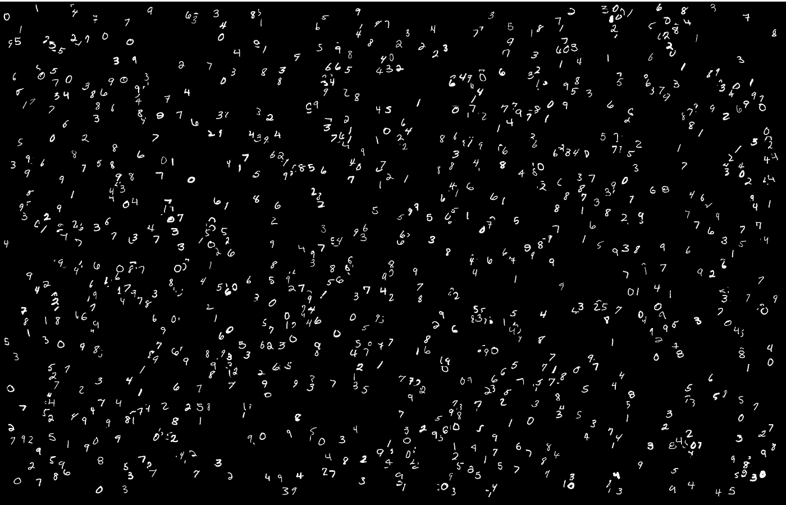
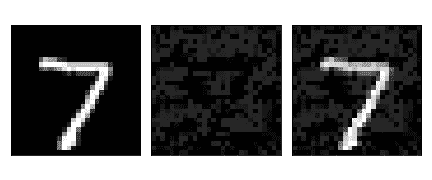
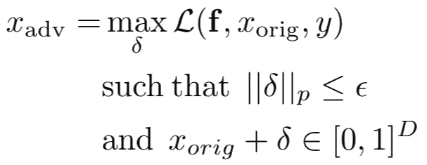
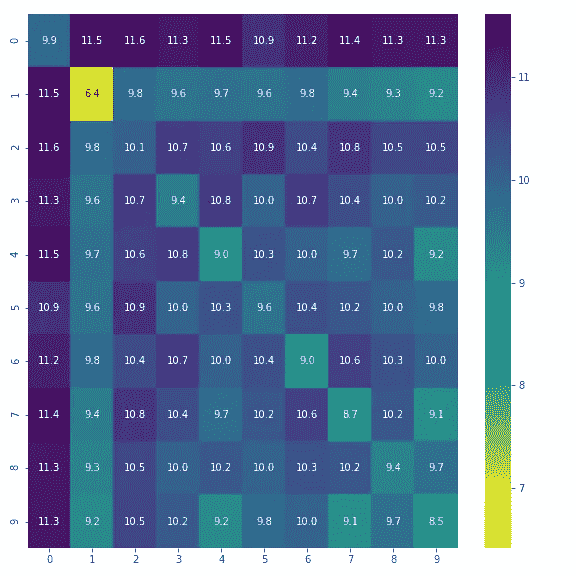
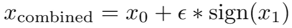
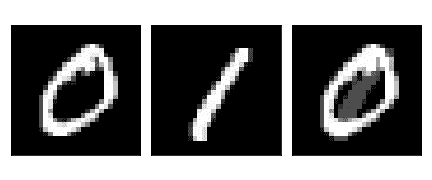
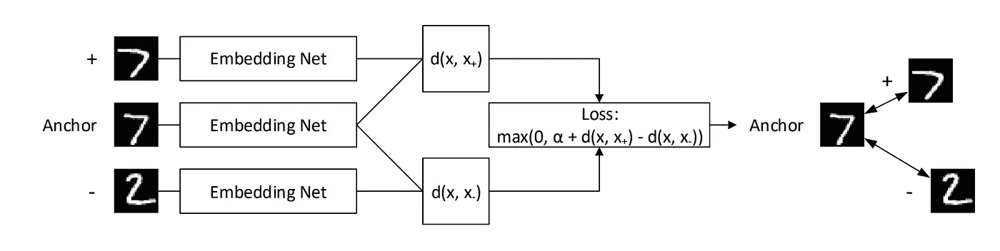

# 对立的例子——重新思考定义

> 原文：<https://towardsdatascience.com/adversarial-examples-rethinking-the-definition-298504bc73ad?source=collection_archive---------20----------------------->

MNIST Digits

对立的例子是各种机器学习系统要克服的一大障碍。它们的存在表明，模型倾向于依赖不可靠的特征来最大化性能，如果受到干扰，可能会导致错误分类，带来潜在的灾难性后果。**对抗示例**的非正式定义是以人类察觉不到的方式修改的输入，但是被机器学习系统错误分类，而原始输入被正确分类。下图说明了这个概念

Original image (left), adversarial noise (middle), perturbed image incorrectly classified as a 2 (right)

对抗性例子的正式定义如下

Adversarial example definition

其中𝓛是我们试图*最大化的损失函数，* 𝑥_orig 是原始图像，𝛿是扰动，y 是地面真实标签，并且选择ε以确保扰动的图像看起来不会太嘈杂，并且使得它对于人类来说仍然看起来像原始类别的图像。诸如 FGS、IGS 和 PGD 的几种攻击使用 L-∞范数来约束扰动图像和原始图像之间的距离。在本帖中，我们将探讨为 MNIST 数据集选择ε的困难。我们也将着眼于不依赖于干扰某些原始图像的生成对立范例的最新技术，并质疑这样生成的图像是否实际上满足对立范例的定义。

## MNIST 距离分析

先简单分析一下同类图像之间，以及不同类图像之间的平均距离。也许这些距离有助于以更定量、更少主观的方式选择ε。这里是我的[原创博文](http://alexadam.ca/ml/2019/09/05/adversarial-examples-rethinking-the-definition.html)的链接，里面有一个包含分析的 Jupyter 笔记本。

我们从每个类别中随机抽取 100 幅图像，并计算不同标准下图像之间的平均成对距离。这里只显示了 L-2 范数，以避免混乱，还因为 L-∞范数热图在每个单元格中只有 1，不提供信息。

L-2 Norm Training Set Distances

一个合理的假设是，该热图的对角线元素(类内距离)应该低于同一行/列中的非对角线元素(类间距离)。然而，情况并非如此，就像上面看到的更接近于 1 的 2 和也更接近于 1 的 8。起初这是一个惊喜，但它只是表明给定数字的风格变化可能比数字之间的切换导致更多的像素差异。人们可以认为这是一个假象，即对于每个数字，对于该数字的不同图像，有一组不变的像素不变，并且当两个数字的不变组具有高度重叠时，可能会出现如上所述的意外结果。

## 选择ε

这一切在选择ε的时候意味着什么？使用 L-∞范数时，最常见的ε值为 0.3，L-2 范数的高值为 4.5 ( [Madry 等人](https://arxiv.org/pdf/1706.06083.pdf))。如果我们考虑 L-∞范数的ε=1.0 的最大极值，我们将无法控制扰动图像的地面真实类，并且可能最终生成对于人类和我们的图像分类模型看起来像不同类的图像。这也将允许我们在训练和测试集图像之间任意插值 x’= rx _ train *(1-r)x_test，并且如果我们的模型碰巧不正确地分类 x _ test，那么它将被标记为敌对的。所以这里有多个条件需要执行。

1.  当并排比较原始图像 x 和它的扰动版本 x '时，我们希望人类察觉不到容许扰动的集合
2.  我们希望扰动不可能导致相同数字的图像之间的插值。否则，这可能会混淆对抗鲁棒性与泛化性能。对于给定的数字 d，以及分别被我们的模型正确和错误分类的测试集图像 x_correct 和 x_false，一个简单的对抗性攻击是将 x_correct 转换成 x_false

根据观察者的不同，(1)通常意味着(2)。ε=0.3 当然满足(2)，因为所有图像都具有接近 1.0 的 L-inf 距离。让我们看看，如果我们生成由两个类组合而成的图像，会发生什么，如下所示

Averaging images under constrained L-∞ distance

这将原始图像和精心制作的图像之间的 L-∞距离限制为ε，但是任何人类观察者都可以很容易地分辨出如下两幅图像之间的差异

Crafted image within ε=0.3 L-inf distance of original

很明显，最右边的图像有问题。事实上，如果没有被告知这是一个由 0 和 1 组合而成的图像，有些人可能会说这只是一个抽象的符号。举个简单的例子，我们已经证明ε=0.3 违反了条件(1)。甚至更小的值，如ε=0.2，也会给出类似的结果。MNIST 允许容易地识别受干扰的像素。在许多情况下，通过简单地检查是否对背景像素进行了修改来创建对抗示例的检测机制是微不足道的。如果攻击者知道这种检测机制，他们可以绕过它([卡里尼和瓦格纳](https://arxiv.org/pdf/1705.07263.pdf))。那么我们如何选择ε呢？

有理由不为每个图像使用相同的ε。对于某些类，判断数字本身的边界框内的像素是否发生了变化要容易得多，如上例所示。对于此类类，ε可能应该设置为较小的值。此外，像 L-2 或 L-∞这样的典型规范在用于计算图像空间中的距离时没有语义相似性的概念。如果他们能够给出输入空间中图像之间的语义相似性，那么就有可能构建一个简单的 KNN 图像分类器，并抛弃过去 7 年卷积神经网络的进展。这个问题的一个**可能的解决方案**是使用度量学习中的技术。通过学习嵌入，其中这种嵌入之间的 L-2 或 L-∞距离包含语义相似性的概念，然后我们可以在这个空间而不是输入空间中调整ε。一种这样的技术叫做**三联体网络**。三元组网络通过一次将 3 个图像并行传递到同一个嵌入网络来工作。传递 y 类的锚，以及同一类的正例(+)和不同 y '类的反例(-)。损失函数确保锚和正样本之间的距离至少比锚和负样本之间的距离小𝛼。

Illustration of a what a triplet network does

使用类似三元组网络的度量学习技术仍然需要人工实验者验证，以确保ε没有被选择得足够大，以允许类中的变化。此外，我们将不得不考虑条件(2 ),它说我们不应该能够使用扰动从我们的数据集中的一个图像跳到同一类的另一个图像。像 PGD 这样的攻击在损失函数的梯度方向上迭代移动以增加损失，然后将结果图像投影到满足与原始图像的距离约束的输入子空间上。不是在输入空间中进行这种投影，而是使用我们选择的度量学习算法在嵌入空间中进行。

## 生成对立范例

一篇非常酷的论文([宋等人](https://arxiv.org/pdf/1805.07894.pdf))介绍了一种创造对抗性例子的新方法。作者选择使用 GAN 从零开始生成可能欺骗被攻击模型的图像，而不是使用恶意制作的噪声干扰一些已经存在的图像。具体来说，他们使用一个辅助分类器 GAN (AC-GAN ),该分类器能够根据图像类别来控制正在生成的图像类型。这导致了“不受限制的对抗性例子”，因为没有距离来约束，因为图像是从零开始生成的。然而，这不满足前面提到的标准(1)或(2)。虽然他们的技术非常有用，并允许通过生成模型失败的新图像来进行模型调试和数据扩充，但该分析将泛化性能和对抗性鲁棒性视为同一件事。为了正确分析模型的稳健性，我们需要能够理清泛化性能和对抗性稳健性这两个指标，因为它们彼此不一致([齐普拉斯等人](https://arxiv.org/pdf/1805.12152.pdf))。因此，虽然远离基于扰动的对立例子的定义可能是诱人的，但目前它们是允许以孤立的、非混淆的方式研究对立鲁棒性的唯一方法。

## 结论

目前对对立例子的定义对于像 MNIST 这样的数据集来说略有缺陷，尽管它对于像 ImageNet 这样的东西来说更有意义，因为在 ImageNet 中扰动更难注意到，并且不会最终使图像看起来像奇怪的类组合。对每个图像或类别使用相同的阈值ε可能是一个苛刻的要求，因为对于特定类别的图像更容易检测噪声。图像是一种自然易于人类分析和判断是否有猫腻的数据。然而，在许多领域中，数据是以非常难以理解和可视化的抽象数字向量的形式出现的。由于我们无法从一开始就理解原始数据，因此在这些领域中定义什么是对抗性的可能超出了我们的想象范围。在这种情况下，得出ε的定量方法是必须的。

我希望你喜欢这篇文章，并让我知道你希望在未来的文章中看到的其他主题。