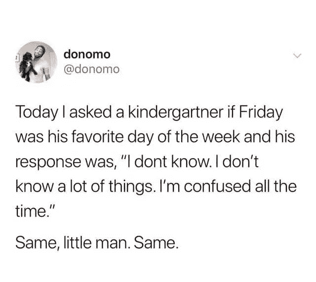
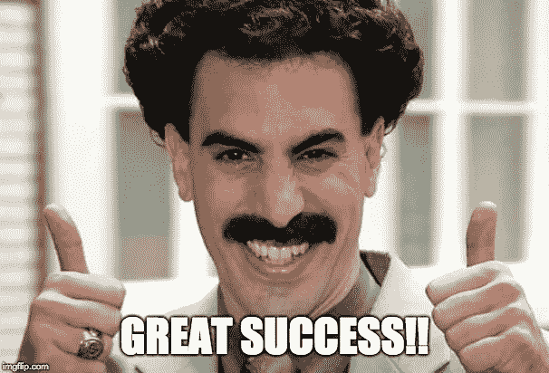
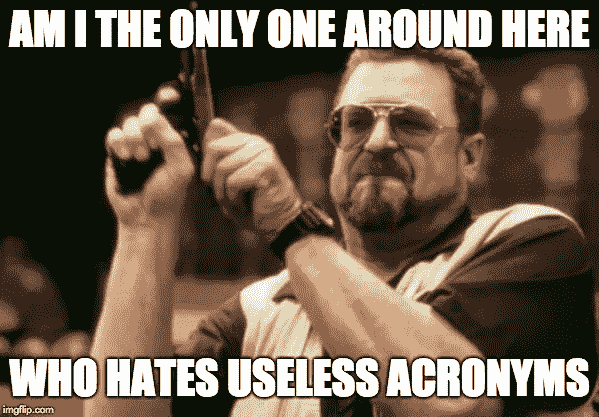

# 给新手和初级数据科学家的建议

> 原文：<https://towardsdatascience.com/advice-for-new-and-junior-data-scientists-7c82f1d8b6e4?source=collection_archive---------4----------------------->

## 我希望两年前就知道的事情

Hopefully, this will bring a little clarity to your path. :)

# 我以为我是谁

我叫 Darrin，我在 Outcome Health 担任数据科学家已经将近两年了。我们是一家专注于护理点患者教育的健康科技公司。用英语来说，这意味着我们在医生的办公室里放一些设备，里面有给病人看的内容。我们在现场有超过 100，000 台设备，这意味着大量的数据。

# 这篇文章是写给谁的

本文面向众多初级/助理数据科学家。如果你刚刚开始你的旅程，如果你有点困惑和失落，如果你不总是确定你应该做什么或如何最好地为你的新公司做贡献，你来对地方了。

You. Me. Your C-suite, probably.

# 我为什么写这篇文章

我看过许多数据科学文章，解释了做更高级的数据科学工作的来龙去脉，伟大的数据科学家需要的技能，这些大师处理的项目类型。但是当我经历我的助理数据科学家之旅时，我花了很长时间来导航如何做**成为一个更初级的团队成员。**

本文试图为其他初露头角的准数据科学家缓解这个问题。

**我的主要目标是提供一个基本的蓝图，并举例说明助理数据科学家如何快速为组织增加重要价值。**

我很幸运地在这个过程中发现了一些东西，现在我已经是一名数据科学家了——我希望这能帮助你们中的一些人走上同样的道路！

# 第一步:寻找低风险、高回报的项目

## **主要问题**

每个助理数据科学家遇到的第一个问题可能都是一样的:如何…

1.  **在真实项目上增加价值**…
2.  当**发展有用的技能** …
3.  没有**打破**任何重要的东西？

回答这个问题让我结结巴巴，与组织中各种各样的人交谈，并且通常会问很多愚蠢的问题。

## **关键洞察力**

**我发现自动化监控过程往往是我能花时间做的风险最低、回报最高的工作。**

*   不用担心破坏生产系统→低风险
*   对公司有明显的增值→节省时间(高回报)
*   我可以用 Python/用 Airflow/[在此插入新的酷技术]构建自动化流程→培养重要的技能

检查，检查，检查。

## **通用的、可操作的外卖**

总的来说，如果你能找到可以自动完成的任务，但由于缺乏带宽或优先级，这些都是测试你能力的好项目。几乎每个公司都有，它们是低风险/高回报的，如果你能很快得到一个 MVP，势头会很快形成。有很多文章都在解释为什么快速获得 MVP 是一件好事，所以我会让他们解释其中的逻辑。

## **我的经历**

在我的工作场所，我发现我们在监控新软件发布的 KPI 时效率明显低下。手动监控流程往往是改进时机成熟的地方。它们的存在通常是由于缺乏适当的生产流程。

最终，我们将分阶段推进软件更新，每个阶段都将在我们的 100，000 台设备网络中占据更大的比例。然而，在每个阶段，分析师将手动提取该软件版本的 KPI。这显然是浪费时间，但是我们没有时间来自动化这个过程。

# 第二步:如何产生深刻的见解

## **主要问题**

所以，你有了一个项目自动化一些过程的想法。现在怎么办？作为数据科学家，我们知道我们工作的一部分是“产生洞察力”。

很长一段时间，我对此的主要反应是“这到底是什么意思？!"我默认有一个工程师的大脑。我需要一个切实、具体的解释。没有那个，我不得不自己做。

So, I was sitting there project in one hand, laptop in the other, and I realized I didn’t have my next step in-sight. (Get it. Insight. Heh. Your groans are my validation.)

## **关键洞察力**

对我来说，一个伟大的“洞察力”是减少做决定所需时间的任何东西。

具体来说，这就是人们通常所说的洞察力。他们想要一份明确他们应该做什么的交付信息，越快越好。如果洞察力使你改变了先前的决定，它仍然减少了做决定所需的时间，因为它只是缩短了你的“坏”决定和新决定之间的时间。

## **通用的、可操作的外卖**

这意味着任何助理数据科学家的一个好目标就是简单地**减少数据接收和行动之间的时间量**。显然，这是一个广泛的任务，但这意味着你要学习端到端的系统，每个数据科学家都应该至少了解数据堆栈的每个部分(在这个人工智能需求层次图中有更多的信息)。此外，数据科学家的角色目前是如此广泛和模糊，你的职责范围可能会涵盖整个堆栈。

## **我的经历**

就我而言，除了简单地自动化数据拉取以节省时间之外，我还意识到了两件事。

Fun for teams. [Not for Batman](https://www.youtube.com/watch?v=YpzKMr4fJwg).

1.  为了节省时间，我可以将数据推送到用户所在的地方，而不是拖到用户所在的地方:Slack。这涉及到[连接到 Slack API](https://api.slack.com/) 并推送用 Python 创建的图表。
2.  我可以自动完成人类分析师正在做的一些推理。(机器会来抢我们的工作。)

我们在我们的网络上开展广告活动，我们的主要 KPI 之一是我们的广告活动在一天内的总播放次数。这个数字应该不会有太大的变化，除非是在周末，这个数字应该会下降到接近于零。

检查数字的分析师会检查这个 KPI，这通常是正常的。但是，时不时地，一个大型的活动会结束，导致播放数量急剧下降。对于给定的软件版本，这可能看起来是一个大问题。

我意识到播放次数(显然)与现场设备的数量和正在播放的活动数量相关。我建立了一个简单的分段线性模型([简单的系统更好，你喜欢神经网络的人](https://blog.insightdatascience.com/always-start-with-a-stupid-model-no-exceptions-3a22314b9aaa))来解释活动的数量、设备的数量和周末。通过对软件更新前的数据训练模型，我可以预测软件更新后的 KPI，并根据软件更新前数据的差异设置防护栏。

这允许分析师查看通过 Slack 交付给他的一个图表，并知道 KPI 是否“在预期之内”！

# 第三步:如何让人们根据你的见解采取行动

## **主要问题**

在构建了几个这样的系统之后，我开始遇到一个大多数数据科学家都会遇到的问题。人们没有采取行动。行动就是一切。如果没有结果，一个好的洞察力有什么用？(或者，在这种情况下，这是一个很好的见解吗？哦哦。)

如果一个模型被建立，一个仪表板被建造，或者一个警报系统被开发，但从来没有引起行动，它真的存在吗？(是的，确实如此，但你明白了。)

## **关键洞察力**

改变我对此想法的主要见解实际上源于[一篇关于为什么懒惰不存在的文章](https://medium.com/@devonprice/laziness-does-not-exist-3af27e312d01)。主要要点是:

采取行动需要一个为什么和一个什么。如果有人不采取行动，他们没有足够强的理由去做某事，或者他们不知道到底该做什么。

这正是我所看到的。人们要么对警报的含义感到困惑，要么不确定如何应对警报。在这两种情况下，警报导致焦虑和无行动**，这比根本没有警报更糟糕**。

## **通用的、可操作的外卖**

在你的工作中，这意味着你需要确保在交流见解时，**你阐明了见解为什么重要，以及该怎么做**。事实上，任何导致行动的交流都是如此。管理不善的会议是不应该做什么的一个很好的例子。如果你曾经参加过一个没有明确原因和内容的会议，你会知道这个会议是曲折的，什么也没有完成，每个人的时间都被浪费了。

如果会议没有明确的议程，我是不会去参加的。没有议程的会议是我最讨厌的事情之一。还有，首字母缩写糟透了。这只是一件无关的个人事情，[但是埃隆·马斯克同意](https://gist.github.com/klaaspieter/12cd68f54bb71a3940eae5cdd4ea1764)。

## **我的经历**

随着我试图自动化的监控的性质变得越来越复杂，我的具体问题开始出现。我开始提供带有小型数据转储的一般语句，而不是具体的操作(可能有几十个)。我本可以处理数据转储。

**数据转储不是消费者想要使用的东西。顾客才是最重要的。**

随着警报变得过于普遍，我为这些新频道设置的空闲频道开始被较少使用。我唯一的选择是创建更具体的信息和行动步骤。

我发现了一个非常有效的方法，那就是仔细考虑问题的确切解决步骤——对于复杂的问题，这可能是一个困难的预先考虑。然而，如果处理得当，它会让行动步骤和需要的信息变得非常清楚。随着清晰的到来，我的通道和所采取的行动得到了重用！

# 最终结果

“异常检测”项目是由我自己发起的，经过 6 个月的稳定工作，我的优秀经理给予我的自由和信任使之成为可能。目前，“异常检测”向我们一半以上的工程-产品-设计组织(40 个人中的大约 20 个)和该组织之外的几个其他利益相关者推送警报。它已成为运营去风险工作的一个重要来源，新的渠道正在不断增加。

对于一个以副业开始的项目来说，这是一个不错的结果！

# 最后的笔记&送别

我不是什么神奇的天才。我来自内布拉斯加州。(爱你，内布拉斯加同胞。)再加上我小时候被摔过。(不过谁不是呢。爱你们，爸爸妈妈！).

Nebraska. Land of corn, football, and…more corn.

我作为数据科学家的第一年所做的事情是任何初级/助理数据科学家都可以做的，我希望你们中的一些人能够从我所拥有的好运和我所做的努力中获得灵感。所以，当你开始你的旅程时，我留给你一句我的数学老师在每次考试前给我们的谚语(这也是一段艰苦但有趣的旅程——我是个数学书呆子):

祝你好运，玩得开心，好好表现！