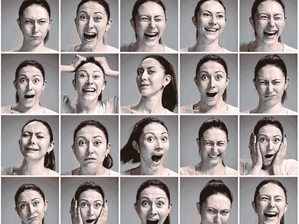
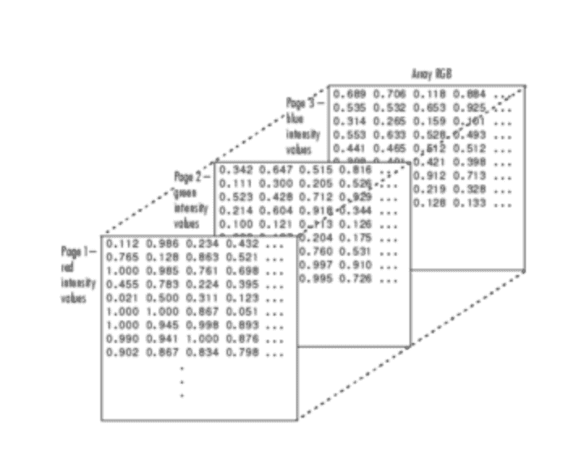
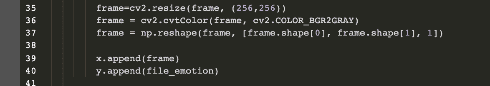
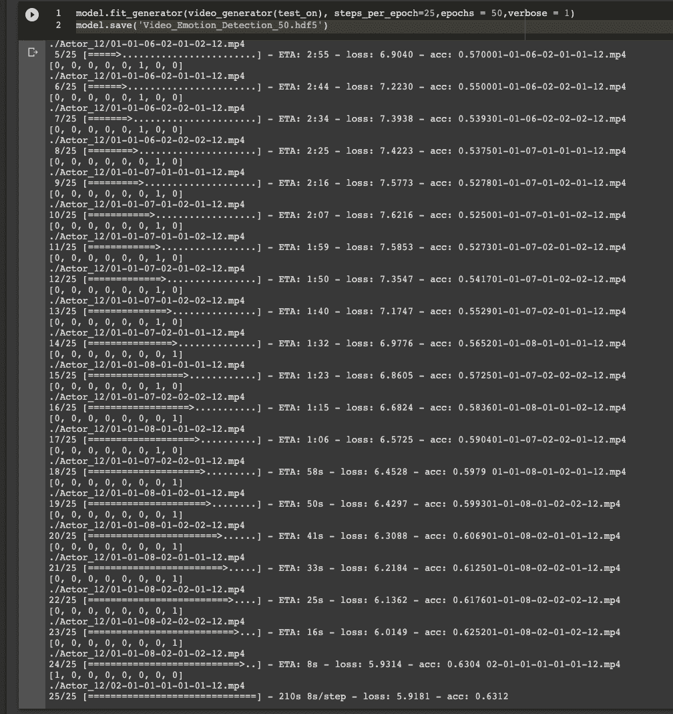
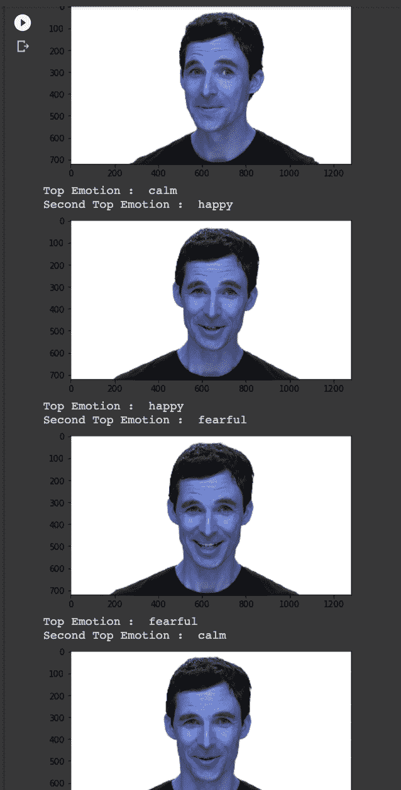
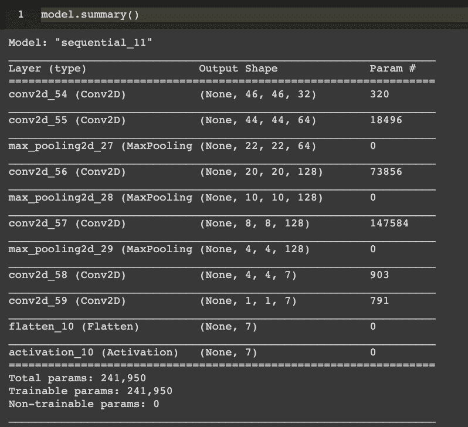
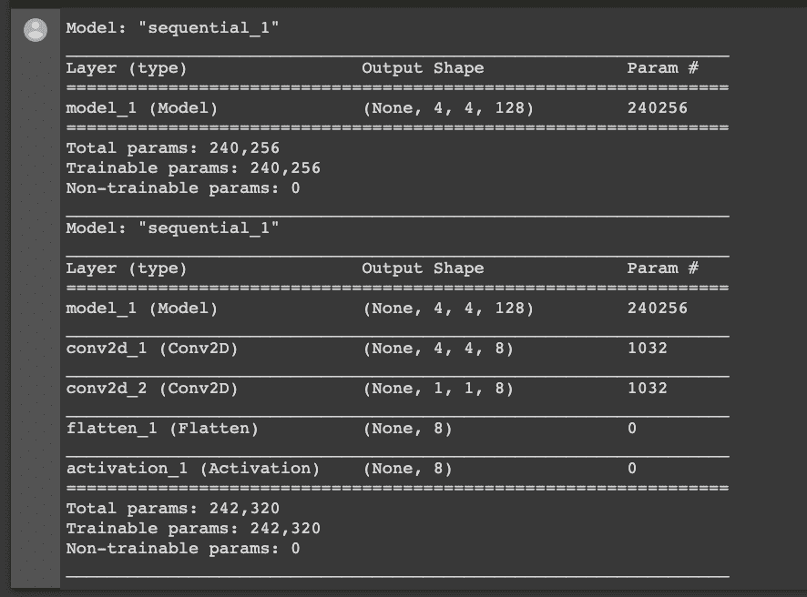
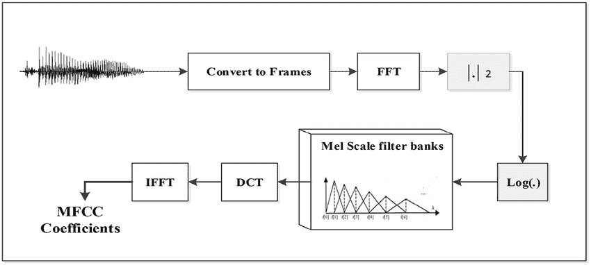
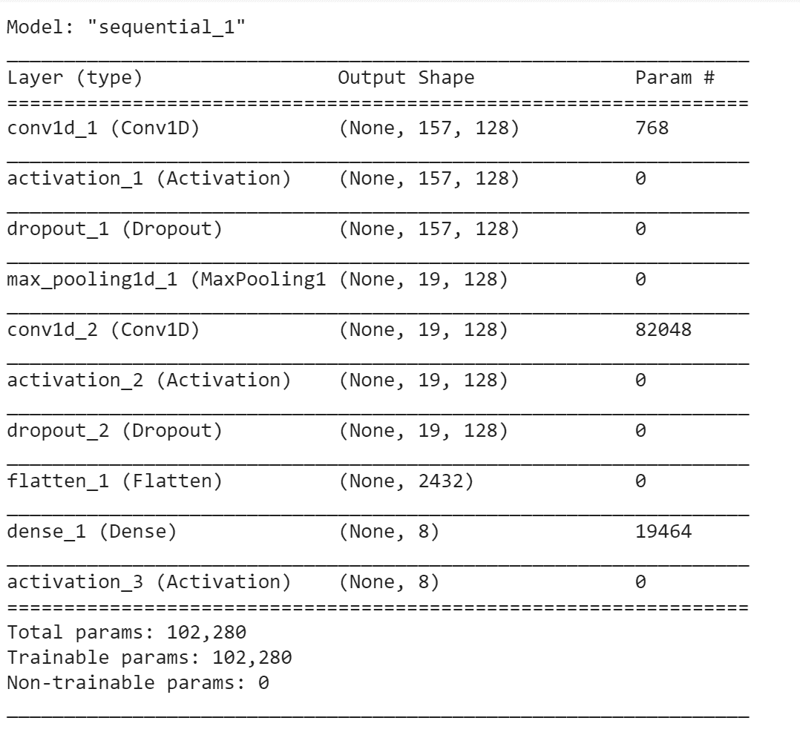

# 人工“情绪”智能

> 原文：<https://towardsdatascience.com/aei-artificial-emotional-intelligence-ea3667d8ece?source=collection_archive---------12----------------------->

> 这一切都始于大约 2000 年前，当时柏拉图写道:“所有的学习都有一个情感基础。”

有人可能会认为超过 20 万年的进化会让人类成为情感的主人。然而，在我们生活的世界里，无论年龄大小或成熟程度如何，人们都经常在情感判断上犯错误。清晰地识别情绪是顺利沟通和建立持久关系等社会行为的关键。

是什么让识别情绪对人类来说具有挑战性？

我们经常努力表达我们的情感，表达我们的感受。情绪有许多不同的程度、性质和强度。此外，我们的经历经常同时包含多种情绪，这给我们的情绪经历增加了另一个复杂的维度。

然而，锦上添花的是情感偏见。随着情绪范围的变化，必然会有偏见。这就是我们作为数据科学家对这个问题感兴趣的地方——我们喜欢好的“偏差-方差”问题！

进入，你的友好，不带偏见的邻居情绪检测机器人。人类和机器唯一的区别是情商的日子已经一去不复返了。情感识别或人工“情感”智能现在是一个价值 200 亿美元的研究领域，在许多不同的行业都有应用。

在各行各业，人工情绪智能可以通过多种方式发挥作用。例如，人工智能可以监控用户的情绪，并对其进行分析，以达到某种结果。该应用程序将证明在增强自动化客户服务呼叫方面极其有用。人工智能还可以使用情绪读数作为决策的一部分，例如在营销活动中。广告可以根据消费者的反应而改变。

# R AVDESS 数据集

瑞尔森情感语音和歌曲视听数据库( [RAVDESS](https://zenodo.org/record/1188976) )包含 7356 个文件(总大小:24.8 GB)。该数据库包含 24 名职业演员(12 名女性，12 名男性)，用中性北美口音发出两个词汇匹配的语句。言语包括平静、快乐、悲伤、愤怒、恐惧、惊讶和厌恶的表情。每种表情都产生于两种情绪强度水平(正常、强烈)，外加一种中性表情。所有条件都有三种形式:纯音频(16 位，48 千赫。wav)、音频-视频(720p H.264、AAC 48kHz、. mp4)和纯视频(没有声音)。

7356 个 RAVDESS 文件中的每一个都有一个唯一的文件名。文件名由 7 部分数字标识符组成(例如，02–01–06–01–02–01–12 . MP4)。这些标识符定义了刺激特征:

文件名标识符:

*   设备(01 =全 AV，02 =仅视频，03 =仅音频)
*   声道(01 =语音，02 =歌曲)。
*   情绪(01 =中性，02 =平静，03 =高兴，04 =悲伤，05 =愤怒，06 =恐惧，07 =厌恶，08 =惊讶)。
*   情绪强度(01 =正常，02 =强烈)。注意:没有强烈的“中性”情绪。
*   陈述(01 =“孩子在门边说话”，02 =“狗在门边坐着”)。
*   重复(01 =第一次重复，02 =第二次重复)。
*   演员(01 到 24。奇数号演员为男性，偶数号演员为女性)。

# 方法

鉴于我们的数据集在数据类型方面的多样性——语音、歌曲和视频——我们决定将音频和音频-视频文件分开，并对它们分别建模以识别情绪。

在接下来的章节中，您会发现我们两个不同模型的具体细节以及总体概念重点。

# 视频情感检测

你有没有想过有人在生你的气，结果发现你只是误读了他们的面部表情？我们的脸可以表达 7 种基本情绪。现在，想象一下，表达“无声的快乐”需要什么样的组合。我们无法对我们七种基本情绪的不同排列和组合所能表达的不同种类的情绪进行计数。

Source — [https://egyptinnovate.com/en/success-stories/affectiva-company-humanizing-technology](https://egyptinnovate.com/en/success-stories/affectiva-company-humanizing-technology)

从面部表情中读出情绪的能力是一项非常重要的技能。有人甚至可以称之为超级大国。自远古以来，正是这种技能促成并促进了人类的互动。

潜意识里我们每天一整天都在看、贴标签、做预测、识别模式。但是我们怎么做呢？我们如何解释我们看到的一切？

大自然花了 5 亿多年才创造出这样一个系统。眼睛和大脑之间的合作被称为初级视觉通路，是我们能够理解周围世界的原因。

大脑中神经元和连接的**非常复杂的层次结构**在记忆和标记物体的过程中起着重要作用。一开始，我们被教导我们周围物体的名称。我们通过给我们的例子来学习。慢慢地，但肯定地，我们开始越来越经常地认识我们周围的事物。它们变得如此普遍，以至于下次我们看到它们时，我们会立刻知道这个物体的名字。他们成了我们的'【T2 模式】' T3 '世界的一部分。

但是现代机器是如何从面部表情识别情绪的呢？

**卷积神经网络**

类似于儿童如何学习识别物体，我们需要对数百万张图片训练一种算法，然后它才能感知输入并对看不见的图像做出预测。

电脑和我们“看”的方式不同。他们的世界只由数字组成。每幅图像都可以用二维数组来表示，称为像素。

[卷积神经网络(CNN)](https://www.freecodecamp.org/news/an-intuitive-guide-to-convolutional-neural-networks-260c2de0a050/) 是一种特定类型的人工神经网络，它教会一种算法如何识别图像中的对象/特征。

以下是我们如何在我们的项目中利用 CNN 的力量。

## 定义 CNN 模型

Keras 被用来创建一个顺序卷积网络——具有线性层堆栈的神经网络。该网络由以下部分组成:

***卷积层:*** 这些层是我们网络的构建模块。这些计算输入图像 X 和一组 Kj 可学习滤波器之间的点积。大小为 k1 × k2 的每个滤波器 Kj 在输入空间中移动，与输入的局部[子块](https://www.sciencedirect.com/topics/engineering/subblocks)执行卷积，提供 Yj，即特征映射(Yj=∑X×Kj+Bj，其中 B 是偏置项)。

***激活函数:*** 我们使用激活函数使我们的输出非线性。在卷积神经网络的情况下，卷积的输出将通过激活函数。在这个项目中，我们将求助于两个函数的使用— Relu 和 Sigmoid。

***池层:*** 这些层将沿维度向下采样操作。这有助于减少空间数据并最小化所需的处理能力。

***密集层:*** 这些层出现在一个 C.N.N 的末端，它们接收卷积层生成的所有特征数据并做出决策。

***退层:*** 随机关闭网络中的几个神经元，防止过拟合。

批量标准化:通过减去批量平均值并除以批量标准偏差来标准化先前激活层的输出。这加快了训练过程。

该网络接受一个大小为 256*256 的二维数组的输入，并预测数据集中存在的八种情绪中的一种。

以下是 CNN 模式的总结:

**解析视频获得图像**

第一步是将视频文件解析成一组我们用来训练模型的图像帧。我们使用 cv2 库从视频中捕捉图像。VideoCapture 函数读取视频文件，并将其转换为一系列图像帧。

获得的每一帧将包含一个包含图像信息的二维整数数组。图像由像素组成，这些像素是多个数字阵列的通道。彩色图像有三个颜色通道，即红色、绿色和蓝色，每个通道由一个网格表示。网格中的每个单元格存储一个 0 到 255 之间的数字，表示该单元格的亮度。为了每次捕捉不同的表情，我们将每 20 帧传递到我们的训练模型中。

What you see (L) vs what computer sees (R)

提取图像数据后，我们将图像的大小调整为 256*256，以尽可能多地保留信息，从而提高模型的准确性。我们将这些图像转换为灰度，因此只有一个通道，从而降低了复杂性。

然后，我们添加图像数据以获得一个生成器对象，我们将在下面的段落中进一步解释这个对象。

**获取标识情绪的标签**

我们在字典中定义情绪，如下面的代码所示。

Emotion Dictionary

> 示例视频文件:“01–01–03–02–02–02–01 . MP4”

所有视频文件的文件名中都列出了情感，如上所示。我们拆分文件名，并使用预定义的情感词典来获取每个视频文件的标签。

**训练 CNN 模特**

对于小而简单的数据集，使用 Keras 是完全可以接受的。拟合函数。然而，像我们这样的大型数据集通常太大而不适合内存。执行数据扩充是为了避免过度拟合并提高模型的泛化能力。在这些情况下，我们需要利用 Keras 的。拟合 _ 生成器函数。的。fit_generator 函数接受批量数据，执行反向传播，然后更新模型中的权重。重复这个过程，直到我们达到期望的历元数。你会注意到我们现在需要在调用时提供一个 steps_per_epoch 参数。fit_generator(的。fit 方法没有这样的参数)。

Keras 数据生成器意味着无限循环。因此，Keras 无法确定一个纪元何时开始，一个新的纪元何时开始。因此，我们将 steps_per_epoch 值计算为训练数据点的总数除以批量大小。一旦 Keras 达到这个步数，它就知道这是一个新时代。

在尝试不同的迭代和切换模型参数后，我们聚焦于 50 个时期和每个时期 25 步。对于这个模型，我们获得了 0.55 到 0.65 的精度。

**测试 CNN 模型**

为了测试 CNN 模型，我们使用 Keras 函数 test_on_batch()。与我们训练模型的方式类似，我们在视频文件中每隔 20 帧捕捉一次，将图像数据转换为灰度，并将图像重新整形为 256*256 阵列。该模型返回对应于一种情绪的八个数字的数组。我们通过确定这个数组中的最高数字来获得预测的情绪。

我们在两个演员身上测试了该模型，并在这些结果上获得了 0.6 的准确度。

**模型预测**

在测试了这个模型之后，我们想在一个看不见的视频文件上测试这个模型。我们通过模型传递了一个带有“快乐”情感标签的视频。

作为模型的输出，我们得到的是一系列加权的情绪。我们运行下面给出的代码来为这个模型选择最好的可能结果。

这是一个模型预测视频文件中每 20 帧前两种情绪的例子。

每一帧的结果被组合以给出视频剪辑的最终预测结果。

**转移学习方式**

除了使用 CNN，我们还尝试了迁移学习，以确定我们是否可以通过在我们的数据集上训练预训练模型来获得更高的准确性。迁移学习是一种机器学习方法，其中为某个预测问题开发的模型被重新用作第二个任务的模型的起点。

这个模型是根据预测七种情绪的 [FER](https://www.kaggle.com/c/challenges-in-representation-learning-facial-expression-recognition-challenge/data) 数据训练出来的。

我们删除了最后五层，增加了两个卷积层和一个激活层，如下文摘要所示。

我们在视频数据集上训练了这个模型，获得了 0.35 的准确率。我们计划致力于提高这一模型的准确性，并确定这是否能击败我们最初的 CNN 模型的准确性。

# 从音频信号中识别情绪

人类处理声音的方式非常复杂，有很多因素会影响到如何从音频片段中感知一种情绪。一个人的性别，语调的变化，甚至使用的词语类型都会影响我们对所说内容的感知。

我们数据集中的音频文件包括 3 秒钟的音频剪辑，包括语音和歌曲。就这个项目的范围而言，我们只限于演讲片段。音频基本上没有任何背景噪音，并且是在受控环境下录制的。

我们遇到了许多挑战，当谈到制作一个模型，可以理解我们可用的音频剪辑的情绪。对我们来说，第一个也是最大的一个挑战是弄清楚我们需要什么样的特性来制作我们的模型。这是一个非常特定领域的任务，我们需要了解声音及其潜在的属性，并找出哪些特征可以帮助正确识别情绪。

**MFCC:**

梅尔频率倒谱(MFC)是数据的短期功率谱，对于语音分析特别有用。人类发出的声音受到声道(包括声带、喉、舌、牙齿等)形状的影响。).在最基本的意义上，梅尔频率倒谱在数字上代表了这个声道。Mel-scale 旨在模仿人耳对声音的非线性感知，在较低频率下更具辨识度，在较高频率下辨识度较低。它对频率进行缩放，使其与人耳能够听到的内容紧密匹配(人类更善于识别低频语音中的微小变化)。

梅尔频率倒谱系数(MFCCs)是共同构成梅尔频率倒谱的一组系数。作为高级概述，计算 MFCC*(摘自维基百科)*涉及以下步骤:

*   对信号进行傅立叶变换。
*   使用三角形重叠窗口，将上面获得的光谱功率映射到 mel 标度上。
*   取每个 mel 频率的功率对数。
*   对 mel 对数幂列表进行离散余弦变换，就像它是一个信号一样。
*   MFCCs 是最终频谱的幅度。

δMFCC 和δ-δMFCC——MFCC 的一阶和二阶导数——也是我们预测模型的重要特征。

Source — [https://www.researchgate.net/figure/Extraction-Mel-frequency-cepstral-coefficients-MFCC-from-the-audio-recording-signals_fig1_289375827](https://www.researchgate.net/figure/Extraction-Mel-frequency-cepstral-coefficients-MFCC-from-the-audio-recording-signals_fig1_289375827)

**数据预处理:**

对于我们所有的音频处理，我们使用了一个名为 librosa 的 python 包，它对音乐和声音分析非常有帮助。

我们使用采样率为 22050 赫兹的 **librosa** 加载音频文件。每个文件被分成 157 帧。帧是用于分析目的的时间序列的一小段。Librosa 具有从音频文件生成 MFCCs 的功能。对于每一帧，我们只计算前 13 个 MFCCs，因为它们捕获了我们分析所需的大部分信息。即使更高阶的 MFCCs 确实包含我们的音频文件的更多频谱细节，它们也给模型增加了额外的复杂性，这通常是不期望的。

该函数返回音频中 157 帧中每一帧的 13 个 MFCCs。这些是对每一帧的汇总。使用每个 MFCCs 的帧的平均值、最大值、最小值和标准偏差。对δ和δδ系数进行相同的汇总。

我们从音频文件中提取的另一个特征是音频的均方根能量。

对于每个音频文件，从文件名中提取情感标签、情感强度、性别和演员号。

**建模方法:**

在建模之前，我们做的第一件事是将数据集分为训练集和测试集。

通常这是随机进行的。在我们的例子中，我们决定手动分割数据，取训练集中的前 20 个参与者和测试集中的后 4 个参与者。这是因为随机分割角色会导致数据泄漏问题。手动隔离某些参与者有助于避免这种情况。

我们的数据规模限制了我们从零开始训练神经网络。理想情况下，人工神经网络需要数百万个数据点来训练精确的算法。然而，我们必须处理几千个音频信号来训练我们的模型。

以下是我们建立的模型的总结:

Accuracy — 41.25%

**随机森林:**

我们认为，鉴于我们没有足够的数据来正确训练神经网络，我们可以尝试其他模型，看看它们的效果如何。我们用的第一个是古老的好随机森林。它给了我们 48%的准确率。

**超参数调谐**

训练随机森林的主要挑战是参数调整。由于参数数量庞大，我们首先对模型进行了随机搜索。其工作方式是，它基本上从给定的选项中选取随机参数，并在此基础上运行模型。我们重复运行了 50 次。这是缩小参数范围的一个非常有用的方法。

基于随机搜索的最佳模型的输出，我们找到了一个较小范围的参数进行试验，并使用 k = 3 的 k-fold 交叉验证对其进行网格搜索。

这给了我们最终的模型，测试精度为 48%，优于神经网络。

**支持向量分类器:**

对于 SVC，我们发现径向基函数在情感分类中表现最好。有趣的是，使用简单的线性分离函数几乎同样有效。不需要其他 SVC 参数(类别权重、概率估计值),分析是使用“一对其余”方法进行的。SVC 提供的准确率为 51.25%。

**XGBoost**

由于 XGBoost 有大量的参数可供选择，RandomizedSearchCV 再次有助于选择 50 个参数组合的子集进行交叉验证。这将培训从几个小时减少到两三个小时。让我们感到有趣/沮丧的是，一些选择的参数非常接近 XGBoost 的默认值。但试一试也无妨，结果超过了 CNN，接近 SVC 的水平。获得了 50%的准确度。

# 挑战和未来范围

**组合音频&视频数据**

这无疑是我们在这个项目中最大的挑战。到目前为止，我们已经将数据分成单独的音频和视频文件，以分别提取 MFCCs 和图像。然而，采用组合方法来同时训练能够处理音频和视频信号的模型将有助于实现更可扩展的结果。正如博客前面提到的，情感识别在很多行业都很受欢迎。我们相信，在未来的范围内，该产品可以通过兼容任何一种输入而被更广泛地接受。

**医疗保健中的情感识别:**

目前正在利用这项技术的一个行业是医疗保健，由人工智能驱动的识别软件帮助决定患者何时需要药物，或者帮助医生决定先看谁。我们预见到的一个可以通过准确的情绪检测来预防的问题是在精神健康意识领域。那些患有精神健康问题的人通常都是封闭的，不太愿意分享他们的问题。正确识别情绪这些痛苦的信号，对于避免精神崩溃和与压力相关的创伤会有很大的不同。计算机将会不带偏见，对检测早期迹象更加敏感，以帮助提醒亲密的朋友或家人。

**处理固有偏见**

我们的模型存在两大偏差:

1.所有演员都来自北美地理区域，因此说话带有明显的北美口音，导致我们的模型对此有偏见。来自其他地理位置的发言者的音频数据将有助于消除这种偏见。

2.所有的音频和视频记录都是在瑞尔森大学的专业环境中进行的，没有任何背景/白噪音。因此，在此数据集上定型的模型在真实数据上可能表现不佳。这种情况的一个潜在解决方案可能是在嘈杂的视听数据集上训练模型，并使用 Amazon Turk 服务附加类别标签。

# 参考资料:

[1] Muneeb ul Hassan， [VGG16 —用于分类和检测的卷积网络](https://neurohive.io/en/popular-networks/vgg16/)

[2] Sourish Dey， [CNN 在结构化数据上的应用——自动特征提取](/cnn-application-on-structured-data-automated-feature-extraction-8f2cd28d9a7e)

[3] [Francesco Pochetti](http://francescopochetti.com/) ，[视频分类实验:结合图像和音频特征](http://francescopochetti.com/video-classification-experiments-combining-image-with-audio-features/)

[4]瑞恩·汤普森，[如何使用谷歌合作实验室进行视频处理](https://dzone.com/articles/how-to-use-google-colaboratory-for-video-processin)

[5]詹姆斯·莱昂斯， [Python 的演讲特点](https://github.com/jameslyons/python_speech_features)

[6]安吉莉卡·佩雷兹，[表情:一个用于情感表达的机器学习工具包](https://www.thoughtworks.com/insights/blog/emopy-machine-learning-toolkit-emotional-expression)