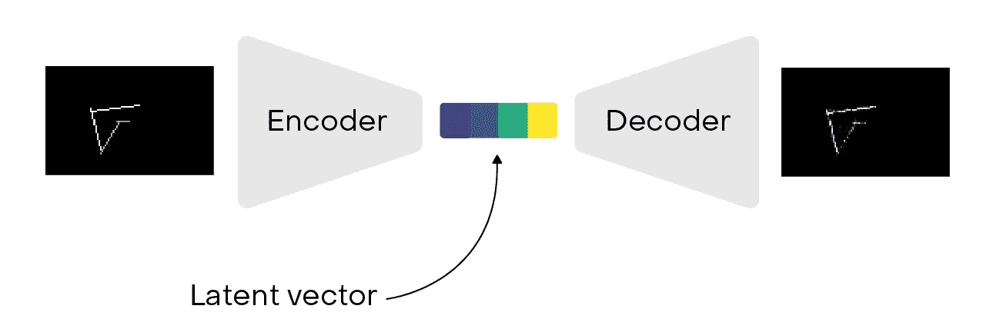
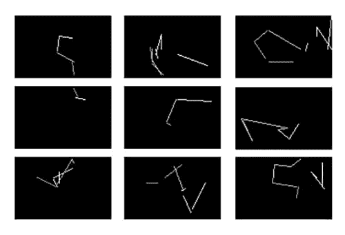
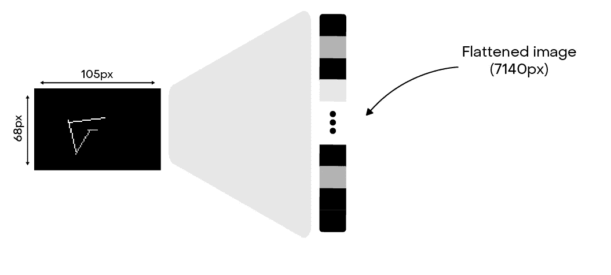
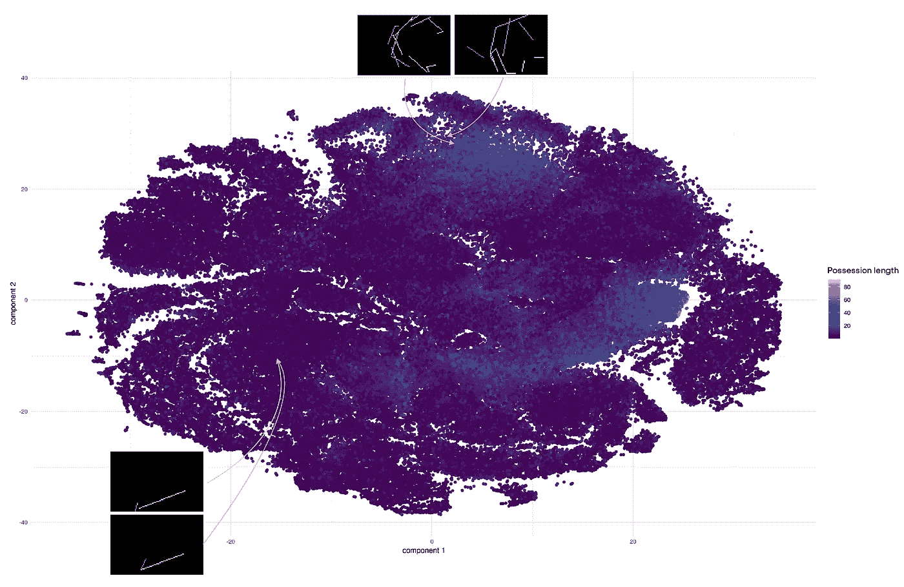
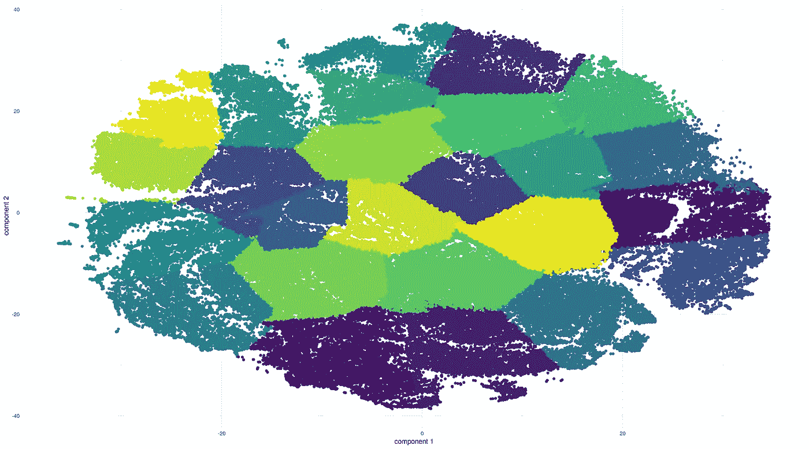
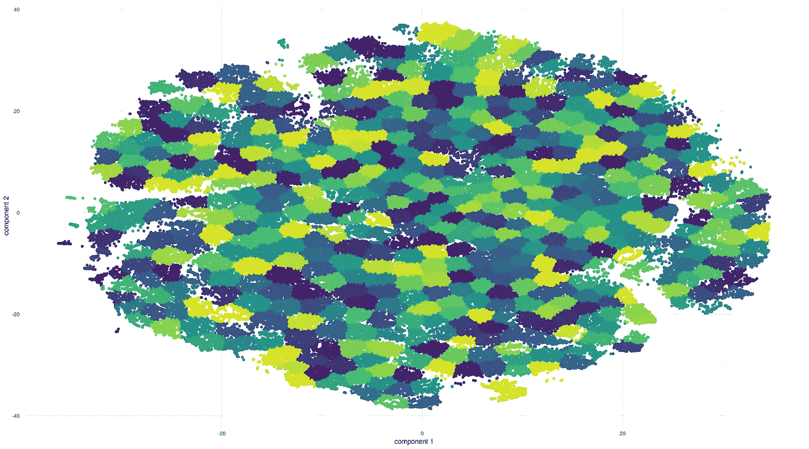
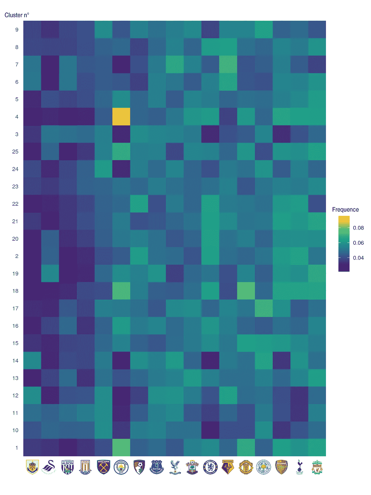
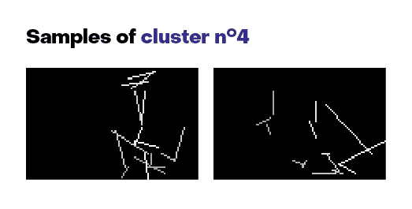
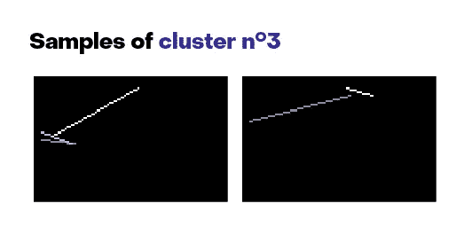

# 原始数据之后:用数据嵌入探索控球风格。

> 原文：<https://towardsdatascience.com/after-raw-stats-exploring-possession-styles-with-data-embeddings-d3ebef718abf?source=collection_archive---------24----------------------->

识别一个球队风格的最基本的方法是看控球率、传球成功率、铲球率、每场比赛的平均失误次数等等。最近很多工作都是用预期目标模型来完成的，这些模型很好地捕捉到了创造和失球机会的质量。然而，它只是向分析型观众展示了一个度量标准，而不是一个团队如何运作的具体愿景。在开放式比赛中，仍然很难了解特定球队的传球顺序类型。

如何描述和分析传球序列的问题在足球分析界并不新鲜。像大卫·佩尔莫多·梅萨在 Statsbomb 上发表的“传球主题:识别球队和球员传球风格”[或里卡多·塔瓦雷斯为足球比赛撰写的](https://statsbomb.com/2016/11/passing-motifs-identifying-team-and-player-passing-style/)[“可视化传球序列”](https://medium.com/football-crunching/visualizing-passing-sequences-8988c09e53ad)这样的作品值得一读，是分析足球传球序列的一种艺术状态。

在这篇博文中，我们将探索一种基于深度学习的方法，以发现一些英超俱乐部的控球模式，并试图展示球队之间的差异。

我不能不提到 Right2Dream(该公司是丹麦俱乐部 FC nordsjlland 的一部分)招聘总监 Joe Mulberry 的工作，以及[他在 2019 年伦敦 Opta 论坛上的精彩演讲](https://youtu.be/TpuPwq0zTMc)。下面的分析受到了这一条的强烈启发。

# 编码占有:一个占有 2Vec 模型

首先，什么是占有？简单来说:这是一个连续的传球和移动过程，直到有球的球队把球丢掉。因此，当一次投篮不中、对方球队成功抢断或传球不成功时，比赛就结束了:这时另一队正在控球。

由于有球事件，我们可以通过纯粹为传球画白线来创建这些财产的简单表示。以下是一些示例:

这些图像宽 105 像素，高 68 像素，符合普通足球场的尺寸。攻击的方向是从左到右。

您会注意到，时间维度被考虑在内，动作的开始用较暗的线条表示，最后一遍是纯白色的。线之间的空间是玩家的跑动，我们不能在这里画出来，因为跟踪数据仍然很少。

为过去三个赛季的英超联赛构建这些图像，我们可以使用一个不错的数据集。每幅图像都可以用 105x68=7140 维的矢量展平。

为了能够比较这些向量，我们使用了深度学习领域中所谓的自动编码器。自动编码器是特定类型的神经网络架构，它允许将输入编码成压缩表示，然后通过解码功能恢复到几乎原始的数据。

通过设计，这些压缩的表示——也称为潜在向量——对于降低输入维度以及保持数据之间的相似性非常有用。在我的实验中，我选择将这些向量的维数设置为 256。在这里选择一个非常低的维度将需要更多的训练时间，并且可能会使保留原始数据信息变得更加困难。

此外，为了能够可视化这些信息，我们可以使用一种技术来进一步降低这些潜在向量的维度。我们有高维和非线性数据，因此 t-SNE 算法似乎最适合该操作。

由于自动编码器嵌入和 t-SNE 算法，这是二维表示的所有通道的视图。

令人欣慰的是，在将由 7140 个像素组成的图像减少到只有二维后，我们仍然能够保持所有物之间的信息相似性。你可能会注意到这张图表突出了控球时的传球次数，我们可以看到数据已经有点集中了。

为了能够比较团队的财产，我们用 K-means 算法对这些数据点进行分组。聚类的数量是任意选择的，而使用诸如肘方法的技术不是特别需要的:数量越多，我们就有越详细的聚类。我们将首先查看 25 个桶的结果，然后深入查看 500 个桶的结果。

Data clustered into 25 buckets.

Data clustered into 500 buckets.

请注意，我们也可以简单地将这些数据分组，但是 K-means 允许更精确一点。

# 大规模结果概览

通过简单地观察每个集群中的球队分布，我们可以发现球队的偏好是什么，或者与其他球队相比，他们使用最多的是哪种控球。

我们筛选球队，剔除那些数据较少的球队，那些在过去三个赛季降级或升级的球队:布莱顿，富勒姆，哈德斯菲尔德，桑德兰，狼队，米德尔斯堡，诺维奇，阿斯顿维拉，卡迪夫，纽卡斯尔。

上面的热图显示了每个集群中的团队分布(k=25)。在有趣的见解中，我们可以看到曼城与其他球队的不同之处。看一下 n 4 集群的一些控球样本，突出曼城的打法，长传控球在高位。

不出所料，排在第 4 组的其他球队是阿森纳、热刺、利物浦或切尔西。相反，集群 n 3 突出显示了像莱斯特或斯旺西这样打长球的球队

观察一些特定的星团，例如星团 n 14 也很有趣。

曼城、阿森纳和热刺在其中相当糟糕。查看一些样本，我们看到这一组代表右边的短传，从右后卫到中场。事实上，这三个团队在这方面经常遇到困难，这显示了这种建模的力量，它可以捕捉这些信息。

# 进入细节

如果我们查看聚集在 500 个桶中的数据，我们可以了解更多关于财产类型的细节。通过寻找集群分布的巨大差异，我们可以发现团队的特殊性

西汉姆几乎是唯一一个出现在 n 17 集群的球队，它代表了右翼的短传。随着大量比赛的进行，萨巴莱塔和安东尼奥在右路组成了五名后卫，铁锤帮在球场的这一边很强大。

看看一个团队在哪里作为一个低比例的行动也很有趣。例如，莱斯特在集群 n 53 中的分布最低。这一个对应于从场的中心到左侧的建造阶段。

在过去的 3 个赛季中，这些地区的球员是富克斯或奥尔布莱顿，他们不是莱斯特的最佳球员。此外，这并没有改变最近与麦迪逊或格雷这两个伟大的球员，但不太可能去深入自己的一部分。

相反，狐狸出现在群集 n 455 中，这相当于右侧具有“内部”通道的序列。是马赫雷兹的影响吗？很难说，但事实是第二支球队是托特纳姆，埃里克森在这一边扮演着特殊的角色(在联盟中很难找到一个球员可以和他相比，他有点独特)。

我们可以尝试另一个练习:以阿森纳为例，那里的枪手与其他球队最不同，因此在防守他们时如何集中注意力？

阿森纳在 n 361 和 n 287 几乎是独一无二的:

虽然第一个非常令人惊讶，但第二个可能是一个训练有素的战术的代表，从左侧开始，迅速改变到右侧，以一个长传结束，并有机会传中。不出意外的话，第二支集群 n 287 的球队是曼城。对面的队伍在防守这些队伍的时候会想注意这边。

# 可能的改进

这个框架很好地捕捉了传球序列的风格，并看到球队更喜欢在哪里以及如何比赛。然而，仍然有改进的方法:

*   当我们专注于球队的时候，我们也可以更深入地观察球员的水平，通过区分球员在传球序列中的表现来比较他们。
*   通过改变坐标参考，我们可能会欣赏传球序列的模式，不管它们的音高位置如何。所以我们可能会在训练中看到一些特定的组合，或者一些球员很受欢迎。
*   最基本的是根据球队统计数据预测比赛结果(平均控球率、每场比赛的 xG、在排行榜中的位置、庄家赔率等……)。我试图只将这些潜在向量作为描述团队的特征:我们可以通过简单的逻辑回归预测 50%的比赛结果，这在特征如此之少的情况下已经相当不错了。

# 资源

这里有一些资源对我写这篇博文帮助很大:

*   [Joe Mulberry](https://twitter.com/joe_mulberry) [在 2019 年伦敦 Opta 论坛](https://youtu.be/TpuPwq0zTMc)上的演讲。
*   [【占有序列聚类实验】](http://business-analytic.co.uk/blog/experiments-on-clustering-possession-sequences-part-1/)来自[盖瑞·盖拉德](https://twitter.com/GarryGelade)。
*   [“从足球比赛记录中发现有趣的传球模式”](https://link.springer.com/content/pdf/10.1007%2F978-3-540-30116-5_21.pdf)来自 Shoji Hirano 和 Shusaku Tsumoto(日本岛根大学医学部医学信息学)。
*   [“冶金学家预测 NBA 球队成功的方法”](/a-metallurgical-scientists-approach-to-predicting-nba-team-success-4bfa7b2bd6a7)作者 Peter Tsai。
*   [“在 Keras 中构建自动编码器”](https://blog.keras.io/building-autoencoders-in-keras.html)作者[Fran ois Chollet](https://twitter.com/fchollet)在 Keras 博客上。

希望你喜欢阅读，不要犹豫给你的反馈，并在下面留下你的回应。