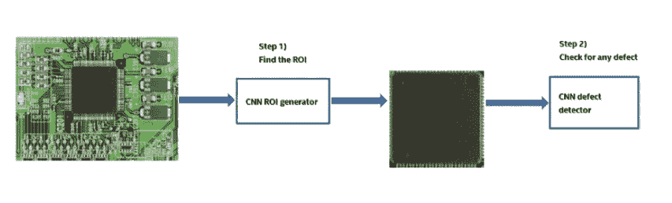
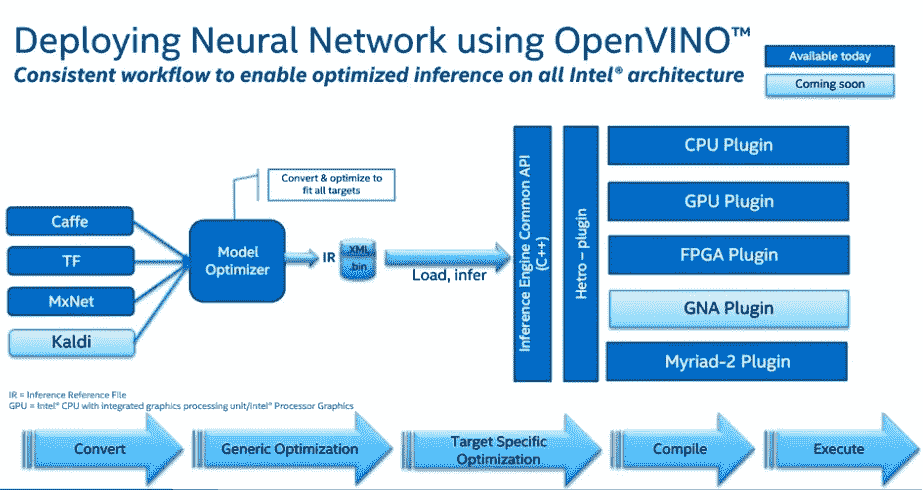
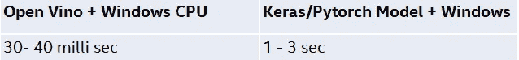
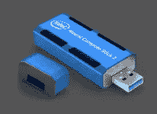
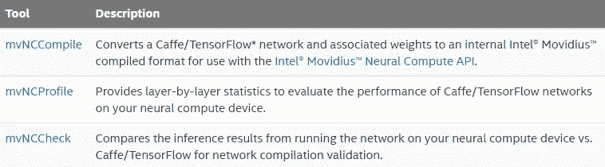
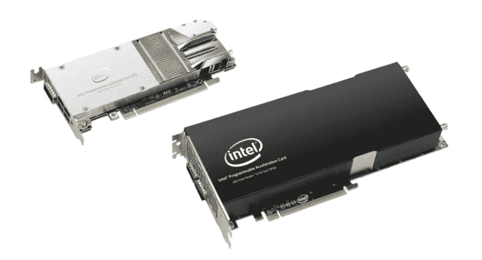
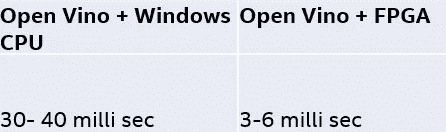

# 人工智能加速器产品

> 原文：<https://towardsdatascience.com/ai-accelerator-products-e02cbb698d93?source=collection_archive---------9----------------------->


## 加速深度学习推理的英特尔软件和硬件

作者:帕萨·德卡和罗希特·米塔尔

如果你已经关注了我们之前在 medium 上的博客(如下)，我们发布了我们如何在制造环境中使用深度学习进行质量检测:

[](/quality-inspection-in-manufacturing-using-deep-learning-based-computer-vision-daa3f8f74f45) [## 基于深度学习的计算机视觉在制造业中的质量检测

### 作者:帕萨·德卡和罗希特·米塔尔

towardsdatascience.com](/quality-inspection-in-manufacturing-using-deep-learning-based-computer-vision-daa3f8f74f45) 

在这篇博客中，我们将详细介绍各种英特尔软件和硬件人工智能产品。这些产品加速了深度学习推理。

## 什么是深度学习推理？

一旦我们在强大的 GPU 中通过数小时/数天的训练开发出最佳的深度神经网络模型，我们就必须对该模型进行操作合理化，以实现其核心商业价值。我们用一个计算机视觉用例来举例，假设我们在 GPU 中用 Keras & Tensorflow 训练了一个硬件产品缺陷检测深度神经网络分类器。现在，由于我们已经有了一个训练有素的模型，是时候在生产环境中部署该模型了，生产环境可以是本地服务器、云实例或边缘环境。如果您已经关注了我们之前的博客，这里是我们讨论的抽象用例的推理流程的图示:



我们得到一张新的图像，用经过训练的 CNN ROI 生成器进行 ROI 提取，然后用经过训练的 CNN 缺陷检测器进行缺陷检测。使用 ML 或 DL 模型的推断是生产流水线的一部分，其中实时或批量数据工程流水线处理图像并调用训练好的模型来执行预测。执行推理的 SLA 可以在几秒钟或几毫秒内完成。我们已经体验到，我们使用 Tensorflow keras/pytorch 为我们讨论的用例构建的训练模型需要花费 1 秒多的时间来对序列化的 h5py 格式的单个图像进行推断。标准 CPU 中的 pt 格式。但是我们如何用毫秒来推断呢？

## **软件加速器—使用 Open Vino 软件优化推理**:

英特尔构建了开放式 Vino 工具套件，以优化卷积神经网络模型的推理。Open Vino toolkit 扩展到整个英特尔硬件并最大限度地提高性能:

-在边缘实现基于 CNN 的深度学习推理

-使用通用 API 支持跨计算机视觉加速器(CPU、GPU、英特尔 Movidius Neural Compute Stick 和 FPGA)的异构执行

-通过函数库和预先优化的内核加快上市时间

-包括针对 OpenCV 和 OpenVX*的优化调用

部署的两个步骤:模型优化器和推理引擎


第一步是使用模型优化器将预训练模型转换为 IRs:

*   产生一个有效的中间表示:如果这个主转换工件无效，推理引擎就不能运行。模型优化器的主要职责是生成两个文件来形成中间表示。
*   生成优化的中间表示:预先训练的模型包含对训练很重要的层，例如 dropout 层。这些层在推理过程中没有用，可能会增加推理时间。在许多情况下，这些层可以从生成的中间表示中自动移除。但是，如果一组层可以表示为一个数学运算，因此可以表示为一个层，则模型优化器会识别这种模式并用一个层替换这些层。结果是一个比原始模型层数更少的中间表示。这减少了推断时间。

IR 是描述整个模型的一对文件:

。xml:描述网络拓扑

。bin:包含权重和偏差二进制数据

第二步是使用推理引擎来读取、加载和推理 IR 文件，使用跨 CPU、GPU 或 VPU 硬件的通用 API

请参考下面的开放 Vino 文档，了解 Python API 的概况:

[](https://software.intel.com/en-us/articles/OpenVINO-InferEngine#overview-of-inference-engine-python-api) [## 推理引擎开发人员指南

### 将深度学习网络从训练环境部署到嵌入式平台进行推理是一项复杂的任务…

software.intel.com](https://software.intel.com/en-us/articles/OpenVINO-InferEngine#overview-of-inference-engine-python-api) 

请参考下面的流程图和步骤，使用 OpenVino 部署神经网络模型



请按照下面的步骤(代码片段)操作:

步骤 1:以 h5 格式保存训练好的模型

```
model.save('trained_model.h5')
```

步骤 2:将训练好的模型转换为 tensorflow pb 格式

(使用 github 回购:[https://github.com/amir-abdi/keras_to_tensorflow](https://github.com/amir-abdi/keras_to_tensorflow))

```
python3 keras_to_tensorflow.py -input_model_file trained_model.h5
```

第三步:运行模型优化器(Optimizer-C:\ Intel \ open vino \ computer _ vision _ SDK _ 2018 . 3 . 343 \ deployment _ tools \ model _ Optimizer \ mo _ TF . py)

```
python3 mo_tf.py — input_model <your_model.pb> — input_shape=[1,224,224,3]
```

步骤 4:预处理图像并运行推理

我们对单个图像的推断基准:



## 硬件加速器:

## 英特尔 Movidius:

英特尔 Movidius 是为推断图像的深度神经网络而定制的。它由专为计算机视觉定制的英特尔 Movidius 视觉处理单元提供支持



技术条件

*   处理器:英特尔 m ovidius Myriad X 视觉处理单元(VPU)
*   支持的框架:TensorFlow*和 Caffe*
*   连接:USB 3.0 Type-A
*   尺寸:2.85 英寸。x 1.06 英寸。x 0.55 英寸。(72.5 毫米 x 27 毫米 x 14 毫米)
*   工作温度:0 摄氏度至 40 摄氏度
*   兼容的操作系统:Ubuntu* 16.04.3 LTS (64 位)、CentOS* 7.4 (64 位)和 Windows 10 (64 位)

请参考下面的视频进行介绍:

请查看英特尔 Movidius github 文档:

[](https://movidius.github.io/ncsdk/index.html) [## 介绍

### 英特尔 Movidius 神经计算 SDK 和英特尔 Movidius 神经计算 API 文档概述。

movidius.github.io](https://movidius.github.io/ncsdk/index.html) 

英特尔 Movidius 神经计算 SDK(软件开发套件):

命令行工具:英特尔 Movidius 神经计算软件开发套件提供了在开发计算机上评测、调整和编译深度神经网络(DNN)模型的工具



mvNCCompile 是一个命令行工具，它将 Caffe 或 Tensorflow 模型的网络和权重编译成与英特尔 Movidius 神经计算 SDK (NCSDK)和神经计算 API(NCAPI)兼容的英特尔 Movidius 图形

```
mvNCCompile inception-v1.pb -s 12 -in**=**input -on**=**InceptionV1/Logits/Predictions/Reshape_1 -is 224 224 -o InceptionV1.graph
```

英特尔 Movidius 神经计算 SDK 附带了一个 Python API，支持通过神经计算设备(如英特尔 Movidius 神经计算棒)利用加速深度神经网络的应用。

Python API:Python API 是作为一个单独的 Python 模块(mvncapi.py)提供的，当安装 NCSDK 时，它位于开发计算机上。它在 Python 2.7 和 3.5 中都可用

Python API 概述:

1.  导入 NCAPI 模块

Python NCAPI 位于 mvnc 包内的 mvncapi 模块 9 中

```
from mvnc import mvncapi
```

2.安装一个神经计算设备

Device 类表示一个神经计算设备，并提供与该设备通信的方法

```
#get a list of available device identifiers
device_list = mvncapi.enumerate_devices()
```

用调用 enumerate_devices()获得的设备标识符之一初始化设备

```
#Initialize the device and open communication
device.open()
```

3.为设备设置网络图和相关的 FIFO 队列

NCSDK 需要使用 mvNCCompile NCSDK 工具编译的神经网络图形文件。支持 Tensorflow 和 Caffe 的许多网络模型。

当我们编译完图形后，将图形文件加载到缓冲区

```
#Load graph file data
GRAPH_FILEPATH = './graph'
with open(GRAPH_FILEPATH, mode='rb') as f:
     graph_buffer = f.read()
```

Graph 类提供了利用网络图的方法。

我们可以用一个名称字符串来初始化这个图。名称字符串可以是我们喜欢的任何东西，直到 mvncapi。MAX_NAME_SIZE 个字符，或者只是一个空字符串。

```
#Initialize a Graph object
graph = mvncapi.Graph('graph'
```

图形输入和输出是通过 FIFO(先进先出)队列完成的。 [Fifo](https://movidius.github.io/ncsdk/ncapi/ncapi2/py_api/Fifo.html) 类代表了这些队列中的一个，并提供了管理它的方法。

我们应该为我们的图形创建输入和输出 Fifo 队列，并用 Graph.allocate _ with _ fifos 将图形分配给我们的设备。我们可以省略关键字参数来使用默认的 Fifo 设置，或者我们可以根据需要指定其他值。

```
*# Allocate the graph to the device and create input and output Fifos with default arguments*
input_fifo, output_fifo **=** graph**.**allocate_with_fifos(device, graph_file_buffer)#*# Allocate the graph to the device and create input and output #Fifos with keyword arguments*input_fifo, output_fifo **=** graph**.**allocate_with_fifos(device, graph_file_buffer,
        input_fifo_type**=**mvncapi**.**FifoType**.**HOST_WO, input_fifo_data_type**=**mvncapi**.**FifoDataType**.**FP32, input_fifo_num_elem**=**2, 
        output_fifo_type**=**mvncapi**.**FifoType**.**HOST_RO, output_fifo_data_type**=**mvncapi**.**FifoDataType**.**FP32, output_fifo_num_elem**=**2)
```

4.获取输入张量

使用 cv2 模块从文件中读取图像并调整其大小以适应您的网络需求

```
import cv2

*# Read an image from file*
tensor **=** cv2**.**imread('img.jpg')*# Do pre-processing specific to this network model (resizing, #subtracting network means, etc.)*
```

5.进行推理

我们将使用 graph . queue _ inference _ with _ fifo _ elem()将输入张量写入输入 Fifo，并对其进行排队以便进行推理。当推理完成时，输入张量将从 input_fifo 队列中删除，结果张量将放入 output_fifo 队列中

```
*# Write the tensor to the input_fifo and queue an inference*
graph**.**queue_inference_with_fifo_elem(input_fifo, output_fifo, tensor, 'user object')
```

如果输入 Fifo 已满，此方法调用将阻塞，直到有空间写入 Fifo。

推理完成后，我们可以用 Fifo.read_element 得到推理结果。这也将返回我们传递给 Fifo.write_elem()的用户对象

```
# Get the results from the output queue
output, user_obj = output_fifo.read_elem()
```

然后，我们可以将输出结果用于我们特定的网络模型

6.打扫

在关闭与设备的通信之前，我们将使用 Graph.destroy()和 Fifo.destroy()来销毁图形和 Fifo 对象，并清理相关的内存。Fifos 在销毁前必须为空。然后使用 Device.close()关闭设备，使用 Device.destroy()销毁设备对象并清理相关内存

```
#Clean up
input_fifo**.**destroy()
output_fifo**.**destroy()
graph**.**destroy()
device**.**close()
device**.**destroy()
```

## 英特尔 FPGA:



FPGAs 是芯片设备，可以针对数据分析、图像推断、加密和压缩等工作负载进行编程。FPGAs 支持提供处理速度更快、能效更高、延迟更低的服务，从而在数据中心的电力、空间和冷却限制内最大限度地提高计算能力。

**英特尔 FPGAs 的优势**

*   **易于部署—**英特尔可编程加速卡(英特尔 PAC)在一个基于 PCIe 的卡中提供了一个英特尔 FPGA，可在多家领先原始设备制造商的经验证服务器上使用。面向英特尔至强处理器和 FPGA 的英特尔加速堆栈大大降低了 FPGA 编程的复杂性
*   **标准化—**采用 FPGA 的英特尔至强处理器定义了标准化接口，FPGA 开发人员和开发与运营团队可以使用这些接口热插拔加速器，并实现应用的可移植性。
*   **加速器解决方案** —由英特尔和第三方技术专家开发的加速器解决方案组合，旨在加快应用开发和部署。可从流分析、图像推断等领域受益于 FPGA 加速的应用。

支持 FPGA 的 OpenVino 图像推断:

步骤 1:配置 FPGA 板:硬件

在进入软件配置之前，必须进行一些硬件方面的设置。我们需要遵循以下说明:

[](https://www.intel.com/content/www/us/en/programmable/documentation/tgy1490191698959.html) [## AN 807:为面向 OpenCL 的英特尔 FPGA SDK 配置英特尔 Arria 10 GX FPGA 开发套件

### 在使用英特尔 Arria 10 GX FPGA 开发套件之前，您必须完成本文档中的说明…

www.intel.com](https://www.intel.com/content/www/us/en/programmable/documentation/tgy1490191698959.html) 

确保我们有 Jtag 连接(通过微型 USB)和 PCIe 连接。

步骤 2:配置 FPGA 板:软件

请遵循以下链接中的说明:

[](https://software.intel.com/en-us/articles/OpenVINO-Install-Linux-FPGA) [## 安装支持 FPGA 的英特尔 OpenVINO toolkit for Linux 发行版

### 注意:-英特尔发布的 open vino toolkit 以前被称为英特尔计算机视觉 SDK。这些…

software.intel.com](https://software.intel.com/en-us/articles/OpenVINO-Install-Linux-FPGA) 

2.1 初始化英特尔 Arria 10 GX 以用于 Open CL

必须用 OpenCL 映像正确初始化该板，以便它可以与 OpenCL 一起使用。请遵循以下链接中“初始化用于 OpenCL 的英特尔 Arria 10 GX FPGA 开发套件”的说明:

[](https://www.intel.com/content/www/us/en/programmable/documentation/tgy1490191698959.html) [## AN 807:为面向 OpenCL 的英特尔 FPGA SDK 配置英特尔 Arria 10 GX FPGA 开发套件

### 在使用英特尔 Arria 10 GX FPGA 开发套件之前，您必须完成本文档中的说明…

www.intel.com](https://www.intel.com/content/www/us/en/programmable/documentation/tgy1490191698959.html) 

2.2 安装 OpenCL 运行时驱动程序

OpenCL 运行时驱动程序(OpenCL 的 FPGA RTE)随 OpenVINO 安装一起提供，因此我们需要确保首先安装 OpenVINO。遵循以下链接的“安装 OpenCL 运行时环境”一节中的说明

[](https://software.intel.com/en-us/articles/OpenVINO-Install-Linux-FPGA) [## 安装支持 FPGA 的英特尔 OpenVINO toolkit for Linux 发行版

### 注意:-英特尔发布的 open vino toolkit 以前被称为英特尔计算机视觉 SDK。这些…

software.intel.com](https://software.intel.com/en-us/articles/OpenVINO-Install-Linux-FPGA) 

2.3 带有 OpenVINO 提供的 bitsream 的程序板

完成上述所有步骤后，我们需要用一个与特定 CNN 拓扑结构相关的比特流对电路板进行编程

我们编程的比特流应该对应于我们想要部署的拓扑。根据我们选择的位流数量，每种 FPGA 卡类型可能有不同的文件夹，这些文件夹将在 OpenVINO 包中下载。对于英特尔 Arria 10GX DevKit FPGA，预训练的比特流在

`/opt/intel/computer_vision_sdk/bitstreams/a10_devkit_bitstreams`

对于采用英特尔 Arria 10 FPGA 的英特尔视觉加速器设计，预训练的双流位于`/opt/intel/computer_vision_sdk/bitstreams/a10_vision_design_bitstreams`

请按照以下步骤编程比特流:

1.  重新运行环境设置脚本。

```
source /home/<user>/Downloads/fpga_support_files/setup_env.s
```

2.切换到主目录

```
cd /home/<user>
```

3.我们需要根据手中的卡来选择选项

*   为英特尔 Arria 10 FPGA 开发套件编写比特流

```
aocl program acl0 /opt/intel/computer_vision_sdk/a10_devkit_bitstreams/2-0-1_A10DK_FP11_SqueezeNet.aocx
```

*   利用英特尔 Arria 10 FPGA 为英特尔视觉加速器设计编写比特流

```
aocl program acl0 /opt/intel/computer_vision_sdk/bitstreams/a10_vision_design_bitstreams/4-0_PL1_FP11_SqueezeNet.aocx
```

步骤 3:为 FPGA 建立神经网络模型

请按照以下步骤创建用于推理的 FP16 模型:

1.  为 FP16 SqueezeNet 型号创建一个目录:

```
mkdir /home/<user>/squeezenet1.1_FP16
```

2.前往/home/ <user>/squeezenet1.1_FP16:</user>

```
cd /home/<user>/squeezenet1.1_FP16
```

3.使用模型优化器将 FP16 Squeezenet Caffe 模型转换为优化的中间表示(IR):

```
python3 /opt/intel/computer_vision_sdk/deployment_tools/model_optimizer/mo.py --input_model /home/<user>/openvino_models/FP32/classification/squeezenet/1.1/caffe/squeezenet1.1.caffemodel --data_type FP16 --output_dir .
```

4.squeezenet1.1.labels 文件包含 ImageNet 使用的类。包含该文件是为了使推理结果显示文本而不是分类号。将 squeezenet1.1.labels 复制到优化的模型位置

```
cp /home/<user>/openvino_models/ir/squeezenet1.1/FP32/squeezenet1.1.labels  .
```

5.将示例图像复制到发布目录。您将在优化的模型中使用它

```
sudo cp /opt/intel/computer_vision_sdk/deployment_tools/demo/car.png  ~/inference_engine_samples/intel64/Release
```

步骤 4:运行一个示例应用程序

1.  转到示例目录

```
cd /home/<user>/inference_engine_samples/intel64/Release
```

2.使用推理引擎示例在 CPU 上运行示例应用程序:

```
./classification_sample -i car.png -m ~/openvino_models/ir/squeezenet1.1/FP32/squeezenet1.1.xml
```

请注意以每秒帧数(FPS)为单位的 CPU 吞吐量。这告诉我们推断在硬件上完成得有多快。现在让我们使用 FPGA 来运行推理。

```
./classification_sample -i car.png -m ~/squeezenet1.1_FP16/squeezenet1.1.xml -d HETERO:FPGA,CPU
```

我们对单个图像的推断基准:



## 结论:

在这篇博客中，我们详细讨论了各种英特尔软件和硬件，以优化基于计算机视觉的深度神经网络的推理。我们还详细讨论了它们的用法以及如何设置它们。我们还用我们的样本用例对我们的结果进行了基准测试。如果你喜欢我们的博客，请点击拍手按钮，并请继续关注我们未来的博客，因为我们会定期贡献关于机器学习和深度学习的博客。

来源:

[https://software . Intel . com/en-us/articles/open vino-Install-Linux-FPGA](https://software.intel.com/en-us/articles/OpenVINO-Install-Linux-FPGA)

[https://www . Intel . com/content/www/us/en/programmable/solutions/acceleration-hub/overview . html](https://www.intel.com/content/www/us/en/programmable/solutions/acceleration-hub/overview.html)

【https://www.movidius.com/ 

[https://software.intel.com/en-us/openvino-toolkit](https://software.intel.com/en-us/openvino-toolkit)