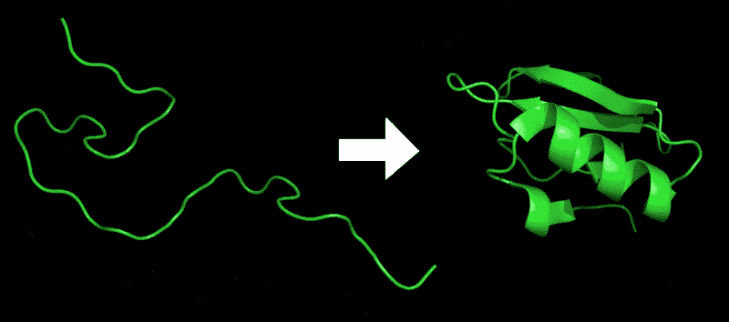
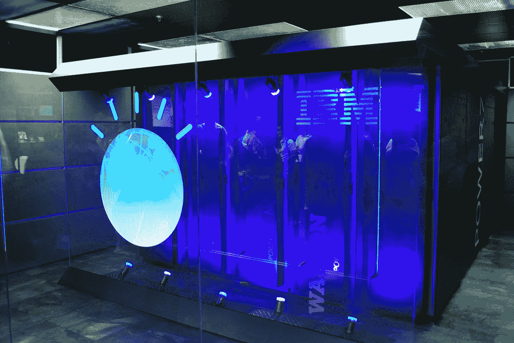

# 艾:几乎不死

> 原文：<https://towardsdatascience.com/ai-almost-immortal-478d13bfd24a?source=collection_archive---------15----------------------->

Photo by [Angely Acevedo](https://unsplash.com/@angelyviviana55?utm_source=medium&utm_medium=referral) on [Unsplash](https://unsplash.com?utm_source=medium&utm_medium=referral)

医疗保健的人工智能革命正在改变我们对年龄相关疾病的看法，甚至是衰老本身

我们正处于一场流行病之中。不管你的家族史、种族或地理位置如何，有一种疾病会降临到我们每一个人身上。你可以躲在西伯利亚的山里，但是疾病仍然会传染给你，因为它不具有传染性。它一直伴随着人类，并将在可预见的未来继续下去，尽管我们最近试图阻止它。

这种疾病叫做衰老。

认为衰老是一种疾病是违反直觉的，因为我们把它等同于时间不可避免的冲击，但科学界有越来越多的人认为这两个概念是可分的。事实上，年龄是如此的可分，以至于有一天它可能真的只是一个数字。据 [*英国《卫报》*](http://www.theguardian.com/society/2017/feb/21/south-korean-womens-life-expectancy-exceed-90-years-2020-study) 报道，35 个发达国家中，2030 年后出生的女性预期寿命最高为 90 岁以上，比 2010 年出生的女性增加了 6.6 岁。[1]

事实上，根据马克斯·普朗克人口研究所主任、杜克大学教授詹姆斯·沃佩尔的说法，“160 年来，最佳表现的预期寿命稳步增长了四分之一年。”[2]有人可能会说，事实也的确如此，我们正稳步达到一个最大年龄范围；然而，沃佩尔反驳道，“如果预期寿命接近最大值，那么预期寿命的增长速度应该会放缓。不是的。”[3]

人类可以解决衰老的想法听起来荒谬而自大。忽略生命意义的决定因素这一存在性问题，没有一个明确的终点，死亡已经成为人类经验中普遍存在的一种隐约可见的必然——唯一的必然。

Photo by [Andres Urena](https://unsplash.com/@andresurena?utm_source=medium&utm_medium=referral) on [Unsplash](https://unsplash.com?utm_source=medium&utm_medium=referral)

不管这看起来有多荒谬，最大的科技公司正在加入结束衰老的竞赛。谷歌的 Calico 实验室成立于 2013 年，是一项旨在解决年龄相关疾病和延长人类寿命的登月计划。但是谷歌并不孤单。苹果也将消费者医疗保健作为重点关注的领域。苹果公司首席执行官蒂姆·库克在接受美国消费者新闻与商业频道采访时表示，

> “如果你放眼未来，回首过去，你会问这样一个问题，‘苹果对人类最大的贡献是什么，这将是关于健康的。" [4]

事实上，医学领域似乎正在成为可量化数据的宝库。研究人员感兴趣的不仅仅是健康记录、家族史和验血，还有生命本身的密码——DNA。普利策奖获得者、作家兼生物学家悉达多·慕克吉(Siddhartha Mukherjee)解释道:对生命中最微小部分——我们的基因——的研究与计算机科学领域的融合是多么恰当，这个领域因对由 1 和 0 组成的比特的理解和操作而发生了革命性的变化。

随着我们逐渐了解我们的个人信息，数据是无价的，特别是因为它是可以收集更深层次知识的信息。如果在互联网上买卖我们的浏览数据产生了数十亿美元的产业，那么隐藏在我们基因组数据中的秘密又有多少价值呢？需要说明的是，我在这里并不是在谈论一个个体基因组的货币价值(无论这种想法如何)，而是对数百万个基因组及其伴随的物理表达进行大规模统计分析所能获得的洞察力财富。

Photo by [Taylor Vick](https://unsplash.com/@tvick?utm_source=medium&utm_medium=referral) on [Unsplash](https://unsplash.com?utm_source=medium&utm_medium=referral)

每个行业都朝着以数据为中心的方法发展，这必然会挤入医疗领域。根据*《时代》杂志*、[、【谷歌大战死亡】、](http://content.time.com/time/subscriber/article/0,33009,2152422-1,00.html)、“医学正在成为一门信息科学”。[5]有了这些信息，像谷歌这样的公司自然会把“信息视为一种商品，一种可以用工业效率开采和处理的实用资源”，[6]定位于利用所有这些宝贵的数据。

尽管尼古拉斯·卡尔，一位研究技术对现代社会影响的著名作家，在他的文章[中对外包人类思维的后果持否定态度，“谷歌是不是在让我们变得愚蠢？”他准确地指出了谷歌对医药领域感兴趣的原因。作为“一家从根本上讲是科学的企业，谷歌的动力来自于使用技术的愿望，用埃里克·施密特的话来说就是‘解决以前从未解决过的问题’。”[7]最难解决的问题之一是衰老，或者至少是与年龄有关的疾病，许多医学专家认为，解决办法在于人工智能和基因组学的结合。卡尔本人在一次演讲中引用了谷歌联合创始人拉里·佩奇的话，他说“致力于搜索是致力于人工智能的一种方式”。](http://www.theatlantic.com/magazine/archive/2008/07/is-google-making-us-stupid/306868/)

> 为人工智能解决问题不是为了实现它而实现的目标，而是为了将其应用于人类面临的更广泛、更广泛的问题，这些问题是人类独自没有能力解决的。

人工智能正在改变所有行业中卡尔所谓的“知识工作”的格局，医疗保健也不例外。然而，在对卡尔的回应中，著名的未来学家贾迈斯·卡斯西欧将这一转变描绘为“我们如何管理和适应我们创造的海量知识”的必要演变。[8]就基因组而言，所创造的知识是储存在数百万个序列中的大量信息及其相应的统计意义——这些信息正是我们自身的组成部分。

Photo by [Amelie Ohlrogge](https://unsplash.com/@pirye?utm_source=medium&utm_medium=referral) on [Unsplash](https://unsplash.com?utm_source=medium&utm_medium=referral)

卡斯西欧继续做了一个有先见之明的声明，告诉我们“人类不会被排除在循环之外——事实上，更多的人将有能力做一些曾经仅限于封闭的神职人员的事情”。这在医学研究中已被证明是正确的。药物发现研究员德瑞克·洛夫、[告诉《纽约时报》](http://www.nytimes.com/2019/02/05/technology/artificial-intelligence-drug-research-deepmind.html)*，*

> *“不是机器将取代化学家，而是使用机器的化学家将取代不使用机器的化学家”。[9]*

*技术可能不会赋予我们永生，但人类和机器智能日益增长的相互依赖性将引领我们进入一个快速医学进步的新世界——一个更实惠、更个性化、更安全的预防性保健的未来，我们的寿命和健康寿命都将大幅增加。*

*医学研究人员长期以来一直试图破译人类基因组。2003 年，第一个完整的人类基因组测序完成，耗时 10 年，耗资 30 亿美元。正如斯坦福大学遗传学和计算机科学助理教授 Anshul Kundaje 在他 2016 年关于“人工智能的未来”的演讲中指出的，“今天我们可以在几天内完成基因组测序，费用不到 2000 美元”。[10]*

*成本的快速降低创造了基因组数据的爆炸式增长——机器学习算法可以根据这些数据获得洞察力。这种见解有可能挽救患者的生命，因为他们的基因信息[可以帮助医生](http://www.yourgenome.org/stories/personal-genomics-the-future-of-healthcare)为个体开出最有效的药物，同时将副作用降至最低。然而，仅仅解码基因组不足以像许多人希望的那样推进医学发展；研究人员必须了解代码片段是如何表达的，以便有意义地利用 2 万个基因的序列。*

**

*Photo by [Daniel Christie](https://unsplash.com/@daniel_christie97?utm_source=medium&utm_medium=referral) on [Unsplash](https://unsplash.com?utm_source=medium&utm_medium=referral)*

*Kundaje 解释说，他的团队获得了原始数据，应用了机器学习模型，并能够分配“基因组的某种综合功能注释”。通过这样做，他的团队确定了解决阿尔茨海默氏症的潜在目标。阿尔茨海默氏症是一种可遗传的疾病，是许多基因治疗努力的目标，其作用机制长期以来一直没有得到传统治疗。*

*当开发有效的疗法时，知道在哪里寻找和预测药物将如何表现为药物研究人员提供了巨大的优势。直接编辑或关闭与疾病相关的基因组片段的能力在基因组学领域引起了很大的兴奋。一个名为 [CRISPR-Cas9](http://ghr.nlm.nih.gov/primer/genomicresearch/genomeediting) 的系统受到了很多关注，“因为它比其他现有的基因组编辑方法更快、更便宜、更准确、更高效”。[11]然而，精确编辑基因的能力对于没有目标的研究人员来说毫无用处。像 Kundaje 的项目可以帮助获得这些基因目标。*

*虽然 DNA 是核心，但它不是疾病背后的全部。DNA 指导蛋白质(利用 RNA 作为中介转录和翻译指令)，蛋白质按照指导执行。但是，[在这个过程中](http://www.theguardian.com/science/2018/dec/02/google-deepminds-ai-program-alphafold-predicts-3d-shapes-of-proteins)，“它们可能会纠缠在一起……导致糖尿病、帕金森氏症和老年痴呆症等疾病”。[12]由于这个原因，预测蛋白质的形状对于理解其功能至关重要——这是一项历史上极其困难的任务。*

*2011 年，研究人员众包了这件事，求助于游戏玩家来帮助找到蛋白质折叠问题的解决方案。在三周内，游戏玩家和研究人员的共同努力导致了“解决对艾滋病病毒繁殖至关重要的蛋白质狙击酶结构的关键见解”——这是一项困扰了科学家十年的壮举。[13] [根据当时《科学美国人》](http://www.scientificamerican.com/article/foldit-gamers-solve-riddle/.) 的说法，“当复杂的问题需要直觉和敏锐的洞察力而不是野蛮的计算时，人类仍然比计算机占有优势”。*

**

*[Protein Folding](https://commons.wikimedia.org/wiki/File:Protein_folding.png) from [Wikimedia Commons](https://commons.wikimedia.org/wiki/Main_Page)*

*显然，这种优势没有持续到这个十年的剩余时间。谷歌的 AlphaFold 是一种基于上述 Foldit 游戏训练的深度学习算法，在蛋白质折叠挑战中以巨大优势击败了 98 名竞争对手。“预测 43 个蛋白质中的 25 个蛋白质的最精确结构，相比之下，第二组的 43 个蛋白质中只有 3 个”。[14]也许更重要的是，该程序从花数周时间提供预测发展到在几个小时内就能做到。随着更多的数据和更多的实践，人工智能已经证明它将获得准确性和效率。*

*对蛋白质折叠的深入了解使研究人员不仅可以窥视遗传性疾病的功能，还可以研究如何开发治疗这些疾病的药物。[据《纽约时报》报道，“如果科学家能够预测蛋白质的形状，他们就能更好地确定其他分子将如何‘结合’它”。像 AlphaFold 这样的工具越来越普及，可以大大减少开发治疗以前无法治愈的疾病所需的时间和金钱。](http://www.nytimes.com/2019/02/05/technology/artificial-intelligence-drug-research-deepmind.html)*

*尽管 AlphaFold 的戏剧性胜利标志着人工智能在生化研究中的重要性日益增加，但并不是所有人都相信机器和开发它们的人能够提供所有答案。正如华盛顿大学蛋白质设计研究所所长大卫·贝克博士向《纽约时报》表达的那样:“创造蛋白质比正在探索的‘折叠’方法更重要，”他认为 AlphaFold 不适合完成这项任务。*

*正如之前对人工智能解决问题能力的质疑一样，时间会证明一切。*

**

*[IBM Watson](https://commons.wikimedia.org/wiki/File:IBM_Watson.PNG) from [Wikimedia Commons](https://commons.wikimedia.org/wiki/Main_Page)*

*机器学习及其在医学中的应用不仅限于计算基因组学或蛋白质折叠。2016 年，IBM 的人工智能机器 Watson 做了医生做不到的事情。在 10 分钟内，[沃森分析了](http://www.nydailynews.com/news/world/ibm-watson-proper-diagnosis-doctors-stumped-article-1.2741857)2000 万份与癌症相关的研究论文，并给出了正确的诊断——这是东京大学的医生在治疗他们 60 岁病人的几个月中未能完成的壮举。[15]与 AlphaFold 类似，Watson 也提高了准确性和效率，IBM 声称在 2011 年至 2013 年间性能提高了 240%。*

*正如我们在沃森和谷歌 DeepMind 的例子之间看到的那样，这些人工智能系统在分析和比较大量数据的情况下表现更好。除了开发这些深度学习算法，收集和提供尽可能多的健康数据也同样重要。*

*[根据国家衰老研究所的说法](http://www.nia.nih.gov/health/alzheimers-disease-genetics-fact-sheet#genetics)，来自健康和高危患者的基因信息越多，“研究人员就有越多的线索来发现额外的风险因素基因”。Kundaje 在他的演讲中还提到，机器学习算法必须输入个人和大规模的基因组数据以及健康记录，才能有效地识别我们基因组成中的比特位和这些比特位中的错误可能导致的疾病之间的统计显著相关性。*

*令人欣慰的是，各机构正在共同努力，让研究人员能够轻松获取这些数据。[ENCODE(DNA 元素百科全书)项目](http://www.genome.gov/10005107/the-encode-project-encyclopedia-of-dna-elements/.)是一个公共研究联盟，其研究数据库可以免费访问。与此同时，哈佛在 2005 年启动了个人基因组计划，这是一个自愿的项目，参与者提供他们的生物样本用于基因研究。希望健康信息的广泛可用性和不断增长的数据库，以及健康记录的集成数字化，将推动人工智能的进步，如 IBM 的沃森和谷歌的 DeepMind。*

*有了这些数据，[机器学习](http://www.youtube.com/watch?v=lX76DzZdjvQ)将成为医生和药物研究人员的关键合作伙伴，正如 Kundaje 所声称的那样，“将这些数据转化为基本的预测性预测、诊断、更小的药物靶点和最佳治疗策略”。*

*尽管尚未超越其技术障碍，但人工智能将引领我们进入一个医学进步的新时代，使个体治疗更加个性化和有效，并从根本上破坏患者与提供者的关系，不是通过取代医疗提供者，而是通过增加他们的专业知识，让他们更有效地治疗患者。随着人工智能在医疗保健领域的出现，研究人员将有权分析他们以前从未能够分析的数据，利用我们存在的代码 DNA 来了解是什么让我们健康和完整，最终使个性化医疗成为现实，有可能解决最普遍的疾病-衰老。*

**

*[**Connect with me**](https://www.linkedin.com/in/sanchezgiovanni/)*

*感谢您花时间阅读这篇文章。我是哥伦比亚大学大三学生，学习计算机科学&数学，旨在利用机器学习的力量来改善人类健康和延长寿命。*

## *参考*

*[1] B. Sarah，“未来几十年预期寿命预测将超过 90 岁”，*《卫报》* (2017 年)，[www . The Guardian . com/society/2017/feb/21/南朝鲜-妇女-预期寿命-超过 90 岁-2020-研究](http://www.theguardian.com/society/2017/feb/21/south-korean-womens-life-expectancy-exceed-90-years-2020-study.)*

*[2] J. Oeppen 和 J. Vaupel，“人口统计:提高:打破预期寿命的限制”(2002 年)，*科学*，第 296 卷，第 5570 期，第 1029-1031 页，[https://science.sciencemag.org/content/296/5570/1029](https://science.sciencemag.org/content/296/5570/1029)*

*[3]同上。*

*[4] T .库克，《美国消费者新闻与商业频道对蒂姆·库克的采访》*美国消费者新闻与商业频道* (2019)，[www . CNBC . com/video/2019/01/02/apple-Tim-cook-revenue-stocks . html](http://www.cnbc.com/video/2019/01/02/apple-tim-cook-revenue-stocks.html.)*

*[5] H .格罗斯曼，《谷歌大战死神》，*时间* (2013)，[content . Time . com/Time/subscriber/article/0，33009，2152422–1，00.html](https://content.time.com/time/subscriber/article/0,33009,2152422,00.html)*

*[6] N .卡尔，“谷歌正在让我们变得愚蠢吗？”、*大西洋* (2018)、[www . thealantic . com/magazine/archive/2008/07/is-Google-making-us-study/306868](http://www.theatlantic.com/magazine/archive/2008/07/is-google-making-us-stupid/306868/.)*

*7 同上*

*[8] J .卡斯西欧，《变得更聪明》，*《大西洋月刊》(* 2014)，[www . theatlantic . com/magazine/archive/2009/07/Get-Smarter/307548/](http://www.theatlantic.com/magazine/archive/2009/07/get-smarter/307548/.)*

*[9] C. Metz，“用一剂人工智能制造新药”，*《纽约时报》(* 2019)，[www . nytimes . com/2019/02/05/technology/Artificial-Intelligence-drug-research-deep mind . html](http://www.nytimes.com/2019/02/05/technology/artificial-intelligence-drug-research-deepmind.html.)*

*[10] A. Kundaje，《Anshul Kundaje:机器学习解码基因组》，《人工智能的未来》(2019 年)，【www.youtube.com/watch?v=lX76DzZdjvQ】T4*

*[11]“什么是基因组编辑和 CRISPR-Cas9？—遗传学家庭参考— NIH”，美国国家医学图书馆，[https://ghr . NLM . NIH . gov/primer/genomic research/genome editing](https://ghr.nlm.nih.gov/primer/genomicresearch/genomeediting)*

*[12]一、样本，“谷歌的 DeepMind 预测蛋白质的 3D 形状”*The Guardian*(2018)[www . The Guardian . com/science/2018/dec/02/Google-deep minds-ai-program-alpha fold-Predicts-3D-Shapes-of-Proteins](http://www.theguardian.com/science/2018/dec/02/google-deepminds-ai-program-alphafold-predicts-3d-shapes-of-proteins.)*

*[13] M. Coren，“Foldit Gamers 在 3 周内解开 HIV 酶之谜”，*科学美国人(* 2011)，[www . Scientific American . com/article/Foldit-Gamers-Solve-Riddle](http://www.scientificamerican.com/article/foldit-gamers-solve-riddle/.)*

*[14]一、样本，“谷歌的 DeepMind 预测蛋白质的 3D 形状”*The Guardian*(2018)[www . The Guardian . com/science/2018/dec/02/Google-deep minds-ai-program-alpha fold-Predicts-3D-Shapes-of-Proteins](http://www.theguardian.com/science/2018/dec/02/google-deepminds-ai-program-alphafold-predicts-3d-shapes-of-proteins.)*

*[15] A. Ng，“IBM 的沃森在医生被难倒数月后为日本白血病患者做出正确诊断”，《纽约每日新闻》(2018 年)，[www . nydaily News . com/News/world/IBM-Watson-Proper-Diagnosis-Doctors-Stumped-article-1.2741857](http://www.nydailynews.com/news/world/ibm-watson-proper-diagnosis-doctors-stumped-article-1.2741857)*