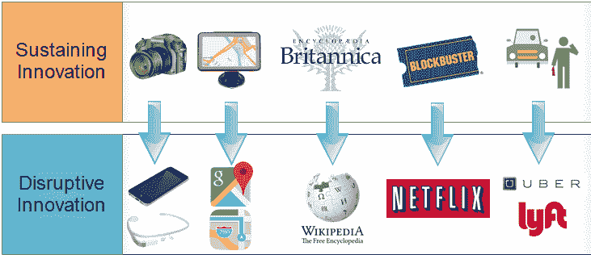
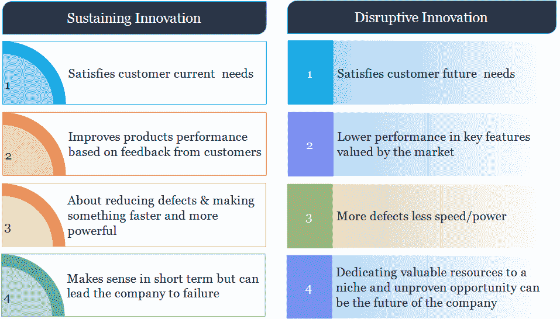
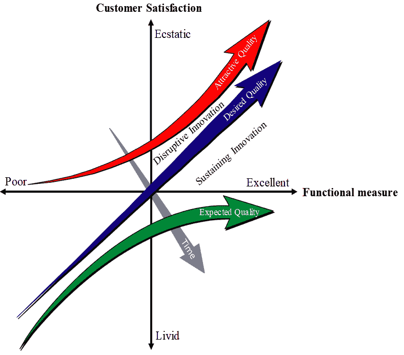

# 人工智能和颠覆性创新

> 原文：<https://towardsdatascience.com/ai-and-disruptive-innovation-393ee89eb5dd?source=collection_archive---------10----------------------->

Source: Alaa Khamis

## 人工智能与全球经济

人工智能将对全球经济产生重大影响。据估计，2019 年全球预测分析软件的市场规模将超过 65 亿美元，高级驾驶辅助系统的全球市场规模将在 2019 年达到 180 亿美元，而 2012 年为 56 亿美元，企业、消费者和医疗保健领域的全球语音识别市场将在 2017 年达到 1130 亿美元，而 2012 年为 530 亿美元，自然语言处理市场预计将在 2018 年超过 99 亿美元，而 2018 年为 38 亿美元这些预测和基于人工智能的产品和服务的巨大财务成功鼓励了许多风险资本家投资机器智能领域。这导致人工智能初创公司在自然语言处理、预测分析和深度学习等领域获得的资金大幅增加，这些领域使用了大量可用的大数据，因为世界上 90%的数据是在过去两年中产生的，而且这些数据中的大部分都是数字化的。6.6 万亿美元的生产率增长加上 9.1 万亿美元的更大消费者需求，到 2030 年，由于人工智能，全球 GDP 将增加 15.7 万亿美元的附加值 [FastCompany](https://www.fastcompany.com/40474564/how-to-stop-worrying-and-love-the-great-ai-war-of-2018) 。这些成功故事的共同点是颠覆性创新。

## 人工智能作为颠覆性创新的推动者

人工智能是颠覆性创新的关键推动者，这种创新导致改变游戏规则的产品和服务能够服务于低端或未得到服务的消费者，并迁移到主流市场。这项技术是我们目前目睹的颠覆性创新背后的驱动力。例如，人工智能使共享经济成为一种新的商业模式，个人可以将自己的资产作为服务与他人分享，以更好地利用这些资产并创造利润。该模型已成功应用于不同领域，如拼车、智能快速原型、智能电网、住宿等。根据创新者的困境，持续创新旨在满足客户当前的需求，根据客户的反馈提高产品性能，减少缺陷，使产品更快更强大。另一方面，破坏性创新满足了客户的未来需求，可能会在一些关键功能上提供较低的性能，但会创造出一些受市场重视的独特功能。

Source: Alaa Khamis

大英百科全书和维基百科分别是持续创新和破坏性创新的例子。《大英百科全书》提供了一部可靠的英语百科全书，而维基百科的可靠性经常受到质疑。然而，维基百科是一个免费的多语言百科全书，每个人都可以访问。这同样适用于昂贵的导航系统和谷歌/苹果地图中的导航功能。与谷歌/苹果地图相比，前者更可靠，不依赖于网络覆盖，但更昂贵，并且不提供实时交通更新。

## 卡诺模型

Kano 模型是理解客户对新产品和服务需求的一种富有洞察力的方式。破坏性创新位于吸引质量和期望质量之间的区域，而持续创新位于期望质量和期望质量之间的区域。随着顾客期望的变化，有吸引力的特征变成了预期的特征。例如，电动车窗、电动座椅、可调方向盘、巡航控制等汽车功能正从理想功能转变为预期功能。其他功能，如车道保持辅助、自适应巡航控制、盲点检测和预测，正在从吸引人的功能转变为理想的功能。虽然像超级巡航和自动驾驶这样的功能对许多客户来说仍然很有吸引力。

Source: Alaa Khamis

如果产品/服务不能反映不断变化的客户期望，客户可能会放弃该产品/服务，转而使用另一种具有更具吸引力功能的产品/服务。许多基于持续创新的公司倒闭了，如 Borders、Blockbuster、Kodak 和 Columbia，取而代之的是采用人工智能和颠覆性创新的软件公司，如亚马逊、Netflex、flicker 和 Apple Music。现在，谷歌是最大的营销平台。亚马逊是最大的书商，Skype 是增长最快的电信公司，LinkedIn 是增长最快的招聘公司，iTunes 和 Spotify 是增长最快的娱乐公司，Airbnb 是世界上最大的住宿提供商，尽管它没有任何房地产。此外，比特币是世界上最大的无现金银行，优步是世界上最大的无车辆出租车公司，脸书是世界上最受欢迎的无内容媒体所有者，阿里巴巴是世界上最有价值的无库存零售商。

是时候在别人之前扰乱你的生意了。扰乱或灭亡！