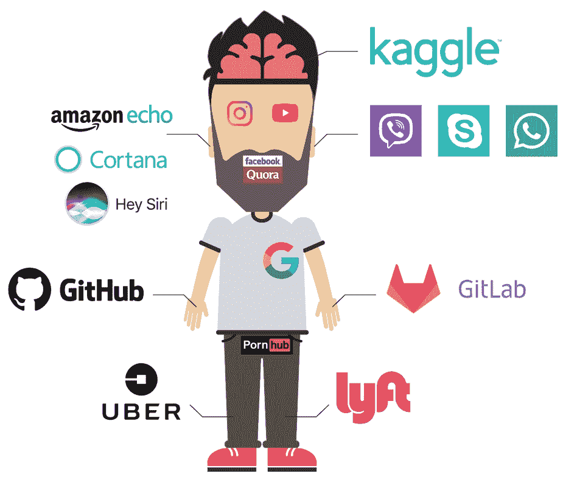
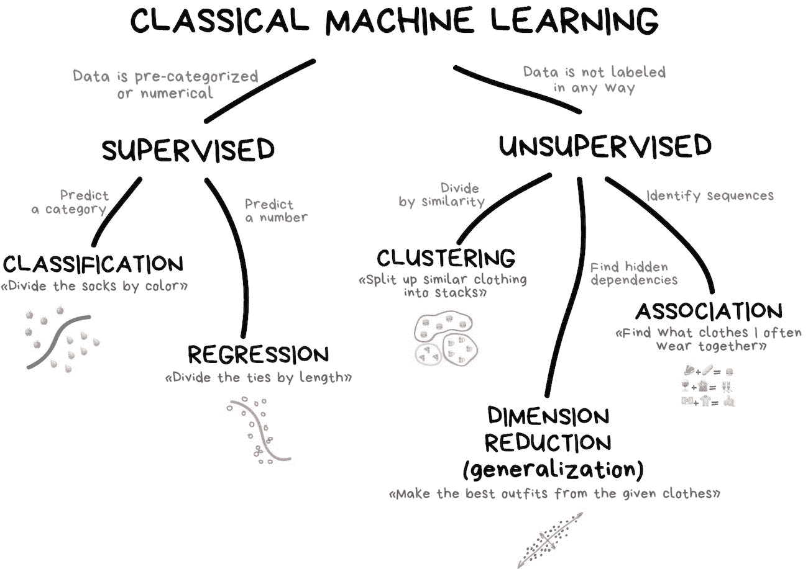
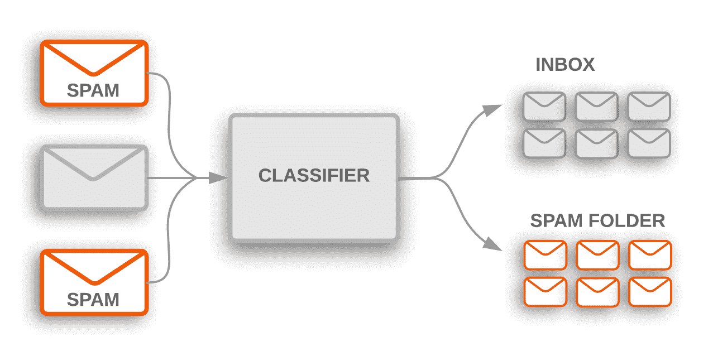
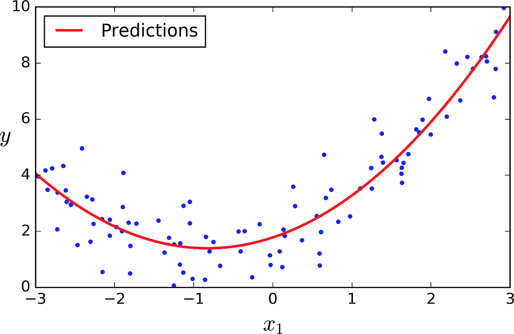
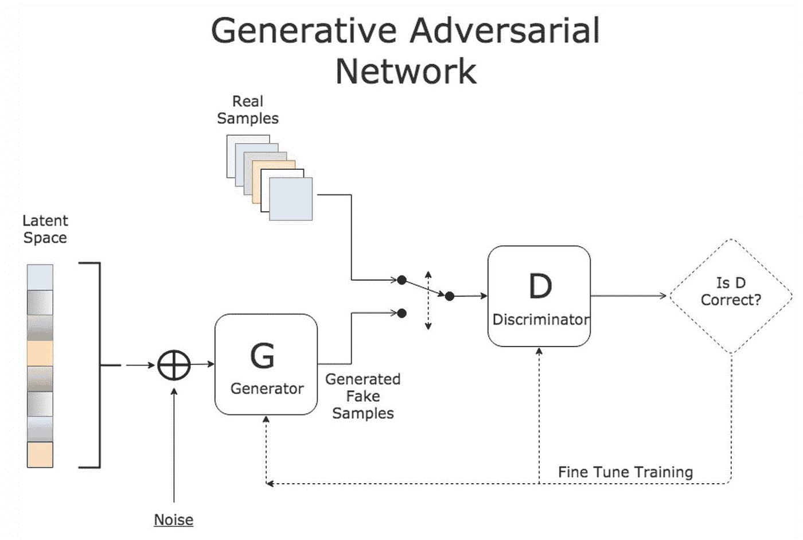
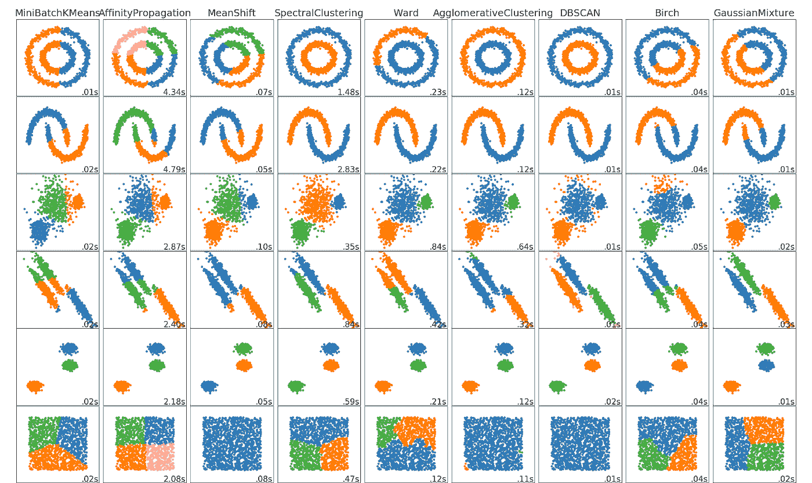
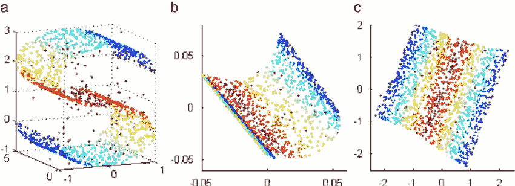
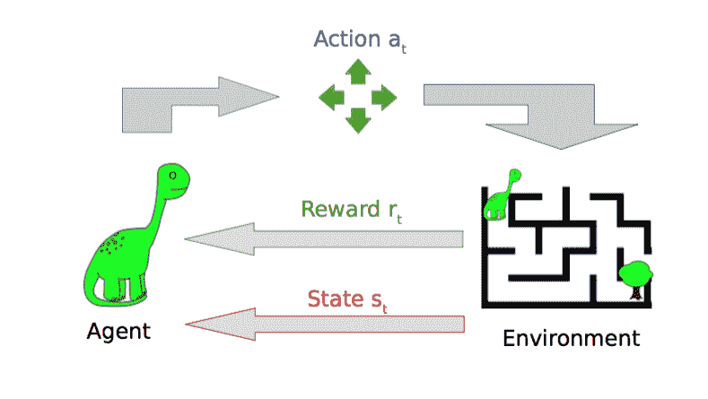

# 人工智能安全和对抗性机器学习 101

> 原文：<https://towardsdatascience.com/ai-and-ml-security-101-6af8026675ff?source=collection_archive---------2----------------------->

Image by [skeeze](https://pixabay.com/users/skeeze-272447/?utm_source=link-attribution&amp;utm_medium=referral&amp;utm_campaign=image&amp;utm_content=808901) from [pixabay](https://pixabay.com/?utm_source=link-attribution&amp;utm_medium=referral&amp;utm_campaign=image&amp;utm_content=808901)

# 介绍

人工智能(AI)越来越频繁地登上头条。新技术产品持续包含人工智能。它还触及了网络安全领域，给了攻击者和 T2 防御者更大的机会来实现他们的目标。我已经发表了一些想法，将[机器学习用于网络安全](/machine-learning-for-cybersecurity-101-7822b802790b)解决方案，以及实施 ML 技术[改善黑客攻击](/machine-learning-for-cybercriminals-a46798a8c268?source=activity---post_recommended)。似乎人工智能在柜台的两边都起作用，所以没有办法明确地说人工智能是好是坏。今天我要给一切泼点冷水。

UPD 2021: [这里](https://adversa.ai/report-secure-and-trusted-ai)你可以找到关于 AI 和 ML 攻击的最新报告

事实上，我们在人工智能的帮助下取得的成果不应该被低估。让我们弄清楚一些术语。我想提出我的观点。广义地说，人工智能是让事物变得智能的科学。换句话说，AI 是由机器执行的人类智能。

*图一。AI 怎么可能长得像*

什么是智能？想一想人们可以轻松完成而机器通常会失败的一些能力。它们是感知(声音、视觉、感官、嗅觉)、NLP(理解、生成、翻译)、常识和推理。这就是我所说的人工智能(或者至少是现在正在发展的人工智能)。在过去的五年里，人们目睹了这一领域的进步。很可能，它的实施将在未来五年内成为现实。大多数好处，特别是在感知方面，都遵循了深度学习(DL)方法，并显示了它们的实际收益和超越人类的能力，主要是在视觉任务和语音识别方面。

几个世纪以来，机器在体力劳动方面胜过人类，但在所有其他领域却输给了人类。现在，我们离机器时代更近了，机器能做的不亚于所有的感知、NLP 和推理任务，这意味着世界上有希望的发展和快速的变化。

权力带来责任，人工智能像任何技术一样，也不能免受攻击。这一事实既令人失望，又刺激了网络安全解决方案的发展，从长远来看，这是有价值的。在参与设计用于用户异常检测的 ML 引擎时，我的目标之一是建立一个不仅能检测而且能对抗网络攻击的系统。这促使我探索人工智能安全领域以及机器学习算法中的漏洞(人工智能的主要领域之一)。

第一个愚弄机器学习算法的案例被公布，以展示垃圾邮件过滤器旁路的实际实现。虽然有很多关于 ML 算法安全性的研究论文，但在 2012 年的深度学习热潮之后，人们在几年前产生了很大的兴趣，当时 AlexNet 等用于图像识别的神经网络在图像识别任务中的表现超过了人类。这个想法看起来很有前途，没有人想到安全问题，他们通过开发更多质量更好的模型来匆忙改进。不幸的是，黑客攻击模型的可能性是深度学习算法的一个关键架构弱点，这在 2013 年由包括 Ian Goodfellow 在内的一组研究人员在他们题为“[神经网络的有趣特性](https://arxiv.org/pdf/1312.6199.pdf)”的文件中涉及。这些应用容易受到对立例子的影响——合成创建的输入假装与一个类别相关，目的是欺骗 AI 和错误分类图像。事实上，对于复杂的物体，你不能简单地用一个公式来区分它们，因为总会有一个对立的例子，看起来像真的，但却被归类为假的。为什么要学习神经网络的漏洞，以及如何在现实生活中使用它？让我们试着进一步回答这个问题。

# 为什么要黑 AI？

人工智能的出现被认为是技术发展的里程碑。人工智能正在稳步涌入我们的世界，并渗透到隐藏的垂直行业和最意想不到的行业。由于许多业务流程已经自动化，现在越来越多的决策由机器人做出。

此外，拥有与网络安全相关的技术的地方越来越多。虽然早期的黑客可以从你的电脑中窃取数据或清空你的银行账户，但现在他们有机会影响你的一举一动。鉴于当今互联世界的性质，人们离不开笔记本电脑、手机、智能手表或自治设备，这很容易实现。运输和通讯工业的完全自动化指日可待。食品和医疗保健是人工智能算法的下一个目标。不幸的是，它们像任何其他算法一样，容易受到不同的网络攻击。

你可能会问为什么人工智能网络安全如此重要。事实上，网络攻击者已经可以制造不同的问题，并在易受攻击的系统中造成混乱。如果行为和操作逻辑是已知的，人工智能和人类一样可以被欺骗。看看可能的干扰类型和为什么有人会试图入侵基于 ML 算法的系统的原因。下面列举一些例子:

**运输业** *。*

*诱骗自动驾驶汽车曲解停车标志或限速。大量的研究项目和实验证明这是真实的。自动驾驶汽车的关键任务之一是图像分类，例如路标的识别。显然，弄清楚如何欺骗路标识别系统会导致可怕的事故。截至 2019 年初，已经发表了 100 多篇研究论文，展示了攻击图像识别系统的各种方法。如果需要的话，大部分作品都可以被赋予生命。考虑到所有的障碍，可以在路标上贴一个小标签，这样系统就会把它当作另一个标志。*

**网络安全行业** *。*

*绕过垃圾邮件过滤器。*这是机器学习出现的最古老的领域之一。事实上，垃圾邮件过滤器不仅是为电子邮件设计的，因为新的图像、语音或视频通信过滤器将会存在，在这种情况下，我们可以称之为人工智能，因为它们现在更加感性。它们将派上用场，以逃避无数的虚假图片，音频和视频流，这是每个人未来的隐现威胁之一。关于绕过垃圾邮件过滤器的研究多达数十项，而且数量还在不断增加。

*绕过基于人工智能的恶意软件检测工具。*越来越多的恶意软件检测系统使用 ML 算法来检测恶意软件。这些算法有其缺点，可能导致黑客修改现有的恶意软件，以便系统将它视为安全的应用程序。研究人员发布了近 20 篇文章，展示了在实践中绕过不同恶意软件检测系统的方法，包括 pdf 和 Android 应用程序中的文件——三种最广泛的感染源。

**零售业** *。*

*绕过面部识别。*事实上，面部识别是新门禁解决方案的核心。在 iPhone X 等智能设备的时代，确保该系统受到绝对保护，从而无法被黑客攻击是非常重要的。许多办公楼已经采用了面部认证系统；此外，有新的自动取款机[使用面部识别](https://www.bloomberg.com/news/articles/2017-06-28/macau-atms-need-face-time-before-payout-to-help-follow-the-money)作为额外的安全措施。人脸识别系统攻击类似于图像分类系统中使用的方法，但有其独特的特征。目前，超过 10 项不同的研究揭示了如何绕过面部识别系统，例如，借助特殊的眼镜。

**智能家居行业**

*伪造语音命令。*如果你的亚马逊 Echo 把一些噪音识别为命令怎么办？很可能，噪声具有最佳频率，这对于人耳来说几乎是听不见的。这不是我的想象。不同的研究表明，很有可能在某人的声音中加入极小的听不见的噪音，这样文本就会被认为是某种指令。因此，语音助手可以执行任意命令并被黑客攻击。

**网络和社交媒体行业**

*影评、酒店等的傻子情绪分析。*研究人员演示了一种对系统进行错误分类的方法，该系统会自动对评论进行评级。事实证明，写一个负面的评论被认为是正面的是可能的。实践研究不像与其他类型的攻击相关的研究那样普遍。然而，也有这样的例子，一个句子中一个单词的微小变化会导致系统误解一个评论的真正价值。

**金融行业。**

*欺诈异常和欺诈检测引擎。*正如恶意软件攻击中提到的，越来越多的网络安全解决方案，如欺诈检测系统、威胁检测系统和用户行为解决方案，使用 ML 技术来更好地检测网络攻击。不幸的是，根据最近的一些研究论文，黑客也可以操纵这些系统。

然而，这并不是一个完整的列表。上述系统即将全面实施。如果这对你来说似乎有些牵强，我可以断言，人们没有看到一波真正的攻击只是因为这些系统没有那么受欢迎。然而，当这一时刻到来时，犯罪分子将利用现有的漏洞。

# 人工智能安全漏洞和威胁

罪犯究竟能对基于人工智能的系统做什么？所有的攻击都可以分为机密性、可用性和完整性这三个最常见的部分。

# 机密

目的是收集关于系统的见解，并利用收到的信息为自己谋利或策划更高级的攻击。

换句话说，一个恶意的人与一个机器学习系统打交道，比如说，一个图像识别引擎，以便深入了解和了解更多关于数据集等内部信息。例如，黑客可以通过制作两个有针对性的广告来猜测脸书某个人的性取向，并检查哪一个适合这个人。当网飞发布他们的数据集时，发生了一个现实生活中的隐私事件。虽然数据是匿名的，但黑客能够识别特定评论的作者。

个人助理收集大量的个人信息以提供更好的服务。这可能对攻击者有所帮助。如果一个声音可以被模仿，一个犯罪者会让你的私人助理说出任何秘密。在系统和专有算法的世界中，目标之一将是利用系统的算法、关于系统结构的信息、神经网络、该网络的类型、层数等。这些信息对进一步的攻击很有帮助。如果我们知道网络的类型及其细节，就可以在家里重建网络，然后发现其他攻击方法。

# 有效性

目标——禁用人工智能系统的功能。

有一些破坏的方式:

1.  用请求淹没 AI，这比一般的例子需要更多的计算时间。
2.  充斥着分类不正确的对象，增加了人工误报的工作量。以防这种错误分类发生，或者需要削弱对该系统的信任。例如，攻击者可以让视频推荐系统向喜剧爱好者推荐恐怖电影。
3.  通过用错误的例子重新训练模型来修改模型，从而使模型结果令人失望。只有模型在线训练才有效。
4.  使用人工智能模型的计算能力来解决你自己的任务。这种攻击被称为对抗性重新编程。

# 完整

人工智能中的欺诈代表错误分类的任务。简单的例子是需要让人工智能(如自动驾驶汽车)相信路上有一只猫，而实际上它是一辆汽车。攻击者有两种不同的方式来做到这一点——通过在学习或生产阶段与系统进行交互。前一种方法被称为投毒，攻击者在训练数据集中投毒一些数据，后一种方法是规避，attackerы利用算法的漏洞来指示人工智能系统进行误操作，如误分类。

# 人工智能:机器学习算法

理解对人工智能解决方案的不正当威胁可以让我们更进一步，从技术的角度来看待这个问题。

如前所述，人工智能代表覆盖一种或另一种感知感觉的智能事物(作为一个简化的概念)，而技术解决方案则被搁置一旁。机器学习来到这里。

AI 代表使事物变得智能，而 ML 代表实现这种“智能”功能的特殊方法。例如，以人工智能驱动的图像识别系统为例，看看这个系统中的所有算法，你会发现至少有两个独立的机器学习任务。一种代表目标检测(或图像分割),目的是检测图片中的人脸，并选择捕获该人脸的图像部分。另一项任务是图像分类，目的是发现照片中究竟捕捉到了谁和什么。这是一个特定人工智能解决方案中不同人工智能任务的例子，其他任务可以是自然语言理解、情感分析、文本推荐等。这些任务的数量正在增加。从技术上来说，它们中的一些是相似的，例如图像分类和情感分析——两者都是分类任务——因此可以共享漏洞。有些可以完全不同像游戏中的图像分类和最优路径计算。以下是如何让它更容易理解。

机器学习任务有各种类别(分类、聚类、回归等。)和方法(有监督、无监督、强化)。这些任务中的每一个都有不同的安全相关属性，这可能会导致攻击。

最常见的任务是分类。由于流行，分类算法具有更多对抗对手的弱点的例子。但是，其他任务和方法(如聚类和强化学习)也容易受到攻击。下图说明了 ML 任务和方法的高级类别。

[http://vas3k.com/blog/machine_learning/](http://vas3k.com/blog/machine_learning/)

*图片。2.经典机器学习图谱*

# 对监督学习的攻击(分类)

分类是安全研究针对的第一个也是最受欢迎的机器学习任务。

分类是一项简单的任务。假设您有两堆按类型分类的图片(例如，狗和猫)，并希望您的系统能够自动对它们进行分类。

监督学习方法通常用于分类，其中某些组的例子是已知的。所有的类都应该被初始定义。ML 模型所基于的所有算法(从支持向量机到随机森林和神经网络)都容易受到不同类型的敌对输入的攻击，第一次攻击发生在 2004 年的研究论文中—“[敌对分类](https://homes.cs.washington.edu/~pedrod/papers/kdd04.pdf)”。目前，有超过 100 篇论文涉及分类算法的不同攻击和防御方法。

*图片。3.带有垃圾邮件过滤器的机器学习分类任务示例*

# 对监督学习的攻击(回归)

回归(或预测)很简单。关于现有数据的[知识](https://www.peerlyst.com/tags/knowledge)被用于了解新数据。举一个用价格数据预测和操纵股票价格的例子来高估价格。关于回归的技术方面，所有的方法都可以分为两大类:机器学习和深度学习。令人惊讶的是，如果与 2004 年至 2018 年发表的超过 200 篇研究论文的分类相比，回归学习攻击并不那么受欢迎。有几个对回归进行实际攻击的例子，如“[多学习者对抗性回归 2018](https://arxiv.org/pdf/1806.02256.pdf) ”。

*图片。4.回归学习攻击例子。红线显示了海军圆点的大致趋势。*

# 对半监督学习(生成模型)的攻击

生成模型的任务与上述不同。监督学习任务(分类和回归)处理现有信息和相关决策，而生成模型旨在基于之前的决策模拟实际数据(而非决策)。生成模型，如 GANs 或自动编码器，也容易受到攻击。标题为“[生成模型的对立例子](https://arxiv.org/abs/1702.06832)”的文章中提到了一个例子。

*图片。5.生成对抗网络方案*

在图中。G 是生成器，它从潜在空间中提取样本并添加一些噪声，D 是鉴别器，它可以判断生成的假图像是否看起来像真实样本。

# 对无监督学习(聚类)的攻击

最常见的无监督学习示例是聚类。聚类类似于分类，唯一但主要的区别是。关于数据类别的信息是未知的，也不知道这些数据是否可以分类。这就是无监督学习。

聚类是一项不太常见的任务，与分类相比，考虑攻击聚类算法的文章要少得多。聚类可用于恶意软件检测，通常新的训练数据来自野外，因此攻击者可以操纵恶意软件分类器和该聚类模型的训练数据。最常见的聚类算法之一是 K-最近邻，最近有一项研究显示了对该算法的实际攻击——“深度 K-最近邻的鲁棒性[”。](http://arxiv.org/abs/1903.08333v1)

*图片。6.阐释了不同的聚类分析方法以及它们将多个示例分成多个聚类的方式。*

# 对无监督学习的攻击(降维)

如果您的复杂系统有未标记的数据和许多潜在的特征，那么降维或泛化是必要的。您不能应用聚类，因为典型方法会限制要素的数量或者不起作用。降维可以帮助处理它，削减不必要的特征。与聚类一样，降维通常是更复杂模型中的任务之一。

虽然这种机器学习类别不如其他类别受欢迎，但有一个例子表明，研究人员对基于 PCA 的分类器进行了攻击，以检测网络流量中的异常。他们证明了 PCA 对异常值的敏感性可以通过污染训练数据来利用，这使得对手可以显著降低对特定目标流的 DOS 攻击的检测率。

降维示例从左边第三个空间到右边第二个空间看(Pic。7).

*图片。7.降维示例*

# 对强化学习的攻击

强化学习是一种环境驱动的方法。这就像一个孩子通过试错来学习环境，或者通过做和以某种方式做出反应来学习模型。与有监督的或无监督的学习相比，在开始之前，没有数据输入到我们的模型中。通常，强化学习方法应用于在不断变化的环境中工作的系统，强化学习模型是应用于自动驾驶汽车解决方案的机器学习任务之一，其他如图像识别和语音识别。

最后，强化学习算法也容易受到敌对攻击，去年有许多关于这个主题的研究论文，包括最新的一篇名为“[深度强化学习对策略诱导攻击的脆弱性](https://arxiv.org/abs/1701.04143)”的论文。本文已经表明，在博弈的每一帧中加入对抗性扰动会任意误导强化学习策略。

如你所见，攻击每个机器学习任务是可能的。我没有触及具体的攻击类型以及它们对每个 ML 模型的利用，因为我打算给出 ML 任务类别及其易受攻击性的概述。

*图片。8.你可以看到一个代理人(恐龙)，它的奖励取决于在迷宫中的行动。*

# 对 AI 和 ML 的攻击摘要

你所读到的只是对人工智能算法安全这个广泛话题的介绍。您看到了可能受到危害的多个行业，从可用性到完整性的各种威胁，以及不同类别的攻击，其中一些是几年前才发明的。

从显而易见的角度来看，情况是令人悲伤的——所有的人工智能系统都有弱点，不幸的是不容易修复。这个问题更像是一个普通的数学问题，而不是一个可以通过改变算法来解决的小问题。

有许多研究人员试图解决本文中没有提到的这些问题。这些问题需要另一篇文章来扩展当前文章的内容，并详细描述所有现有的攻击和解决方案。

UPD 2021: [这里](https://adversa.ai/report-secure-and-trusted-ai)你可以找到关于 AI 和 ML 攻击的最新报告

***来自《走向数据科学》编辑的提示:*** *虽然我们允许独立作者根据我们的* [*规则和指导方针*](/questions-96667b06af5) *发表文章，但我们不认可每个作者的贡献。你不应该在没有寻求专业建议的情况下依赖一个作者的作品。详见我们的* [*读者术语*](/readers-terms-b5d780a700a4) *。*