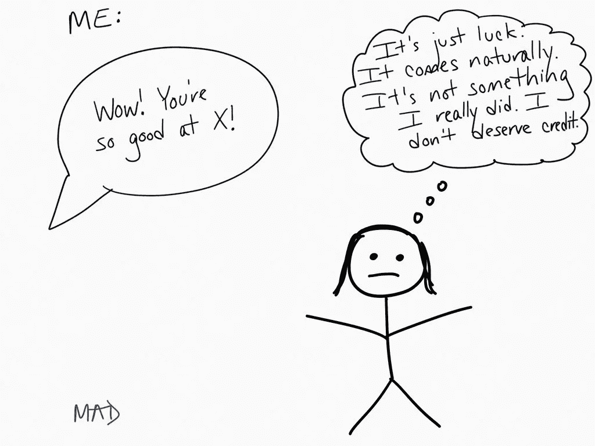
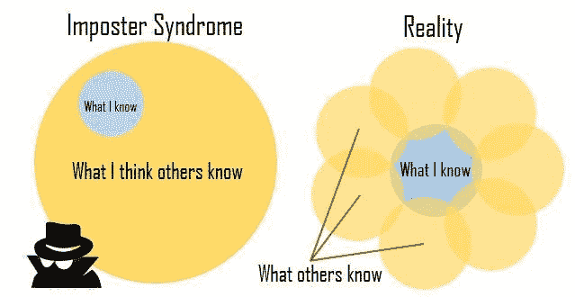
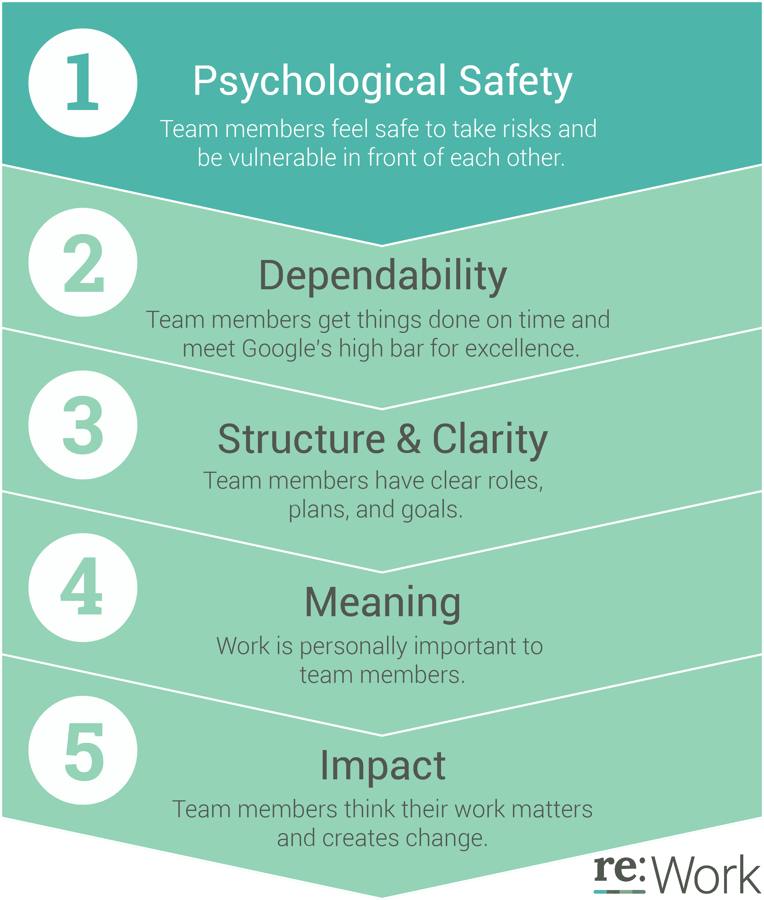
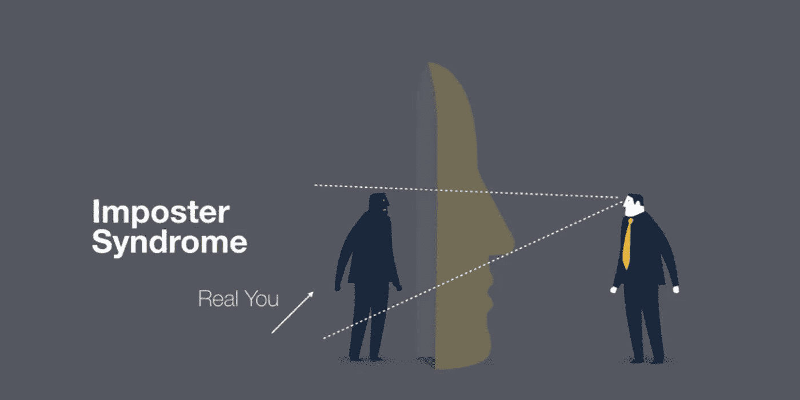
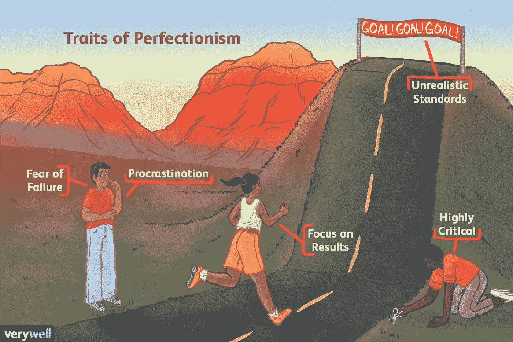
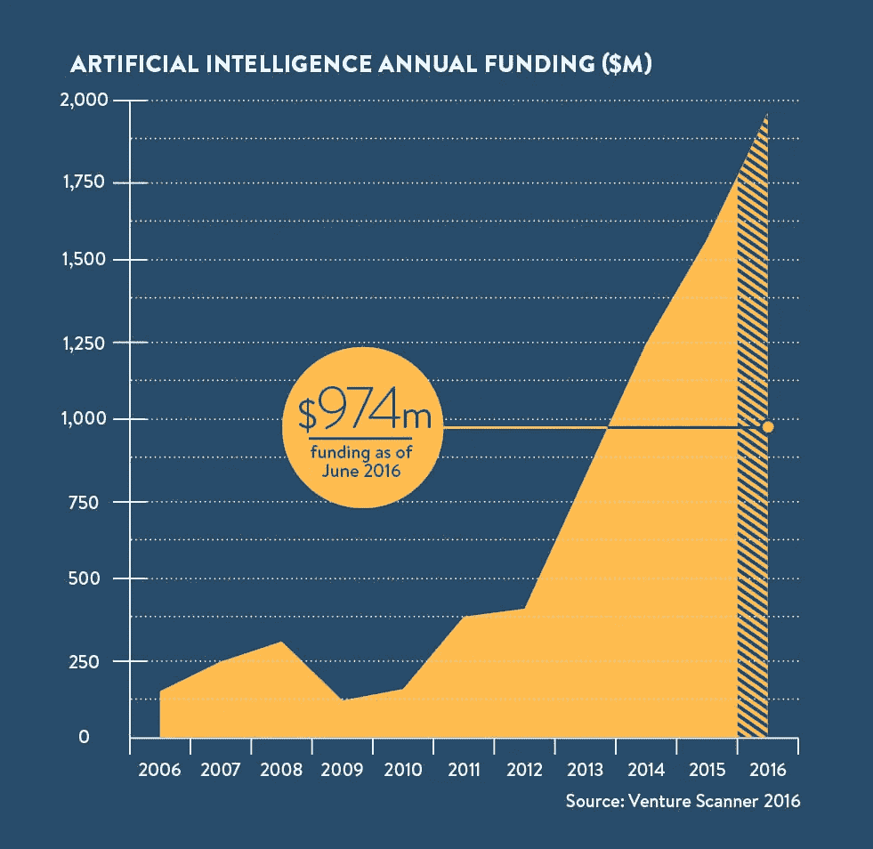
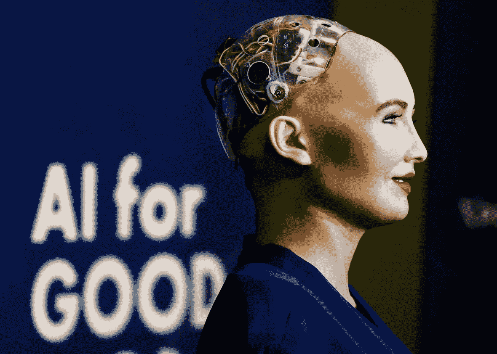

# 人工智能和冒名顶替综合症

> 原文：<https://towardsdatascience.com/ai-and-the-imposter-syndrome-bf66e1daf8d8?source=collection_archive---------14----------------------->

## 让我们或人工智能变成冒名顶替者

你努力成为什么样的人？我们希望 AI 变成什么样？

五年前，当我帮助建立一个合作空间时，我在与一名程序员的对话中遇到了一个术语。我曾经和一家公司的技术主管交谈过，很多人认为他非常擅长编程，他承认自己经常觉得自己是个骗子。后来和其他开发人员交谈时，我意识到这在 T2 的技术人员中是很常见的事情。

**:自我指导、协作、灵活和自愿的工作方式，建立在参与者之间相互信任和共享共同核心价值观的基础上。**

*多年来，在编程模块领域和一些开发人员打交道的过程中，我仍然觉得这是一个持续存在的现象。您的代码要么运行，要么不运行。当它运行时，可能会出错。*

*经常会有一些 bug/错误需要修复。编程的薪水更高，这可能会带来更高的生活水平，但也许我们可以问，这是否会给那些发现自己处于这种幸运地位的人带来压力。也许是运气？我活该吗？*

***冒名顶替综合征**(也称为冒名顶替现象、冒名顶替、欺诈综合征或冒名顶替体验)是一种心理模式，在这种模式中，个人怀疑自己的成就，并对被揭露为“欺诈”有一种持续的内在恐惧。*

**

*Graphics created by [Chris Do](https://medium.com/u/e7df903c6cf5?source=post_page-----bf66e1daf8d8--------------------------------)*

*尽管有他们能力的外部证据，那些经历这种现象的人仍然相信他们是骗子，不值得他们所取得的一切。患有冒名顶替症的人错误地将他们的成功归因于运气，或者是欺骗他人认为他们比自己想象的更聪明的结果。*

*所以在某种程度上，这是对“被发现”的恐惧，因为你认为自己没有别人认为的那么有才华。*

> *你有没有觉得自己像个骗子，只是靠猜测和胡扯度过难关，害怕随时会有人打电话给你。我能想出很多我有这种感觉的例子[……]所以对我来说，冒名顶替综合症是一种感觉，感觉好得超出了你的能力范围，但已经在这种情况下根深蒂固了。从内心来说，你知道你不够熟练，不够资格去证明你在那里，但是你在那里，你必须找到一条出路，因为你不能就这么出去。这不是对失败的恐惧，也不是对能够做到的恐惧。这更多的是一种侥幸逃脱的感觉，一种被发现的恐惧，一种随时有人会发现这一点的感觉。
> -迈克·坎农-布鲁克斯[亚特兰大](https://www.atlassian.com/)的联合创始人在 TEDxSydney 演讲*

**

*Drawing by [@DynamicEcology](https://dynamicecology.wordpress.com/2017/10/18/imposter-syndrome-and-cognitive-distortions-some-thoughts-and-poorly-drawn-cartoons/)*

*在某种程度上，它也许可以被视为一种感知你自己知识的方式。相信人们会通过你缺乏的知识来寻找，而不是看到与其他知识领域的联系。Mike Cannon-Brookes TEDx 演讲中的一条评论给我留下了特别深刻的印象:“编码一直在对我这样做。”*

**

*Drawing by software consultant [David Whittaker](https://twitter.com/rundavidrun?lang=en&lang=en)*

*冒名顶替综合症最初被称为“冒名顶替现象”20 世纪 70 年代，心理学家波林·罗斯·克兰斯和苏珊娜·艾姆斯[创造了术语“冒名顶替现象”](http://www.apa.org/gradpsych/2013/11/fraud.aspx?utm_source=zapier.com&utm_medium=referral&utm_campaign=zapier)。尽管有外部证据证明他们的能力，但与 Clance 交往过的学生似乎对被发现是骗子有一种不合理的担心。Clance 在当时写道:“这些女性没有体验到内在的成功感。他们认为自己是“冒牌货”。"*

*[Caryn Farvour(Humphreys)](https://medium.com/u/6337afe49e9b?source=post_page-----bf66e1daf8d8--------------------------------)2017 年在刊物 Code Like A Girl 上写了一篇关于 medium 的文章。在那里，她写道[加州理工学院咨询中心](http://counseling.caltech.edu/general/InfoandResources/Impostor)将冒名顶替综合症定义为:*

> *“即使面对表明相反情况的信息，这种不充分的感觉仍然存在。它在内心被体验为慢性自我怀疑，以及智力欺诈的感觉。”*

**

***谷歌已经认识到认可他人能力的重要性**并表示:*“我们都不愿意做出会对他人如何看待我们的能力、意识和积极性产生负面影响的行为。”的确，我们可能会意识到，人们会看穿我们缺乏的知识，当你尊重自己并非无所不知时，有可能获得更多，如果你接受这一点，你会变得有价值，或者可能会学到更多。**

**

*[Five keys to a successful Google team](https://rework.withgoogle.com/blog/five-keys-to-a-successful-google-team/)*

## *人工智能领域的冒名顶替者*

*在连续 30 天每天都写关于人工智能的文章，每天都发表一篇文章之后，我仍然觉得自己像个骗子。也许有人会说一个月写很多，但是我的目标是 500 天内每天写一篇文章。每次我与业内专业人士或该领域的研究人员交谈时，我都觉得他们会责怪我不知道或试图“抓住我”。*

*有一种紧张感。也许特别是在一家风险投资公司发布了一份报告*‘揭示’*40%的人工智能初创公司没有使用人工智能之后。[Verve](https://www.theverge.com/2019/3/5/18251326/ai-startups-europe-fake-40-percent-mmc-report)上的一篇文章甚至声称:“MMC 的报告发现，当公司部署人工智能和机器学习时，用例往往非常平庸。”当该领域如此缺乏能力或经验时，这有什么好奇怪的？*

*这种指责文化或者什么是人工智能或者什么不是人工智能是可以理解的——我们在谈论大笔资金的投资。然而，这确实回避了一个问题，即初学者开始使用的基本算法是否是“真正的人工智能”。以这种方式，完美主义者很难向前迈出下一步。根据某些定义，声称程序员通过设计来追求完美主义是不公平的。*

***完美主义**，在心理学上，是一种人格特质，其特征是一个人努力追求完美，并设定高的表现标准，伴随着批判性的自我评价和对他人评价的担忧。*

*如果你在一个开发团队中，有人写了一个可以运行的代码——它可以运行，而你的代码可能不行。即使是链接在一起的“块”中的小错误也会阻碍代码的运行。因此，自我批评式的评估是许多程序员日常工作中的一个常态。我做错了什么？为什么我的代码没有运行？这些问题有时可能需要几分钟、几小时、几周或几个月的时间来回答，具体取决于所面临的问题或挑战。然而，我们只是人类。*

**

*Graphics created by [Chris Do](https://medium.com/u/e7df903c6cf5?source=post_page-----bf66e1daf8d8--------------------------------)*

*不管你愿不愿意，人们都会看穿你的面具。*

*Knatokie Ford 博士的另一个 TED 演讲引起了我的注意。Knatokie 是奥巴马政府白宫科技政策办公室(OSTP)的高级政策顾问，负责监督提高科学、技术、工程和数学的可见性和改善其形象的国家倡议的发展。*

*在谈到冒名顶替综合征的背景下，她还谈到了**刻板印象威胁**:害怕遵从对自己社会群体的刻板印象。她是班上唯一的非裔美国人，认为其他人会认为她很傻——她说这种组合导致了抑郁症。最终她决定她不能继续下去，所以她在一个学期后离开了哈佛。我想转贴一下她演讲中的一句话:*

> *"攀比是快乐的小偷。"
> —西奥多·罗斯福*

## *为什么我们要把人工智能比作我们自己？*

*在我与研究人员和大多数业内人士的每次谈话中，都会出现一系列典型的话题。通常会提到人和机器的比较。人工智能的定义本身就有助于拟人化的类比；我们把自己与发达国家相比。我们以机器学习技术，叠加自己为标准。我强烈认为这是不健康的。*

**

*[Illustration by Brianna Gilmartin, Verywell](https://www.verywellmind.com/signs-you-may-be-a-perfectionist-3145233)*

**

*Graph appeared in [Raconteur August 22, 2016](https://www.raconteur.net/business-innovation/the-rise-of-artificial-intelligence-in-6-charts).*

*看看 2018 年 12 月经合组织最新[报告中提到的数字也很有趣。从 2011 年到 2018 年年中，估计人工智能初创企业的投资总额超过 500 亿美元。可以说，巨大的投资带来了对财务回报的巨大期望。](https://www.oecd.org/going-digital/ai/private-equity-investment-in-artificial-intelligence.pdf)*

*如果人工智能的目标迅速变成超智能，我们可能会犯一个错误，特别是因为我交谈过的科学家之间有一个普遍的共识，即人工智能远远超出了这些能力(至少如果我们直接与人类相比)。此外，我认为考虑到所涉及的风险，这可能是一种破坏性的追求。也许这是未来的担忧或关注，但当前的关注是气候危机；全球严重不平等和战争风险。*

*一方面，我会主张不要把所有问题都变成简单的对立，但我可能会通过质疑研究人员、行业和国家的追求或目标来做到这一点。与我交谈的那些人脑海中的画面是索菲亚，一个在沙特阿拉伯获得公民身份的硬件和软件。*

**

*Sophia, a robot recenty granted citizenship in Saudi Arabia. Photo by Denis Balibouse/Reuters [from Slate](https://slate.com/technology/2017/11/what-rights-does-a-robot-get-with-citizenship.html)*

*我们为自己奋斗，为下一个人奋斗——我认为这是一个关于骗子综合症的讨论点。把我们自己比作一个技术应用程序，我们希望达到什么目的？是的，我们通过理解神经网络取得了进展，这导致了巨大的进步，特别是在认知机器学习方面，深度神经网络(DNN)被认为是一个飞跃。可以说，这标志着人工智能资金、开发、部署和商业用途的增加。*

*然而，如果我们谈论人工智能，就好像我们在谈论一个人或一种产品——从“它”的角度。这似乎很平常，虽然我不知道是什么程度，但阅读福布斯人工智能和大数据撰稿人小组最近的一篇文章很有意思:*

> *请记住，现在还早，AI 在能够推理、独自解决复杂问题或学习到足以自行规划之前，还有很长的路要走。
> –[春天过得怎么样，福布斯【2019 年 4 月 29 日](https://www.forbes.com/sites/cognitiveworld/2019/04/29/so-how-goes-that-ai-spring/#4c719a4e23d4)*

*人们偶尔会担心，知名人工智能科学家过于雄心勃勃或不切实际的承诺，或者商业供应商的过度承诺，可能会引发新的人工智能冬天。*

*我们应该把自己想象成数学方程式的完美智能吗？相反，让我们认识到迄今为止已经取得的巨大进步，以及人工智能领域通过应用机器学习技术来发现知识而取得的巨大进步；治病；监控气候；预测灾难；诸如此类。*

> *让我们不要让人工智能成为冒名顶替者。*
> 
> *相反，让我们想想辛勤工作的开发人员、研究人员、商人和政治家的精神健康和幸福。*

***这是#500daysofAI** 的第 32 天，请关注我关于 AI 的每日更新。*

> *什么是#500daysofAI？*
> 
> *我在挑战自己，用#500daysofAI 写下并思考未来 500 天的人工智能话题。这是我发明的一个挑战，来保持对这个话题的思考，和大家分享我的话。*