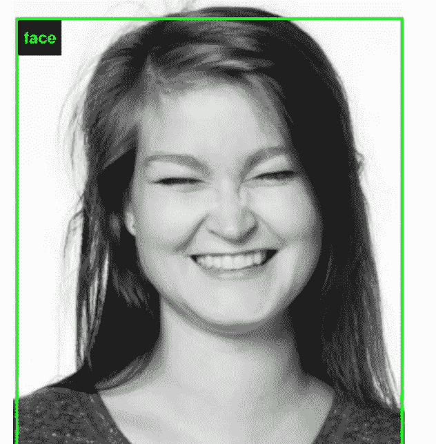

# 艾和我们——一场歌剧体验

> 原文：<https://towardsdatascience.com/ai-and-us-an-opera-experience-cff27dbae82a?source=collection_archive---------40----------------------->

## [EKHO 集体](http://ekho.fi/):超越系列的歌剧

在[我之前的帖子](https://uxdesign.cc/what-on-earth-did-we-get-ourselves-into-a-ux-case-study-77662200429b)中，我详细描述了我们 Ekho Collective 如何开始我们的项目，为[芬兰国家歌剧院和芭蕾舞团](https://oopperabaletti.fi/en/)打造身临其境的歌剧体验。在这篇文章中，我将讨论是什么激发了我们为未来的访问者编造的故事。

An excerpt from our storyboard

# 双曲线期货

在媒体中，人工智能经常被视为两种夸张。在想象的乌托邦中，人工智能将治愈癌症，将我们从气候灾难中拯救出来。在反乌托邦中，人工智能被描绘成一个超级大国——在一个新建立的社会中篡夺控制权并强迫人类成为下属，摧毁所有人道的东西。我们的集体故事体现了这些刻板印象:在斯派克·琼斯的电影 *Her* 中，主角找到了与人工智能代理人的理想主义爱情(尽管，这种爱情是短暂的)；在电影《我与机器人》(根据科幻作家艾萨克·阿西莫夫的著名故事改编)中，不会说话的机器人不懂得珍惜人类生命。

找到这两个双曲线未来之间的对话是我们希望我们的经历的访问者将探索的故事的关键。我们作品中的人工智能将跟随过去的歌剧明星，如莎乐美和卡门。莱拉——一个利用人工智能建立在新访客留下的数据上的体验领域——将通过建立在人类的痕迹上来反映人类的本质。这种体验将允许游客以有形和可理解的方式与人工智能互动。

# **我们如何看待人工智能——以及人工智能如何看待我们**

探索我们如何看待人工智能的一部分是展示人工智能如何看待我们。人工智能对世界的看法有限，并根据有限数量的变量做出决定——这些变量并不总是代表人类社会的复杂性质。数据点也总是有限的，并且会以意想不到的方式受到环境的影响。当建立在有偏见的数据上时，人工智能可以反映出我们最糟糕的品质。例如，美国司法系统用来估计累犯率的[算法被证明存在种族偏见](https://www.propublica.org/article/machine-bias-risk-assessments-in-criminal-sentencing)。

最近出版的项目 [ImageNet](https://imagenet-roulette.paglen.com/) Roulette 是偏见的一个很好的例证，这是由研究员凯特·克劳福德和艺术家特雷弗·帕格伦共同完成的艺术项目。该网站接受了 ImageNet 的培训，ImageNet 是网上最受欢迎的开源图像识别数据库之一。它允许用户上传自己的图像，并查看网站的算法如何识别他们的图像。结果是不可接受的:[记者朱莉娅·卡丽·王被贴上了种族歧视的标签](https://www.theguardian.com/technology/2019/sep/17/imagenet-roulette-asian-racist-slur-selfie)，而[一个黑皮肤男人的形象被贴上了罪犯的标签](https://news.artnet.com/art-world/imagenet-roulette-trevor-paglen-kate-crawford-1658305)。

How AI sees us: results can vary according to environment and other variables, even with the same objects (ImageNet Roulette)

该算法所基于的数据来源是亚马逊的在线众包平台 mechanical Turk。Mechanical Turk 招募执行重复性任务的用户:标记图像、执行调查等。它经常被研究人员和开发人员用来寻找大量数据来构建他们的机器学习应用程序。在 mTurk 上可以买到的数据是由真实的人类生成的——基于通过它获得的数据建立的算法是我们的真实反映——最好的和最差的。

# 我们的倒影

像所有人类发明一样，人工智能也有好坏之分。我们建设的未来不仅取决于技术本身，还取决于我们做出的选择。在 Laila 中，我们希望强调这一思想，并为游客提供一个场所，让他们真正以物理形式与人工智能见面和互动。人工智能经常在机器学习的抽象概念中被提及——对于外行人来说仍然遥不可及。

通过提供一个与人工智能交互的界面，我们希望用户能够思考他们在这个新的存在领域中采取的行动如何影响人工智能的决策。正如哲学家马丁·海德格尔在他的文章*中所写的，关于技术的问题*:

> 因此，技术不仅仅是手段。科技是一种揭示。