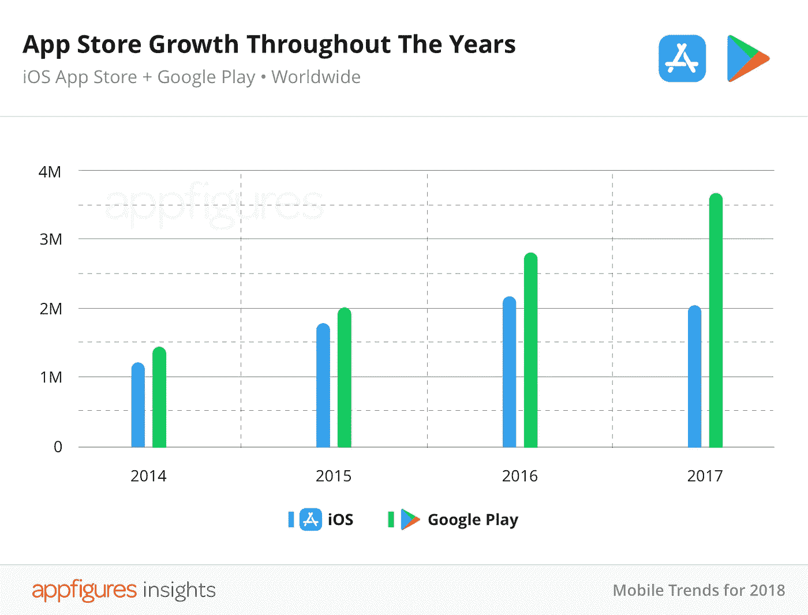
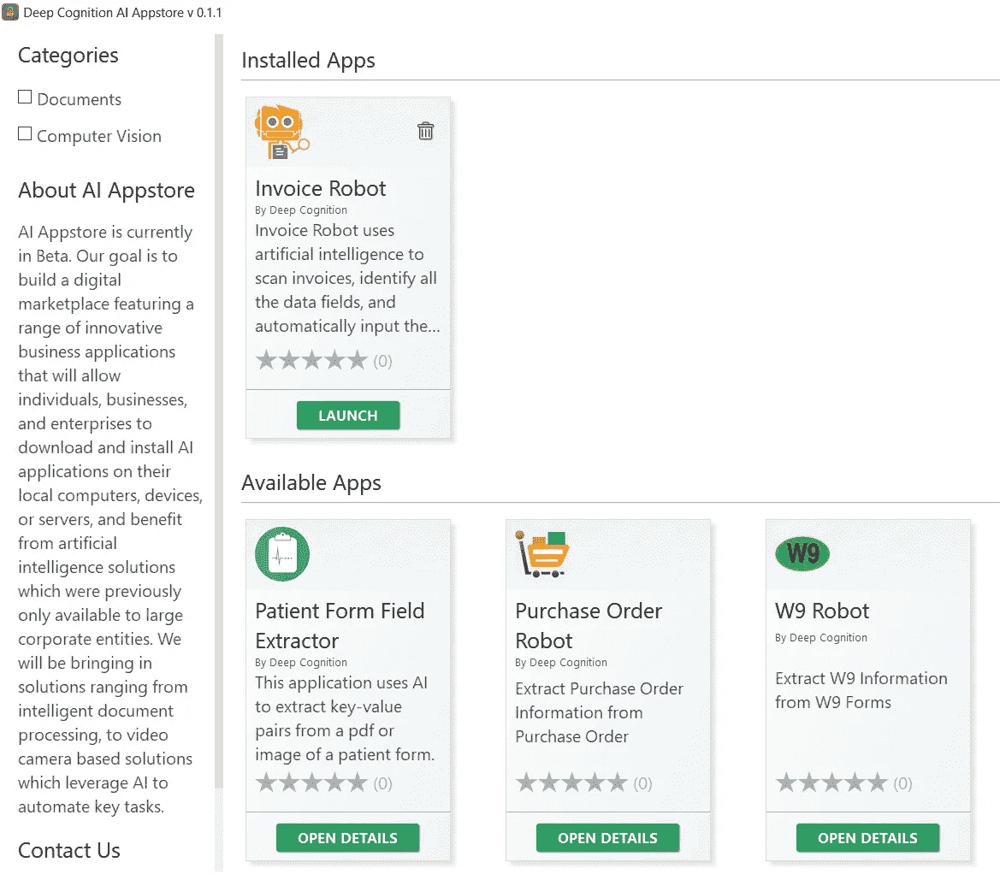

# 商业人工智能应用的人工智能应用商店

> 原文：<https://towardsdatascience.com/ai-appstore-for-business-ai-applications-3e832f4579c7?source=collection_archive---------14----------------------->

## 想象一个拥有数百万人工智能应用的世界，这些应用可以让我们的工作变得更加简单，并利用人工智能的力量来真正改变世界。这可能是开始。

[http://phpcantho.com/revolutionizing-everyday-products-with-artificial-intelligence/](http://phpcantho.com/revolutionizing-everyday-products-with-artificial-intelligence/)

我们拥有应用商店已经有一段时间了。通常我们访问它们来下载游戏、生产力工具、Whatsapp、Instagram 和类似的应用程序。

以下是我们在谷歌和苹果商店有多少应用程序的想法:

[https://blog.appfigures.com/ios-developers-ship-less-apps-for-first-time/](https://blog.appfigures.com/ios-developers-ship-less-apps-for-first-time/)

我们有数以百万计的应用程序，但人工智能应用程序的应用商店呢？这是 DeepCognition 公司的人推出的一个有趣的新东西。

# 人工智能应用商店

AI AppStore 是一个为企业带来最佳人工智能应用的市场，没有任何争议。

AI AppStore 的方法非常简单。该计划是将人工智能的好处带给所有企业，而不必雇佣昂贵的工程团队或需要做大量的定制开发工作。

每个应用程序:

1.  解决一个终端业务用例。
2.  最终用户是否可以通过直观的 GUI 安装和使用(不需要 IT 团队)。
3.  为客户提供用自己的数据训练 AI 的能力。
4.  为高级商业用户/公司提供使用 API/插件将人工智能功能集成到其现有系统的能力。

在这里，您可以访问 AI 应用商店:

 [## 商业人工智能应用的人工智能应用商店

### AI AppStore 是一个为企业带来最佳人工智能应用的市场，没有任何争议。我们与最佳人工智能合作…

deepcognition.ai](https://deepcognition.ai/ai-appstore/) 

例如，他们的发票机器人使用人工智能来扫描发票，识别所有的数据字段，并自动将它们输入到您的会计软件中。它非常适合会计师、簿记员、公司会计部门和小型企业或合伙企业，并允许他们完全消除与发票相关的数据输入任务。

有趣的是，你可以开发自己的应用程序并放在那里，当人们购买或使用你的应用程序时，你就可以赚钱。他们开发了一个叫做文档应用软件开发工具包的东西。如果你是一名开发人员，那么你可以创建全新的应用程序并提交给他们。他们将对其进行评估，然后在 AppStore 上发布。这是 GitHub 回购:

 [## 深度认知/ai-apps-sdk

### 通过在 GitHub 上创建帐户，为 DeepCognition/ai-apps-sdk 开发做出贡献。

github.com](https://github.com/DeepCognition/ai-apps-sdk/tree/master/document-ai-app) 

在这里，您可以找到创建、开发和提交应用程序所需的所有信息。

我在想象一个有数百万人工智能应用的世界，在那里我们可以让我们的工作变得更加简单，并利用人工智能的力量来真正改变世界。

更多更新我会在[推特](https://twitter.com/faviovaz)和 [LinkedIn](https://www.linkedin.com/in/faviovazquez/) :)上看到你