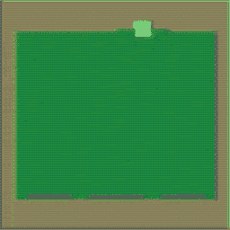
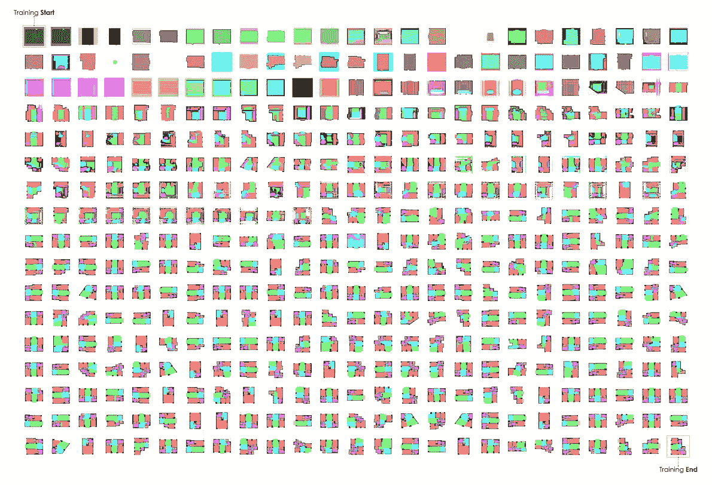
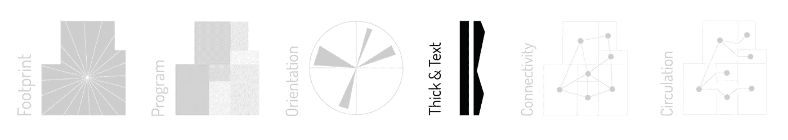
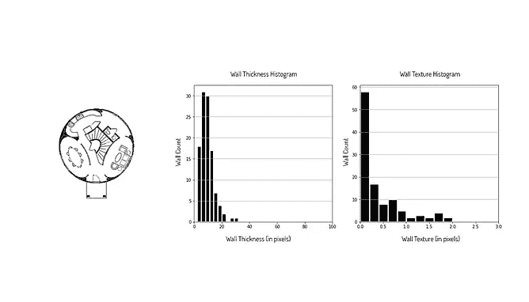

# 人工智能与建筑

> 原文：<https://towardsdatascience.com/ai-architecture-f9d78c6958e0?source=collection_archive---------3----------------------->

## 实验视角

[*斯塔尼斯拉斯·夏洛*](https://www.linkedin.com/in/stanislas-chaillou-b1931090/) *，哈佛大学设计研究生院| 2019 年 2 月 24 日*

[*法语版*](https://medium.com/@sfjchaillou/ia-architecture-475d3282f6e6)

GAN-Generated Masterplan | Source: Author

*本文放出* [*我们的论文*](https://www.academia.edu/39599650/AI_Architecture_Towards_a_New_Approach) *的一部分，在哈佛开发，2019 年 5 月提交。这件作品是一个更大的作品的一个组成部分，调查艾在建筑中的开端，它的* [*历史背景*](/the-advent-of-architectural-ai-706046960140) *，它的潜在空间* [*组织*](/ai-architecture-f9d78c6958e0)*&*[*风格*](/architecture-style-ded3a2c3998f) *。*

A 人工智能作为一门学科，已经渗透到无数领域，为以前未解决的挑战带来手段和方法，跨行业。**AI 在建筑上的问世，** [***在上一篇文章中描述过***](/the-advent-of-architectural-ai-706046960140) ***e* ，仍处于早期阶段但提供了有希望的结果。这不仅仅是一个机会，这种潜力对我们来说代表了一个重大的进步，即将重塑建筑学科。**

我们的工作旨在证明这一承诺在建筑环境中的应用。具体来说，我们提出将人工智能应用于平面图分析和生成。我们的最终目标是三重的: **(1)** **生成平面图**，即优化大量且高度多样化的平面图设计的生成， **(2)** **鉴定平面图**，即提供适当的分类方法 **(3)允许用户通过生成的设计选项“浏览”**。

我们的方法遵循两个主要的直觉 **(1)** **建筑平面图的创建是一个不小的技术挑战，尽管包含标准的优化技术**， **(2)** **空间的设计是一个连续的过程，需要跨越不同尺度(城市尺度、建筑尺度、单位尺度)的连续设计步骤**。然后，为了利用这两种现实，我们选择了嵌套式生成对抗性神经网络或 GANs。这种模型使我们能够捕捉遇到的平面图的更多复杂性，并通过连续步骤解决问题来分解复杂性。每一步都对应于一个给定的模型，专门为这个特定的任务而训练，这个过程最终可以证明人类和机器之间可能的来回。

计划确实是一个高维的问题，处于可量化技术和更多定性属性的十字路口。对建筑先例的研究通常仍然是一个危险的过程，它否定了现有资源的丰富性，同时缺乏分析的严密性。我们的方法受当前数据科学方法的启发，旨在验证平面图。通过创建 6 个指标，我们提出了一个框架，捕捉平面图的建筑相关参数。一方面，**足迹形状、方向、厚度&纹理**是捕捉给定平面图的*风格*的本质的三个度量。另一方面，**计划、连接、**和**循环**意在描绘任何平面图*组织*的本质。

**简而言之，机器，曾经是我们铅笔的延伸，今天可以用来绘制建筑知识，并训练来帮助我们创造可行的设计方案。**

# 一.框架

我们的工作处于建筑和人工智能的交汇点。前者是主题，后者是方法。两者都被简化为清晰的可操作类别。

**建筑**在这里被理解为*风格*和*组织*的交集。一方面，我们认为*建筑是文化意义的载体*，通过它们的几何形状、分类、类型和装饰来表达某种风格。巴洛克式、罗马式、哥特式、现代式、当代式:通过仔细研究建筑平面图可以发现尽可能多的建筑风格。另一方面，*建筑是工程*和科学的产物，符合严格的框架和规则——建筑规范、人体工程学、能源效率、出口、程序等——我们可以在阅读平面图时发现这些。这种组织上的必要性将完成我们对架构的定义，并推动我们的研究。

Framework Matrix | Source: Author

人工智能将被使用，使用它的两个主要调查领域——*分析*和*生成对抗网络*——作为调查工具。

首先，我们将进入*代*的话题。通过使用 GANs，我们可以将我们自己的人工智能系统应用于建筑设计。我们假设它的使用可以加强建筑学科的实践。这个领域是最近的，因为它是实验性的，并产生了令人惊讶的结果。我们希望能够训练它绘制实际的建筑平面图。

然后，我们将提出一个强大的分析框架，对生成的平面图进行鉴定和分类。最终，我们的目标是组织 GANs 的结果，为用户提供无缝浏览各种设计选项的可能性。为此，数据科学提供的工具的数量和普遍性将证明对我们的调查是有价值的。

通过这个双重镜头，在风格&组织，资格&生成的十字路口，我们奠定了一个框架，组织架构& AI 的遭遇。

# 二。产生

建筑平面图的设计是建筑实践的核心。它的精通是这门学科的黄金标准。这是一项实践，从业者一直不懈地试图通过技术来改进。在这第一部分中，我们深入探讨了人工智能应用于平面图生成的潜力，作为一种将信封推得更远的手段。

使用我们的框架，解决平面图的风格和组织，我们在下一章奠定了人工智能空间规划的潜力。我们的目标是提供一套可靠和健壮的工具来证明我们方法的潜力和测试我们的假设。

这里的挑战有三个: **(1)选择正确的工具集**、 **(2)分离出正确的现象显示给机器**和 **(3)确保机器正确地“学习”**。

## 人工智能与生成对立神经网络

生殖对抗性神经网络——或称*GANs*——是我们的首选武器。在人工智能领域，神经网络是一个关键的研究领域。这种模型的创造能力最近已经通过生成对抗性神经网络的出现得到了证明。与任何机器学习模型一样，GANs 从提供给它们的数据中学习具有统计意义的现象。然而，它们的结构代表了一个突破:由两个关键模型组成，*发生器*和*鉴别器*，GANs 利用两个模型之间的反馈回路来完善它们生成相关图像的能力。鉴别器被训练来从一组数据中识别图像。经过适当的训练，该模型能够区分从数据集中取出的真实示例，以及与数据集无关的“*假*图像。然而，生成器被训练来创建类似于来自相同数据集的图像的图像。当生成器创建图像时，鉴别器向他提供一些关于其输出质量的反馈。作为响应，发生器会进行调整，以产生更真实的图像。通过这种反馈循环，GAN 慢慢建立起创建相关合成图像的能力，将观察到的数据中发现的现象考虑在内。

Generative Adversarial Neural Network’s Architecture | [Image Source](https://medium.freecodecamp.org/an-intuitive-introduction-to-generative-adversarial-networks-gans-7a2264a81394)

## 表现和学习

如果 GANs 对我们来说是一个巨大的机会，知道向他们展示什么是至关重要的。在这里，我们有机会让模型直接从平面图图像中学习。通过格式化图像，我们可以控制模型将要学习的信息类型。例如，只要向我们的模型显示一个地块的形状和相关的建筑物覆盖区，就会产生一个能够在给定地块形状的情况下创建典型建筑物覆盖区的模型。为了确保输出的质量，我们将使用我们自己的架构感来管理我们训练集的内容:作为架构师，一个模型的好坏取决于我们给他的数据。

下面，我们展示了一个典型的训练序列:这个序列是在一天半的训练过程中实现的，展示了我们的 GAN 模型如何逐步学习如何为一个住宅单元布置房间和开窗。

**Training Sequence** | Source: Author

虽然最初的尝试是不精确和混乱的，但在 250 次迭代之后，机器为自己建立了某种形式的直觉。

## **先例**

如果说 GANs 在建筑设计上的应用还处于起步阶段，那么一些先例启发了我们的工作，并推动了我们的直觉。郑浩和黄卫新在 2018 年的 ACADIA 会议上发表了第一份出版物，展示了 GAN 在平面图识别和家具布局生成方面的潜力。他们的模型会根据房间程序和洞口位置，使用颜色块绘制房间填充物。同年，Nathan Peters 在哈佛 GSD 的论文中提出使用 GANs (pix2pix)解决单户模块化住宅中基于房屋足迹的程序再分配问题。

将甘斯视为设计助理，郑浩的(用机器人绘图:人机协作绘图实验，2018)和辜莞允·马丁内兹在 GSD 的论文(2017)启发了我们的研究。两位作者都提出了在机器和设计师之间建立一个循环的想法，以精炼“设计过程”的概念。

我们的工作扩展了这些先例，并提供嵌套 3 个模型(足迹、程序和装饰)来创建完整的“生成堆栈”，同时提高每个步骤的结果质量。通过自动化多单元处理，我们的工作可以扩展到整个建筑的生成和总体规划布局。我们还提供了一系列处理风格转换的模型。最后，我们的贡献添加了一个严格的框架来解析和分类结果输出，使用户能够一致地“浏览”生成的选项。

# A.风格转移

**Modern-to-Baroque** Floor Plan Translation | Source: Author

在一个平面图中，通过研究其墙壁的几何形状和图形平面，可以观察到*风格*。典型的巴洛克式教堂会展示粗大的圆柱，带有多个圆形凹痕。密斯·凡·德·罗设计的现代别墅将展示薄而平的墙壁。墙面的这个*锯齿*是甘可以欣赏的一个特色。通过向它显示成对的图像，一个图像是平面图的分段版本，另一个是原始的墙壁结构，我们可以建立一定数量的关于建筑风格的机器直觉。

这部分展示了一个模型的结果，这个模型被训练来学习巴洛克风格。我们接着进行风格转换，其中给定的平面图是手动****(A)***重新装饰成新的墙壁风格* **(B)** 。**

****

**Style Transfer Results: Apartment Units **Modern-to-Baroque Style Transfer** | Source: Author**

# **B.布局助手**

****

****Layout Assistant**, a Step by Step Pipeline | Source: Author**

**在本节中，我们提供了一个多步骤的管道，集成了绘制平面图的所有必要步骤。它跨越不同的尺度，模拟建筑师所采取的过程，并试图将每个步骤封装到一个特定的模型中，训练该模型来执行给定的操作。从**地块到建筑占地面积** **(I)** ，从**占地面积到用墙分割的房间&开窗(II)** ，从**开窗平面图到带家具的平面图(III)** : *每一步都经过精心设计、训练和测试*。**

****

**Generation Pipeline (Models I to III) | Source: Author**

**同时，通过将管道分成离散的步骤，系统允许用户在每个模型之间进行干预。通过选择一个模型的输出，并对其进行编辑，然后将其交给下一个模型，用户可以控制设计过程。它的输入塑造了模型做出的决策，从而实现了预期的人机交互。**

## **1.脚印**

****

**Context | Parcel (input)| Generated Footprint (output), Source: Author**

**我们管道中的第一步解决了为给定的地块几何图形创建合适的建筑覆盖区的挑战。为了训练这个模型，我们使用了波士顿建筑足迹的广泛数据库，并能够创建一系列模型，每个模型都为特定的财产类型量身定制:*商业*、*住宅*、*(房屋)*、*住宅(公寓)*、*工业*等。**

**每个模型能够为给定的地块创建一组相关的足迹，在尺寸和风格上类似于它被训练的类型。下面是使用住宅(房屋)模型的 9 个示例。**

****

**Results: Generated Footprints (housing) | Source: Author**

## **2.房间分隔和开窗**

****

**Footprint | Openings & Balcony (input) | Program & Fenestration (output) | Source: Author**

**下一步自然是在建筑范围内布置房间。能够分割给定的平面图，同时尊重有意义的*相邻关系、典型的房间尺寸*和*适当的开窗*是一个具有挑战性的过程，GANs 可以处理并带来令人惊讶的结果。**

**使用大约 700+个带注释的平面图的数据集，我们能够训练大量的模型。每一个都是针对一个特定的房间数，一旦用于空的建筑占地面积，就会产生惊人的相关结果。我们在下面展示了一些典型的结果。 [*更多结果也在这里。*](http://stanislaschaillou.com/thesis/GAN/unit_opening_results/)**

****

**Results: Generated **Program & Fenestration** | Source: Author**

## **3.装备**

****

**Program (input, option 1) | Furniture Position (input, option 2)| Furnished Unit (output) | Source: Author**

**这最后一步将生成的原则带到了最精细的层面:*在空间中添加家具*。为此，我们首先训练了一个模型来一次性布置整个公寓。**

**该网络能够根据每个房间方案，了解家具在空间中的相对位置，以及每个元素的尺寸。结果显示如下。**

**[*更多结果也在这里。*](http://stanislaschaillou.com/thesis/GAN/unit_furnishing_results/)**

****

**Results: Furnished Units | Source: Author**

**如果这些结果可以给出潜在家具布局的粗略想法，那么最终绘图的质量仍然太模糊。为了进一步优化输出质量，我们已经为每种房间类型(*客厅、卧室、厨房*等)训练了一系列附加模型。每个模型只负责将添加到平面图上的颜色块转换成一个正确绘制的家具。家具类型使用颜色代码进行编码。我们在下面显示每个模型的结果。**

****

**Results of Room Furnishing Models | **Bathroom / Kitchen / Livingroom / Bedroom** | Source: Author**

## **4.更进一步**

**如果使用我们的技术可以建造标准公寓，那么下一步自然是拓展我们模型的边界。事实上，GANs 可以提供相当大的灵活性来解决看似高度受限的问题。在平面布局的情况下，由于占地面积在尺寸和形状上的变化，手工划分和布置空间可能是一个具有挑战性的过程。事实证明，我们的模型在适应不断变化的约束的能力方面相当"*聪明*，如下所示。**

**************************

GAN-enabled Space Layout under Morphing Footprint | Source: Author** 

**我们控制单元入口门窗位置的能力，加上我们模型的灵活性，使我们能够超越单个单元的逻辑，以更大的规模处理空间规划。在下面的例子中，我们将我们的技术扩展到整个建筑。**

****************************

**Experimental GAN-generated Masterplans | Source: Author**

# **三。具有资格；合格；取得资格(或学历)**

> **“不能给事物命名增加了世界的混乱”阿尔贝·加缪**

**为了平衡我们生成平面图的能力，**找到合适的框架来组织、排序&对所生成的设计方案财富进行分类是非常重要的**。我们提供的平面图只有在我们的生成选项数据库中导航的能力足够好。通过借用建筑中的概念，我们希望将常见的建筑形容词转化为可量化的指标。**

**为此，我们分离出 6 个关键指标，描述平面图设计的 6 个基本方面:**占地面积、计划、方向、厚度&纹理、连通性**和**流通**。**

****

**6 Metrics | Source: Author**

**这些指标作为一个全面的框架协同工作，解决了平面图的风格和组织方面的问题。每一个都被开发成一种算法，并且经过了彻底的测试。**

****

## **A.脚印**

**建筑物的形状是鉴定其风格的最简单和最直观的代表。 **"Footprint"** 指标分析平面图周界的形状，并将其转换为直方图。**

**这个描述符在对建筑形状进行编码的同时，可以将建筑师使用的常见形容词——“瘦”、“笨重”、“对称”等翻译成数字信息，以便与计算机交流建筑形状。**

****

**Footprint Polar Diagram | Source: Author**

***从技术角度来看*，该指标使用极坐标凸性将一个给定的轮廓转化为一系列离散值(向量)，然后可以与其他平面图进行比较。我们使用从平面图的中心开始的线的极坐标阵列，来提取由所获得的每个空间切片所捕获的平面图的区域。这种方法已经被证明产生了令人满意的结果，如下面的查询所示。这种技术也可以用来限定室内空间的形状以及建筑周边的几何形状。**

****************

**Typical Floor Plans Retrieval using the **Footprint** Metric (left: query, right: results) | Source: Author**

****

## **B.程序**

**一栋建筑的**项目**，或者换句话说，它包含的房间类型，是其内部组织的主要驱动力。捕捉这一现实是我们方法的核心。为了描述房间的“组合”,我们通过颜色代码来表示任何给定平面图中包含的房间列表。这条彩色的带子就成了代理，用来描述程序。它作为一个模板，聚合平面图中房间的数量和规划质量。它对人类来说是一种直观的视觉描述，可以转化为一种可靠的机器编码技术。**

****

**Typical Floor Plans Retrieval using the **Program** Metric (left query, right results) | Source: Author**

***从技术的角度来看*，通过使用这个色带，我们可以计算任何给定平面图对之间的程序相似性和差异性。为了可视化结果，每个平面图都报告为彩色平面图和其程序的一维颜色向量。**

************************

**Typical Floor Plans Retrieval using the **Program** Metric (left: query, right: results, bottom: results’ program) | Source: Author**

****

## **C.方向**

**平面图中墙壁的方向是一个有价值的信息来源。它可以描述围墙(由于墙的存在，空间变得多么隐蔽)和平面图的风格。事实上，使用这种度量标准，我们可以很容易地区分一个现代的房子-亭子和一个哥特式大教堂，简单地通过提取墙壁方向的直方图。**

****

**Orientation Diagrams | Source: Author**

***从技术角度来看*，方向提取给定平面图的墙壁，并沿空间的每个方向对其长度求和，范围从 0 度到 360 度。产生的值列表是对计划总体方向的评估。可以对其进行平均以获得单个描述符，或者将其用作跨计划进行比较的向量。**

************************

**Typical Floor Plans Analysis using the **Orientation** Metric (left: plan, right: orientation diagram) | Source: Author**

****

## **D.厚度和质地**

****厚度&纹理**度量限定了平面图的“脂肪”:其壁厚和该厚度的变化。平面图上墙壁的*厚度*以及墙壁表面的几何形状*纹理*可能会因风格不同而有很大差异。当密斯·凡·德·罗的别墅展示薄的直线墙时，美术大厅将展示圆柱和锯齿状的厚墙，我们的度量将很容易掌握(见下图)。**

****

**Thickness & Texture Diagrams | Source: Author**

***从技术角度来看*，该指标隔离了给定平面图的所有墙壁，并输出墙壁厚度直方图。同时，该算法计算厚度的变化，以更好地描述壁纹理(即平墙对竖框)。**

************************

**Typical Floor Plans Analysis using the **Thickness & Texture** Metric (left: plan, right: resulting diagrams) | Source: Author**

****

## **E.连通性**

****连通性**指标解决了房间邻接的问题。房间之间的接近度是平面图的一个重要方面。此外，它们通过门和走廊的连接定义了它们之间连接的存在。**连通性**通过将它们视为一个标准图来调查这种连接的数量和质量。**

****

**Connectivity Diagram & Adjacency Matrix | Source: Author**

**从技术的角度来看，通过使用平面图上的开窗，我们可以推断出房间之间的关系图。连通性度量然后构建邻接矩阵，报告这些连接。最终生成一个图形表示。使用这个图表，我们可以比较平面图，考虑到房间之间连接的相似性。**

************************

**Typical Floor Plans Analysis using the **Connectivity** Metric (left: connectivity graph, right: plan adjacencies) | Source: Author**

****

## **F.流通**

**平面图中的**循环**捕捉了人们如何穿过它。通过提取循环的骨架，或者换句话说，循环网络的线框，我们可以量化和定性人们在平面图上的运动。**

****

**Circulation Diagram | Source: Author**

***从技术角度来看*，循环提取给定平面图的循环骨架，并沿空间的每个方向对其长度求和，从 0 度到 360 度。生成的直方图是对循环网络几何形状的评估，可用于与其他平面图的循环进行比较。**

************************

**Typical Floor Plans Analysis using the **Circulation** Metric (left: circulation graph, right: diagram) | Source: Author**

# **四。映射和浏览**

****

****Similarity graphs**, Comparing One Plan to Many | Source: Author**

**回头看看我们的 GAN 模型，每个模型实际上都在我们这一代流水线的每一步输出了多个选项。然后邀请设计者"*选择*"一个首选选项，如有必要，在采取下一步行动之前修改它。然而，浏览生成的选项可能会令人沮丧且耗时。为此，**“*限定*”一章中定义的指标集可以在此展示它们的全部潜力，并补充我们的世代管道。**通过将它们用作过滤器，用户可以缩小选项范围，并在几秒钟内找到与其设计相关的选项。这种双重性**生成过滤是我们工作的价值得到更多证明的地方**:我们在这里提供了一个完整的框架，利用人工智能，同时保持在标准用户可及的范围内。**

**一旦根据给定的标准(*足迹、程序、方向、厚度&纹理、连接性*或*循环*)进行了过滤，我们就为用户提供了她/他的选择的树状表示。在中心是一个选定的选项，在其周围是根据用户选择的标准分类的最近邻。然后，用户可以缩小搜索范围，找到理想的设计选项，或者选择树中的另一个选项，重新计算图形。**

***(下面显示的每棵树都可以通过以下链接在线访问:* [*足迹*](http://stanislaschaillou.com/thesis/tree/convexity/) *，* [*程序*](http://stanislaschaillou.com/thesis/tree/program/) *，* [*连通性*](http://stanislaschaillou.com/thesis/tree/graph/) *)***

************

**Floor Plans Similarity Trees | Source: Author**

# **动词 （verb 的缩写）结论**

**人工智能将很快在建筑师的日常实践中赋予他们巨大的权力。由于这种潜力即将被展示，我们的工作参与概念的证明，而我们的框架提供了讨论的跳板，*邀请架构师开始与 AI* 和*数据科学家接触，将架构视为一个研究领域*。然而，今天，我们的宣言可以归纳为四个要点。**

**首先从概念上来说，我们相信设计概念的统计方法塑造了人工智能在建筑方面的潜力。它的不确定性和整体性对我们的领域来说无疑是一个机会。不是使用机器来优化一组变量，而是依靠它们来提取重要的质量，并在整个设计过程中模仿它们，这是一种范式转变。**

**第二，我们深信，我们设计正确管道的能力将决定 AI 作为一种新的架构工具集的成功。正如 Andrew Witt 教授在《日志》中介绍的那样，我们选择的“灰箱”方法可能会获得最佳的潜在结果。这种方法与“黑盒”方法形成对比，黑盒方法只允许用户预先输入信息，并在过程结束时获得完成的设计选项，对后续的生成步骤没有任何控制。相反，通过将我们的管道分成离散的步骤，“灰箱”允许用户全程干预。他对机器的严密控制是他设计过程质量的最终保证。**

****第三，从技术上来说，我们相信应用程序的顺序性将有助于其可管理性并促进其开发。**在整个生成过程中进行干预的能力是一个基本的维度:由于管道的每一步都代表了建筑专业知识的一个独特部分，每个模型都可以独立训练，从而为不久的将来的重大改进和实验开辟了道路。事实上，端到端地改进整个管道可能是一项漫长而繁琐的任务，而逐步修改仍然是一个可管理的过程，是业内大多数建筑师和工程师都可以做到的。**

****最后，我们希望我们的框架将有助于解决待训练模型和任何一代管道中使用的模型的无限广度和复杂性。**处理*包裹-足迹-房间分割-等等。我们相信，我们所做的是众多选择中的一种可能的方法。要概括空间规划的必要步骤，关键更多的是原则而不是方法。随着建筑数据可用性的增加，我们鼓励进一步的工作和开放的实验。***

## **我们并不认为人工智能是建筑领域的新教条，而是认为这个领域是一个充满潜力和希望的新挑战。我们在这里看到了丰富结果的可能性，这将补充我们的实践，并解决我们学科的一些盲点。**

**[*链接到 Academia.edu 的论文脚本*](https://www.academia.edu/39599650/AI_Architecture_Towards_a_New_Approach)**

# **数字资源**

****

# **文献学**

*   ****超越计算机的数字建筑**，罗伯托·博塔齐，布卢姆斯伯里**
*   ****数据驱动设计&构建**，兰迪·多伊奇，威利**
*   ****建筑智能，设计师和建筑师如何创造数字景观**，Molly Wright Steenson，麻省理工学院出版社**
*   ****建筑谷歌**，*超越网格——建筑&信息技术第 226–229 页*，Ludger Hovestadt，Birkhauser**
*   ****算法复杂性:凭空而来**，*复杂性，设计策略&世界观第 75–86 页*，安德里亚·格莱尼格&格奥尔格·弗拉赫利奥蒂斯，伯克豪斯**
*   ****代码&机器**，*代码，操作间&叙述第 41–53 页*，Andrea Gleiniger&Georg Vrachliotis，Birkhauser**
*   ****格罗皮乌斯的问题还是关于在建筑和艺术中揭示和隐藏代码**，*代码，介于操作&叙述第 75–89 页*，安德里亚·格莱尼格&格奥尔格·弗拉赫利奥蒂斯，伯克豪斯**
*   ****软架构机器**，尼古拉斯·尼葛洛庞帝，麻省理工学院出版社。**
*   **《建筑机器》，尼古拉斯·尼葛洛庞帝，麻省理工学院出版社。**
*   ****一种模式语言，音符合成形式**，克里斯多夫·亚历山大，[链接](http://www.patternlanguage.com/ca/ca.html)**
*   ****地图的变形；或者输入 RoweBot** ，安德鲁·威特，日志#36**
*   ****灰拳击**，安德鲁·威特，日志#43**
*   ****人类与人工智能中的暗示性绘画，**辜莞允·马丁内兹，哈佛 GSD 论文，2016**
*   ****启用替代架构:参与式设计的协作框架，** Nathan Peters，哈佛 GSD 论文，2017 | [链接](https://www.nathanpeters.us/enabling-alternative-architectures?fbclid=IwAR199qC4eGuxAx3V5EzOk5z-ZJOFpxAegeAJ2RtQoKm7g5lwbTy73e0yh4o)**
*   ****通过机器学习的建筑图纸识别与生成，**郑浩(宾夕法尼亚大学)，黄卫新(清华大学)，ACADIA 2018 [ [论文](https://www.researchgate.net/publication/328280126_Architectural_Drawings_Recognition_and_Generation_through_Machine_Learning) ]**
*   ****丹尼尔:自动分析和检索建筑平面图的深度架构**，迪维娅·夏尔马，尼廷·古普塔，奇兰霍伊·查托帕迪亚，萨梅普·梅塔，2017，IBM 研究，IIT·焦特布尔**
*   ****建筑平面图中的自动房间检测和房间标记**，Sheraz Ahmed，Marcus Liwicki，Markus Weber，Andreas Dengel，2012 年，凯泽斯劳滕大学**
*   ****利用空间索引自动解释平面图**，哈南·萨梅特，阿雅·索费尔，1994 年，马里兰大学**
*   ****解析平面图图像**，塞缪尔·道奇，久旭，比约恩·斯坦格，2016，亚利桑那州立大学，乐天理工学院**
*   ****项目探索:生成性设计在建筑空间规划中的应用**，丹尼尔·纳吉，达蒙·刘，约翰·洛克，吉姆·斯托达特，洛伦佐·维拉吉，王雷，戴尔·赵和大卫·本杰明，2016，生活，欧特克工作室**
*   ****光栅转矢量:重访平面图转换**，刘晨，吴家军，Pushmeet Kohli，川口恭誉古川，2017，华盛顿大学，深度思维，麻省理工学院**
*   ****图形文档视觉理解的关系模型。建筑制图应用**，2014 年，巴塞罗那自治大学**
*   ****基于骨骼上下文的形状匹配与建模**，谢军，heng-Ann Heng，Mubarak Shah，2007，中佛罗里达大学，香港中文大学**
*   ****平面图解释的统计分割和结构识别**，Lluís-Pere de las Heras，Sheraz Ahmed，Marcus Liwicki，Ernest Valveny，Gemma Sánchez，2013，西班牙巴塞罗那计算机视觉中心**
*   ****结合使用统计和结构策略在平面图中进行无监督和独立于符号的墙壁分割**，llus-Pere de las Heras、Ernest Valveny 和 Gemma Sanchez，2014 年，西班牙巴塞罗那计算机视觉中心**
*   ****使用生成式对抗网络支持智能移动应用的路径规划**，Mohammadi，Mehdi，Ala Al-Fuqaha，和 Jun-Seok Oh。, 2018**
*   ****基于方形树形图算法自动实时生成平面图**，Fernando Marson 和 Soraia Raupp Musse，2010 年，PUCRS**
*   ****建筑程序建模**，帕斯卡·穆勒，彼得·旺卡，西蒙·海格勒，安德烈亚斯·乌尔默，吕克·范·古尔，2015，苏黎世联邦理工学院，亚利桑那州立大学**
*   ****建筑空间规划的生成式设计**，Lorenzo Villaggi 和 Danil Nagy，2017，Autodesk Research**