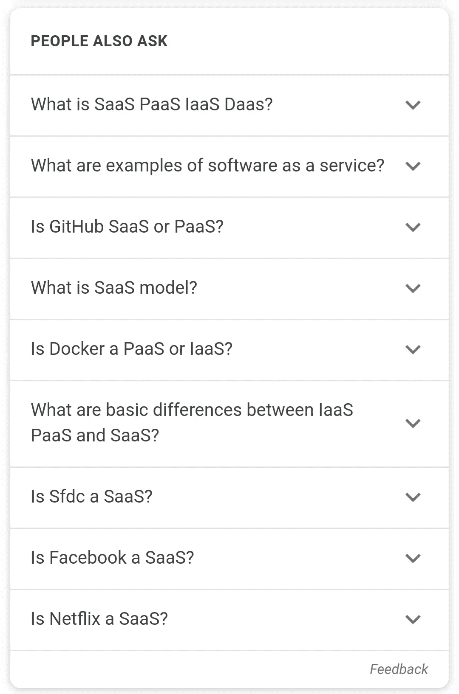
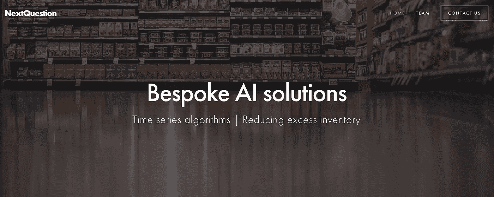

# AI 即服务？

> 原文：<https://towardsdatascience.com/ai-as-a-service-b465ddc0c7e0?source=collection_archive---------18----------------------->

Photo by [@airamdatoon](https://unsplash.com/@airamdatoon)

## 数字基础设施和一切即服务

AaaS——当然不是最幸运的缩写。在这个时候，说你假设意味着你让你和我成为傻瓜是合适的。如果不是假设，还有什么是算法？一个数学上的假设，毫无疑问，它可以像人类的假设一样是对的和错的。现在有各种各样的“【T2 即服务】”缩写，有些甚至提出了 [AI 即服务或 AIaaS](https://www.bmc.com/blogs/ai-as-a-service-aiaas/) 。

AaaS 代表算法即服务，是我在“作为服务”的词汇云中遇到的许多首字母缩略词之一。

一个**算法**是:在计算或其他解决问题的操作中要遵循的一个过程或一组规则，特别是由计算机来执行。它是一组指令，通常用于解决一类问题或执行计算。算法是执行计算、数据处理、自动推理和其他任务的明确规范。

以这种方式，它是一组假设。一个**假设**是:一件被认为是真的或者肯定会发生的事情，无需证明。承担权力或责任的行为。**狭义人工智能**是指**人工智能**，它只能处理一个特定的任务。因此，我们可以问有什么不同？2019 年 10 月 26 日 CMS Wire 上的一篇由 [Kaya Ismail](https://medium.com/u/245899579f77?source=post_page-----b465ddc0c7e0--------------------------------) 撰写的文章试图解释算法和 AI 之间的区别:

> 算法是一组指令——一个预设的、严格的、编码的配方，当它遇到一个触发器时就会被执行。另一方面，人工智能是一个非常广泛的术语，涵盖了无数的人工智能专业和子集，是一组可以修改其算法并创建新算法的算法，以响应学习到的输入和数据，而不是仅仅依赖于它被设计为识别触发器的输入。

## AaaS 和 SaaS 不一样吗？

你可能会说，ass，我的意思是 AaaS，类似于 SaaS(欢迎使用 heaven btw 的缩写)。**软件即服务(SaaS)** 是一种软件分发模式，由第三方提供商托管应用程序，并通过互联网提供给客户。SaaS 是云计算的三个主要类别之一，另外两个是基础设施即服务(IaaS)和平台即服务(PaaS)。缩略词超载？

AIaaS 或 MLaaS(机器学习即服务)有何不同？[另一位为《走向数据科学》撰稿的作家 Oleksii Kharkovyna](https://medium.com/u/a0e39375a333?source=post_page-----b465ddc0c7e0--------------------------------) 在他的文章*中说得很好，机器学习与传统编程:*

> ***在传统编程中你硬编码程序的行为。在机器学习中，你把很多事情留给机器从数据中学习。***

因此，我们可以尝试区分 Saas 和 AIaas 或 MLaaS 的缩写。在人工智能(AI)领域，机器学习是最常见的技术。因此，使用 AIaas 或 MLaas 可能是一种有用的区分，但可能彼此过于接近，令人不舒服。

谷歌和亚马逊似乎几乎可以互换地谈论人工智能和机器学习产品(就像我经常在其他地方看到的那样)。他们目前拥有最大的 AIaas 或 MLaas 平台，因此让我们只看表面，不做全面的回顾)。以下内容根据各自网站略有调整。

## Google AI Hub 和 TensorFlow

**TensorFlow** 是一个免费的开源软件库，用于数据流和一系列任务的差异化编程。它是一个符号数学库，也用于机器学习应用，如神经网络。它被用于谷歌的研究和生产。‍

谷歌另外还有[几款人工智能和机器学习产品](https://cloud.google.com/products/ai/)。

**AI Hub** ，一个即插即用的 AI 组件托管库。

**AI 构建模块**具有视觉、语言、对话和结构化数据的应用。

**AI 平台**，基于代码的数据科学开发环境，面向 ML 开发者和数据科学家。其中一部分是**云机器学习引擎，**这是一种托管服务，允许开发人员和数据科学家在生产中构建和运行机器学习模型。

## 亚马逊 SageMaker

Amazon SageMaker 使开发人员和数据科学家能够快速轻松地构建、训练和部署任何规模的机器学习模型。它消除了阻碍跨用例和行业成功实施机器学习的复杂性——从运行实时欺诈检测模型，到虚拟分析潜在药物的生物影响，再到预测棒球比赛中的盗垒成功。

从 TensorFlow、PyTorch、Apache MXNet 和其他流行的框架中进行选择，以试验和定制机器学习算法。你可以在亚马逊 SageMaker 中使用你选择的框架作为托管体验，或者使用 AWS 深度学习 AMIs(亚马逊机器映像)，它完全配置了最流行的深度学习框架和工具的最新版本。根据亚马逊的说法:

*   云中 81%的深度学习项目运行在 AWS 上
*   云中 85%的 TensorFlow 项目运行在 AWS 上

从这个意义上说，亚马逊似乎声称自己是 MLaaS 或 AIaaS 中的平台的平台。

## 小演员能竞争吗？

当然，这一领域的专业产品总会有利基市场，我们可能会发现通过一项创新(新方法、想法、产品等)脱颖而出的演员。)或者技巧。

写这篇文章的过程始于我在 [Craig E Ryder](https://medium.com/u/14dcbe207baf?source=post_page-----b465ddc0c7e0--------------------------------) 关于 [*你需要了解的五家 AI 初创公司*](https://medium.com/silicon-roundabout-hub/https-medium-com-craig-calcey-five-ai-startups-you-need-to-know-about-40e54826dec2) 的一篇精心撰写且简明扼要的文章中读到关于算法即服务的内容。在这篇文章中，我发现了引起我注意的 [NextQuestion](https://nextquestion.io/) 和他们的*算法即服务* (AaaS)(流行语的魔力)。如果你喜欢，可以去美国汽车协会看看。

Screenshot of [NextQuestion website](https://nextquestion.io/) retrieved the 8th of July 2019

无论如何，感谢你收听#500daysofAI，再次声明:保持直立。

**这是#500daysofAI** 的第 36 天，请关注我关于 AI 的每日更新。

> 什么是#500daysofAI？
> 
> 我在挑战自己，用#500daysofAI 写下并思考未来 500 天的人工智能话题。这是我发明的一个挑战，以保持对这个话题的思考，并与你分享我的更新。一起学习是最大的快乐。