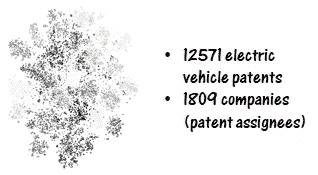
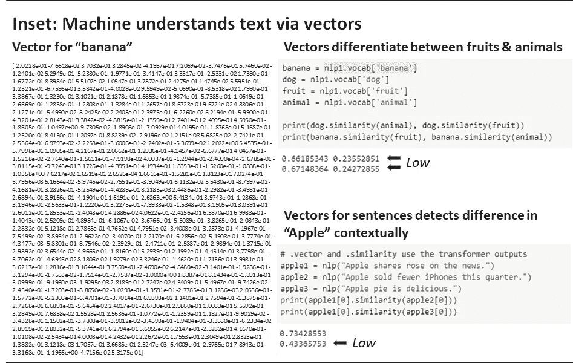
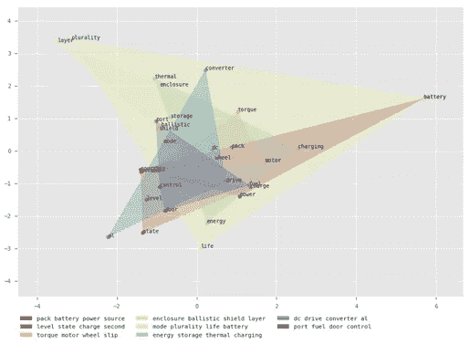
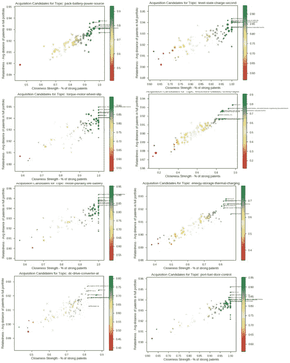
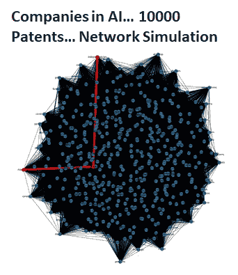

# 人工智能自动生成 M&A 候选人

> 原文：<https://towardsdatascience.com/ai-auto-generates-m-a-candidates-41eca0b8d7c1?source=collection_archive---------31----------------------->

传统方法:X 公司希望在某个特定的技术领域进行扩张，并准备一份潜在收购候选人的名单。如何识别这些公司？人们如何对它们进行排序？有人雇了一位昂贵的投资银行家来准备候选名单。银行家喜欢买方委托。

**新方法:**租一台机器。

我承认 M&A 不仅仅是入围候选人名单，但是让我们一点一点地剥 M&A 洋葱，好吗？目标列表生成是一项关键活动，大多数企业集团都有一份活动列表，并为此花费数小时的 CXO 时间。

下面是机器如何提供帮助的——通过一个例子来说明……让我们以电动汽车行业为例。“最大的电动汽车制造商”(收购者)希望确定拥有最接近的匹配技术组合的公司(目标)进行购买。

A 2-dimensional representation of patent landscape

**矢量化:**获得 12571 项电动汽车专利(近期)。这涵盖了 1809 家公司(专利受让人)。机器对专利进行矢量化(见矢量图)。

在这个过程中，机器理解每个单词的意思(见插图:机器通过向量理解文本)。

**解释:**机器接下来会了解收购方拥有哪些领域的技术。下面是从电池组到扭矩控制到热充电等重点领域的图表。机器识别 8 个区域。

A 2-dimensional representation of focus areas in vector space

**入围名单:**对于每个领域，该机器将收购方的每项专利与潜在目标(1808 家公司)的每项专利进行映射，并根据我们对寻找最接近技术目标的定义，使用“相关性”/“接近度”指标来筛选候选人。下图为 8 个领域的 8 个图表，根据专利向量分析绘制了每个公司(1808)的情况。候选名单摆在我们面前。每个领域的候选名单。

我们将最接近的技术定义为标准……我们也可以将其定义为补充/最核心/最交叉连接等……一个指标的变化会改变候选名单。

收购型公司保持着一份活跃的目标清单。这台机器可以在几小时内重复这一分析。相比之下，通过一个采购过程来雇用一个银行家，以及与此相关的成本。

在“数字”时代，一切都越来越成为载体，我们是在剥洋葱，还是在用不同形式的智能拓展可能性的边界？

如果竞争对手 1 收购竞争对手 2…会发生什么，什么技术会消失… 1809 公司是一个网络，任何人都可以收购任何人…鉴于技术格局的潜在变化，我们今天应该收购某人吗？一个有机的技术研究项目是否应该变成无机的(收购)？我们如何对此建模？

现有的人类智能形式将很难模拟这种复杂性…机器可以…尽管是人工的。