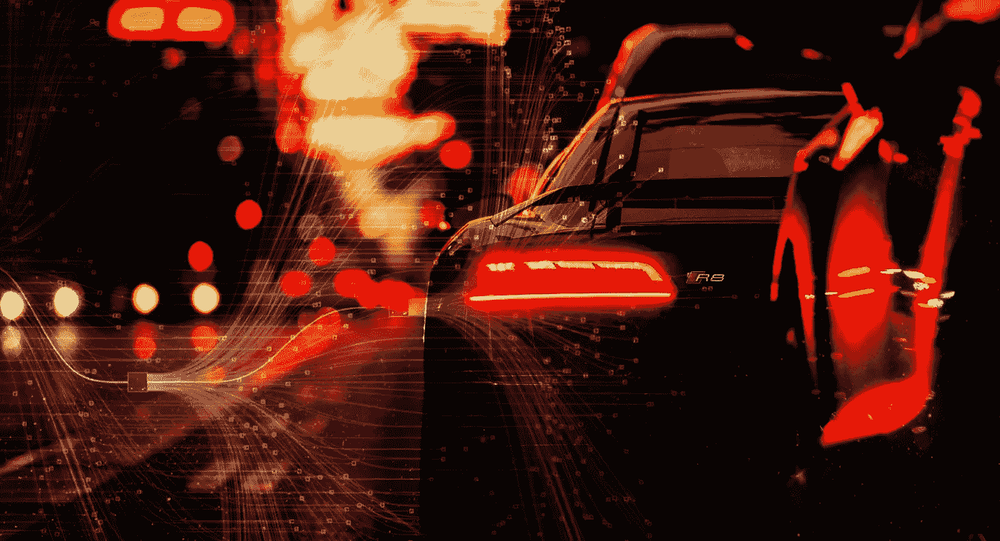
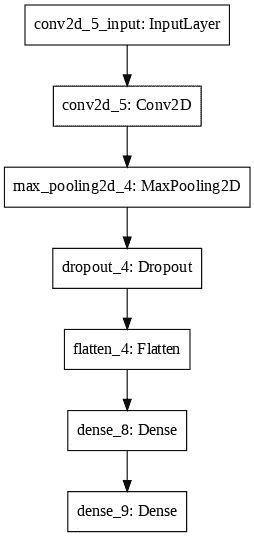
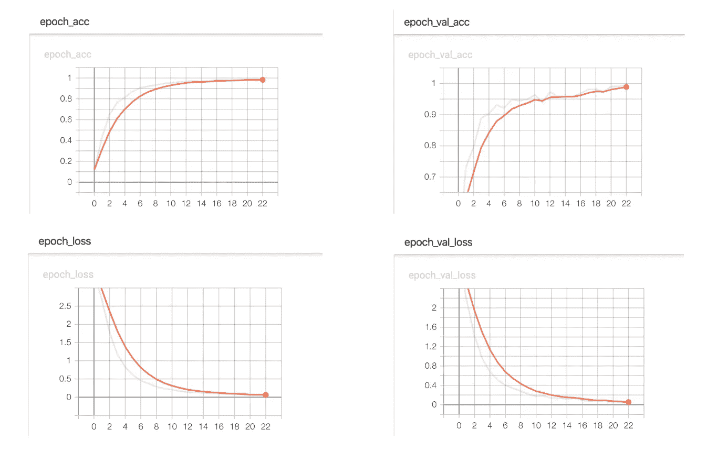

# 人工智能驱动的印度车牌检测器。

> 原文：<https://towardsdatascience.com/ai-based-indian-license-plate-detector-de9d48ca8951?source=collection_archive---------5----------------------->



> 灵感:撞了我的车还逍遥法外的家伙！
> 
> **背景故事:**在和朋友度过了一个难忘的夜晚后，当我们准备回家时，有一件事让那个夜晚更加难忘，我的汽车前保险杠上有一个巨大的凹痕，似乎是被另一辆车撞了，但这该怪谁呢？周围没有人会目睹那件事。我能做些什么呢？
> 我会告诉你我到底做了什么。
> 我利用我的机器学习和编程技能，决定制作一个基于人工智能的印度车牌检测器，它能够通过检测周围车辆的车牌来监视车辆，在这篇博客中，我将带你们了解我是如何做到这一点的！
> 
> **首先:**总有即兴发挥的余地，所以如果你对这个项目有更好的想法或疑问，请使用下面的回复部分。

# 方法:

## 我们需要建立一个系统，能够-

*   从周围获取图像/视频(一系列图像):
    在硬件端，我们需要一台 pc(或 raspberry pi)和一个摄像头，在软件端，我们需要一个库来捕获和处理数据(图像)。我在这个项目中使用了 OpenCV (4.1.0)和 Python (3.6.7)。
*   在图像中寻找车牌:
    要从图像中检测一个物体(车牌)，我们需要另一个工具来识别印度车牌，为此我使用了 Haar cascade，它是在印度车牌上预先训练的(将很快更新到 YOLO v3)。
*   对车牌进行分析和执行一些图像处理:
    使用 OpenCV 的灰度、阈值、腐蚀、扩张、轮廓检测，并通过一些参数调整，我们可以很容易地生成足够多的关于车牌的信息，以决定这些数据是否足够有用，可以传递给进一步的处理(有时如果图像非常失真或不正确，我们可能只能得到假设的 10 个字符中的 8 个， 然后，没有必要将数据传递到管道中，而是忽略它并查看下一帧的板)，此外，在将图像传递到下一个过程之前，我们需要确保它没有噪声并经过处理。
*   从车牌中分割出字母数字字符:
    如果上述步骤一切正常，我们应该准备好从车牌中提取字符，这可以通过巧妙地对图像进行阈值处理、腐蚀、扩张和模糊来完成，这样最终我们得到的图像几乎没有噪声，并且易于进一步的功能处理。我们现在再次使用轮廓检测和一些参数调整来提取字符。
*   逐个考虑字符，识别字符，将结果串联起来并以字符串形式给出车牌号码:
    现在有趣的部分来了！因为我们有所有的字符，所以我们需要将字符一个接一个地传递到我们训练好的模型中，它应该能够识别字符，瞧！我们将使用 Keras 作为我们的卷积神经网络模型。

# 先决条件:

*   OpenCV : OpenCV 是一个编程函数库，主要针对实时计算机视觉，加上它的开源性，使用起来很有趣，也是我个人的最爱。这个项目我用的是 4.1.0 版本。
*   **Python** :又名编码的瑞士军刀。我这里用的是 3.6.7 版本。
*   IDE: 我将在这里使用 Jupyter。
*   **Haar cascade** :这是一种机器学习对象检测算法，用于识别图像或视频中的对象，基于 Paul Viola 和 Michael Jones 在 2001 年的论文“使用简单特征的增强级联进行快速对象检测”中提出的特征概念。[更多信息](https://en.wikipedia.org/wiki/Viola%E2%80%93Jones_object_detection_framework)
*   **Keras**:Keras 易于使用并得到广泛支持，它让深度学习变得尽可能简单。
*   **Scikit-Learn:**It**是一个免费的 Python 编程语言的软件机器学习库。**
*   **当然，不要忘记**咖啡**！**

# **第一步**

> ****创建工作空间。****

**我推荐创建一个 conda 环境，因为它使项目管理更加容易。请按照此[链接](https://docs.conda.io/projects/conda/en/latest/user-guide/install/)中的说明安装 miniconda。安装完成后，打开 cmd/terminal 并使用以下命令创建一个环境**

```
>conda create -n 'name_of_the_environment' python=3.6.7
```

**现在让我们激活环境:**

```
>conda activate 'name_of_the_environment'
```

**这应该让我们进入虚拟环境。是时候安装一些库了-**

```
# installing OpenCV
>pip install opencv-python==4.1.0# Installing Keras
>pip install keras# Installing Jupyter
>pip install jupyter#Installing Scikit-Learn
>pip install scikit-learn
```

# **第二步**

> ****设置环境！****

**我们将从运行 jupyter notebook 开始，然后在我们的例子中导入必要的库 OpenCV、Keras 和 sklearn。**

```
# in your conda environment run
>jupyter notebook
```

**这将在默认的网络浏览器中打开 Jupyter 笔记本。一旦打开，让我们导入库**

```
#importing openCV
>import cv2#importing numpy
>import numpy as np#importing pandas to read the CSV file containing our data
>import pandas as pd#importing keras and sub-libraries
>from keras.models import Sequential
>from keras.layers import Dense
>from keras.layers import Dropout
>from keras.layers import Flatten, MaxPool2D
>from keras.layers.convolutional import Conv2D
>from keras.layers.convolutional import MaxPooling2D
>from keras import backend as K
>from keras.utils import np_utils
>from sklearn.model_selection import train_test_split
```

# **第三步**

> ****号牌检测:****

**让我们简单地从导入一个带有牌照的汽车样本图像开始，并定义一些函数:**

**上述函数的工作方式是将图像作为输入，然后应用预先训练好的“haar cascade”来检测印度车牌，这里的参数 scaleFactor 代表一个值，通过该值可以缩放输入图像，以便更好地检测车牌([了解更多信息](https://sites.google.com/site/5kk73gpu2012/assignment/viola-jones-face-detection#TOC-Image-Pyramid))。minNeighbors 只是一个减少误报的参数，如果这个值很低，算法可能更容易给出一个误识别的输出。(您可以从我的 [github](https://github.com/SarthakV7/AI-based-indian-license-plate-detection) 个人资料中下载名为“indian_license_plate.xml”的 haar cascade 文件。)**

****

**input image**

****

**output image with detected plate highlighted**

****

**output image of detected license plate**

# **第四步**

> ****对车牌进行一些图像处理。****

**现在让我们进一步处理这个图像，使字符提取过程变得容易。我们将从定义更多的函数开始。**

**上述函数接收图像作为输入，并对其执行以下操作-**

*   **将它调整到一个尺寸，这样所有的字符看起来都清晰明了**
*   **将彩色图像转换为灰度图像，即图像只有一个 8 位通道，取值范围为 0-255，0 对应黑色，255 对应白色，而不是 3 通道(BGR)。我们这样做是为下一个过程准备图像。**
*   **现在阈值函数将灰度图像转换为二进制图像，即每个像素现在将具有 0 或 1 的值，其中 0 对应于黑色，1 对应于白色。这是通过应用具有 0 到 255 之间的值的阈值来完成的，这里的值是 200，这意味着在灰度图像中，对于具有大于 200 的值的像素，在新的二进制图像中，该像素将被赋予值 1。并且对于值低于 200 的像素，在新的二进制图像中，该像素将被赋予值 0。**
*   **图像现在是二进制形式，为下一个腐蚀过程做准备。
    侵蚀是一个简单的过程，用于从对象的边界移除不想要的像素，即值应该为 0 但却为 1 的像素。它的工作原理是逐个考虑图像中的每个像素，然后考虑像素的邻居(邻居的数量取决于内核大小)，只有当它的所有邻居像素都是 1 时，该像素才被赋予值 1，否则被赋予值 0。**
*   **图像现在是干净的，没有边界噪声，我们现在将放大图像以填充缺少的像素，即应该具有值 1 但具有值 0 的像素。该函数的工作方式类似于侵蚀，但有一点不同，它的工作方式是逐个考虑图像中的每个像素，然后考虑像素的邻居(邻居的数量取决于内核大小)，如果像素的至少一个相邻像素为 1，则该像素的值为 1。**
*   **下一步是将图像的边界变成白色。这是为了移除帧外的任何像素(如果它存在的话)。**
*   **接下来，我们定义一个包含 4 个值的维度列表，我们将用它来比较字符的维度，以筛选出所需的字符。**
*   **通过上面的过程，我们已经将我们的图像减少到一个处理过的二进制图像，并且我们已经准备好传递这个图像用于字符提取。**

# **第五步**

> **从车牌中分割出字母数字字符。**

**在第 4 步之后，我们应该有一个干净的二进制图像。在这一步中，我们将应用更多的图像处理来从牌照中提取单个字符。涉及的步骤将是-**

*   **找到输入图像中的所有轮廓。函数 cv2.findContours 返回它在图像中找到的所有轮廓。轮廓可以简单地解释为连接所有连续点(沿边界)的曲线，具有相同的颜色或强度。**

****

**[https://www.oipapio.com/static-img/4698620190220123940948.jpg](https://www.oipapio.com/static-img/4698620190220123940948.jpg)**

****

**plate with contours drawn in green**

*   **找到所有轮廓后，我们逐个考虑它们，并计算它们各自的边界矩形的尺寸。现在考虑边界矩形是可能包含轮廓的最小矩形。让我通过在这里为每个字符画出边界矩形来说明它们。**

****

*   **因为我们有了这些边界矩形的尺寸，所以我们需要做的就是做一些参数调整，并过滤出包含所需字符的所需矩形。为此，我们将通过只接受宽度在 0，(pic 的长度)/(字符数)和长度在(pic 的宽度)/2，4 *(pic 的宽度)/5 范围内的那些矩形来执行一些维度比较。如果一切顺利，我们应该有所有的字符提取为二进制图像。**

****

**The binary images of 10 extracted characters.**

*   **字符可能是无序的，但不要担心，代码的最后几行会处理好这一点。它根据字符的边界矩形相对于盘子左边界的位置对字符进行排序。**

# **第六步**

> ****创造一个机器学习模型，并为角色训练它。****

*   **数据都是干净的，准备好了，现在是时候创建一个足够智能的神经网络来识别训练后的字符。**

****

**[https://mesin-belajar.blogspot.com/2016/05/topological-visualisation-of.html](https://mesin-belajar.blogspot.com/2016/05/topological-visualisation-of.html)**

*   **为了建模，我们将使用具有 3 层的卷积神经网络。**

```
## create model
>model = Sequential()
>model.add(Conv2D(filters=32, kernel_size=(5,5), input_shape=(28, 28, 1), activation='relu'))
>model.add(MaxPooling2D(pool_size=(2, 2)))
>model.add(Dropout(rate=0.4))
>model.add(Flatten())
>model.add(Dense(units=128, activation='relu'))
>model.add(Dense(units=36, activation='softmax'))
```

****

*   **为了保持模型简单，我们将从创建一个顺序对象开始。**
*   **第一层将是具有 32 个输出滤波器、大小为(5，5)的卷积窗口和作为激活函数的‘Relu’的卷积层。**

********

*   **接下来，我们将添加一个窗口大小为(2，2)的 max-pooling 层。
    **Max pooling** 是一个基于样本的离散化过程。目标是对输入表示(图像、隐藏层**和输出矩阵**等)进行下采样。)，减少其维数，并允许对包含在被装仓的子区域中的特征进行假设。**

****

**max-pooling layer**

*   **现在，我们将增加一些辍学率，以照顾过度拟合。
    **Dropout** 是一个正则化超参数，被初始化以防止神经网络过拟合。Dropout 是一种在训练过程中忽略随机选择的神经元的技术。他们是“**掉** - **掉**”随机产生的。我们选择了 0.4 的丢弃率，这意味着将保留 60%的节点。**
*   **现在是展平节点数据的时候了，所以我们添加了一个展平层。展平层从上一层获取数据，并在一维中表示它。**

****

*   **最后，我们将添加两个密集层，一个输出空间的维数为 128，激活函数='relu ',另一个，我们的最后一层有 36 个输出，用于对 26 个字母(A-Z) + 10 个数字(0–9)和激活函数=' softmax '进行分类**

****

# **第七步**

> ****训练我们的 CNN 模型。****

*   **我们将使用的数据包含大小为 28x28 的字母(A-Z)和数字(0-9)的图像，并且数据是平衡的，因此我们不必在这里进行任何类型的数据调整。**
*   **我已经创建了一个 [zip 文件](https://github.com/SarthakV7/AI-based-indian-license-plate-detection/blob/master/data.zip)，其中包含按照下面的目录结构的数据，训练测试分割为 80:20**

****

**[https://medium.com/@vijayabhaskar96/tutorial-image-classification-with-keras-flow-from-directory-and-generators-95f75ebe5720](https://medium.com/@vijayabhaskar96/tutorial-image-classification-with-keras-flow-from-directory-and-generators-95f75ebe5720)**

*   **我们将使用 keras 中可用的 ImageDataGenerator 类，使用宽度移动、高度移动等图像增强技术来生成更多的数据。要了解更多关于 ImageDataGenerator 的信息，请查看[这篇](https://medium.com/@vijayabhaskar96/tutorial-image-classification-with-keras-flow-from-directory-and-generators-95f75ebe5720)不错的博客。**
*   **Width shift:接受一个浮点值，表示图像将向左和向右移动的百分比。
    Height shift:接受一个浮点值，表示图像上下移动的比例。**

*   **现在该训练我们的模特了！
    我们将使用“分类 _ 交叉熵”作为损失函数，“亚当”作为优化函数，“准确度”作为误差矩阵。**

*   **经过 23 个历元的训练，模型达到了 99.54%的准确率。**

********

# **第八步**

> ****输出。****

**最后，是时候测试我们的模型了，还记得从车牌中提取字符的二值图像吗？让我们把图像输入到我们的模型中！**

****

**输出-**

****

> ****最终意见****

**感谢你们阅读这个博客，希望这个项目对那些有志于做 OCR、图像处理、机器学习、物联网项目的人有用。**

**如果你对这个项目有任何疑问，请在回复部分留下评论。**

**完整的项目可以在我的 Github 上找到:
[https://Github . com/SarthakV7/AI-based-Indian-license-plate-detection](https://github.com/SarthakV7/AI-based-indian-license-plate-detection)**

**在 LinkedIn 上找到我:[www.linkedin.com/in/sarthak-vajpayee](http://www.linkedin.com/in/sarthak-vajpayee)**