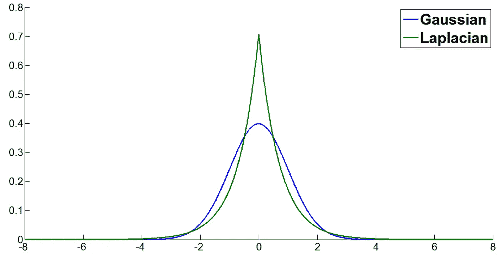
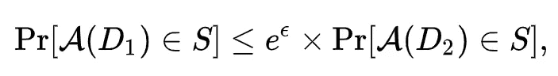
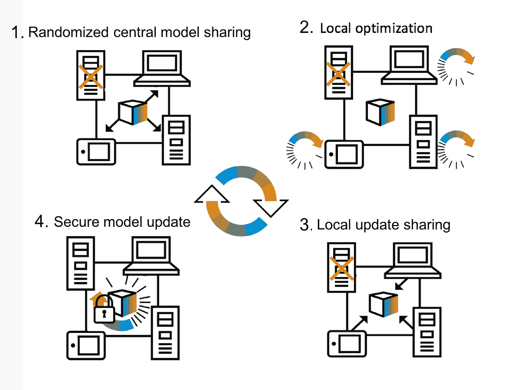

# 人工智能差分隐私和联邦学习

> 原文：<https://towardsdatascience.com/ai-differential-privacy-and-federated-learning-523146d46b85?source=collection_archive---------21----------------------->

## 对用户敏感数据使用人工智能最近引发了许多担忧。差分隐私和联合学习是谷歌和苹果等公司目前针对这一问题提出的解决方案。

(Source: [https://ai.googleblog.com/2017/04/federated-learning-collaborative.html](https://ai.googleblog.com/2017/04/federated-learning-collaborative.html))

# 介绍

每天都会以不同的形式收集敏感数据(例如，医院医疗记录、手机活动记录等)。一旦数据被收集，然后进行预处理，成为完全匿名，最后提供给公司和研究社区进行分析。

使数据集匿名可以防止任何人仅仅利用数据集就完全能够将数据逆向工程到其原始形式。

但是，数据集中包含的数据也可以在网上以任何其他形式获得。通过使用数理统计方法比较相同数据的不同来源，原始数据的逆向工程可以变得容易得多。通过这种方式，提供数据的人的隐私可能会受到损害。

例如，网飞在 2007 年发布了一个数据集，其中包含他们对公开竞赛的用户评分。该数据集在比赛午餐前已经完全匿名，以便不包含任何私人信息。研究人员相继尝试测试该数据集的隐私安全性，并成功恢复了高达 *99%* 的被删除个人信息[1]。通过将网飞提供的数据与 IMDB 上公开的其他信息进行比较，有可能取得这一结果。

利用差分隐私和联合学习等技术可以大大降低这种风险。

# 差异隐私

差异隐私使我们能够量化数据库的隐私级别。这可以帮助我们尝试不同的方法，以确定哪种方法最能保护用户的隐私。通过了解我们的数据隐私级别，我们可以量化某人可能从数据集中泄露敏感信息的可能性，以及最多可以泄露多少信息。

Cynthia Dwork 给出的差分隐私的定义是:

> 差异隐私描述了数据持有人或管理者对数据主体做出的承诺，该承诺如下:
> 
> “您不会因为允许您的数据用于任何研究或分析而受到不利或其他方面的影响，无论其他研究、数据集或信息来源是否可用”。
> 
> 辛西娅·德沃克

差分隐私用来保护个人隐私的一种技术是在数据中添加噪声。两种主要的差分隐私方法是局部差分隐私和全局差分隐私。

*   **局部差分隐私** =噪声被添加到数据集中的每一个单独的数据点(在数据集形成后由数据集管理者添加，或者在将数据提供给管理者之前由个体自己添加)。
*   **全局差分隐私** =保护个人隐私所必需的噪声被添加到数据集的查询输出中。

一般来说，与局部差分隐私相比，全局差分隐私可以产生更准确的结果，同时保持相同的隐私级别。另一方面，当使用全局差分隐私时，捐赠数据的人需要相信数据集管理器会添加必要的噪声来保护他们的隐私。

在实现差分隐私时，通常可以使用两种类型的噪声:高斯噪声和拉普拉斯噪声(图 1)。

Figure 1: Gaussian and Laplacian distributions [2]

为了确定添加到数据集上的必要噪声量以确保其隐私安全，使用了差分隐私的正式定义(图 2)。

Figure 2: Differential Privacy Definition [3]

在图 2 中， **A** 表示一个随机算法，该算法将一个数据集作为输入，数据集 **D1** 和 **D2** 仅相差一个元素，并且**ε**(ɛ)是一个正实数。ε用作确定必要噪声量的参数。

# 联合学习

利用大量数据的机器学习模型传统上是使用在线服务器来训练的。谷歌和苹果等公司过去常常收集移动设备用户的数据记录活动，然后将其存储在云服务中，以创建一个集中式机器学习模型，从而提高其移动服务的性能。

如今，这些大公司正转向使用一种叫做联合学习的分散模型方法。使用联邦学习，在数据源上训练机器学习模型，然后将其输出移动到云上进行进一步分析。这意味着像谷歌和苹果这样的公司不再需要访问他们的用户数据来改善他们的服务，而是可以使用本地训练的机器学习模型的输出(不侵犯用户隐私)。

此外，由于这些模型是在本地培训的，因此可以为最终用户提供更加个性化的体验(图 3)。

联合学习的定义可以是:

*   **联合学习** =一种在我们无法访问的数据上训练机器学习模型的技术。我们用来训练模型的数据集分布在大量资源中。

Figure 3: Federated Learning in action [4]

像谷歌这样的公司指定，这些类型的本地机器学习培训旨在仅在终端设备处于以下状态时发生:用户未使用、正在充电并且有 wifi 连接。这样，设备的整体性能不受影响。

智能手机设备上联合学习的一些例子可以是:在 Android、Gmail 和 Google 搜索引擎上使用 Gboard 的个性化单词建议。

谷歌人工智能提供了几个谷歌如何利用联合学习及其工作原理的例子，这些例子可以在[这里](https://ai.googleblog.com/2017/04/federated-learning-collaborative.html)和[这里](https://federated.withgoogle.com/)找到。

# 结论

如果你想了解更多关于这些话题的信息，我强烈建议你报名参加由 Udacity 提供的免费[安全和私人 AI 课程](https://classroom.udacity.com/courses/ud185)。获得更好的数学背景的其他有价值的资源可以是这两个出版物[5，6]。

# 联系人

如果你想了解我最新的文章和项目[，请通过媒体](https://medium.com/@pierpaoloippolito28?source=post_page---------------------------)关注我，并订阅我的[邮件列表](http://eepurl.com/gwO-Dr?source=post_page---------------------------)。以下是我的一些联系人详细信息:

*   [领英](https://uk.linkedin.com/in/pier-paolo-ippolito-202917146?source=post_page---------------------------)
*   [个人博客](https://pierpaolo28.github.io/blog/?source=post_page---------------------------)
*   [个人网站](https://pierpaolo28.github.io/?source=post_page---------------------------)
*   [中等轮廓](https://towardsdatascience.com/@pierpaoloippolito28?source=post_page---------------------------)
*   [GitHub](https://github.com/pierpaolo28?source=post_page---------------------------)
*   [卡格尔](https://www.kaggle.com/pierpaolo28?source=post_page---------------------------)

# 文献学

[1]大型数据集的稳健去匿名化(如何打破 Netflix Prize 数据集的匿名性)。Arvind Narayanan 和 Vitaly Shmatikov，德克萨斯大学奥斯汀分校。访问地点:[https://arxiv.org/pdf/cs/0610105.pdf](https://arxiv.org/pdf/cs/0610105.pdf)

[2]使用基于拉普拉斯分布的小波域隐马尔可夫树模型的纹理分割。乔玉龙和赵干超，。访问地点:[https://www.mdpi.com/1099-4300/18/11/384/html](https://www.mdpi.com/1099-4300/18/11/384/html)

[3]差分隐私，维基百科。访问时间:[https://en.wikipedia.org/wiki/Differential_privacy](https://en.wikipedia.org/wiki/Differential_privacy)

[4]差异私人联合学习:客户层面的观点。罗宾·盖耶，塔希洛·克莱恩，和莫因·纳比。访问:[https://medium . com/sap-machine-learning-research/client-sided-differential-privacy-preserving-federated-learning-1 fab 5242d 31b](https://medium.com/sap-machine-learning-research/client-sided-differential-privacy-preserving-federated-learning-1fab5242d31b)

[5]差分隐私和机器学习:调查和评论。张龙吉，扎卡里利普顿，查尔斯埃尔坎。访问地点:【https://arxiv.org/pdf/1412.7584.pdf 

[6]差分隐私的深度学习。马丁·阿巴迪、安迪·楚、伊恩·古德菲勒等人访问:[https://storage . Google APIs . com/pub-tools-public-publication-data/pdf/45428 . pdf](https://storage.googleapis.com/pub-tools-public-publication-data/pdf/45428.pdf)