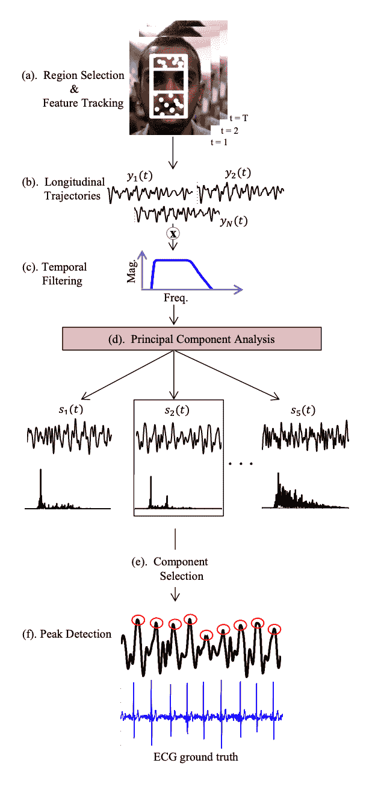
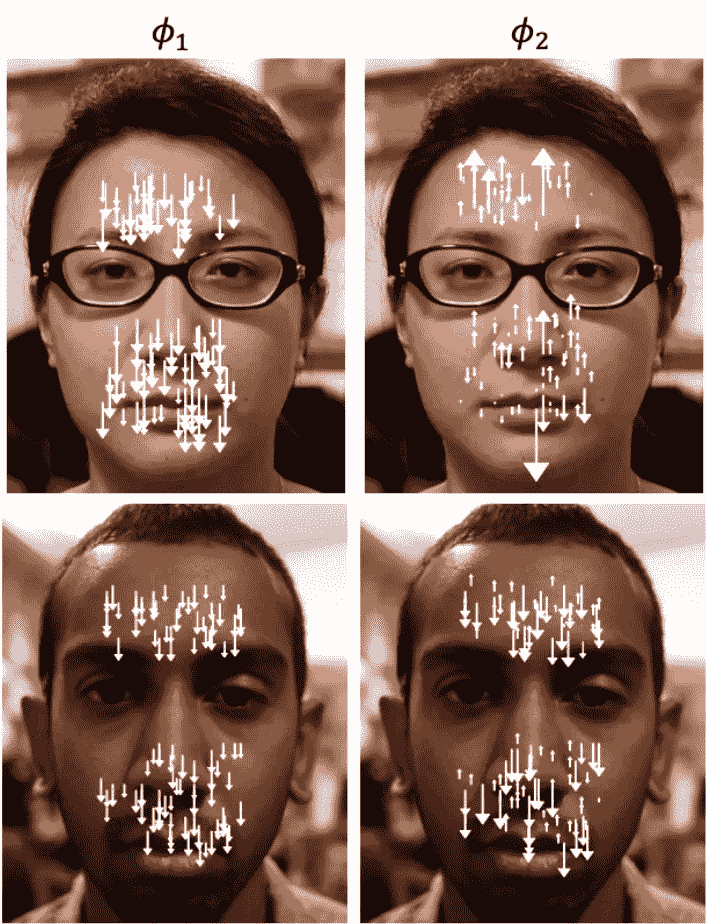
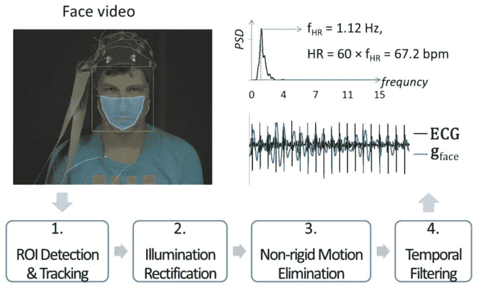

# 人工智能发现你脸上的心跳

> 原文：<https://towardsdatascience.com/ai-discovers-the-heart-beat-in-your-face-e129320a8bab?source=collection_archive---------7----------------------->

## 对从视频中读取生命体征的技术进行中等深度的探究

由乔尔肖尔，谷歌 ML 研究工程师，萨利赫纳比勒谢哈达，医学博士，马特奥布莱恩

有时候很难想象今天笨重的听诊器会变成明天的《星际迷航》三录仪。这篇文章将通过解释医疗保健中的一项具体发展来帮助你更好地设想这条道路:一项仅通过视频来确定你的心率的技术。

视频心率将开启医院内外的许多酷应用。

*   将闭路电视摄像头转换为心脏病预警探测器
*   通过移除更昂贵的监控设备来降低医院护理的成本
*   在给你保险之前，让保险公司知道你的心血管健康状况，立即自动拨打 911
*   通过向计算机提供你所感受到的情绪的直接线索来改善人机交互

你也可以想象看一段你最喜欢的政治家说了一些令人难以置信的令人发指的话的视频，然后得知这位政治家的心率一直为零。然后你可能会得出结论，要么她是一个僵尸，要么你一直在看一个[深度假](https://en.wikipedia.org/wiki/Deepfake)。

# 先前的心率测量值

当前测量心率的技术通常分为三类:

**技巧一:电信号。**测量心率最可靠的方法是直接监测心脏的电活动。像所有肌肉一样，心脏由神经系统控制。附着在皮肤表面适当位置的电极可以检测到这些电脉冲。

**手法二:机械信号。急诊室医生通常通过将手指放在患者手腕上 15 秒钟来测量心率。这是因为心脏跳动的力量如此强大，以至于动脉会随着每次跳动而移动。医生计算每分钟静脉或动脉搏动的次数，肌肉收缩如此强烈，以至于手腕和脚踝都能可靠地感觉到脉搏。**

**手法三:吸光。**光电容积描记术(PPG)利用光的反射和吸收特性。不同数量的血液吸收不同数量的光，因此血液量的变化可以通过光吸收来跟踪(因此当心脏跳动时)。通常，一个 LED 照亮皮肤，另一个设备测量有多少光被反射回来。反射光量的变化与心跳一致。

算法技术利用了许多相同的物理现象。

# 运动心率的算法测量

软件可以通过观察头部的细微运动来利用机械信号。血液从心脏到头部的运动导致头部以周期性运动的方式运动，运动心率算法试图仔细测量大致预期频率的周期性头部运动，然后反向工作并推断出心率(类似于上一节中前面的心率技术#2)。下图显示了算法流程。

Schematic diagram of technique. Taken from [1]

**步骤 a** :跟踪头部和颈部。这是使用传统的计算机视觉技术完成的。

**步骤 b** :将头部的运动映射到一个 1D 轴上。作者发现，垂直方向最好地捕捉了由于心跳引起的不随意运动，因为水平方向的运动由不随意摇摆所支配。

**步骤 c** :即使在垂直方向，除了心率之外，还有很多运动源。例如，呼吸和姿势的变化也会移动头部和颈部。为了消除这些噪声源，作者使用传统的信号处理滤波技术，只针对与“正常”心率对应的频率范围内的运动。

**步骤 d** :即使滤波后，也只有部分垂直头颈运动是由于心率。作者将剩余的混合运动分解为子运动矢量，并假设最周期性的运动矢量对应于心率。他们使用标准的分解技术(主成分分析，或 PCA)来提取运动的主导方向和幅度。请参见下图，了解此步骤结果的直观描述。

Examples of the first two eigenvectors for two subjects. Each white arrow on a face represents the magnitude and direction of a feature point’s contribution to that eigenvector. The eigenvector decomposition is unique to each subject. Taken from [1].

他们在私人数据集上的结果非常好:所有 18 名受试者在 70-90 秒窗口内的平均心率误差小于 4%，平均误差为 1.5%。

# 从颜色计算心率

2008 年引入了使用正常环境光的视频心率。[2]使用精心控制、精心收集的数据集，从面部轻微的颜色波动中检测心率(类似于上一节中的心率技术#3)。他们通过记录志愿者在精心控制的环境中静止不动的时候，避免了改变背景光和头部运动的问题。有趣的是，他们发现大多数心率信息是由数字 RGB 颜色空间中的绿色通道携带的，这与绿光比红光更容易被红细胞吸收的事实相一致。

2014 年[3]在 2008 年算法的基础上进行改进。他们在公共数据集[4]上进行评估，这意味着他们的结果更具可重复性。该数据集在照明和运动方面也有更多的变化，因此结果更接近于真实生活场景的代表。下面是他们方法的示意图，我将在下面详细介绍。

Framework for heart rate measurement from facial videos. Taken from [3].

**步骤 1** :检测人脸，并通过视频帧进行可靠、稳定的跟踪。稳定地跟踪人脸是很重要的，因为本文使用人脸区域像素的平均绿色值来估计脉搏。不断变化的面部区域会导致对脉搏的不正确估计。

**第二步**:控制光照变化。如果您假设面部和背景由相同的光源照明，那么如果面部的颜色变化与背景的颜色变化同时出现，您可以忽略它们。

**第三步**:从第一步开始的面部跟踪处理了某些类型的面部运动(例如平移)，但其他类型的面部运动对于基于绿色的分析来说仍然是个问题(例如眨眼或微笑)。为了避免这个问题，作者简单地排除了包含许多有问题的运动的时间段。他们之所以能做到这一点，是因为他们测量了一个时间窗口(例如 30 秒)内的平均心率。他们通过观察颜色通道变化的时间段来识别这些有问题的区域。换句话说，如果你面部的平均颜色变化太大太快，他们(正确地)会怀疑。

第四步:最后，作者应用一个过滤器来排除不可信的信号信息。众所周知，心率在每分钟 42 到 240 次之间(并且通常存在于一个更窄的范围内)，因此比这更快或更慢的颜色变化被标准的信号处理技术排除在外。

他们在公共数据集[4]上使用 30 秒的窗口对 27 名受试者的结果平均在实际值的 3.5 次心跳之内，标准偏差不到 7。

# 我们要去哪里

在这项技术成为主流之前，仍然有许多挑战需要解决。一个问题是准确性，另一个问题是鲁棒性。这两个问题都可以通过更多的数据来解决，但在医疗情况下收集大型数据集总是需要高度谨慎，以保护患者信息和保持匿名。另一个问题是潜在的偏见:从数据中训练出来的算法需要对所有肤色的人都有效。

# 总之…

能够从视频中测量心率有望使现有的护理更容易获得，并开启了许多人在回路中不可能实现的应用。这篇文章有望揭开这项技术背后的一些算法巫术。

# 来源

[1] G. Balakrishnan，F. Durand 和 J. Guttag，[从视频中的头部运动检测脉搏](https://ieeexplore.ieee.org/document/6619284) ( *2013)* ， *IEEE 计算机视觉和模式识别会议*，俄勒冈州波特兰，2013 年，第 3430–3437 页。doi: 10.1109/CVPR.2013.440

[2]弗克鲁伊塞、斯瓦桑德、纳尔逊。[使用环境光的远程体积描记成像](https://www.ncbi.nlm.nih.gov/pmc/articles/PMC2717852/) (2008)。 *Opt 快递*。；16(26):21434–21445.doi:10.1364/oe.16.021434

[3] X. Li，J. Chen，G. Zhao 和 M. Pietikä inen，(*2014)*， *IEEE 计算机视觉和模式识别会议*，俄亥俄州哥伦布市，2014 年，第 4264–4271 页。doi: 10.1109/CVPR.2014.543

[4] M. Soleymani，J. Lichtenauer，T. Pun 和 M. Pantic，[情感识别和隐式标记的多模态数据库](https://ieeexplore.ieee.org/document/5975141) (2012)，载于 *IEEE 情感计算汇刊*，第 3 卷，第 1 期，第 42–55 页，1 月至 3 月。doi: 10.1109