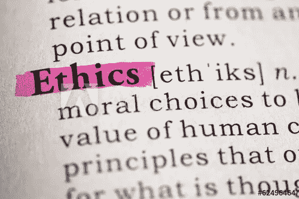

# 人工智能与伦理:我们是不是让自己变得更困难了？

> 原文：<https://towardsdatascience.com/ai-ethics-are-we-making-it-more-difficult-on-ourselves-2783e48c95d2?source=collection_archive---------21----------------------->

不久前，我们讨论了与脸书十年挑战赛有关的人工智能启示录。脸书邪恶吗？我们因为帮助自己走向灭亡而变得邪恶了吗？正如我们所说:不完全是。然而，道德似乎无情地联系在一起，而且理由充分。这是正在进行的关于人工智能和伦理问题系列的一部分。当然，没有比科幻小说更好的起点了。

长久以来，关于人工智能*能做什么的问题已经抓住了我们的想象力。事实是，这个想法至少在概念上可以追溯到古希腊的[。](https://introspectdata.com/greek-robots-and-ai/)*

从哲学的角度来说，人类的创造物能够做什么并不新鲜。也不知道我们该如何应对。然而，至少在现代意义上，艾萨克·阿西莫夫在将这个问题推向公众辩论方面发挥了作用。至少对于人工智能来说是这样。也就是机器人。机器人能做什么？我们如何阻止他们？

谢天谢地，阿西莫夫找到了解决办法。机器人三定律首次出现在 1942 年的短篇小说《逃避》中阿西莫夫提供了一套准则，这些准则是所有机器人编程的关键组成部分:

*   第一定律:机器人不能伤害人类，也不能坐视人类受到伤害。
*   第二定律:机器人必须服从人类的命令，除非这些命令与第一定律相冲突。
*   **第三定律:**机器人必须保护自己的存在，只要这种保护不与第一或第二定律相冲突。

# 够了吗？

人工智能和伦理的概念并不新鲜。也不应该。我们坚信，占据这个空间的任何人都应该思考、评估和考虑人工智能的伦理含义。今天如此，明天亦然。

机器人背叛它们的创造者的想法造就了伟大的科幻小说。然而，我们还没有完全实现。据《科学美国人》报道，这是一件好事，该杂志认为阿西莫夫定律根本不起作用:

> 虽然这些定律听起来似乎有理， [*无数的论据*](http://io9.gizmodo.com/why-asimovs-three-laws-of-robotics-cant-protect-us-1553665410) *已经证明了它们的不足。* [*阿西莫夫自己的故事*](https://en.wikipedia.org/wiki/The_Complete_Robot) *可以说是对规律的一种解构，表现了他们在不同的情境下是如何反复失败的。* [*大多数尝试*](https://www.epsrc.ac.uk/research/ourportfolio/themes/engineering/activities/principlesofrobotics/) *起草* [*新指南*](https://futureoflife.org/ai-principles) *遵循类似的原则来创造安全、顺从和健壮的机器人。*
> 
> *By*[*Christoph Salge*](https://www.scientificamerican.com/author/christoph-salge/)*[*对话我们*](https://www.scientificamerican.com/author/the-conversation-us/)*2017 年 7 月 11 日**

*我们现代对人工智能和伦理的关注通常不是机器人接管世界，而是更多地关注保护数据免遭盗窃，防止算法偏差，以及我们对待人工智能、数据等的负责任的方式。*

*没错，这比担心如何阻止我们建造天网稍微不那么冠冕堂皇；但是尽管如此，关于人工智能还有一些重要的问题&伦理问题，值得关注和研究。*

*最近的文章再次提出了这些问题。最近[人工智能教育和伦理将在 2019 年扰乱社会的 4 种方式](https://www.edsurge.com/news/2019-01-28-4-ways-ai-education-and-ethics-will-disrupt-society-in-2019)也许更尖锐:[人工智能有可能是伦理的吗？](https://www.asianscientist.com/2019/02/features/sginnovate-artificial-intelligence-ethics-governance/)*

*嗯，有可能吗？*

# *是的。不是。但大部分是。也许吧。*

*这些天我们产生了大量的数据。很多。人们对我们如何处理这些数据有很多担忧。可以理解也很明智。然而，也有人担心我们可能弊大于利。或者至少从端点的角度来看，我们给自己制造了更多的困难。*

*去年在欧盟实施的《通用数据保护条例》( GDPR)就是这样一个例子，它让我们的事情变得更加困难。*

*从某些角度来看，很难反驳 GDPR 提出的观点。也就是说，组织在道德上有责任正确处理您的数据，而不是共享它，并保护它。理论上都是好东西。*

*然而，无论好坏，它也是一堵墙。毫无疑问，墙可以防止坏东西进入。但是，也能让好的东西出不去。*

*GDPR 成功做到的，部分是有意的，部分是无意的，是将数据与外界隔离开来。这是好事吗？嗯，不总是这样。*

*与这些想法形成对比的是，人们普遍指责和相信硅谷到处都有带有偏见的算法。某些群体受益于(至少在某些人看来)应该是不偏不倚的等式。*

*现在，考虑这些算法是如何创建的。或者更重要的是，它们是在哪里产生的。*

# *隔离数据问题*

*过去，我们习惯于从单一来源获取数据。或者至少很少的来源。我们所说的“数据”是指成千上万比特的信息，这些信息放在一起形成了一个连贯的、可行的算法优化模型。*

*限制性数据保护法可能无意中造成的问题是，它使数据更难合法获得。出于对人工智能和伦理的担忧，我们前所未有地隔离了数据。保持它的限制性。*

*现在，如果你的脑海中浮现出一家电话销售公司的画面，希望创造一种模式，让他们知道晚餐时间该打电话给谁，打扰谁，这听起来可能不是一件坏事。如果你是一所大学的医学研究部门，建立一个模型来预测、诊断甚至治愈疾病，这可能是一件坏事。*

*过去，我们已经详细讨论了与开发和部署相关的“竖井问题”。专业团队能够对问题的一个特定方面表现出高度集中的注意力。然而，它不一定会产生最好的结果或最好的最终产品。*

*在竖井中处理数据也是如此。为了解决世界上的问题，甚至尝试这样做，我们需要访问大量的数据。随着越来越多的限制进一步封锁这些数据，我们面临着偏向我们自己的数据池的风险。*

*要明确的是:当我们谈论能够在一个地方收集数据时；我们指的是可以从单一来源访问的大量数据；但不是来源于单一来源的大量数据。*

# *让我们烤面包吧*

*例如，我们可以去超市购物，面包、牛奶、肉和蔬菜都在一个地方。超市是许多不同类型产品(数据)的巨大来源。如果我们想建立一个算法来跟踪或预测人们购买的食品杂货，超市将是一个很好的起点。*

*为什么？因为我们知道那里的购物者会购买各种各样的商品，包括不同类型和不同种类的商品。我们将能够查看大量数据来构建我们的模型。*

*现在，让我们假设超市不存在。事实上，从送牛奶的人那里买牛奶，从蔬菜市场买农产品，或者从面包师那里买面包，可能被认为是“更安全”或“更好”的。然而，它远没有那么方便，也有更多的限制。*

*如果你从一个单一的来源购买面包:你要感谢这个单一的来源和这个来源的所有特征。那么，当我们只能方便地访问面包师的数据时，我们如何建立一个模型来跟踪杂货购买呢？*

*这就是我们如何无意中偏向我们自己的算法。*

# *开放寄宿生数据*

*这并不是说算法或数据实践中不存在具有文化意义的社会偏见。他们绝对可以。然而，由于跨越某些障碍合法获取数据的难度越来越大，建立具有文化意义和跨文化的模型变得越来越困难。*

*因此，在硅谷建立的模型可能会反映硅谷的人口结构。在印度建立的模型可能反映了印度的人口统计，等等。我们面临的一个问题是，这种一刀切的方法很难从一组数据中有意义地创建一个模型，这些数据可能无法反映所有用户、所有组件，甚至无法达到现实的、理想的或有意义的结果，如果数据之前存在这样或那样的偏差。*

*同样，在大多数人看来，如果我们停止电话营销，这并不是一件坏事。如果我们用对人工智能和伦理的担忧来割掉我们自己的鼻子，以此来刁难我们的脸，这可能是一件坏事。*

*数据收集和分析的未来可能更像这样:在本地收集，在全球重复。当然，这是一个更漫长、更复杂的过程。然而，对增强数据保护的推动越大，访问限制就越多。*

# *那我们该怎么办？*

*在很大程度上，关于人工智能和伦理的对话才刚刚开始。这是件好事。因为正如我们之前所说，我们认为在这个领域工作的人有责任继续问这些问题。也就是说，我们的行为符合道德吗？我们是否为围绕这些问题的公共空间和公共辩论贡献了有意义的思想和行动。随着技术的发展，这些问题需要继续提出。*

*在某种程度上，我们认为个人(和公司的责任)必须发挥作用。政府监管能够也将有助于指出正确的道路。然而，如上所述，它也有自己的缺点和不足。*

*有很好的理由要求像 GDPR 这样的监管，以及美国更严格的监管。然而，也有如上所述的无意的缺点。这也使得空间的新来者很难上手。这就把业务转移到了少数几个有手段、资源和关系的人手中。*

*在某种程度上，对人工智能的伦理处理可能最终取决于控制它的人。我们可能离真正担心机器人起义还有很长的路要走。谢天谢地。这并不意味着在这个领域不存在对坏演员的担忧。*

*我们有责任负责任地使用人工智能。这并不意味着一路上不会有错误、失误和灾难。不这样想是愚蠢的。然而，人工智能和伦理的问题也是一个基本的人类问题。就像编写实现阿西莫夫机器人三定律的代码的人一样。*

*当一个糟糕的演员“忘记”或省略了这段代码会发生什么？当那些负责保护数据的人试图滥用数据时会发生什么？不要太哲学化，但是围绕着人工智能有多道德的问题暂时将最终停留在人类行为的道德可能性的范围内。*

*当然，我们有自由意志。不像我们的机器人下属。暂时如此。*

**原载于 2019 年 5 月 9 日*[*【https://introspectdata.com】*](https://introspectdata.com/ai-ethics-are-we-making-it-more-difficult-on-ourselves/)*。**