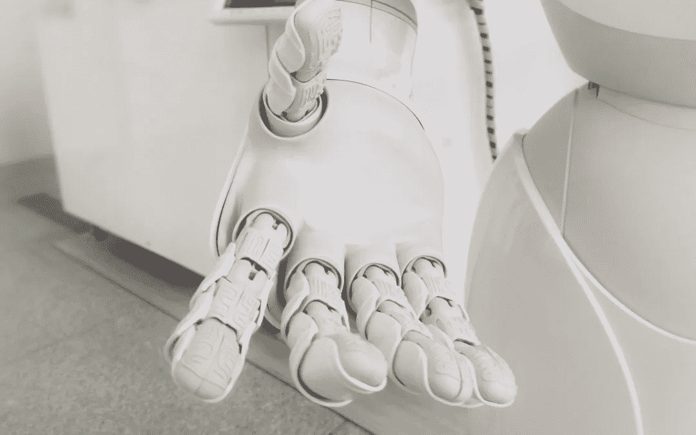

# 人工智能失败了，他们教给我们关于新兴技术的什么

> 原文：<https://towardsdatascience.com/ai-fails-and-what-they-teach-us-about-emerging-technology-e6978c8c4922?source=collection_archive---------34----------------------->

这些天来，我们已经对人工智能的奇迹般的便利变得麻木不仁。当我们打开网飞，立即找到完全符合我们口味的内容时，我们并不感到惊讶，当脸书的面部识别技术从一组照片中认出我们的脸时，我们也不会感到惊讶。十年前，如果我们听到一个朋友让一个看不见的人调暗灯光或报告天气，我们可能会找个礼貌的借口迅速离开。现在，我们几乎不眨眼——也许想知道我们是否也应该得到一个回声点。

我们已经变得如此习惯于人工智能悄悄融入我们日常生活的几乎每个方面，以至于我们不再有坚硬的墙阻挡我们对可能性的感知。我们不是怀疑人工智能能力的新主张，而是带着感兴趣的惊讶看待它，并思考——我可以用它吗？

但是当 AI 没有我们预期的那么好的时候会发生什么呢？当我们对人工智能有用性近乎无限的信念被放错了地方，当我们已经开始依赖的高科技工具在我们委派的责任的重压下开始崩溃时，会发生什么？

让我们考虑一个例子。

**人工智能不能治愈癌症——或者它能吗？IBM 案例研究**

当 IBM 的沃森在 2014 年首次亮相时，它吸引了投资者、消费者和技术爱好者。支持者夸口说，沃森的信息收集能力将使其成为医生的[宝贵资源，否则他们可能没有时间或机会跟上医学知识的不断涌入。在同年](https://www.wired.co.uk/article/ibm-watson-medical-doctor)的[演示中，沃森分析了一系列症状，并提供了一系列潜在的诊断，每个诊断都根据系统的可信度进行了排名，并与相关的医学文献相关联，这让行业专业人士和投资者眼花缭乱。人工智能对罕见疾病的清晰认识及其提供诊断结论的能力既令人印象深刻又鼓舞人心。](https://www.technologyreview.com/s/607965/a-reality-check-for-ibms-ai-ambitions/)

沃森的积极印象刺激了投资。受到人工智能潜力的鼓舞，德克萨斯大学癌症中心 MD Anderson 与 IBM 签署了一份价值数百万美元的合同，将沃森的认知计算能力应用于抗癌。Watson for Oncology 旨在解析大量病例数据，并提供新颖的见解，帮助医生为癌症患者提供更好、更有效的护理。

不幸的是，这个工具并没有完全实现它的营销宣传。

2017 年，德克萨斯大学的审计师提交了一份刻薄的报告，声称沃森不仅[花费了 MD Anderson 超过 6200 万美元](https://www.utsystem.edu/sites/default/files/documents/UT%20System%20Administration%20Special%20Review%20of%20Procurement%20Procedures%20Related%20to%20UTMDACC%20Oncology%20Expert%20Advisor%20Project/ut-system-administration-special-review-procurement-procedures-related-utmdacc-oncology-expert-advis.pdf)，而且未能实现其目标。医生痛斥该工具倾向于给出错误的建议；在*边缘*报道的一个令人难忘的案例中，人工智能建议一名严重出血的患者接受一种会恶化其病情的药物。幸运的是，病人是假设的，没有真实的人受伤；然而，用户仍然对沃森明显的无能感到恼火，这是可以理解的。正如一位特别尖刻的医生在给 IBM 的一份报告中[所说，“这个产品是一个 s-。我们买它是为了营销，希望你能实现这个愿景。我们不能在大多数情况下使用它。”](https://www.statnews.com/2018/07/25/ibm-watson-recommended-unsafe-incorrect-treatments/)

但是，该项目未能实现其宣传的目标，难道都是沃森的错吗？不完全是。

沃森的主要缺陷在于实现，而不是技术。当项目开始时，医生按计划输入真实的患者数据。然而，沃森的指导方针经常改变，以至于更新那些案例成了一件苦差事；很快，用户[切换到假设的例子](https://www.theverge.com/2018/7/26/17619382/ibms-watson-cancer-ai-healthcare-science)。这意味着沃森只能根据少数医生提供的治疗偏好和信息提出建议，而不是来自整个癌症中心的实际数据，从而扭曲了它提供的建议。

此外，人工智能辨别联系的能力只在一定程度上有用。它可以注意到患有某种疾病的患者、他们的状况和所开药物之间的模式，但从这种分析中得出的任何结论充其量都是脆弱的。人工智能无法明确确定这种联系是相关、因果还是仅仅是巧合——因此，在没有循证支持的情况下，提供诊断结论的风险[。](https://spectrum.ieee.org/biomedical/diagnostics/how-ibm-watson-overpromised-and-underdelivered-on-ai-health-care)

鉴于缺乏用户支持和真实信息的短缺，沃森未能提供创新的答案有什么奇怪的吗？

**沃森的失败教会了我们什么？**

沃森的问题与其说是技术性的，不如说是人性的。我们可以从人工智能的崩溃中吸取三大教训:

我们需要检查我们的期望。

我们倾向于相信人工智能和新兴技术可以实现其开发者所说的。然而，正如沃森无法区分相关性和因果性所表明的那样，我们在营销文案中读到的潜力可能被过度夸大了。作为用户，在我们开始依赖新兴技术之前，我们需要对它有更好的理解和怀疑。

*工具必须集成良好。*

如果医生能够使用 Watson 界面，而不需要不断修改他们提交的新指南，他们可能会提供更多真实的患者信息，并比他们更频繁地使用该工具。这反过来可能让沃森更有效地完成了它被赋予的角色。考虑人类用户的需求和考虑工具的技术需求一样重要(如果不是更重要的话)。

*我们必须小心*

如果 MD 安德森中心的科学家们没有如此小心，或者他们盲目地跟随沃森，真正的病人可能已经处于危险之中。我们永远不能让我们对一个新兴工具的信心膨胀到看不到它应该帮助的人。

新兴技术的确令人兴奋，但我们也需要花时间来解决我们如何将这种看似强大的技术带入我们生活的道德和实践问题。至少，对我们的信仰多一点怀疑似乎是明智的。

***原载于***[***www.BennatBerger.net***](http://bennatberger.net/ai-fails-and-what-they-teach-us-about-emerging-technology/)