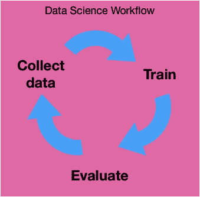
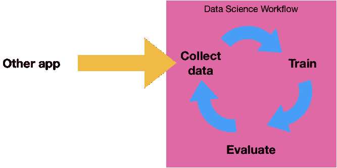

# 艾:假装它，直到你成功

> 原文：<https://towardsdatascience.com/ai-fake-it-till-you-make-it-d99ec63af543?source=collection_archive---------9----------------------->

经常有人抱怨那些假装在做人工智能但实际上并没有做的公司。事实是，有时他们只是提前计划——这实际上是解决重大挑战的好方法。让我们看看它如何帮助以及如何(真正)正确地做这件事，或者，如何建立一个 **MLMVP(机器学习最小可行产品)**！

What if AI was just a big scam? [Taken from “*Scooby-Doo, Where Are You!”* episode “Hassle in the Castle”](https://knowyourmeme.com/memes/lets-see-who-this-really-is)

# AI 到底给你带来了什么？

等等:对了，你当初为什么要做 AI？人工智能(或计算机视觉或机器学习或 NLP 等)会给你带来什么？

有时，我喜欢将项目视为“计算机辅助决策”，而不是人工智能/机器学习，我一直记得，正如[凯西·科济尔科夫](https://medium.com/u/2fccb851bb5e?source=post_page-----d99ec63af543--------------------------------)所说，机器学习“只是”一个[事物的标签](https://hackernoon.com/the-simplest-explanation-of-machine-learning-youll-ever-read-bebc0700047c)。

一个人脸检测算法？东西标签。
视觉金属疲劳检测仪？东西标签。一个聊天机器人，它的首要任务是理解用户想要说什么？东西标签。

许多人工智能项目始于一个给事物贴上正确标签的程序。

据我所知，人类已经在不用机器的情况下做了大量的标签工作。机器学习是一个相对较新的计算机科学领域，但这个世界早就存在了。我们是如何解决给我们的神经网络的任务的？

我们要么手工做，要么通过大量编程来做。如果你记得不错，深度学习使特征提取独立于先验知识，这是非常酷的…..当它工作的时候。

实际上，机器学习给了我们 3 个重大突破:

*   自动特征提取，只要我们给神经网络提供足够的例子。这意味着与手动特征提取相比，**更快的构思**(或训练)；
*   **即时回答**(你的里程数可能会有所不同，但对于我们在 NumeriCube 的工作，我们通常希望算法能在 0.5 秒内做出回答)
*   **缩放**。大规模并行处理能力。ML + Cloud =大规模可扩展的事物标签解决方案。人类无法如此快速地扩展。

这是机器学习算法相对于人工干预的 3 个主要优势。

# 在理想的世界里…

任何人都需要什么来建立一个东西贴标机？

*   大量**示例数据**
*   首先是最先进的分析，又名**人工智能专业知识**(这是经验说话的地方:)
*   **很多时候**又不紧不慢地走向漫长的试错之路。

很简单，不是吗？通常，数据科学应用程序构建流程如下:

The usual Data Science workflow

显然，你需要数据来开始。在一个理想的世界里，你只需要为你的问题建立或者请别人建立一个干净的数据集，然后开始处理它。然而，这并不总是可能的，事实上，很多时候根本不可能。

示例数据？我的个人经验是，当一个项目从一个已经存在的数据集开始时，大约 99%将被丢弃，主要是因为**实验室数据实际上从未以与生产数据**相同的方式获得。

例如，考虑一个图像识别应用程序。你可以在 Flickr 上从数百万张已经标注的图片中训练它，对吗？嗯，除了当你的普通用户用她的智能手机拍照时，结果不会看起来像你建立训练集的整洁的 Photoshop DSLR+flash 图片。该死的。

因此，您有一个业务问题，您非常确定您可以用足够的数据来解决它，并且您知道您将使用的最佳数据来自生产系统。

换句话说，为了以正确的方式收集数据，您需要您的系统处于生产状态！看起来像是鸡和蛋的问题！

Photo by [Sebastian Staines](https://unsplash.com/@seabas?utm_source=medium&utm_medium=referral) on [Unsplash](https://unsplash.com?utm_source=medium&utm_medium=referral) — Does the data come before the app, or the app before the data 🤔

# 在谷歌工作怎么做到这一点？

对于大平台(想想谷歌、脸书、苹果等)，很容易将数据收集过程与数据科学过程分开。为什么？因为这些公司的背包里已经有了庞大的数据收集工作流程。

How big companies are doing data science (thanks to other apps)

在某种程度上，谷歌、脸书、亚马逊等花了 10 多年时间来开发数据收集应用。例如，至少从 2008 年开始，脸书就允许[在你的照片上标记你的朋友](https://www.adweek.com/digital/facebook-marketing-photo-tag-spamming-on-the-rise/)！他们现在有一个大规模的面部检测数据集…它工作得很好，因为他们的数据收集应用程序已经包含了服务。

但是如果你想从零开始建立一个 AI 服务，你不能这样做。**如果你还没有数据，你必须一步到位**。

旁注:实际上，这是大多数拥有自动车辆数据集收集的大公司的情况——这可能是他们在这方面如此挣扎的原因:除了特斯拉，他们在开始研究这一主题时没有数据收集流程。

如果你正在阅读这篇博文，而你不是谷歌，那么你可能也没有一个好的数据集可供使用。那么，你如何能在构建一个人工智能应用的同时收集数据呢？

# 等等:你现在真的需要实时和可伸缩性吗？

答案是:假的。用人类来做。

应用程序构建循环现在看起来更像这样:

The loop for collecting data while training an algorithm

通过这种方式，在图的左侧，您将得到:

*   **即时回答**(除非你有一群粘在电脑屏幕上的奴隶，回答一个给东西贴标签的问题可能需要一秒钟以上)；
*   **缩放**(除非你统治的国家可以强制招募一群奴隶，这超出了本故事的范围；还有，我们不鼓励)；

现在有问题吗？您的应用程序真的需要实时运行吗？如果你正在建造一辆自动驾驶汽车，答案是*很可能*是的，但是我们有那么确定吗？为什么某种自动驾驶的车辆不能由人驾驶(即使是远程驾驶)？

在大多数应用程序中，从质量控制到情感分析，实时是一个很大的优势，但如果开始时没有实时呢？真的会阻止你的应用被使用吗？

**大多数情况下，机器学习应用的 MVP 应该避免实时处理。**

一旦你设置你的应用程序来做这种人在回路中的方法，你只需要收集一段时间的数据，让你的数据科学家工作，同时已经满足了早期阶段的用户。

# 不要在这方面惨败！

即使我们鼓励这种方法，也有一个巨大的警告:如果你的机器学习算法从来没有工作过，你会悲惨地失败。因此，为了以这种方式执行事情，您必须确保能够在某个时候交付它！

然而，人类执行真实任务的主要优势是，在适当的条件下，你非常确定机器学习算法将*最终*赶上人类的精确度。为什么？

1.  如果您的操作员在信息有限的情况下工作(即使用与你的算法相同数量的信息)，那么你将非常确定你能找到相关的艺术状态来给你再保险。图像识别竞赛或 NLP 竞赛将让您大致了解这些任务有多困难。
2.  如果您的操作员只接受了几分钟的示例培训，并且不需要专业知识来执行任务，那么对于机器学习算法来说，挑战可能不会太难。
3.  通过建立这条管道，您将不得不机械地以一种既适合您的操作人员(因此也适合您的数据科学家；))并且可以在生产中复制，因为你已经*在生产*了。

这样做让我改变了我们在 [NumeriCube](https://www.numericube.com) 开发的大型计算机视觉应用的数据采集策略。这可能节省了数千小时的标签！

> *我们正在发布我们在 NumeriCube 用于日常计算机视觉项目的工具:视觉数据收集、注释、存储和管理。如果你喜欢这篇文章和/或想保持联系，我很乐意在评论中听到你的意见！*