# 算法交易的人工智能:重新思考棒线、标签和平稳性

> 原文：<https://towardsdatascience.com/ai-for-algorithmic-trading-rethinking-bars-labeling-and-stationarity-90a7b626f3e1?source=collection_archive---------2----------------------->

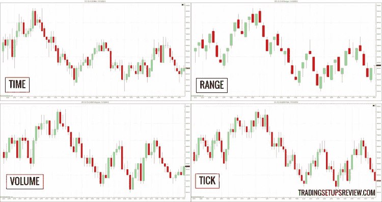

Image from [https://www.tradingsetupsreview.com/trading-charts-without-time-range-tick-volume/](https://www.tradingsetupsreview.com/trading-charts-without-time-range-tick-volume/)

在一系列文章中，我应用了一种非常简单的方法来预测金融时间序列:利用整个数据集，使用滑动窗口方法生成 X 和 Y，将其分为历史数据和样本外数据，训练一些机器学习模型将 X 映射到 Y，并回测简单的多空策略。但是正如我在[的上一篇博客文章](https://medium.com/@alexrachnog/ai-for-algorithmic-trading-7-mistakes-that-could-make-me-broke-a41f94048b8c?source=user_profile---------6------------------)中所展示的，我开始意识到,“正常”静态数据(如图像、文本、音频、表格数据，甚至不太混乱的时间序列)的管道不能用于金融时间序列分析。

问题不仅仅在于数据是随机的，难以预测。这完全是对其内在本质的误解，这影响了数据集准备、交叉验证、特征选择和回溯测试。在本文中，我们将专注于众所周知的“酒吧”，它们有什么问题，以及如何正确地烹饪它们，以便稍后在机器学习模型中使用。在重建了这些条之后，我们将会发现一些新的方法来构建输入和输出。当然，我们将从统计和经验两方面比较这些方法。我在这里展示的观点受到了《T2》**洛佩兹·德·普拉多** 的书的很大影响，我推荐任何想深入了解更多细节的人阅读这本书。您还可以在这里找到所有代码:

[](https://github.com/Rachnog/Advanced-Deep-Trading/tree/master/bars-labels-diff) [## rach nog/高级深度交易

### 大部分实验基于“金融机器学习的进步”一书- Rachnog/Advanced-Deep-Trading

github.com](https://github.com/Rachnog/Advanced-Deep-Trading/tree/master/bars-labels-diff) 

# 蜡烛怎么了？

我们习惯于使用所谓的“蜡烛线”数据，这些数据代表特定时间段(从几分钟到几天)的开盘价、最高价、最低价和收盘价。这种方法有一个主要问题:市场不遵循这个时间规则。人们不会在某个时间或每隔 N 分钟/小时下单和交易。此外，由于现代市场是由算法驱动的，它们肯定会在需要的时候下注，而不是在 N 秒过后下注。如果我们基于恒定的时间间隔对历史数据进行采样，会发生什么呢？当交易非常活跃时，我们会欠采样，而当交易不活跃时，我们会过采样。最后但并非最不重要的是，从上面提到的所有情况来看(根据经验)，按时间采样的棒线遵循**“坏的”统计特性**:它们具有低序列相关性，具有异常值，并且不能通过分布正态性检验。

解决方案在于根据另一种规则对这些棒线进行采样:

*   **分笔成交点:**当出现 N 个分笔成交点时，对 OHLC 棒线进行采样
*   **成交量棒线:**当某项资产的 X 股交易时，对 OHLC 棒线进行取样
*   **美元棒线:**当资产以 Y 美元(或其他货币)交易时，对 OHLC 棒线进行采样
*   不平衡棒线:当价格或买入/卖出的涨跌比率偏离我们的预期时，对 OHLC 棒线进行取样

从下面一个时间序列样本的图片中，你可以直观地了解这些条形是如何产生的:

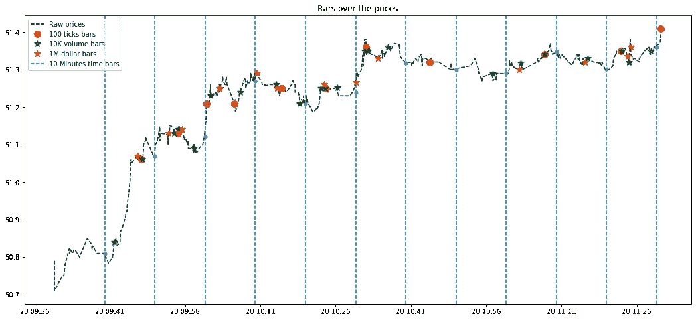

Comparison of some of the above-mentioned bars on IVE ticker

上面提到的所有方法都是为了创建含有**等量信息的棒线**:分笔成交点有相同的交易数量，但是交易量可能有很大的不同，所以我们可能更好地选择交易量相同的棒线作为样本。美元棒扩展了这个想法链，使每个棒都有相同的市场价值。不平衡棒线可以应用于分笔成交点、成交量或美元棒线。让我解释一下分笔成交点不平衡棒线背后的想法。不平衡分笔成交点是遵循相似价格趋势的 N 个分笔成交点的样本。

正如你所看到的，所有这些想法都严重依赖于市场微观结构来重建我们已经非常了解的时间序列。让我们来看看这些酒吧是否真的像看起来那么好。他们没有太多的市场微观结构数据的来源，有出价，要价和大小列，我可以找到这个[相同主题的教程](http://www.blackarbs.com/blog/exploring-alternative-price-bars)，但我会自己实现大多数方法。这里我们有每 10 分钟采样一次的时间棒线，每 100 根棒线采样一次的价格棒线，每 10000 笔交易的交易量和每 1000000 美元的交易量(几个月内):

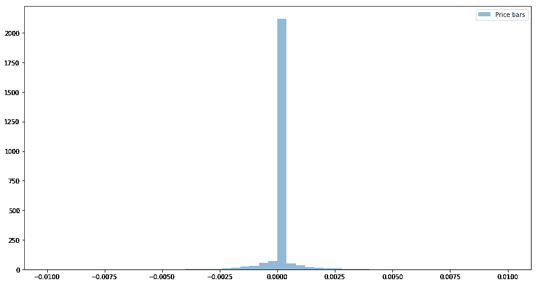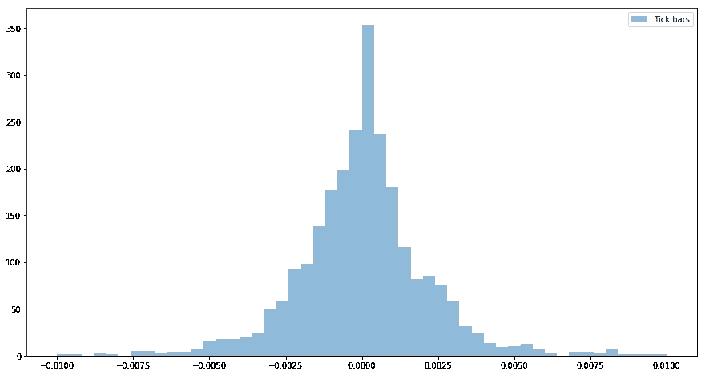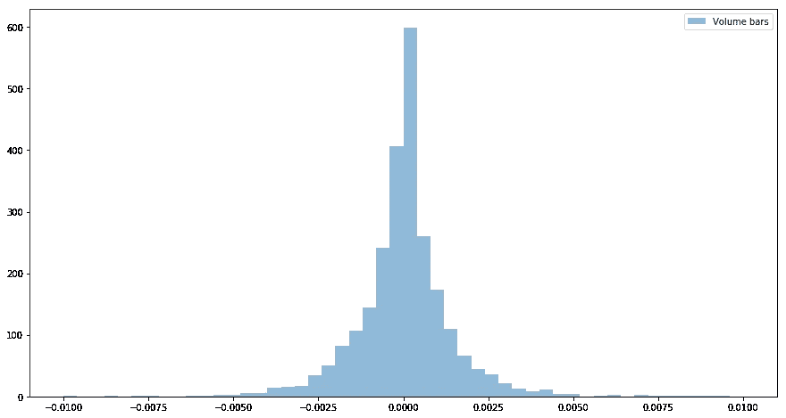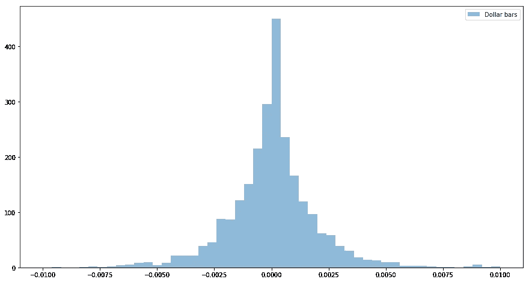

Comparison of distributions of returns with different bar rules

**统计属性**呢？下面你可以找到不同参数的不同棒线的比较，以及它们的序列相关性、标准差和正态性检验。

正如我们所看到的，对于每个参数**，替代棒线比时间棒线表现得更好**(除了方差之外，方差无论如何都非常低)。我以前怎么会用时间条呢？:(

## ！更新！

GitHub 用户[https://github.com/mpugna](https://github.com/mpugna)对代码进行了[修复，这使得时间条仍然非常吸引人:](https://github.com/Rachnog/Advanced-Deep-Trading/pull/1)

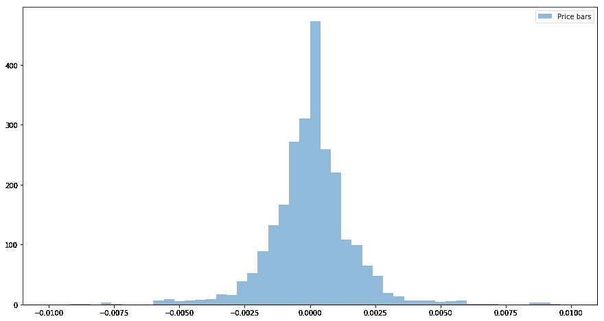

自相关是-0.079，Jarque-Bera 78692.65，Shapiro 0.7924。常态测试仍然比另类酒吧差，但至少现在看起来更有吸引力。

# 如何正确标注数据集？

在我之前的文章中，我预测了价格在 N 根棒线通过后的变化。例如，我想预测 30 分钟后价格将如何变化，并根据预测做多或做空。但这真的是从业者和交易者的行为方式吗？当他们在一些信号后开仓时，他们会记住他们的止盈目标和止损目标。这意味着，我们更关心这 30 分钟内发生了什么，而不是当它们过去时会发生什么。此外，由于市场的波动，我的利润和亏损目标可能会随着时间的推移而变化。此外，由于我要在市场价格变动的某个方向下注，我需要知道我应该下多少注。最后但同样重要的是，从我的模型的角度来看，我对我的预测的信心感兴趣，不要在随机信号上浪费时间。

因此，我对一种新的标记方法感兴趣，它包括:

*   考虑收益的**滚动波动率**
*   考虑到**止损止盈**
*   告诉我的不仅仅是一方，还有**赌注的大小**

## 动态阈值

我们先从收益的波动性说起。让我们考虑一个简单的框架，其中我们仍然有一个固定的预测范围，我们想标记三个类别:如果当前价格和未来的回报大于某个阈值 **T** (如 T = 0.1 时 r = 0.2)，小于-T(如 T = 0.1 时 r = -0.12)，或不显著(如回报的符号小于 T，如 T = 0.1 时 r = 0.05)。我们可以固定整个数据集的 T 值，也可以使用回报率的标准变化来自适应地计算 T 值。让我们检查一下这个想法，选择固定的 T = 0.025 阈值用于 60 个分笔成交点的水平回报，并将其与 T 进行比较，这等于最近 100 个回报的绝对值的标准偏差:

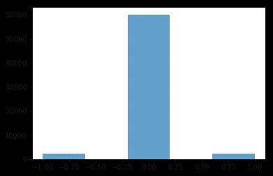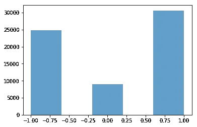

Histogram of labels for fixed threshold (left) and volatility driven labeling (right) for the fixed horizon

正如我们所看到的，基于波动性的标记仍然不是很平衡，但固定阈值标记**基本上使大多数标记为 0** (其中-1 表示下降，1 表示上升，0 表示无显著变化)。我只想注意，这些标签是在使用滑动窗口在条形上循环时创建的，这不是采样数据点的最佳方式，但我们稍后将讨论这个问题。

## 三重屏障标记

现在让我们研究另一种用于标记数据集的适应性，这种适应性在书“**三重屏障方法**”中被称为。我们想知道接下来的 N 根棒线会发生什么——我们会遇到止损的情况吗？或者我们应该获利？或者价格会有一点波动，所以我们最好不要下注？或者甚至是这些事件的组合？我们可以用三个障碍来描述这三种情况:两个水平障碍(代表止损和止盈)和一个垂直障碍，这意味着最终的地平线(在我们前面的例子中是固定的地平线)。当然，这些水平障碍不应该是对称的(例如，你是一个激进的玩家，你的止损与止盈目标相比相当低)。

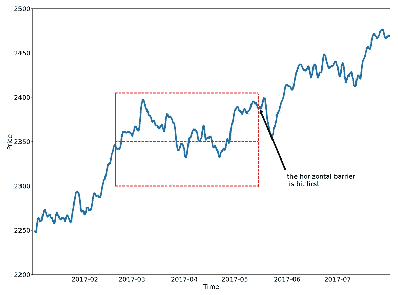

Image from [http://www.quantresearch.info/Innovations.htm](http://www.quantresearch.info/Innovations.htm)

## 赌注的大小和元标记

好的，我们有一些聪明的方法来标记价格是上涨还是下跌，考虑到波动性和我们的止损和获利目标。但我们仍然不知道我们应该赌多少(以及我们是否应该下注)！Lopez de Prado 提供了两步标记，其中一个标记负责方向，另一个标记负责赌注的确定性(以及赌注的大小):

*   将每个样本标记为将首先上涨或下跌的样本，使用动态阈值作为**初步止损和止盈屏障**(基本上我们想知道价格将首先上涨还是下跌)
*   了解这一点后，我们希望根据我们的**预定义止损和止盈目标**下注或不下注，因此，如果我们的第一个标签显示“上涨”，我们将检查我们是否也会达到止盈目标，如果我们得到确认，我们将第二个标签设置为 1。如果我们有第一个标签“下跌”,我们将触及止损——我们仍将其标记为 1。只有当我们在第一个标签的方向和止损或止盈之间没有对应关系时，我们才会将它标记为零。

最酷的是。在准备数据集时，我们在我们的特征集上训练一个预测边(标签 1)的模型。我们还训练了第二个模型，它将所有以前的特征作为输入，并标记一个特征。因此，在根据第一个模型预测了方向之后，我们希望知道第二个模型的确定性水平，并根据其从 0 到 1 的输出，我们进行适当的押注。例如，如果第一个模型显示“上涨”，但第二个模型显示 0.05 左右，这意味着即使价格也会上涨，很可能我们不会达到止盈目标。

# 内存和平稳性呢？

正如我们所知，在将数据传递到任何机器学习模型之前，我们需要以某种其他方式规范化或标准化或使其稳定。当我们谈论金融时间序列时，我们通常会进行一些滞后的微分(通常滞后 1，我们称之为**回报**)。它确实使时间序列平稳，但是这个时间序列中应该有一些记忆的信息发生了什么？就这么被消灭了！为什么？由于滞后 1 的这种差异，它看起来仅落后一个棒线，对之前发生的事情一无所知，因此为了平稳起见，我们对历史时间窗口中的所有棒线都这样做。我们仍然希望有一个平稳的时间序列，但不删除其中所有有用的内存…如果我们只能用小于 1 的阶来区分它会怎么样？事实上我们可以，这叫做**，分数阶微分**。我将把更多的细节留给主书或[其他资源](https://en.wikipedia.org/wiki/Autoregressive_fractionally_integrated_moving_average)，现在让我们相信我们可以区分滞后 0.1、0.3 或 0.75 的时间序列，这应该会给我们更多一点的内存。

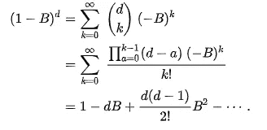

Backshift operator of arbitrary order (from Wikipedia)

让我们通过 ADF 测试来衡量对数价格与不同种类的差异和平稳性之间的相关性保留了多少信息:

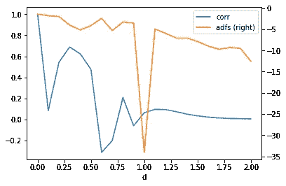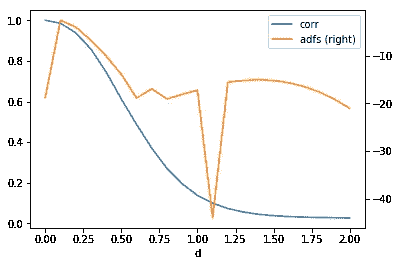

ADFs and correlation for tick bars (left) and time bars (right)

正如我们所见，在这些分笔成交点时间序列中，分数阶微分不会给我们更好的平稳性，但确实有更多的相关记忆。在**时间条**的情况下，我们可以使用 0.5–0.75 阶微分来稍微改善我们的数据**。**

# 把它全部输入神经网络

好了，现在是时候看看当我们试图用新的目标来塑造我们的新酒吧时会发生什么。我将使用非常简单的 softmax 回归作为分类算法(剔除正则化)，并将历史窗口内的收盘价、成交量和回报率标准化为特征。Keras 中的模型看起来像:

```
main_input = Input(shape=shape, name='main_input')
x = Flatten()(main_input)
x = Dropout(0.25)(x)
output = Dense(3, activation = "softmax")(x)
```

相应地，长窗口长度为 100，短窗口长度为 50，预测范围为 25 小节。阈值 T = 0.01。数据集将由**刻度条**组成:

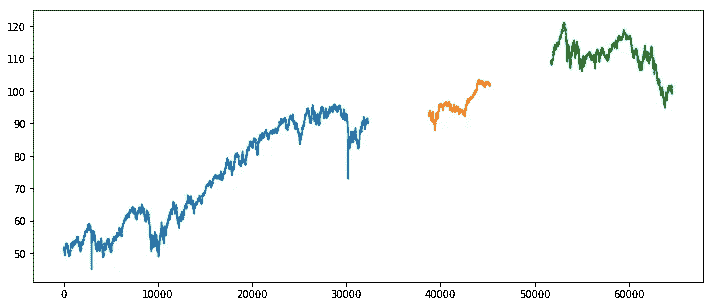

Tick bars for a train (blue), validation (yellow) and test set (green)

正如你所看到的，在集合之间有一些自由空间，这被称为*“禁运”*并且有助于确保我们的模型在未来会工作得更好。我们稍后将详细研究它，现在让我们把它看作一个更现实的拆分场景。为了处理类别不平衡，基于训练集和验证集计算每个类别的权重。

## 固定阈值与波动阈值与三重屏障

我们的**基线**将只是对价格上涨或下跌或不超过阈值 t 的预测。分类报告将如下(0 级代表下跌，1 级代表不显著的上涨，2 级代表上涨):

```
 precision    recall  f1-score   support

           0       0.09      0.32      0.14       899
           1       0.90      0.36      0.52     11116
           2       0.06      0.41      0.11       765

   micro avg       0.36      0.36      0.36     12780
   macro avg       0.35      0.36      0.25     12780
weighted avg       0.79      0.36      0.47     12780
```

印象不深，对吧？而不是精确度/召回率的不平衡以及数据集标签的不平衡。那么**波动阈值**呢？

```
 precision    recall  f1-score   support

           0       0.39      0.33      0.36      4922
           1       0.20      0.30      0.24      2896
           2       0.38      0.34      0.36      4962

   micro avg       0.33      0.33      0.33     12780
   macro avg       0.33      0.32      0.32     12780
weighted avg       0.35      0.33      0.33     12780
```

数字越来越好。我们在精确度/召回率方面没有不平衡(这意味着分类器是公平的，随着算法本身和功能的改进，我们将在精确度方面有值得信赖的改进)，数据集不平衡现在不是那么关键。好了，让我们试试**三重屏障，现在根据波动率在滚动 T 的值处对称止盈止损**，就像上一个例子一样:

```
 precision    recall  f1-score   support

           0       0.50      0.28      0.36      6225
           1       0.48      0.47      0.47      6189
           2       0.02      0.22      0.04       366

   micro avg       0.37      0.37      0.37     12780
   macro avg       0.33      0.32      0.29     12780
weighted avg       0.48      0.37      0.41     12780
```

平均结果大致相同，因为等级 2，这里代表接触垂直线的障碍，人口非常少。如果我们避免这种情况，基于止盈和止损的上下波动的精确度将会高于前面的例子，但精确度/召回率会出现轻微的不平衡。将这些预测作为二元预测模型的**元标签**，该二元预测模型将学习**赌注**的一面，它将具有以下准确度:

```
 precision    recall  f1-score   support

           0       0.03      0.58      0.06       360
           1       0.98      0.52      0.68     12420

   micro avg       0.52      0.52      0.52     12780
   macro avg       0.51      0.55      0.37     12780
weighted avg       0.95      0.52      0.66     12780
```

## 分数微分与整数微分

现在让我们用 **d = 0.5** 来替换具有微小差异的对数价格的特征集合中的回报，并看看相同的实验会发生什么。**基线**(还是没什么印象):

```
 precision    recall  f1-score   support

           0       0.09      0.47      0.15       899
           1       0.88      0.45      0.60     11116
           2       0.05      0.16      0.08       765

   micro avg       0.44      0.44      0.44     12780
   macro avg       0.34      0.36      0.28     12780
weighted avg       0.78      0.44      0.54     12780
```

**波动范围**已经比“正常”分化好一点:

```
 precision    recall  f1-score   support

           0       0.41      0.37      0.39      4922
           1       0.24      0.28      0.26      2896
           2       0.40      0.40      0.40      4962

   micro avg       0.36      0.36      0.36     12780
   macro avg       0.35      0.35      0.35     12780
weighted avg       0.37      0.36      0.36     12780
```

最后，**三重屏障及其元标签**:

```
 precision    recall  f1-score   support

           0       0.49      0.37      0.42      6225
           1       0.49      0.44      0.47      6189
           2       0.04      0.25      0.06       366

   micro avg       0.40      0.40      0.40     12780
   macro avg       0.34      0.35      0.32     12780
weighted avg       0.48      0.40      0.43     12780 precision    recall  f1-score   support

           0       0.03      0.53      0.06       360
           1       0.98      0.54      0.69     12420

   micro avg       0.54      0.54      0.54     12780
   macro avg       0.50      0.54      0.38     12780
weighted avg       0.95      0.54      0.68     12780
```

我想我们确实可以确认，分数阶微分是一个非常有用的变换，它允许从原始时间序列中保存更多的信息！

# 结论

在本文中，我们回顾并重新定义了我们过去在金融网站上看到的经典酒吧是如何创建的。我们发现了它们的统计特性，我们真的同意成交量或美元棒线比标准的时间棒线更有吸引力。我们还建立了几种更现实的方法，根据不断变化的波动性和预定义的止盈止损目标来标记产出。最后但并非最不重要的是，我们回顾了一种方法，使金融时间序列平稳，而不会失去所有的记忆。我们还用数据和标签评估了所有这些实验，我们实际上可以看到，所有这些有意义的改进确实使结果更加稳定和充分。当然，这不是一个神圣的圣杯，但至少它不像我和许多其他人以前做的那样愚蠢……:)不要忘记查看我的库中的[代码！](https://github.com/Rachnog/Advanced-Deep-Trading/tree/master/bars-labels-diff)

**附言**
如果你觉得这个内容有用，有观点，可以[在 Bitclout 上支持我](https://bitclout.com/u/alexrachnog)。关注我还可以在[脸书](https://www.facebook.com/rachnogstyle.blog)上看到太短的人工智能文章，在 [Instagram](http://instagram.com/rachnogstyle) 上看到个人信息，在 [Linkedin](https://www.linkedin.com/in/alexandr-honchar-4423b962/) 上看到！