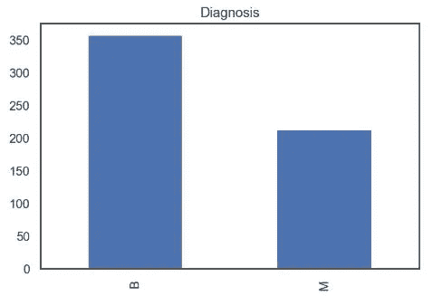
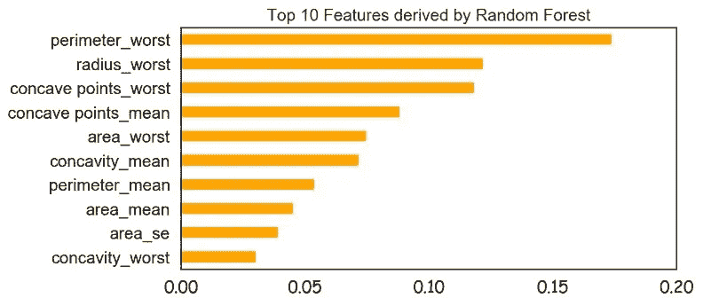
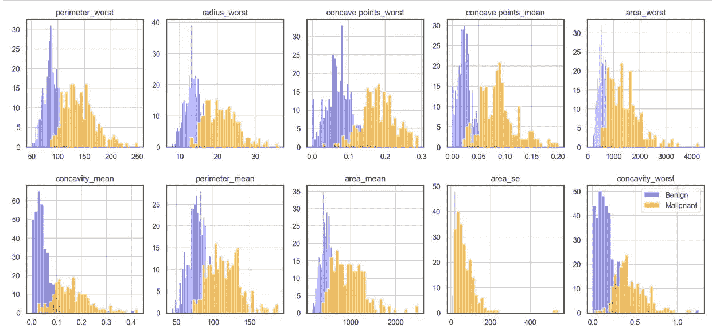
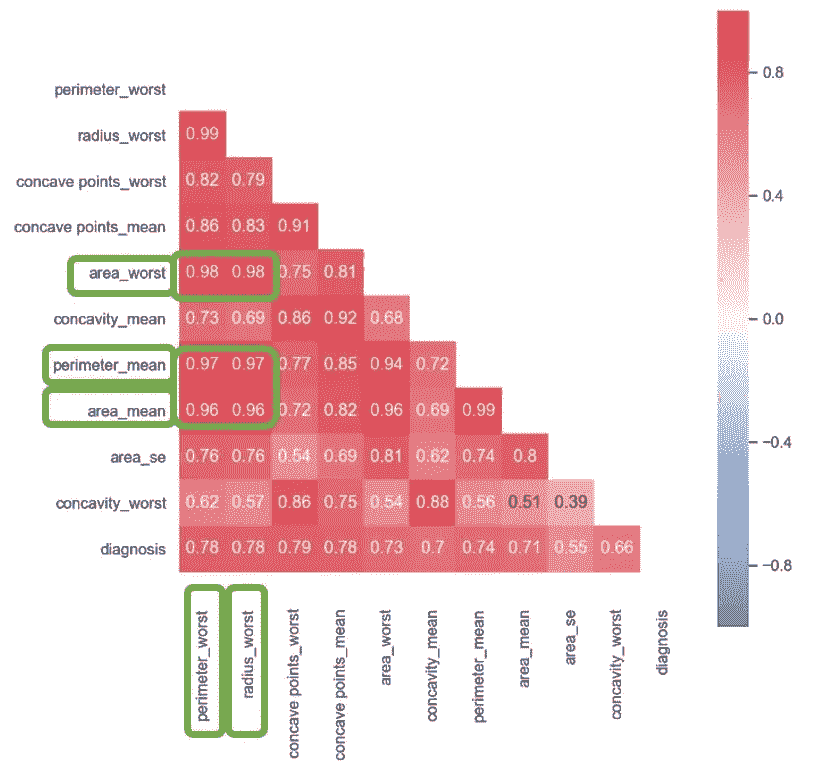
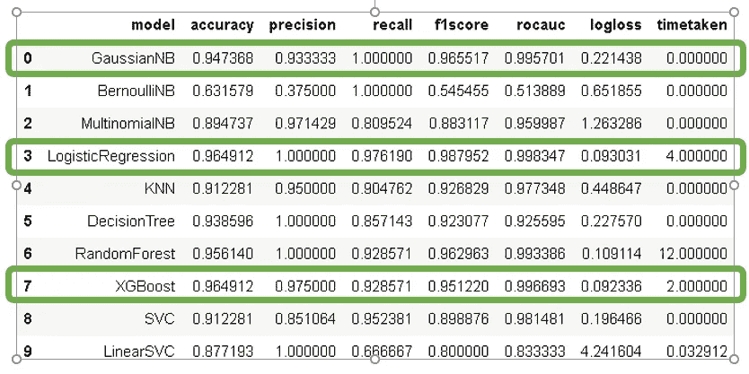
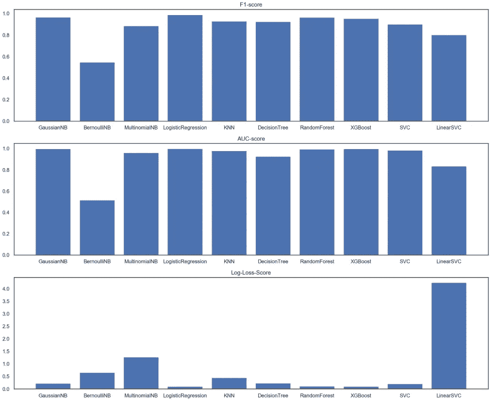
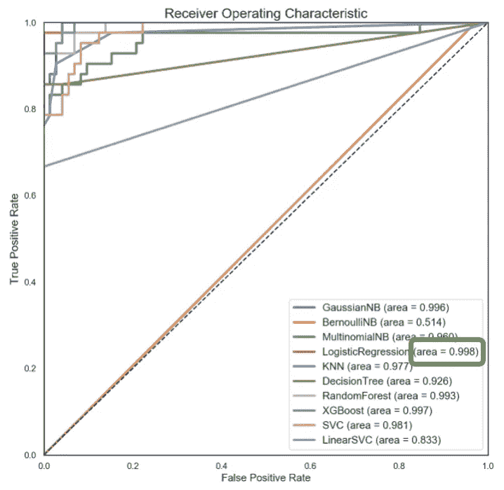
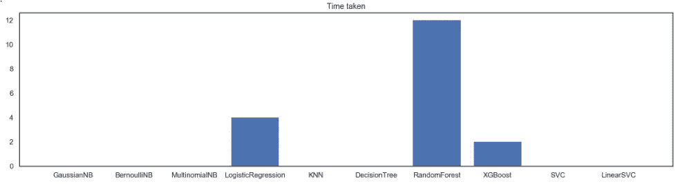

# 人工智能检测癌症

> 原文：<https://towardsdatascience.com/ai-for-cancer-detection-cadb583ae1c5?source=collection_archive---------26----------------------->


Credit: pixabay

C**ANCER**——这个词几乎总能引起任何人的恐惧。在新加坡，据估计每 4 到 5 个人中就有一个人会在一生中患上癌症，其中乳腺癌在女性中居首位([T5【来源】T6](https://www.nccs.com.sg/patient-care/cancer-types/cancer-statistics))。虽然令人欣慰的是，随着医疗保健的进步，癌症不再是每个病人的死刑，但治疗费用过高。事实上，晚期癌症治疗的费用从每月 8k 美元到 17k 美元不等( [*来源*](https://blog.seedly.sg/true-cost-cancer-treatment-singapore/) *)* 。解决办法？不，不是人寿保险，而是…..及早发现！

使用来自 [kaggle](https://www.kaggle.com/uciml/breast-cancer-wisconsin-data) 的乳腺癌数据集，我的目标是建立一个机器学习模型来区分恶性和良性病例。

# 概观

该数据集由 569 个病例组成，其信息跨越从乳腺肿块提取的细胞核的数字化图像上的 33 个特征。

```
Rows     :  569
Columns  :  33

Columns : 
 ['id', 'diagnosis', 'radius_mean', 'texture_mean', 'perimeter_mean', 'area_mean', 'smoothness_mean', 'compactness_mean', 'concavity_mean', 'concave points_mean', 'symmetry_mean', 'fractal_dimension_mean', 'radius_se', 'texture_se', 'perimeter_se', 'area_se', 'smoothness_se', 'compactness_se', 'concavity_se', 'concave points_se', 'symmetry_se', 'fractal_dimension_se', 'radius_worst', 'texture_worst', 'perimeter_worst', 'area_worst', 'smoothness_worst', 'compactness_worst', 'concavity_worst', 'concave points_worst', 'symmetry_worst', 'fractal_dimension_worst', 'Unnamed: 32']
```



数据集有些不平衡。

```
B    357
M    212 
```

# **功能选择**

在 33 个特征(又名列)中，并非所有特征对恶性肿瘤的确定都有同等贡献。Random forest 有一个函数调用 feature_importance 来帮助识别重要的。

```
# Plot the top 10 features based on its importance
(pd.Series(model.feature_importances_, index=X.columns)
 .nlargest(10) 
```



以下是按降序排列的 10 大特征。

这 10 个特征分布的直观表示揭示了其中恶性病例的一些“钟形曲线”模式。



我们真的需要 10 项功能吗，或者可以进一步减少吗？这些前 10 个特征与我们的目标(“诊断”)的关联热图偶然显示其中 5 个特征彼此之间有很强的相关性。这意味着我们可以选择一个作为代表，并消除其余的。它们都与周长、面积和半径有关，是有意义的。(*体积不包括在内，因为数据集属于 2d 信息，否则它很可能在其中。)如果您想知道为什么每个重要特征都显示正相关，这是意料之中的，因为所有 33 列都与维度相关，并且我们知道可量化的癌细胞越多，它就越先进。每个人都有癌细胞。如果是可检测的量，这就是我们将患者标记为患有癌症的地方。*



我满足于用“radius_worst”来表示这些高度相关的特征，并重新定义 X(特征)和 Y(目标)。

```
X = df.loc[:,[‘radius_worst’,’concave points_worst’,’concave points_mean’,‘concavity_mean’,’area_se’,’concavity_worst’]]y = df[‘diagnosis’]
```

# 模型建立和比较

建立模型的下一步是将数据集分为训练数据集和测试数据集。我采用了 80%-20%的分割，并使用分层方法在训练集和测试集中保持相同的恶性-良性病例比率，因为数据集是不平衡的。

下一步是将 kfolds 应用于训练集，以在 80%的数据集上执行训练验证。我再次应用 StratifiedKFold 来保持我的(n_split = 5)折叠的分布。10 种常见机器学习算法的结果令人振奋。有三个强有力的竞争者。


通过调整参数来查看这些模型是否可以进一步改进被证明是有用的，因为大多数模型在大多数指标上都有所改进。



从视觉上看，很明显这将是一个艰难的决定，在我值得的候选人中。从下面的图表来看，LogisticRegression、RandomForest 和 XGBoost 之间的竞争几乎不分上下。



当考虑 ROC-AUC 度量时，逻辑回归是冠军，ROC-AUC 度量说明了模型区分两个类别的能力。

# **结论**

然而，如果我们从时间消耗的角度考虑成本，那么就有一些权衡。对我来说，我觉得这仍然是可以接受的，也是在实际部署时需要考虑的一个因素。但是现在，由于数据集不是非常大，它仍然是可管理的。



我希望在处理不平衡数据集时需要注意的不同算法、指标和因素(分层训练-测试分割、使用分层文件夹的交叉验证)是有用的。