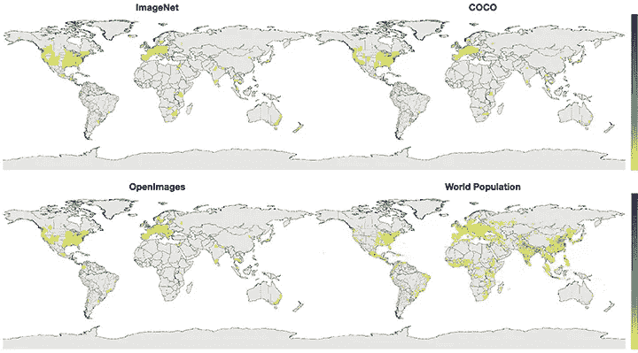
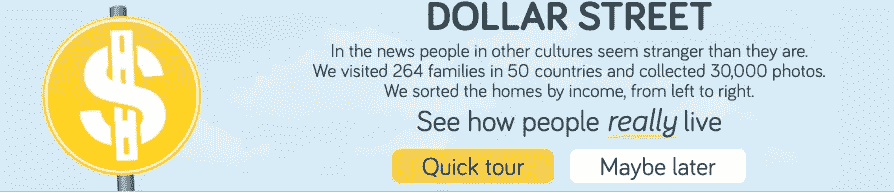
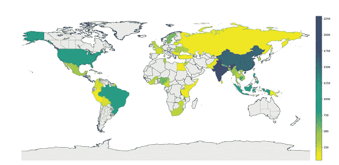
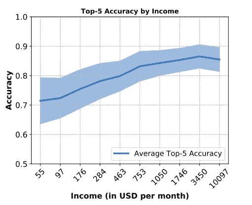
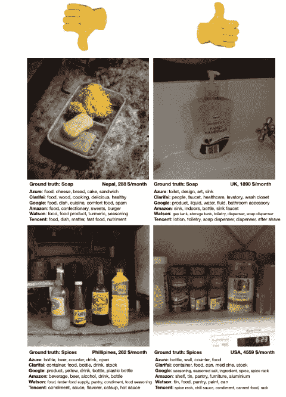

# 面向所有人的人工智能:神话还是现实？

> 原文：<https://towardsdatascience.com/ai-for-everyone-myth-or-reality-44edc24f7982?source=collection_archive---------16----------------------->

## 脸书题为“物体识别对每个人都有效吗？”

Photo by [Perry Grone](https://unsplash.com/@perrygrone?utm_source=medium&utm_medium=referral) on [Unsplash](https://unsplash.com?utm_source=medium&utm_medium=referral)

> “AI 是一个工具。如何部署是我们的选择。”柳文欢·埃齐奥尼

人工智能技术正在缓慢而稳步地侵入我们的生活。他们已经在为我们做一些重要的决定，比如我们是否有资格申请抵押贷款，我们喜欢什么样的电影或歌曲，甚至建议给我们发电子邮件回复。计算机视觉是人工智能的一个积极发展的子领域，它有着很大的前景。面部识别、物体检测、图像识别、情感分析等技术正被各行各业用来增强消费者体验、降低成本和提高安全性。但如果这些系统的结果对某个特定的种族、性别或地区有偏见呢？嗯，肯定有比看上去更复杂的东西。

最近，脸书研究人员在一篇题为: [***的论文中称，物体识别对每个人都有效吗？***](https://research.fb.com/wp-content/uploads/2019/06/Does-Object-Recognition-Work-for-Everyone.pdf?) 就当前 SOTA 异议检测技术结果的适用性提出了一个非常中肯的问题。他们的研究强调了在低收入或非西方国家识别普通家庭用品时的强烈地理偏见。下图显示了低收入国家的预测结果与实际情况相差甚远，而西方国家的预测结果却非常准确。

Household item recognition in Low income Vs High-Income Countries.

# 有偏见的数据导致有偏见的模型

计算机视觉系统中的偏见和代表性不足的故事并不新鲜。许多研究都清楚地表明了这种模式。这里有两个具体的例子。

*   论文 [*商业性别分类的交叉准确性差异*](http://proceedings.mlr.press/v81/buolamwini18a.html) 强调了这样一个事实，即商业使用的性别分类系统对于肤色较浅的男性比肤色较深的女性更为准确。
*   **职业图片搜索结果中的不平等代表性和性别刻板印象显示，谷歌搜索结果中女性代表性不足。**

**这种有偏差的结果的最可能的原因之一是用于训练模型的数据类型。在大多数情况下，数据收集本身是有偏差的，正是这种偏差最终渗透并显示在模型的预测中。在当前的研究中，发现几乎所有流行的数据集中使用的照片集合包括****[**COCO**](http://cocodataset.org/#home)和 [**OpenImages**](https://storage.googleapis.com/openimages/web/index.html) 。大部分数据来自欧洲和美国，地理分布非常不均匀。******

************

******Data Distribution VS Population Distribution******

******令人惊讶的是，尽管大部分人口集中在非洲、南美、中亚和东南亚，但他们对数据的贡献却少得多。******

# ******需要多样化的数据******

******这项研究是在 [**美元街**](https://www.gapminder.org/dollar-street/matrix) 数据集上完成的，该数据集收集了来自 50 个国家的 264 个家庭的家居用品。这些图像是由 T21 Gapminder 基金会收集的，目的是为了衡量世界上人们生活条件的差异。******

************

******与其他流行的影像数据集不同，Dollar Street 数据集具有相当分散的数据。以下 Cholorpeth 地图显示了 Dollar street 数据集中每个国家的影像数量。******

************

******A more geographically spread Dollar Street dataset******

******美元街数据集还记录了每栋被拍照房屋的**月消费收入**。这揭示了当前对象检测系统中与收入差距相关的另一个重要因素。******

> ******“与每月收入超过 3500 美元的家庭相比，每月收入低于 50 美元的家庭的物体识别系统的错误率大约低 10%”[Terrance 等人](https://research.fb.com/wp-content/uploads/2019/06/Does-Object-Recognition-Work-for-Everyone.pdf?)。(2019)]******

************

******The accuracy of the object detection models w.r.t the income levels.******

******以下是顶级模特的表现以及她们的 5 大预测。相当惊人。******

************

# ******结论******

******该论文强调了数据收集方法中的严重问题及其对全世界正在开发的人工智能系统的影响。为了培养对这些系统的更多信任和信心，重要的是研究不应局限于某一特定地区或经济状况，而应包括社会的所有地区、性别和种族。只有到那时，人工智能才会对所有人真正有意义。******

# ******参考******

# ******参考******

******文中引用的所有图片和数据均摘自论文: [*物体识别对每个人都有效吗？作者:Terrance DeVries，Ishan Misra，Wang，Laurens van der Maaten 脸书艾研究*](https://research.fb.com/wp-content/uploads/2019/06/Does-Object-Recognition-Work-for-Everyone.pdf?)******