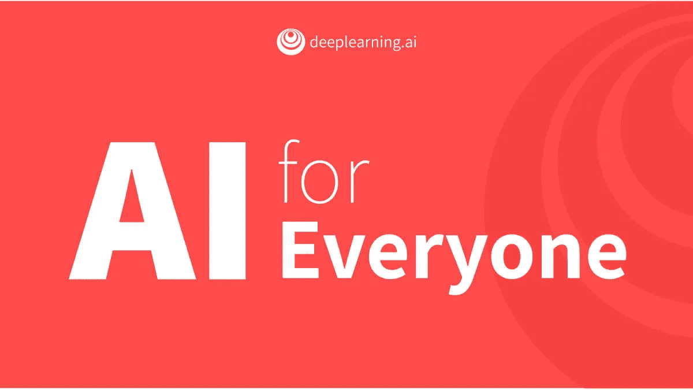
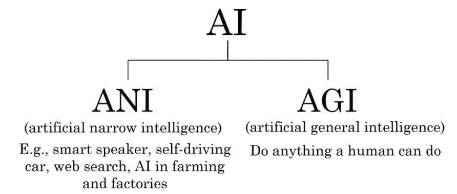
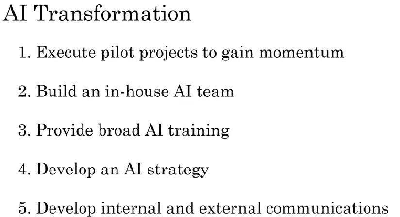

# 《人工智能为每个人》:吴恩达想用 30 分的非技术课程传达什么。

> 原文：<https://towardsdatascience.com/ai-for-everyone-what-andrew-ng-want-to-convey-with-this-non-technical-course-in-30-points-bedaea57c81b?source=collection_archive---------13----------------------->

[Source](https://www.linkedin.com/feed/update/urn:li:activity:6506917687791353856/)

人工智能对每个人来说都是一门非技术性的课程，学习这门课程，你会比世界上大多数 CEO 学到更多的知识。至少吴恩达是这么宣称的。所以让我们简单地了解一下他想传达什么。

*   到 2030 年，人工智能将创造 13 万亿的价值，主要用于零售，其次是旅游和汽车行业。
*   人工智能大致分为人工狭义智能(ANI)和人工广义智能(AGI)。随着 ANI 的大量进步，人们开始错误地相信他们正在 AGI 进步。

*   不要在收集数据的 IT 基础设施上花费太多。尽可能早地向人工智能团队提供数据，以便他们可以判断收集数据是否有用，并可以改变**数据收集策略**。也不是说数据越多，价值越大！
*   机器学习就是学习 A 到 B 的映射，其中 A 是输入，B 是输出标签，而数据科学更多的是从数据中提取见解和结论。机器学习的输出是**软件**，而数据科学的输出是**幻灯片**。
*   深度学习是“神经网络”的品牌名称，这些网络只不过是大型数学方程。神经网络受到大脑的启发，但内部功能几乎与实际大脑的工作方式无关。
*   正如:
    *商场+互联网！=互联网公司* 同理:
    *任何公司+深度学习！= AI 公司。*
*   人类用**一秒钟的思考**所能做的任何问题，以及有大量标记数据可用的问题，都可以用监督的 ML 来自动化。例如——用户是否会点击添加。
*   AI 目前无法感同身受或理解手势。人工智能无法学习少量数据复杂任务。
*   对于机器学习:
    *收集数据，训练模型，部署模型。* 对于数据科学:
    *收集数据，分析数据，建议修改*。
    例如:在招聘中，数据科学将通过分析数据帮助我们**优化招聘流程**。而机器学习可以帮助自动简历筛选。
*   选择对你的生意既可行又有价值的项目。在决定一个项目时，人工智能专家和领域专家应该一起工作。
*   **自动化任务**而不是作业。了解您业务中的**痛点**。
*   即使没有**大数据**也可以进步。
*   除了*业务勤勉和技术勤勉*，还要考虑**道德勤勉**你正在建设的项目是否会给人类带来一些好处。
*   对于人工智能团队，在测试集上指定你的统计接受标准。
*   角色:
    *软件工程师*:像写函数/子程序一样写软件代码。
    *机器学习工程师*:负责创建模型
    *机器学习科学家*:负责扩展技术状态
    *应用 ML 科学家*:介于 ML 工程师和研究员之间的角色
    *数据科学家*:检查数据并提供见解以推动业务决策
    *数据工程师*:确保数据可以以安全且经济高效的方式轻松访问
    *AI 产品经理*

[Source](http://coursera.org/ai-for-everyone)

*   执行相关的**人工智能试点项目**可以设定 6-12 个月的牵引。
*   创建一个中央人工智能团队，并在 **CAIO(首席人工智能官)**的领导下分散到多个业务部门。最初，首席执行官应该向人工智能部门提供资金，而不是阿布提供资金，在初始投资后，人工智能团队必须展示其为业务部门创造的价值。
*   商业领袖必须了解人工智能能为他们的企业做什么。人工智能团队领导应该设定项目方向并监控资源。*内部人工智能工程师应接受人工智能管道方面的培训*。
*   CLO 应该知道如何管理内容，而不是创造内容。
*   只有在执行了一两个项目后才建立人工智能策略，否则它将成为一个学术策略而不是实用策略。不同的公司有不同的策略。
*   **少数据起家的好产品，才会有用户。随着时间的推移，这些用户将生成可用于改进产品等的数据**。
*   **战略数据采集**。不要为了收集有用的数据而将产品货币化。像机器学习工程师这样的新角色应该被提升。
*   **将工程人才与商业/销售人才配对，寻找可行且有价值的项目。**
*   不要期望人工智能项目第一次就能成功，也不要在人工智能项目中执行传统的计划流程。
*   **找朋友学 AI，头脑风暴项目，找导师！**
*   *也不要对 AI 过于乐观*超级智能即将到来。*也不要太悲观*关于 AI 那个 AI 冬天来了！在中间的某个地方！
*   **可交代性**AI 是硬的。
*   AI 可以变成**有偏**有偏数据。
*   人工智能系统对**对抗性攻击**开放。在未来，公司可能会与敌对的攻击者展开战争。
*   **美国和中国**在人工智能方面领先，但这项技术仍然**不成熟**给了其他国家同等的竞争优势。
*   根据麦肯锡公司的报告，到 2030 年，人工智能取代了 4-8 亿份工作，创造了 5 . 55-8 . 9 亿份工作

谢谢你吴恩达！总的来说，我喜欢这个课程，我希望能有更多的人力资源专业人士应该了解像 tensorflow，keras 等工具。但是再一次，很高兴看到吴恩达回来了。最后一个笑话来结束它！

> 为什么 AI 会有那么多令人震惊的结果？
> 
> 因为人工智能是新的电力，
> 
> 电击！！:D

阅读我在 Medium 上的其他文章:

1.  [我的第一次数据科学面试](/my-first-data-science-interview-bccc006ba2c8)
2.  [机器学习:什么、何时、如何？](/machine-learning-what-why-when-and-how-9a2f244647a4)
3.  [卡尔曼滤波面试](/kalman-filter-interview-bdc39f3e6cf3)

关于我:我是一名自动驾驶汽车工程师，专注于使用深度学习为车辆提供智能。请在 LinkedIn 上联系我，这是与人交流的好机会。