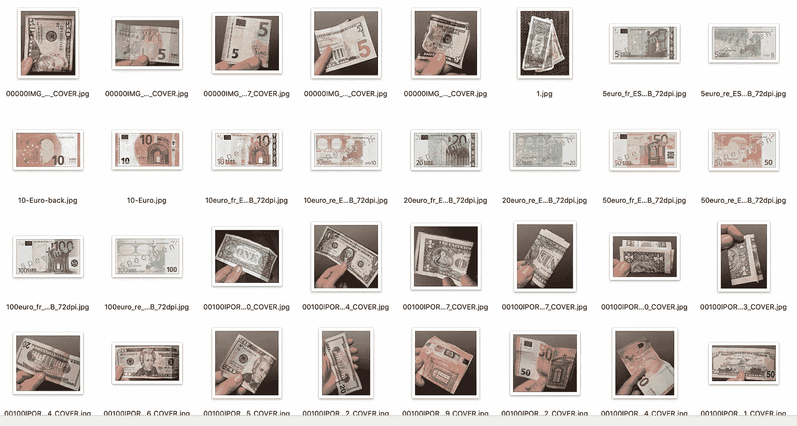
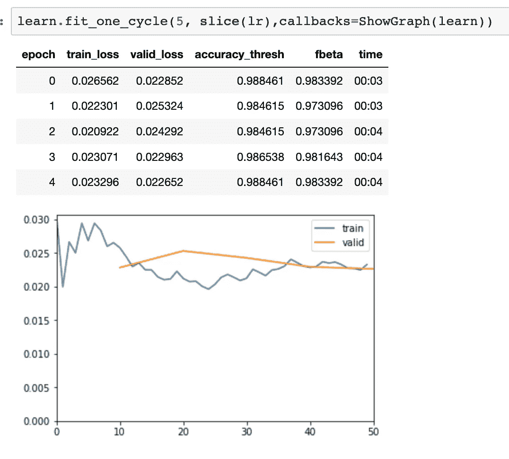
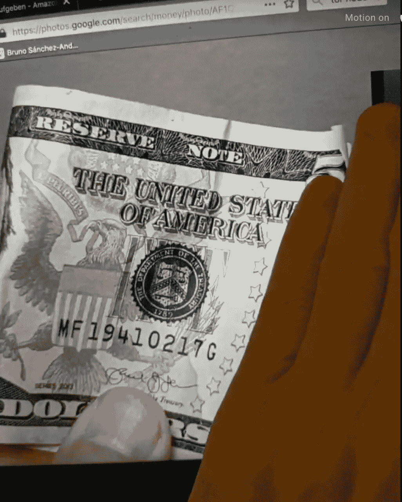

# 人工智能的好处:盲人钞票检测

> 原文：<https://towardsdatascience.com/ai-for-good-banknotes-detection-for-blind-people-373efc81a482?source=collection_archive---------15----------------------->

## 使用深度学习人工智能制作最先进的验钞机的指南

这项服务可以识别钞票是哪种货币(*欧元*或*美元*美元)以及面额(5、10、20、…)。社会影响的目的是帮助盲人，所以我小心翼翼地制作了“现实生活”的训练图像，将钞票握在手里，有时折叠，有时遮住一部分。

> *这篇文章希望有助于鼓励其他人学习深度学习。我在用令人惊艳的* [*fast.ai*](https://www.fast.ai/) *在线免费课程，非常推荐。作为他们务实、自上而下方法的证明，这个附带项目是基于第 3 课。在他们的在线论坛上，你可以找到更多令人惊叹的同学申请。*

我的项目部署在 [iris.brunosan.eu](http://iris.brunosan.eu)

这里有一个推论的例子:


令人惊讶的是，快速、有趣和简单的部分是深度学习部分(恭喜 fastai！)，生产服务器花费了大约 10 倍的时间(我还必须了解一些关于 docker 和无服务器应用程序的细节)。

# 挑战

我发现在识别钞票上做了一些努力来帮助盲人。一些尝试使用[计算机视觉](https://www.sciencedirect.com/science/article/pii/S1319157816300416)和“比例不变特征”(大约 70%的准确率)，一些使用机器学习(准确率高得多)。在机器学习方面，值得一提的是微软研究院去年的一项研究和尼泊尔程序员 [Kshitiz Rimal](https://twitter.com/KshitizRimal) 今年的一项研究，它们得到了英特尔的支持:

*   微软[在去年的人工智能峰会上宣布了他们的版本](https://news.microsoft.com/en-gb/2017/12/13/seeing-ai-can-now-tell-people-with-blindness-which-banknote-they-are-holding/)，“已经被下载了超过 10 万次，并帮助用户完成了超过 300 万项任务。”他们的代码是[可在这里](https://github.com/xiaoyongzhu/SeeingAI-Currency-Detection)(无训练数据)。基本上，他们使用 Keras 和迁移学习，就像我们在我们的课程中一样，但他们不会解冻进行微调，他们会用不相关的图片创建一个“背景”负类(我觉得创建一个负类很奇怪……你怎么能学习“缺席特征”)。他们使用移动友好的预训练网络“MobileNet”在设备上运行检测，每张钞票有 250 张图像(+加上数据增强)。他们有 85%的准确率。
*   来自 Kshitiz 的[尼泊尔版本:总共 14000 张图片(由他拍摄)，准确率达到 93%。他从神经网络的 VGG19 和 Keras 开始，应用程序的“Reach Native”(这是一个可以用相同的代码创建 iOS 和 Android 应用程序的框架)，但后来他转向了 Tensorflow，在每个平台上都有 MobileNetV2 和原生应用程序。这是 6 个月的努力。太棒了。！他在 github](https://software.intel.com/en-us/articles/cash-recognition-for-the-visually-impaired-part-3) 上有训练的代码、应用程序的代码和训练数据[。](https://github.com/kshitizrimal/Cash-Recog-Project/blob/master/Training_Evaluation_Notebook.ipynb)

**我的目标**是复制一个类似的解决方案，但我将只制作一个功能正常的网站，而不是应用程序，也不是设备上的检测(我现在离开这一点)。但是，我将使用不同的架构。由于我想一次做几种货币，所以我想尝试多类分类。我见过的所有解决方案都使用单一类别检测，例如“1 美元”，我想将其分为两个类别，“1”和“美元”。原因是我认为跨货币(所有美元看起来都相似)和跨面额(例如，5 美元和 5 欧元有相同的数字 5)都有一些特征需要学习。共性应该有助于网络强化每个类别的特征(例如，一个大数字“5”)。

# 简单的部分，深度学习

我基本上遵循了 fast.ai 课程中关于[卫星探测](https://github.com/fastai/course-v3/blob/master/nbs/dl1/lesson3-planet.ipynb)的多类课程，没有做太多修改:

## 数据

在现实生活中，很难在单张钞票上获得图像。完成这个项目后，我找到了我上面提到的关于约旦货币的学术论文，以及尼泊尔的项目，它们都链接到了他们的数据集。

我决定依靠谷歌图片搜索和来自欧洲央行和美国造币厂的图片，我知道它们会给我不切实际的好钞票图片。我也用家里的钱拍了一些小面额的照片(可惜我家里没有 100 美元或 500 欧元)。我总共有 14 到 30 张每种面值钞票的图片。一点也不多。我的图像数据集是这里的。



Training images for identifying banknotes, a combination of stock photos and some I made.

由于我没有太多的图像，我使用了参数加宽的数据增强。(我错加了空翻，这可能不是个好主意):

```
*tfms = get_transforms(do_flip=True,flip_vert=True, 
 max_rotate=90, 
 max_zoom=1.5, 
 max_lighting=0.5, 
 max_warp=0.5)*
```

最终，数据集在训练/验证期间看起来是这样的:


Note the effect of data augmentation, rotating, flipping and cropping the images.

用这么少的图像就能得到这么好的结果，真是令人惊讶。

## 培训

我使用 20%的分割进行验证，图像的像素大小为 256，并使用“ [resnet50](https://www.quora.com/What-is-the-deep-neural-network-known-as-%E2%80%9CResNet-50%E2%80%9D) ”作为预训练的模型。在 resnet 冻结的情况下，我做了 15 个时期(每个时期 2 分钟)来训练添加的顶层，并且得到了`. 087 '的 [fbeta](https://en.wikipedia.org/wiki/F1_score) ，已经很不错了。然后解冻，并在 20 个时期内以分段学习率(最后一层的学习率更大)进行更多的训练，以得到` [fbeta](https://en.wikipedia.org/wiki/F1_score) =.098`。我能够通过再次冻结预先训练的模型并做更多的纪元来获得更多的准确性。最好的是“fbeta=0.983”。没有过度拟合的迹象，我使用了默认的辍学参数。



## 导出模型并测试推理。

将模型导出到 PyTorch Torch 脚本进行部署[只是几行代码](https://iris.brunosan.eu/notebooks/Iris.html#Convert-to-PyTorch-model-in-TorchScript-format)。

我确实花了一些时间测试导出的模型，并查看输出(包括原始激活和 softmax。然后我意识到我可以用它来推断自信:

*   积极的原始激活(总是转化为高 softmax)通常意味着高置信度。
*   当没有明确的标识时，会出现负的原始激活但非零的 softmax 概率，所以我可以将它们用作“试探性的替代方案”。

例如，让我们看看这张有问题的 5 美元折叠图片，它覆盖了 5 美元的大部分



A difficult image, folded, and covering most of the number 5 that correctly identifies the denomination.

```
*{‘probabilities’: 
 ‘classes’: [‘1’, ‘10’, ‘100’, ‘20’, ‘200’, ‘5’, ‘50’, ‘500’, ‘euro’, ‘usd’]
 ‘softmax’: [‘0.00’, ‘0.00’, ‘0.01’, ‘0.04’, ‘0.01’, ‘0.20’, ‘0.00’, ‘0.00’, ‘0.00’, ‘99.73’], 
 ‘output’: [‘-544.18’, ‘-616.93’, ‘-347.05’, ‘-246.08’, ‘-430.36’,* ***‘-83.76’****, ‘-550.20’, ‘-655.22’, ‘-535.67’,* ***‘537.59’****], 
*** *‘summary’: [‘usd’]****, 
 ‘others’: {****‘5’: ‘0.20%’****, ‘20’: ‘0.04%’, ‘100’: ‘0.01%’, ‘200’: ‘0.01%’}}*
```

只有类“` usd`”的激活是肯定的(数组的最后一个),但是 softmax 也正确地启动了类“` 5 `”,并对类` 20 '产生了一些疑问。

# 部署

这是最难的部分。

基本上你需要两部分。前端和后端。

*   **前端**是人们看到的，它做的是给你一个页面看(UI 我用 Bootstrap)，代码选择一个图像，最后显示结果。我在前端添加了一些代码，使用 Javascript 在客户端对图像进行缩减采样。原因是现在的相机图片很重，所有的推理过程需要的是一个 256 像素的图像。这是客户端上的 11 行代码，用于[向下采样](https://github.com/brunosan/iris-ai/blob/master/docs/client.js#L112-L123)。由于这些都是静态代码，我在同一个库上使用了 github 页面[。为了将图像发送到服务器，我直接将它们作为](https://github.com/brunosan/iris-ai/blob/master/docs/) [DataURI](https://en.wikipedia.org/wiki/Data_URI_scheme) 传递，而不是将它们上传到某个地方，然后从那里提取。
*   **后端**接收图像，在我们的模型上运行推理代码，并返回结果。是难中之难:)，见下文:

我第一次使用谷歌云引擎(GCE)，按照这里的指示。我的部署代码在这里是[这里是](https://github.com/brunosan/iris-ai/tree/master/iris-GCE)，它包括[上传](https://github.com/brunosan/iris-ai/blob/a503d55a1413c4f8837100cc5732df749d942406/iris-GCE/app/server.py#L87)和保存带有推断类的用户图像副本的代码，因此我可以检查错误的分类，使用它们进行进一步的训练。相当整洁。

总的来说，它很容易部署。它基本上创建了一个 docker，可以部署您需要的任何代码，并根据需要旋转实例。我的问题是服务器总是在运行，实际上至少有两个实例。GCE 意味着非常高的可伸缩性和响应，这很好，但这也意味着我一直在付费，即使没有人使用它。我认为应该是每月 5-10 美元。如果可能的话，我想部署一些不用花太多钱就能长时间在线的东西。

我决定转 AWS Lambda(课程说明[这里](https://course.fast.ai/deployment_aws_lambda.html))。流程看起来比较复杂，但其实没那么难，巨大的好处就是你只需付费使用。此外，就使用水平而言，我们将处于免费层(除了在 S3 上保留模型的成本，这是最低的)。我要部署的代码是这里的。因为您正在部署 Torchscript 模型，所以您只需要 PyTorch 依赖项，AWS 有一个很好的 docker 文件，包含您需要的所有内容。我必须添加一些 python 库来格式化输出和记录日志，它们都在那里。这意味着您实际的 python 代码很少，并且您不需要使用 fastai(在课程线程中，另一名学生[分享了](https://forums.fast.ai/t/share-your-work-here/27676/1394)她的部署技巧，如果您需要将 fastai 也用于部署的话)。

## UX，反应时间。

分类的推断大概需要 0.2 秒，确实很快，但是用户从选择图像到得到结果的整体时间可能长达 30s，甚至失败。额外的时间部分用于将图像从客户端上传到服务器，如果需要的话，在上传之前缩小图像。

在实际测试中，响应时间的中位数是 1s，这是可以接受的…除了第一次，第一次响应有时需要长达 30s。我认为这被称为“冷启动”，对应于 AWS 从存储中取出 Lambda 的时间。为了最小化这种影响，我添加了一些代码，在您加载客户端页面时触发对服务器的 ping。ping 只返回“pong ”,所以不会消耗太多的计费时间，但是它触发 AWS，让 lambda 函数为真正的推理调用做好准备。

# 支持

今年夏天，我在西班牙国家广播电台每周有一个小节目来谈论影响科学，我专门在一集里谈论人工智能及其对就业和社会的影响。我将这个工具作为一个例子。可以听一下(西班牙语，时间戳 2h31m): [朱莉娅恩拉翁达，翁达塞罗](https://www.ondacero.es/programas/jelo-en-verano/programas-completos/jelo-en-verano-21082019_201908215d5d8b9a0cf2370b319a086f.html)。

# 后续步骤

我很想得到你的反馈和想法。或者如果你试图复制它有问题，让我知道。

以下是我为下一次冲刺已经想到的几点:

*   使用类似“MobileNetV2”的移动友好型工具重新训练模型
*   使用尽可能多的货币(和硬币)重新训练模型。随着您添加更多的货币，多类别分类检测面额的好处应该会变得明显。
*   添加服务器代码来上传用户图像的副本，就像我在 GCE 部署中所做的那样。
*   具有设备上推理的智能手机应用。