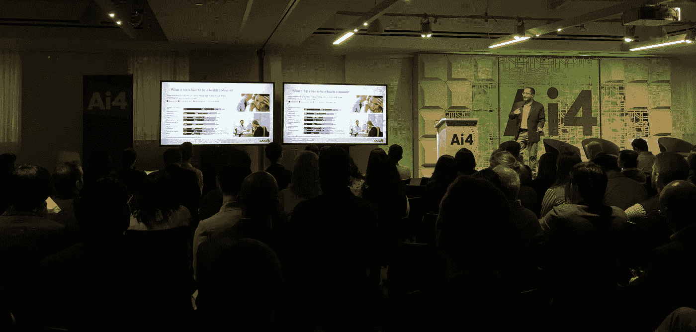
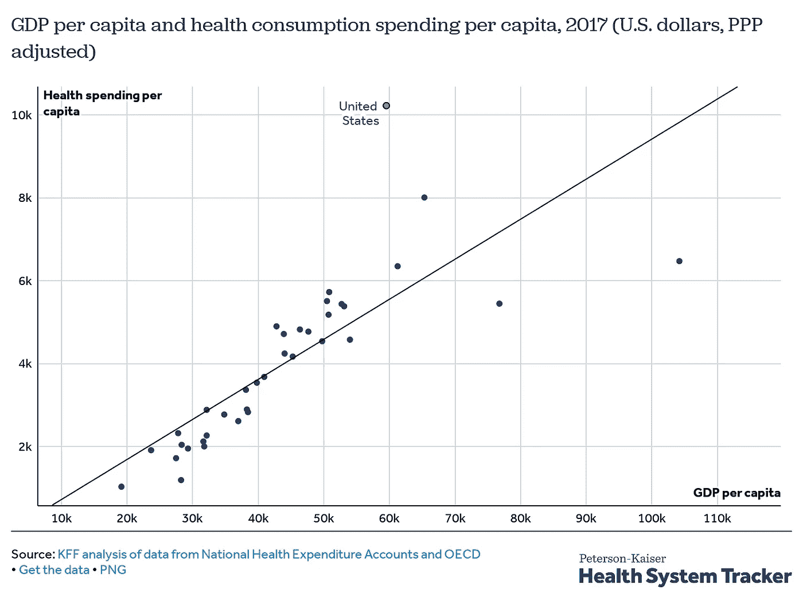
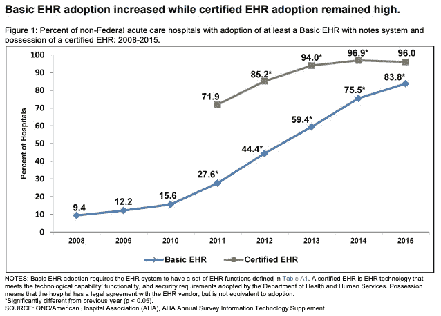
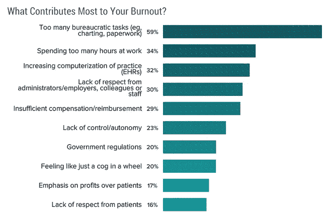
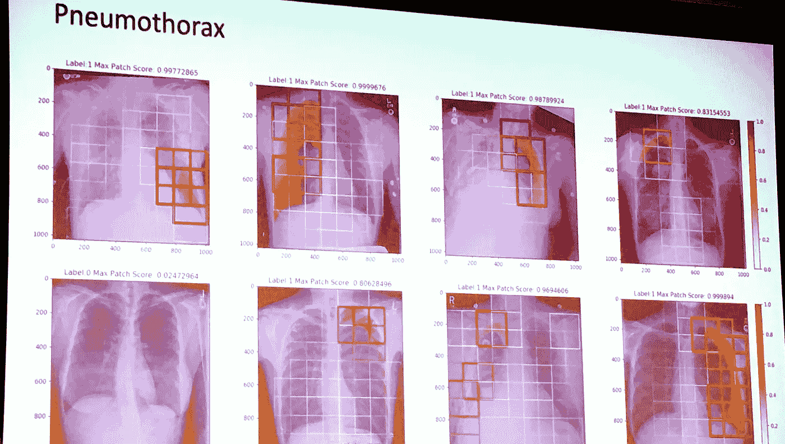
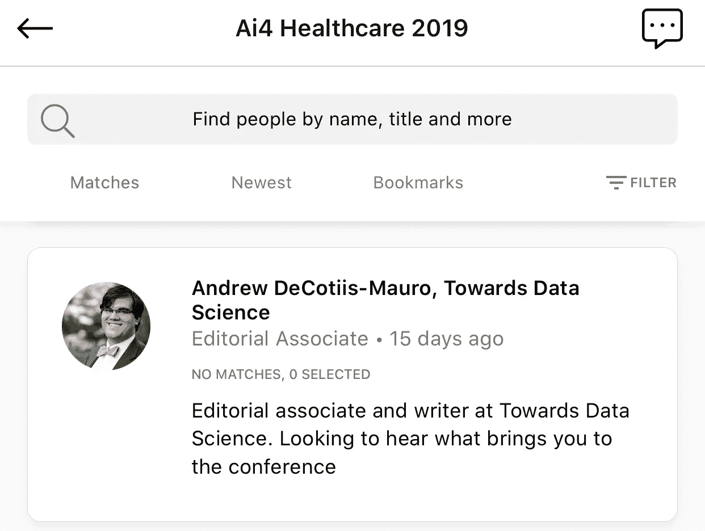
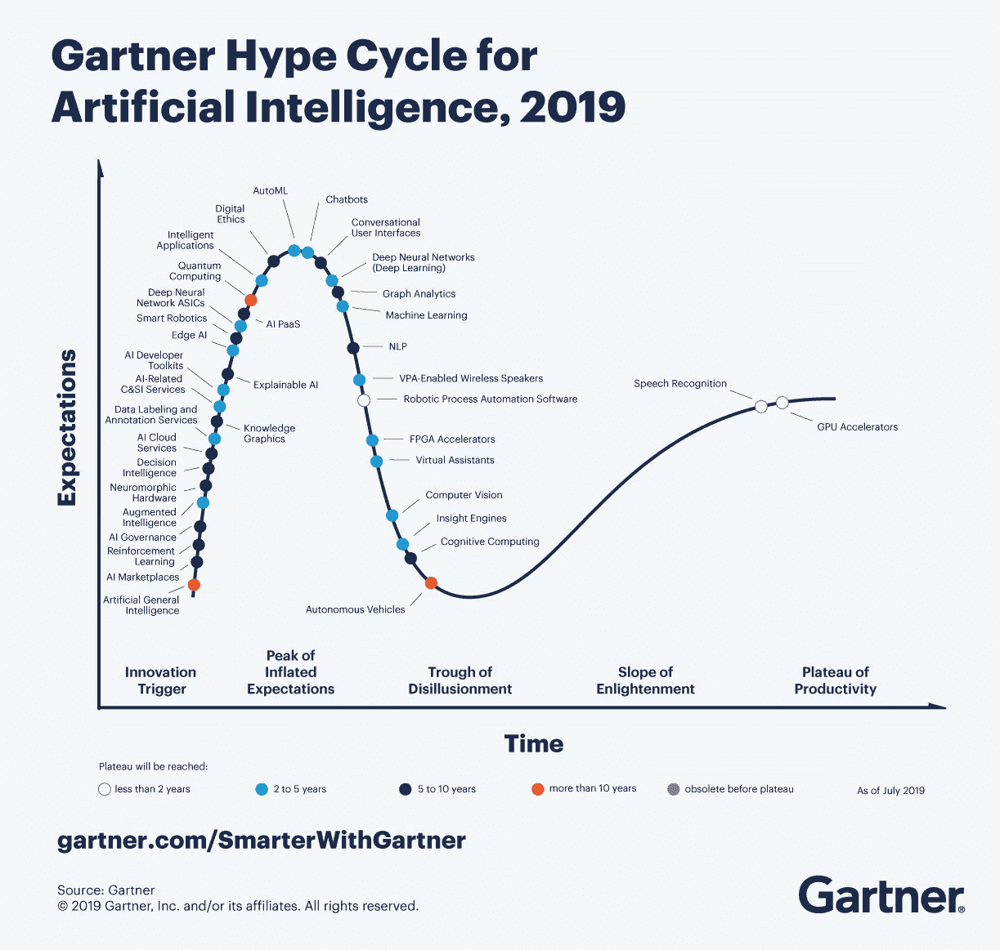

# 面向医疗保健的人工智能

> 原文：<https://towardsdatascience.com/ai-for-healthcare-c975ffad1e8b?source=collection_archive---------18----------------------->

Antique Glass Medicine Bottles. Photo by [Matt Briney](https://unsplash.com/@mbriney)

## 我在 Ai4 医疗保健会议上的经历

当你把内科医生、外科医生、首席执行官、首席技术官、首席运营官、战略总监、产品经理、软件工程师、数据分析师、教授和研究人员聚集在一起讨论人工智能在医疗保健领域的现状时，会发生什么？这就是 Ai4 医疗保健公司的理念。

Ai4 Healthcare 是在纽约举行的为期两天的会议，重点是将数据从业者、医疗临床医生和商业领袖聚集在一起，以促进围绕人工智能在医疗保健中的应用的讨论。此次活动的特色是有 85 位演讲者在，大量的交流机会和[关于参加哪些讲座的技术/非技术“跟踪”指导](https://ai4.io/healthcare/agenda-2019/)。因为我正在为《走向数据科学》写作，而且我自己也是一名工程师，所以我主要关注技术方面的讨论。

我在会议上的观察非常清楚地表明，Ai4 医疗保健代表了所有这些专业人员之间非常需要的对话，以确保临床医生和技术专家的目标一致。我注意到的最常见的目标是:

*   为医生提供更多与患者面对面的时间
*   为患者提供尽可能最好的护理，无论他们在哪里
*   将可解释性构建到临床接受的模型中
*   减少浪费性支出

# 四大亮点

**Building an AI Future that Benefits Patients and Doctors**, Christopher Khoury, American Medical Association. Photo by Andrew DeCotiis-Mauro.

## 造福患者和医生的人工智能未来

想象一个医生可以花大量时间和病人在一起的世界。这对医疗保健领域会有什么影响？如果医生没有压力，医学会受到怎样的影响？如果医疗费用不那么高，病人会怎么样？美国医学协会(AMA)一直在思考实践的这些方面，以及如何将人工智能集成到医学实践中来帮助迈向这样的未来。

**Figure 1:** 2017 Health Spend per Capita. Source: [Health System Tracker](https://www.healthsystemtracker.org/chart-collection/health-spending-u-s-compare-countries/#item-relative-size-wealth-u-s-spends-disproportionate-amount-health)

**Figure 2:** EHR Adoption Rates in the United States. From the [Office of the National Coordinator Health IT](https://www.healthit.gov/sites/default/files/briefs/2015_hospital_adoption_db_v17.pdf).

在美国，人均医疗保健支出约为每年[1 万美元](https://www.healthsystemtracker.org/chart-collection/health-spending-u-s-compare-countries/#item-relative-size-wealth-u-s-spends-disproportionate-amount-health) ( **图 1** )。最重要的是，它的价值是许多富裕国家的两倍，据信[其中大约 25-30%被浪费在各种系统低效上](https://jamanetwork.com/journals/jama/fullarticle/2752664?guestAccessKey=bf8f9802-be69-4224-a67f-42bf2c53e027&utm_source=For_The_Media&utm_medium=referral&utm_campaign=ftm_links&utm_content=tfl&utm_term=100719)。幸运的是，提高效率是数据科学的主要优势之一。我们可能需要首先回答的一个问题是，我们从哪里获得数据？

自从 2009 年[美国复苏与再投资法案](https://en.wikipedia.org/wiki/American_Recovery_and_Reinvestment_Act_of_2009#Healthcare) (ARRA)颁布以来，电子健康记录系统(EHRs)的采用大幅增加(**图 2** )。ARRA 包括了有助于向 EHRs 转变的资金。到 2014 年 1 月，它还将医疗保险报销与电子病历的“有意义使用”挂钩。

虽然使用电子健康记录有一些问题，但是有很多好处。电子病历提供了前所未有的对患者信息的访问——这允许[协调护理、提高诊断效率和更安全的护理](https://www.healthit.gov/faq/what-are-advantages-electronic-health-records)。此外，电子病历还提供了大量信息，可用于提高护理标准，提高护理质量，甚至更早发现疾病爆发。

**Figure 3:** Main sources of physician burnout. [Source: Medscape](https://www.medscape.com/slideshow/2019-lifestyle-burnout-depression-6011056#5)

AMA 关心的另一个问题是医生的健康。医生面临倦怠的比率几乎是普通大众的两倍。**图 3** 根据 Medscape 国家医师倦怠、抑郁&自杀报告( [2019](https://www.medscape.com/slideshow/2019-lifestyle-burnout-depression-6011056) )，突出了倦怠的主要来源。我们面临的首要问题是:过多的官僚任务；工作时间太长；还有 EHRs。

AMA 将术语**增强智能**视为前进的方向。这种人工智能的概念化侧重于以辅助的角色使用人工智能，以强调其设计增强了人类的智能，而不是取代它。增强智能将以机器学习模型为特色，这些模型可以减少临床医生的工作量——通过帮助诊断或减少花费在管理工作上的时间。会议展示了两款旨在减少制图时间的产品——[淑熙](https://www.suki.ai/)和[赛卡拉](https://www.saykara.com/)。

AMA 在他们的网站上有一整块区域致力于人工智能在医疗保健系统中的作用。

## 无论哪里需要，都能提供更好的护理

**AI and the Intersection of Robotics and Surgery**, Prakash Gatta, MultiCare Health System. Photo by Andrew DeCotiis-Mauro.

[pra kash Gatta 医生梦想有一天，无论患者身在何处，都可以获得高质量的标准化外科治疗。Gatta 是机器人辅助手术的支持者(免责声明——他与](https://www.multicare.org/doctors/prakash-gatta/)[动词外科](https://www.verbsurgical.com/)和[直觉外科](https://www.intuitive.com/en-us)合作)。在他对未来的展望中，机器人辅助手术系统提供了一个奇妙的平台，使医院手术设备标准化。

机器人辅助手术有许多好处，包括缩短住院时间、减少疼痛和不适、更快恢复、降低感染风险和减少失血。此外，机器人辅助手术可以通过上述改善的结果和更短的住院时间来降低成本(尽管快速搜索表明其成本是否低于传统的腹腔镜手术仍有争议)。Gatta 展示了一个机器人手术的视频，并描述了在腹腔镜/机器人手术之前，这是一个需要长时间恢复的主要手术。[这里有一段[视频](https://www.youtube.com/embed/-14rh9OJFyo?start=510&end=698&autoplay=0)是 Gatta 展示另一个机器人手术，如果你好奇的话]

与人工智能的联系来自机器人产生的数据。正如 Gatta 指出的，每一个动作都是一个数据点。他设想未来机器人能够预测外科医生的下一步行动，要么提供反馈，要么为手术的下一步做准备。此外，他认为该系统可以根据手术进行的方式实时预测结果。例如，机器会知道手术中一个特别重要的步骤比外科医生的平均时间多或少，从而提供有价值的预测数据。

综上所述，手术设备的未来标准化和强大数据的整合可以用来推动护理标准的发展。也许，随着时间的推移，Gatta 获得护理的梦想将会实现。

## 注释的可解释人工智能

当算法显示医学图像有恶性肿瘤时，会发生什么？放射科医生应该盲目相信结果吗？为什么放射科医生一开始就应该相信一个预测模型呢？

这是一个在会议上反复出现的问题——我觉得在一个名为*的演讲中，这个问题至少得到了部分解决，这个演讲的主题是 Evan Schwab 在飞利浦所做的工作*。

医学图像，如胸部 X 射线(CXR)、磁共振成像(MRI)或计算机断层扫描(CT)，在计算机视觉领域提出了独特的挑战。虽然对象在图像中的定位是一致的，但是可用的训练图像的数量是有限的，并且当它们可用时，它们通常具有有限的注释。此外，正确的风险很高——可能和某人的生命一样高。

最终目标是创建一个端到端的管道，该管道在胸部 X 射线中准确地自动分类和定位关键发现，而无需对局部地面实况进行注释(“强”注释)。

来自麻省理工学院[模拟胸部 X 射线数据库](http://news.mit.edu/2019/mimic-chest-x-ray-database-0201)的图像使用自然语言处理(NLP)进行标记，以提供“弱”注释，即该 CXR 患有气胸。这些图像然后使用[小块采样](https://www.researchgate.net/figure/Image-patch-sampling-process-The-original-WSI-with-manual-annotations-from-pathologists_fig2_263052166)(以保持图像分辨率)进行处理，并被输入预先训练好的[卷积神经网络](https://en.wikipedia.org/wiki/Convolutional_neural_network) (CNN)。使用[多实例学习](https://en.wikipedia.org/wiki/Multiple_instance_learning)框架，该模型能够组合来自每组补丁的信息。

得到的预测允许图像的逐块分类。这提供了可解释性，因为在可以呈现给放射科医师的 CXR 中指示了预测具有恶性肿瘤的区域，从而允许放射科医师确定模型的准确性。下面是这次谈话的部分结果。

Annotated Chest X Rays from Evan Schwab’s presentation **Explainable AI for Training with Weakly Annotated Data**. Each chest X Ray is overlaid with grids indicating the probability of pneumothorax, with white indicating low probability of disease and thick red boxes indicating high probability of disease. Ground Truth is shaded in red/orange. Image altered to show details more clearly. Photo by Andrew DeCotiis-Mauro.

## 会话

在整个会议过程中，我尽力与尽可能多的人进行简短的交谈。我想知道是什么让他们来参加会议，他们的角色以及他们已经走了多远。会议组织者通过提供对社交应用程序 [Brella](https://www.brella.io/) 的访问来帮助每个人，并将建立社交网络纳入日程。

Brella had a section for requesting meetings with other attendees. I thought I’d try to use it to learn more about what drew people to the conference.

布雷拉让像我这样内向的人很容易就能要求与我可能没有机会见面的人见面。同样，我设计了我的个人资料，看看我是否能吸引一些其他与会者告诉我他们的故事。

我在这个领域遇到了一些非常有趣的人。他们从全国各地赶来参加会议——加利福尼亚、亚利桑那、罗德岛、康涅狄格、费城，甚至还有一个来自我工作的地方——他们来的原因各不相同。

这是我遇到的人:

*   几名外科医生:两名心脏外科医生对将人工智能引入他们的部门感兴趣，第三名是一名[神经介入外科医生](https://www.pacificneuroscienceinstitute.org/people/ambooj-tiwari/)除了将大数据收集的信息应用于医院信息系统以发现医疗保健难题的新方向外，还希望将这些信息融入他们的思维模式。
*   一位来自[眼科成像](http://A4BF1538C)公司的项目经理，他有兴趣了解更多关于人工智能在医疗保健中的应用。
*   一位来自医疗保健[非营利](https://c-path.org/)的健康数据分析师希望看到人工智能在实地的实施。
*   一位来自[纽约一家医院](https://www.nyp.org/)的数据科学家是该领域的新手，他的经理鼓励他参加并了解更多信息。
*   NLU 一家保健品公司的首席采购官作为赞助商出席了会议。
*   一家[制药公司](https://www.merck.com/index.html)的管道数据科学家。我们讨论了数据科学在制药流程中的作用。

**Figure 4**: The AI hype cycle for 2019\. From [Gartner](https://www.gartner.com/smarterwithgartner/top-trends-on-the-gartner-hype-cycle-for-artificial-intelligence-2019/).

*   离我不远的一家生物医学技术公司的数字信息学主管。我们讨论了该技术如何仍然处于[炒作周期](https://www.gartner.com/smarterwithgartner/top-trends-on-the-gartner-hype-cycle-for-artificial-intelligence-2019/)中，并且还有其他技术，如计算机辅助检测(CAD)用于乳房 x 线照相术，也有类似的承诺，但未能实现(图 4)。
*   对因果关系感兴趣的健康数据科学家。(我只看到一个演讲提到因果关系是数据科学的第三次浪潮。)他担心的是，虽然数据科学通常专注于相关性，但强调因果关系对于让医生接受这项技术极其重要。这将与医生的教育方式联系起来。

# 结论

我发现这次会议是一次奇妙的经历。我相信它为医疗保健和人工智能所有领域的专业人士之间的对话提供了一个绝佳的机会。我交谈过的一些与会者告诉我，这个会议是他们参加过的唯一一个如此高度集中的会议。

这种高度集中的性质——以及与会者和发言者的多样性——为就人工智能在医疗保健领域的现状及其潜在未来进行诚实的对话提供了一个强大的背景。

## 关于作者

我是一名人工智能爱好者和软件开发人员。作为一名训练有素的化学家，在成为一名教师之前，我的大部分化学生涯都是在计算生物物理化学领域度过的。通过教学，我学会了讲故事的重要性和艺术以及清晰的技术写作。在 [LinkedIn](https://www.linkedin.com/in/akdcm/) 上与我联系，或者在 [Twitter](https://twitter.com/kaumaron) 上开始对话。

如果你在医疗保健和人工智能领域，想合作写一篇文章，请告诉我。