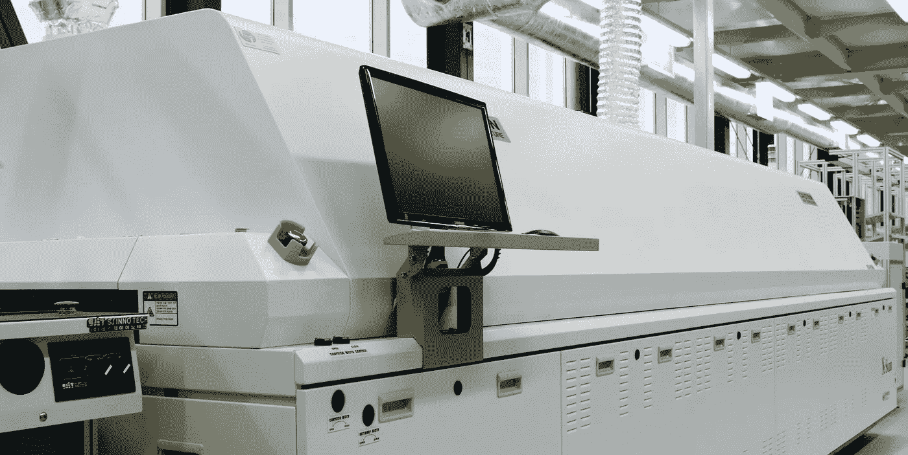
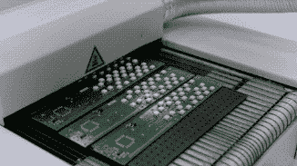
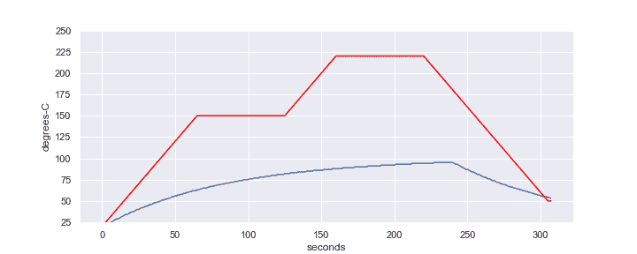
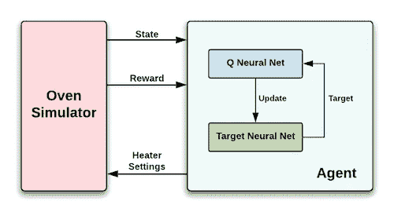

# 工业过程控制的人工智能

> 原文：<https://towardsdatascience.com/ai-for-industrial-process-control-ee774267094b?source=collection_archive---------13----------------------->

## 使用强化学习来调整过程炉

Figure 1\. Reflow Oven

确定工业过程的最佳控制设置可能很困难。例如，控件可以交互，调整一个设置需要重新调整其他设置。此外，控件与其效果之间的关系可能非常复杂。这种复杂性对于优化工艺来说是具有挑战性的。本文探索了一种用于控制工业传送带式炉的强化学习解决方案。

## 介绍

这类设备的一个例子是用于将电子元件焊接到电路板上的回流焊炉(图 1 和图 2)。烤箱有一个传送带，将产品传送通过多个加热区。该过程根据确保可靠焊接连接所需的精确温度-时间曲线加热产品。

Figure 2\. Product Exiting Oven

本文讨论的回流焊炉有八个加热区，每个加热区都有一个控制装置，用于设置加热区加热器的温度。当产品通过烤箱时，传感器会记录大约 300 点的温度。每个点的温度由从加热器传递到产品的热量决定。

## 强化学习解决方案

操作员通常采取以下步骤来学习加热器设置:

*   让产品通过烤箱一次
*   根据传感器读数观察温度-时间曲线
*   调整加热器设置(希望)改善轮廓
*   等待烤箱稳定到新的设置
*   重复此程序，直到传感器读数的曲线可接受地接近所需的曲线

强化学习系统用两阶段过程代替了操作员步骤。在第一阶段，智能代理学习烤箱的动态，并创建一个在各种烤箱条件下更新加热器设置的策略。

在第二阶段，代理按照学习到的策略寻找最佳加热器设置。这些设置将在实际产品曲线和所需的温度-时间曲线之间产生最接近的匹配。图 3 显示了代理按照策略寻找最佳设置。红色轨迹是所需的温度-时间曲线，蓝色轨迹是代理发现最佳加热器设置时的实际曲线。

Figure 3\. red: desired profile — blue: actual profile

## 代理人

由于通过烘箱需要相当长的时间(> 300 秒)并稳定烘箱(许多分钟)，因此使用烘箱模拟器来大大加快该过程。模拟器模拟烤箱对产品的加热作用。

在第一阶段的每个步骤中，强化学习代理将八个加热器的设置传递给模拟器。模拟运行后，模拟器返回产品温度读数(大约 300 个读数，间隔 1 秒)。

代理使用选择的读数来确定系统的状态。它还通过比较返回的读数和期望的温度-时间曲线之间的差异来计算当前运行的回报。如果当前运行的差异小于先前运行的差异，则奖励为正；否则为负。奖励用于更新策略。

Figure 4\. Reinforcement Learning System

在重复该过程数千次之后，代理将已经学习了在各种烤箱条件下更新加热器设置的广泛策略。在第二阶段，代理遵循学习到的策略来寻找最佳加热器设置，该设置将在实际产品曲线和期望的温度-时间曲线之间产生最接近的匹配。

## 更深的潜水

项目中使用的强化学习系统使用双 Deep-Q 模型，该模型包含两个神经网络和经验重放。在第一阶段过程之后，其中一个神经网络保存代理在第二阶段使用的学习策略。要了解更多细节，请查看本文末尾引用的论文。

[1]: van Hasselt，h .，Guez，a .，Silver，D. **采用双 Q 学习的深度强化学习。** arXiv 预印本 [arXiv:1509.06461](https://arxiv.org/abs/1509.06461v3) ，2015。

[2]: Mnih 等，**通过深度强化学习实现人级控制。**自然，518(7540):529–533，2015。[ [Deepmind](https://deepmind.com/research/publications/human-level-control-through-deep-reinforcement-learning)