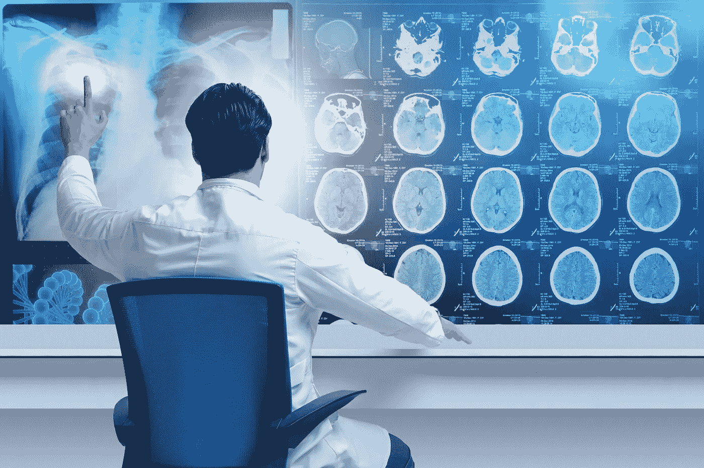
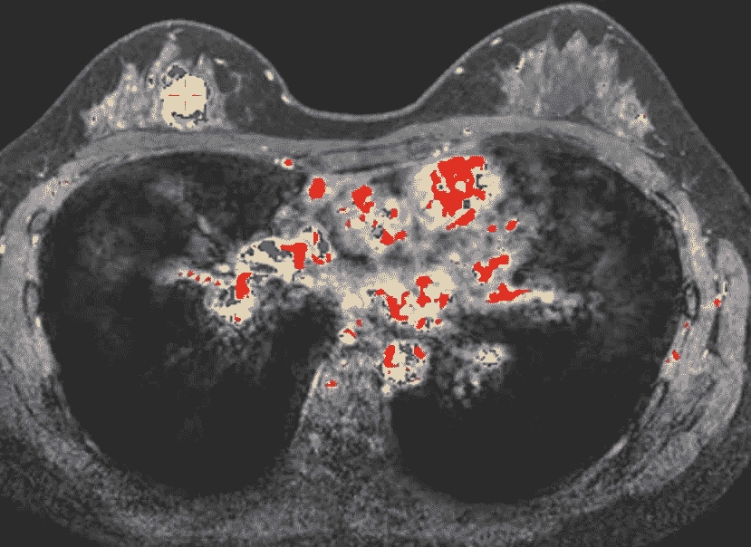
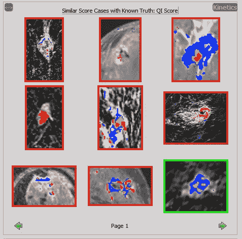
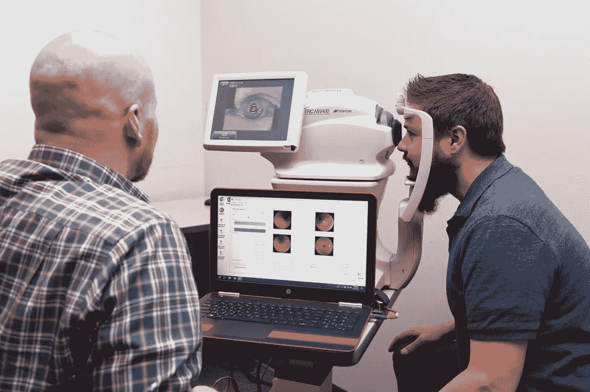
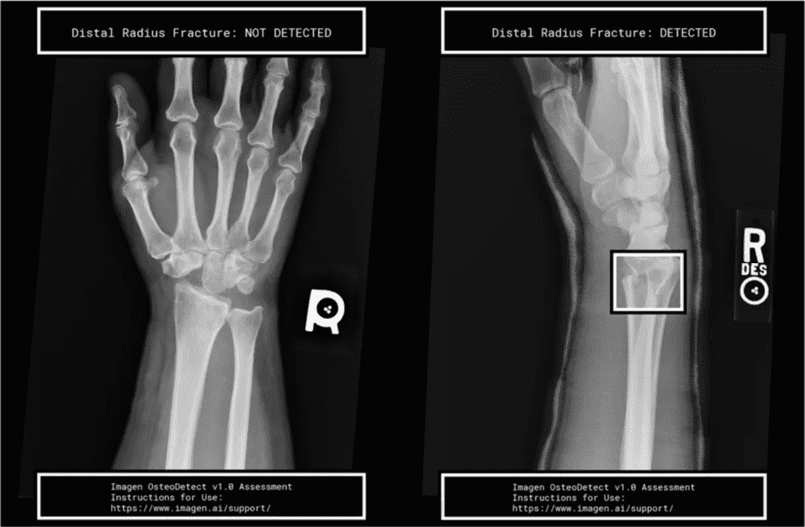
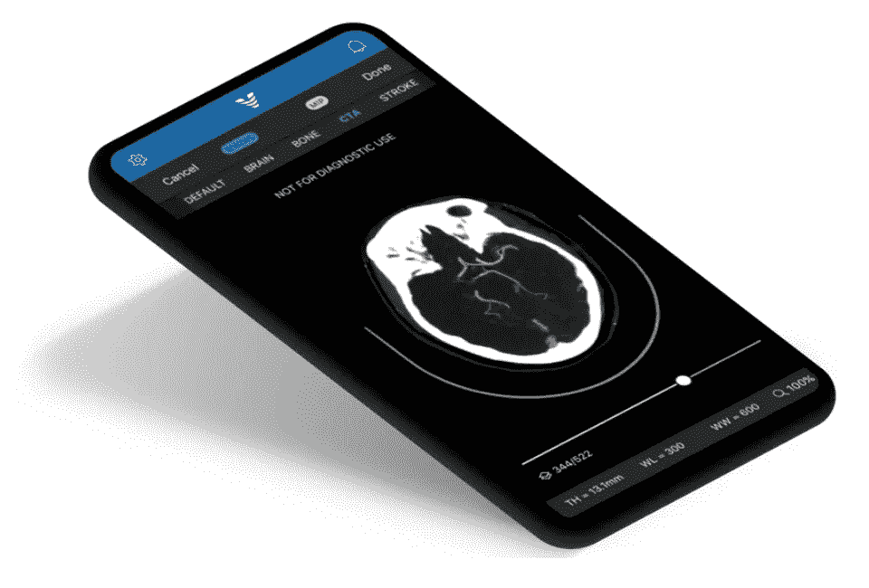
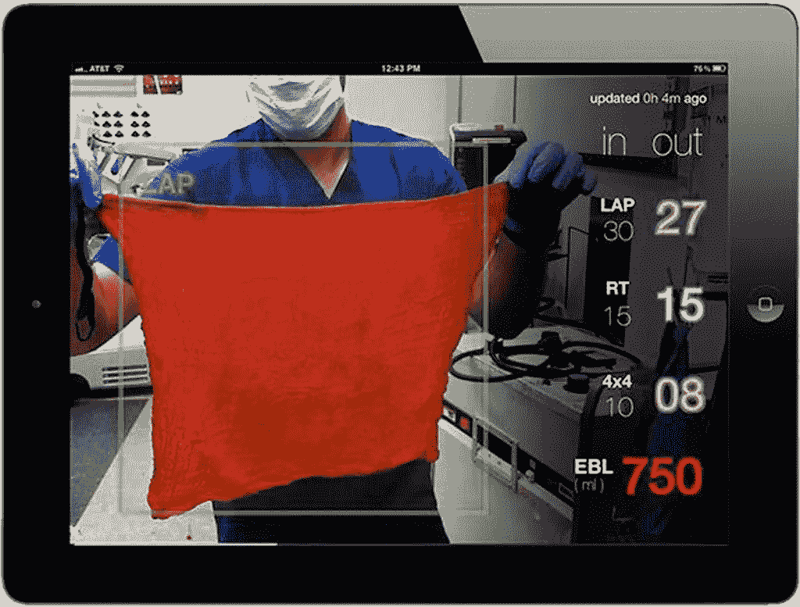

# 人工智能在医学成像中的应用——现在？

> 原文：<https://towardsdatascience.com/ai-for-medical-imaging-now-8fad32c4c96b?source=collection_archive---------9----------------------->

## “医生”现在可以见你了…

解读医学成像(x 射线、CT、MRI)扫描是一项高技能的手工工作，需要多年的培训。[对影像的需求超过了合格放射科医生的供应](https://www.cancerresearchuk.org/sites/default/files/horizon_scanning_-_final.pdf)随着新兴市场人口老龄化和医疗保健技术解决方案的普及，这一趋势可能会持续下去。人工智能和计算机视觉准备好提供帮助了吗？

> 计算机第一次可以在没有医生解释的情况下诊断病人。

人工智能和计算机视觉长期以来一直被视为更快、更准确诊断的基础。医疗器械认证和验证的严格监管要求意味着新技术进入一线临床实践可能会很慢。然而，基于深度学习的决策支持工具正在获得认可，其中一些已经在诊所和医院中使用。在这篇文章中，我们将检查六种已经被批准用于临床的产品，看看它们的上市路线和任何公开的潜在算法的细节。

所有医疗软件——包括人工智能决策支持工具——都必须符合相关标准。认证可能是一项昂贵的工作，需要临床试验来证明安全性和有效性。

在决策支持软件的监管分类方面，美国医疗器械法规(FDA)比英国(MHRA)更具体(也更清晰),分为两组:

*   计算机辅助检测(CADe):支持诊断的工具，但积极地让医生参与到这个过程中来——例如通过突出扫描图像中的关键区域。
*   计算机辅助诊断(CADx):旨在提供可操作诊断的技术，例如通过将病变定性为良性或恶性肿瘤。

大多数 CAD 产品不得不经过漫长的*上市前授权* (PMA)再到*产品所需的认证*。[最近的 FDA 指南](https://www.itnonline.com/content/fda-proposes-reclassify-some-types-radiology-image-software-analyzers)稍微放宽了规则，某些类别的医学成像分析软件将被允许使用更简化的 510[k]途径。

在*重新*分类请求之后，被分类为 I 类或 II 类至的设备可用作未来*上市前通知* [ [510(k)](https://www.fda.gov/premarket-notification-510k) ]提交的谓词。

让我们来看看一些已经被批准用于临床的人工智能和机器视觉技术:

## QuantX(定量分析)

这种计算机辅助诊断(CADx)软件帮助放射科医生使用磁共振成像(MRI)评估和描述乳房异常。除了使用图像分割突出感兴趣的区域之外，还计算与恶性肿瘤可能性相关的专有度量( *QI 得分’*)

*   具有特殊控制的二类医疗器械
*   FDA 法规:21 CFR 892.2060
*   途径:重新开始([EN170022](https://www.accessdata.fda.gov/cdrh_docs/reviews/DEN170022.pdf)2017)

Quantx highlights area of interest in a magnetic resonance imaging scan

经审查，该软件被归类为二类医疗设备，并有额外的“特殊控制”——其中一项是监控使用情况，并证明使用该软件比独立诊断提供了更高的检测率。

Screenshot from QuantX showing similar cases with known outcomes

一旦识别出病变，该软件就会执行自动图像分割——尽管这似乎是使用传统的图像处理方法，而不是基于深度学习的工具，如 Mask R-CNN。

从病变区域提取图像特征，例如球形度、均匀性、体积、对比度，并且基于机器学习的分类器确定 QI 分数和可能的预后。也可以查询包括来自已知结果的患者的扫描的库，并且回顾最相似的病例。

## 深度人工智能(iCAD 公司)

这款 CADe/x 软件可分析乳房 x 光片中疑似癌症的病灶。乳房断层合成扫描产生一组 2D 图像，每个图像都是身体的一个狭窄横截面。感兴趣的区域从单独的平面中提取出来，并混合在一起，因此它们作为单个图像可见。临床研究表明，使用该软件后，检测率提高了 8%。

*   [第二类医疗器械](https://www.accessdata.fda.gov/scripts/cdrh/cfdocs/cfpcd/classification.cfm?id=5459)
*   FDA 法规:21 CFR 892.2090
*   途径:510(k)实质等同
*   CE 认证(适用于欧盟)

ProFound AI presents detections and Certainty of Findings scores for soft tissue density and calcifications in mammography

在分析过程中，该算法使用深度卷积神经网络对每幅图像中的大量小块(256 x 256 像素)进行分类。使用了四个类别:正质量和负质量，正建筑变形和负建筑变形。

延伸阅读: [*从数字乳房断层合成中检测软组织密度:传统和深度学习方法的比较*](https://www.icadmed.com/assets/sfyy2016b.pdf)

## IDx-DR

这个 CADx 软件程序分析眼睛的图像，寻找糖尿病视网膜病变的迹象。至关重要的是，IDx-DR 是第一款无需临床医生解释图像或结果即可提供筛查决定的授权设备。这使得通常可能不涉及眼睛护理的卫生保健提供者可以使用它。

*   具有特殊控制的二类医疗器械
*   FDA 法规:21 CFR 886.1100
*   途径:从头开始([EN180001](https://www.accessdata.fda.gov/cdrh_docs/reviews/DEN180001.pdf)

IDx-DR is the first device for screening diabetic retinopathy that does not requrie a clinician to be present

糖尿病视网膜病变是超过 3000 万美国糖尿病患者中视力丧失的最常见原因，也是工作年龄成人视力损害和失明的主要原因。

IDx-DR 被授予[突破性设备](https://www.fda.gov/medical-devices/how-study-and-market-your-device/expedited-access-pathway-program)称号，这意味着 FDA 在高效设备开发方面为该公司提供了密集的互动和指导，以加快证据生成和该机构对设备的审查。

## 骨骼检测(Imagen 技术公司)

OsteoDetect 是一种软件，它使用机器学习技术分析手腕 x 光照片(X 射线)，以识别和突出显示桡骨远端骨折。

*   具有特殊控制的二类医疗器械
*   FDA 法规:21 CFR 892.2090
*   途径:重新开始([EN180005](https://www.accessdata.fda.gov/cdrh_docs/reviews/DEN180005.pdf)2018)

Osteodetect highlights distal radius fractures in x-ray images

深度卷积神经网络用于检测算法。 [U-net](https://arxiv.org/abs/1505.04597) 架构用于分割图像，并生成疑似骨折位置的热图。这被叠加在原始图像上以显示给用户。

延伸阅读: [*深度神经网络提高临床医生骨折检出*](https://www.pnas.org/content/115/45/11591/tab-article-info) 。

## 联系人(即 ai)

ContacCT 是一种人工智能算法，用于分析计算机断层扫描(CT)图像，以获得指示潜在中风的生物标志物。该软件使用深度学习来识别扫描中的大血管闭塞(LVOs)。在治疗中风时，时间尤其重要，因此一款手机应用程序可以直接向临床医生提供通知。

*   具有特殊控制的二类医疗器械
*   FDA 法规:21 CFR 892.2080(2018 年 2 月)
*   途径:从头开始([EN170073](https://www.accessdata.fda.gov/cdrh_docs/pdf17/DEN170073.pdf)
*   CE 认证(适用于欧盟)

Viz.ai have developed a mobile app to get results to clinicians more quickly

虽然底层实现的细节很难获得，但该系统似乎使用卷积神经网络进行图像分割

## Triton(高斯外科)

我们的最后一个例子是一个基于 iPad 的机器视觉系统，它使用摄像头来估计手术过程中从手术海绵和敷料中收集的失血量。虽然本质上不是医学成像，但这是机器视觉应用于临床环境的一个有趣例子。

*   第二类医疗器械
*   FDA 法规: [21CFR880.2750](https://www.accessdata.fda.gov/scripts/cdrh/cfdocs/cfcfr/cfrsearch.cfm?fr=880.2750) (2018)
*   途径:510(k)实质等同

Triton estimates the blood loss absorbed into dressings and sponges using machine vision

传统上，外科手术中的失血量通过以下方式估算:

*   海绵和敷料的人类视觉评估，或
*   在天平上称重并减去干质量。

这两种方法都不完美，而且很难考虑到其他可能扭曲结果的液体的影响，如盐水。

Triton 系统通过使用比色图像分析算法和基于云的机器学习来量化手术海绵和敷料从患者体内取出时的血红蛋白(Hb)质量，[提供比称重更准确的结果](https://pdfs.semanticscholar.org/1076/2addd7917871f6e86a059b118ca07370da41.pdf)。

计算机辅助诊断将对医学成像产生越来越大的影响。也许在某些时候，用肉眼解释扫描结果的想法会显得古怪，甚至不安全。

人工智能医疗设备的认证途径越来越为人所知。过多的预测设备和来自监管机构的新指导可能意味着下一代决策支持系统有更容易的上市途径。

你有什么想法？您使用过这里描述的设备吗？在下面给你留言吧！

> [*Rupert Thomas*](https://twitter.com/rupertthomas) *是一名技术顾问，专门研究机器学习、机器视觉和数据驱动产品。*[*@ Rupert Thomas*](https://twitter.com/rupertthomas)

## 进一步阅读

[医疗设备中的人工智能——三个新兴行业应用](https://emerj.com/ai-sector-overviews/ai-medical-devices-three-emerging-industry-applications/)

[FDA 对医学图像解读中机器学习的观点更新](https://cdn.ymaws.com/siim.org/resource/resmgr/mimi18/presentations/18cmimi-sahiner.pdf) (PDF)

[人工智能驱动& FDA 批准的医疗健康项目](https://medium.com/syncedreview/ai-powered-fda-approved-medical-health-projects-a19aba7c681)