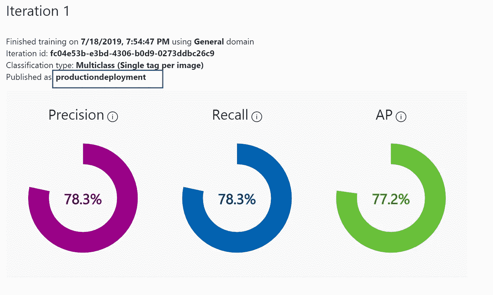

# 由微软授权的 AI for One，AI for All。

> 原文：<https://towardsdatascience.com/ai-for-one-ai-for-all-empowered-by-microsoft-c73c75c51fba?source=collection_archive---------34----------------------->


我在交通信号灯处回复一封来自客户的电子邮件，我妻子理所当然地不喜欢它。她分享了一些最近的统计数据，这些数据显示有人在开车时试图使用手机而丧生或受伤。我想要一个量化的数字，当我在网上搜索时，新西兰的交通官员说，司机因手机分心造成的道路死亡和伤害的社会成本明年可能达到 1800 万美元(T1)，比 1998 年增加了五倍多。如果你正在读这篇文章，下次你想在开车的时候伸手拿手机，请不要。**家里有人在等你。**

因此，我今天的自定义视觉示例！

我们将创建一个分类模型来帮助区分两类图像。一类是开车时打电话的人，另一类是开车时不打电话的人。

我想带你了解一下:由微软提供并托管在 Azure 上的[定制视觉服务](/customvision.ai)，它是[认知服务](https://azure.microsoft.com/en-us/services/cognitive-services/)套件的一部分。

认知服务提供了几个特定的人工智能或机器学习任务，通过 API 作为服务提供，我们可以使用 REST API 将其集成到 web、移动和桌面应用程序中。


Custom Vision portal

“登录”并同意条款和条件。


Create a new project


Details of the project

创建新的资源组。


在项目中使用新创建的资源组。


我们将创建一个分类项目，并将使用多类分类类型。

如果您使用某个特定的域，域选择会有所帮助。

点击“创建项目”


我试着下载了很多图片(大约 50 张),并用一个 chrome 插件来帮我完成这项艰巨的工作

这是我用的: [Fatkun 批量下载](https://chrome.google.com/webstore/detail/fatkun-batch-download-ima/nnjjahlikiabnchcpehcpkdeckfgnohf?hl=en)

网上还有很多。

将图像下载到您电脑上的文件夹中。

选择所有并上传所有的图片，如下所示。


一旦你点击打开，所有的图片将如下。

我正在添加人们开车时使用手机的图像。


Adding a tag to ‘classify’ this class of images

我正在下载的下一个类是人们不用手机开车的图像。


Google image search to the rescue as usual!

遵循相同的过程，但使用不同的标签，如下所示。


我正在使用上面的标签，请随意使用任何标签。当你标记图像时，你正在做的是说“这些图像属于这个类”


下一步是通过顶部的绿色按钮训练模型，一旦完成，将向我们显示一些预期模型性能的统计数据。


单击顶部的“Train ”,并为本演练选择“Fast Training”。

培训的结果。


See the two tags with the various model statistics

选择图片时要记住的一件重要的事情是确保图片有不同的背景，从不同的角度拍摄等等。


点击“快速测试”。

我下载了一个随机图像(不包含在您的训练集中)


正如你所看到的，它检测到司机开车时没有使用手机！

因此，在 30 分钟的时间里，您已经训练了您的分类器模型并测试了该模型！

现在让我们用一张使用手机的人的照片来试一试这个模型。


image of a person using a mobile phone

所以，现在我们可以看到我们的模型正在工作！

下一步是为它创建一个应用程序。

点击下面突出显示的“发布”。


为您的端点命名:


该名称在截图中突出显示，如下所示



productiondeployment

**获取网址和预测键**

一旦您的模型已经发布，您可以通过选择**预测 URL** 来检索所需的信息。这将打开一个对话框，显示使用预测 API 的信息，包括**预测 URL** 和**预测键**。


getting the prediction key and the URL

# 创建应用程序

1.  在 Visual Studio 中，创建新的 C#控制台应用程序。
2.  使用以下代码作为 **Program.cs** 文件的主体。

更改以下信息:

*   将`namespace`字段设置为项目的名称。
*   用之前检索的键值替换占位符`<Your prediction key>`。
*   将占位符`<Your prediction URL>`替换为您之前检索到的 URL。

# 运行应用程序

运行该应用程序时，系统会提示您在控制台中输入图像文件的路径。然后将图像提交给预测 API，预测结果作为 JSON 格式的字符串返回。我要给它下图。


mobile phone usage while driving

我的 JSON 响应应该显示图像包含使用电话的司机的可能性更高。

如果你看到下面的回应；您可以清楚地看到 JSON 输出如何显示图像属于标签类:" **usingphonewhiledriving** "

```
Enter image file path: C:\Users\Nimish Rao\Desktop\mobilphone.jfif
{"id":"a210442b-01bb-4b1c-930a-c00db2b666ea","project":"5c6c2d62-3f00-45a8-be5f-ebb88d4e04be","iteration":"fc04e53b-e3bd-4306-b0d9-0273ddbc26c9","created":"2019-07-19T12:09:10.845Z","predictions":**[{"probability":0.9983218,"tagId":"1cc5723f-9033-4e16-a713-02a8cf3117b5","tagName":"usingphonewhiledriving"},**{"probability":0.00167823618,"tagId":"3aab49f8-9852-4d90-8a5d-28f66c753d2b","tagName":"notusingphonewhiledriving"}]}Hit ENTER to exit...
```

这样，您就有了:您自己的控制台应用程序，它可以拍摄图像，并使用您训练的模型为您提供分类输出！

只有铁杆人工智能专家才能使用的功能现在可以由更广泛的开发人员通过云订阅来访问。 ***那就是 AI for everyone，由*** [***微软***](https://medium.com/u/940e606ec51a?source=post_page-----c73c75c51fba--------------------------------) ***授权。***

给你读点东西:

*   计算机视觉服务文档:
    [https://azure . Microsoft . com/en-us/services/cognitive-services/computer-Vision/](https://azure.microsoft.com/en-us/services/cognitive-services/computer-vision/?source=post_page---------------------------)

注意:这里表达的观点是我个人的，不代表我的雇主的观点。

*请注意:我对定制视觉模型或帖子中使用的任何图像没有任何权利，我使用的是在线图像。*