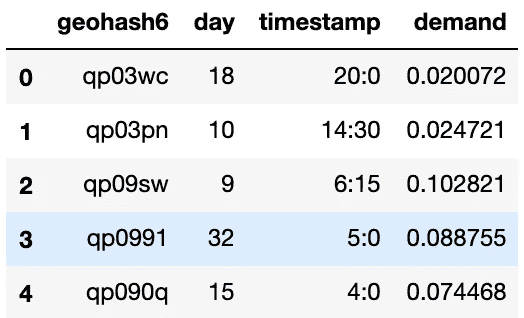
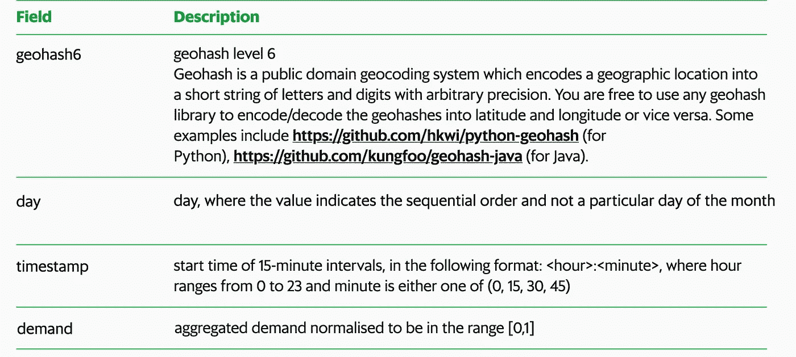
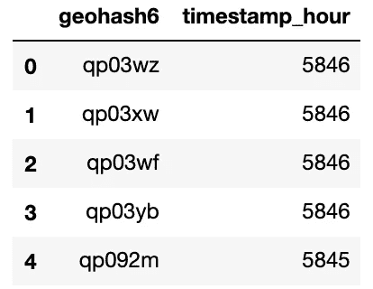
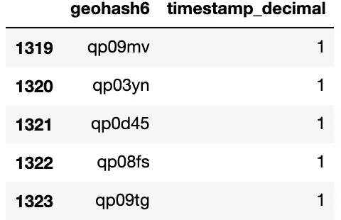
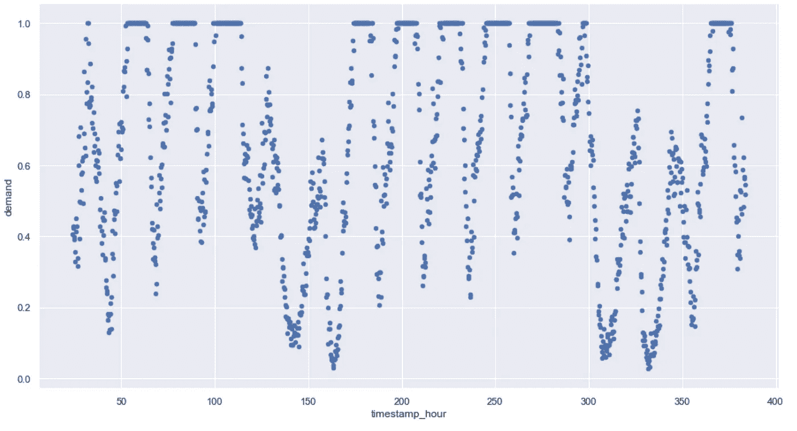
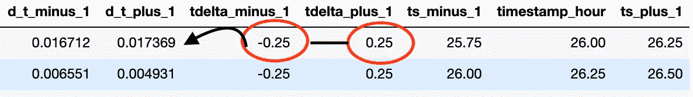
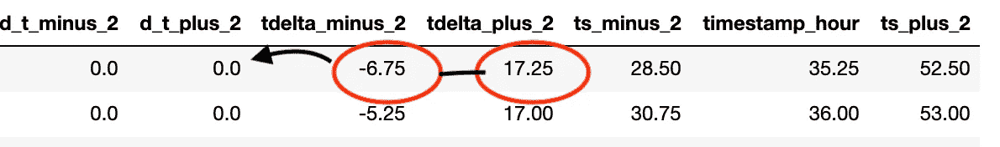
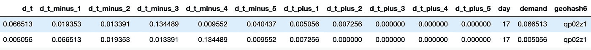
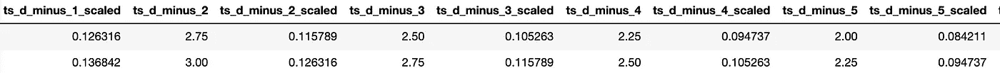
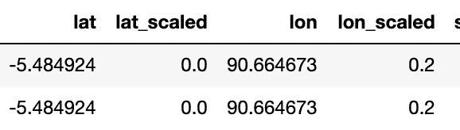

# 海上交通管理的人工智能:特征工程(1/2)

> 原文：<https://towardsdatascience.com/ai-for-sea-traffic-management-feature-engineering-part-1-2-e54f8d4eaa9e?source=collection_archive---------25----------------------->


Traffic in Phnom Penh, Cambodia

## 创建相关的模型特征并处理数据缺口

**也读作:**

[海上交通管理人工智能:建模(下)](https://medium.com/@kiliantep/ai-for-sea-traffic-management-modeling-part-2-2-45cf301bd37)
[海上交通管理人工智能:多步预报窗口 LSTM(后记)](/ai-for-sea-traffic-management-window-lstm-for-multi-step-forecasting-epilogue-33551e1e07c9)

*最近决定参加 Grab 的 AI for SEA 挑战赛。Grab 提出了 3 个不同的挑战:交通管理(我选择的)、计算机视觉和安全。*

这个过程很有趣，也需要做很多工作，所以我决定写这些帖子来详细说明我是如何解决这些问题的。希望这将有助于评估员和参与挑战的人。在本文中，我将介绍这一挑战，并分享我是如何转变 Grab 提供的原始训练集的(特征工程、填补数据缺口等)。

*我所有的代码都可以在*[*GitHub*](https://github.com/KilianTep/traffic-management-aiforsea)*上找到。*

[**交通管理挑战**](https://www.aiforsea.com/traffic-management)

网站上的问题陈述:

"*东南亚经济体正转向人工智能来解决交通拥堵问题，交通拥堵阻碍了流动性和经济增长。缓解交通拥堵的第一步是了解城市内的出行需求和出行模式。*

*能否根据历史抢订量精准预测出行需求，预测出行需求高的区域和时间？*

***在这个挑战中，参与者要建立一个根据历史需求数据集训练的模型，该模型可以根据拒不接受的测试数据集预测需求。该模型应能够在给定截至时间 T 的所有数据的情况下，通过 T+1 至 T+5 时间间隔(其中每个时间间隔为 15 分钟)准确预测未来。***

1.  **了解数据集**

Grab 提供的原始数据集如下所示:



First few rows of original dataset



Description of the meaning of each column. [More info can be found here.](https://www.aiforsea.com/traffic-management)

每条需求记录对应 15 分钟间隔。该数据集总共包含 61 天。

需要理解的棘手部分是，每个 **geohash6** 都有一组*唯一的日期和时间戳。这个信息是至关重要的，因为我们正在处理一个时间序列问题。这将使数据集的排序更加容易。*

总共有大约 1300 个唯一的 **geohash6** 代码。如果您进行快速汇总，您可以看到代码的数字应该接近 61 天* 24 小时* 4 个季度= 5856。

我所做的第一步是使用 pandas 创建一个列‘timestamp _ hour ’,它基本上创建了一个新的时间戳，将日期和时间转换为小时格式。这将有助于我们更好地分析数据。以下代码将帮助您理解:

然后，我汇总数据，以证实我前面提到的说法:



Count of number of timestamps per geohash6 code

我们非常接近拥有这些 geohash6 代码的完整记录，因为我们只缺少 10 个时间戳来获得前四个 geohash6 代码的完整时间序列。遗憾的是，并非所有 geohash6 代码都是如此。有些不完整(即 3000 个时间戳),有些只有一条记录:

```
agg_geohash.tail()
```



The tail of geohash6\. Some codes only have one instance. Because we’re dealing with time series, these geohash6 will have to be dropped.

**2。获得时间序列模式的直觉**

我想直观地了解一个特定地理哈希的需求行为随时间的变化。事实证明，我选取的样本遵循一个非常典型的时间序列行为。我尝试了不同的 geohashes(完整的 geo hashes ),它们都显示出某种程度的静态行为:



Scatter plot of demand over time for selected geohash6 code ‘qp03wz’ over 15 days

我们可以清楚地看到这个 geohash6 的固定模式。高峰大约在一天的同一时间。周末是相当低的。我们应该能够使用以前的需求值相应地用时间序列特征建模。现在让我们继续进行特征工程，这样我们就可以得到一个训练集，我们可以在这个训练集上建立一个模型。

**3。如何在处理不完整的 geohash6 代码时创建时间滞后？**

如上所述，数据集是不完整的。对于某些特定的时间戳，所提供的数据集没有记录的值。幸运的是，Grab 团队注意到了这一点，并在 FAQ 中告诉我们，只需假设对缺失时间戳没有需求(值为 0)。这个假设会特别有用。

鉴于这个问题，我需要在 T+1 创建**需求，直到需求 T+5。**至于我的模型特征，我已经决定使用**需求 T-1 下降到需求 T-5** 。我还决定包含**纬度、经度和相应的时间戳(以十进制每小时的格式)。**因为我已经决定使用 LSTM(见[下一篇](https://medium.com/@kiliantep/ai-for-sea-traffic-management-modeling-part-2-2-45cf301bd37?postPublishedType=repub))，我不得不使用最小-最大缩放来标准化这些特征，以避免爆炸梯度的问题。

预处理代码可以在这里找到[。我在预处理代码中调用的函数可以在这个](https://github.com/KilianTep/traffic-management-aiforsea/blob/master/src/preprocess_dataset.py)[链接](https://github.com/KilianTep/traffic-management-aiforsea/blob/master/src/util/util.py)中找到。

由于代码有点密集，我不会详细说明我是如何创建这些延迟的。然而，我想花一些时间解释我是如何处理丢失的时间戳的，以便填补不完整的需求。基本上，一旦我们通过 geohash 和时间戳对数据集进行排序，当前时间戳与其前一个时间戳之间的时间差应该是# of lags * 15 分钟。类似地，当前时间戳与其后续时间戳之间的时间差应该是步骤数* 15 分钟。该代码包括替换不满足这些条件的先前/下一个时间戳的需求。

请参见下面的代码:

为了使用函数 pd，我基本上逐个处理每个 geohash6 代码。Series.shift()来获取我的时滞/步长。然而，由于数据集不完整，我不能保证移位总是有效的。我需要通过查看上一个/下一个时间戳来进行检查。我的做法如下(伪代码)

```
time_delta = timestamp_lag - timestamp_hourif time_delta != 0.25 * lag:
 return 0
else:
 return demand
```

如果代码对你来说看起来有点复杂，让我们看看下面的例子，它将以一种非常简单的方式帮助你理解。



The d_t_minus_1 and d_t_plus_1 correspond to the observed demand at T-1 and T+1 respectively. ts values correspond to shifted timestamps. The time difference (tdelta) is correct here for lag 1 and step 1 (1 * 0.25 = 1). Thus we do not replace the value by 0



Here, the tdeltas are incorrect for lag 2 and step 2\. They should be equal to 2 * 0.25 = 0.5, thus we replace the values with 0.0

一旦特性工程完成了，我们就获得了下面的需求特性，我用字母“d”将其缩短。



*note that d_t and demand are the same values. I just created another column for consistency.

我将用于建模的其他特性是标准化的十进制每小时时间戳，从 0.0(午夜)到 23.75(晚上 11:45):



ts_d is short for timestamp_decimal. The scaling was obtained through Min-Max scaling

我还将使用标准化的纬度和经度:



Latitude/Longitude values with the Min-Max scaled values

希望你喜欢！如果你有兴趣看看我是如何模拟这个问题的，请看看挑战的第二部分:

[海上交通管理人工智能:建模(下/2)](https://medium.com/@kiliantep/ai-for-sea-traffic-management-modeling-part-2-2-45cf301bd37)

基利安