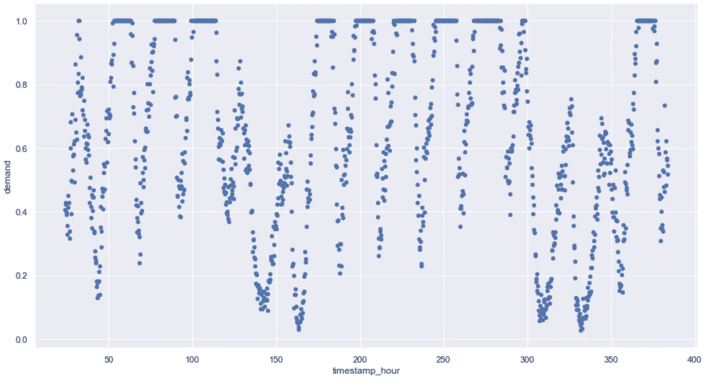
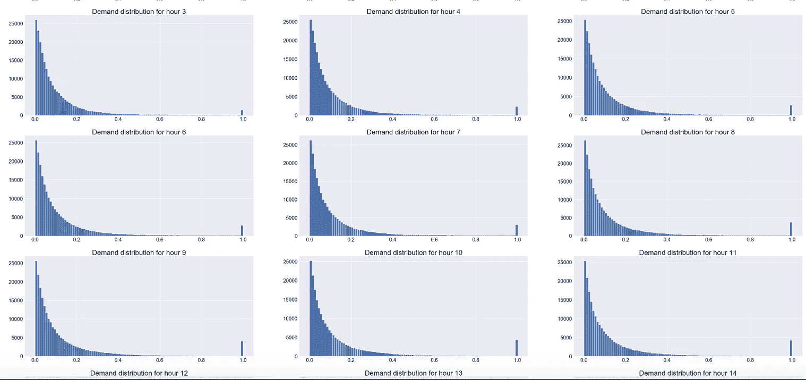
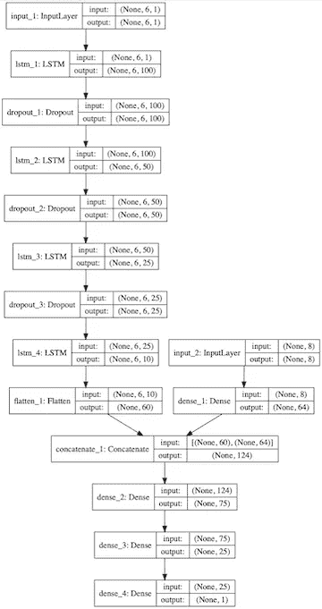
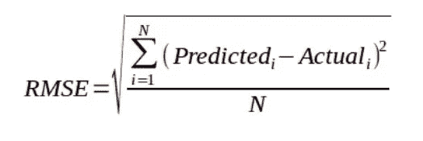

# 海上交通管理的人工智能:建模(下)

> 原文：<https://towardsdatascience.com/ai-for-sea-traffic-management-modeling-part-2-2-45cf301bd37?source=collection_archive---------28----------------------->

Peaceful traffic near Angkor temples, Cambodia

## 具有地理定位特征的时间序列问题的 LSTM 体系结构

**也读作:**

[海上交通管理人工智能:特色工程(1/2)](https://medium.com/@kiliantep/ai-for-sea-traffic-management-feature-engineering-part-1-2-e54f8d4eaa9e?postPublishedType=initial)

**更新:**这篇文章的方法现在已经过时。您可以通过下面的链接查看性能更好的方法:

[海上交通管理的人工智能:多步预报的窗口 LSTM(续)](/ai-for-sea-traffic-management-window-lstm-for-multi-step-forecasting-epilogue-33551e1e07c9)

[*在之前的文章*](https://medium.com/@kiliantep/ai-for-sea-traffic-management-feature-engineering-part-1-2-e54f8d4eaa9e?postPublishedType=initial) *中，我已经详细介绍了我是如何设计这些特性和处理数据缺口的。在这最后一部分，我将描述我的 LSTM 模型架构和我在建模过程中必须考虑的因素。我所有的代码都可以在* [*GitHub 上找到。*](https://github.com/KilianTep/traffic-management-aiforsea)

*通过此链接获得数据集* [*的简要回顾。*](https://www.aiforsea.com/traffic-management)

1.  **为什么深度学习而不是传统的时间序列建模？**

如前一篇文章所示，每个 geohash6 代码都有一组对应的时间戳。在隔离每个 geohash6 的需求时间序列时，我们可以(直观地)观察平稳性，这可能适用于传统的时间序列建模(见下面的例子)。

Scatter plot of demand over time for selected geohash6 code ‘qp03wz’ over 15 days

虽然传统的时间序列建模，如 ARIMA 看起来很有前途，但它是不可扩展的。由于只有在单独处理每个 geohash6 代码时才会显示平稳性，这意味着我们需要训练和维护 1300 多个时间序列模型。此外，ARIMA 模式需要不断的再培训，以确保良好的表现，这使得它很难维持。

出于上述原因，我决定训练一个长短期记忆(LSTM)模型，这已经被证明是非常有效的处理时间序列。LSTM 的优点是，我可以将所有 geohash6 代码包含到我的训练集中，而不必区分它们。给定大量的估计参数，我只是希望模型能够有效地区分每个 geohash6 代码的模式。

2.**需求数据集挑战:不平衡分布**

这个数据集的一个大挑战是它总体上极度不平衡。无论何时，需求都严重向左倾斜(见下面的分布)，这意味着需求在大多数时间都很低。然而，交通管理是为道路上的高需求做好准备，因此我们的模型学习如何很好地预测高峰时间是很重要的。

Overall descriptive statistics and hourly distributions of Demand. I’m only showing 9 hours because the shape of these distributions is the same across all hours

处理这样的问题有两种方法。第一种解决方案是重新采样，以改变训练集的分布。这种解决方案似乎不可行，因为我们可能会丢失许多对模型潜在有用的数据点。此外，由于我们正在处理一个时间序列问题，样本不是独立的。采样变得棘手，因为我们不能随机进行，因为我们可能会错过宝贵的时间信息。我选择的第二个解决方案是，给予这些未被充分代表的价值更大的权重。

3.**解决不平衡数据集:指数加权**

为了给我的训练示例分配权重，我在使用 pd 的训练集上使用了以下函数。Series.apply():

4.**喀拉斯 LSTM 建筑**

LSTM Model architecture built with Keras. The model has two input layers, one consisting of a Demand Vector from T down to T-5; and the other consisting of a time and space vector with scaled latitude, longitude as well as scaled timestamps at time T down to T-5.

该 LSTM 架构旨在预测**需求 T+1** 的需求

第一个输入层接收一个大小为 6 的**向量，由需求 T 直到需求 T-5 组成。为了挑选一个合适的延迟，我随机抽取了一个完整的 geohash6 代码，并对其运行 Auto-Arima。Auto-Arima 确定最佳滞后时间为 T-5，这似乎是合理的。然后，模型将这个输入层传递到几个 LSTM 层。**

第二个输入层接收一个大小为 8 的**向量，它由以下归一化值(最小-最大缩放)组成:纬度、经度、时间 T 时的时间戳、…、时间 T-5 时的时间戳。正如上一篇文章中提到的，我们必须应用最小-最大缩放来避免渐变爆炸的问题。**

我的直觉是，地点以及一天中的时间会对需求产生强烈影响。基本上，我试图将纯需求输入与时间和空间输入结合起来，以便模型了解 T+1 时需求之间的关系。

**损失函数**为*均方误差*，这是一个回归问题的预期。**优化器**是学习率为 0.001 的 *Adam* 。如果模型丢失在两个连续的时期达到稳定状态，我选择将学习率乘以系数 0.2。我还在最终的密集层上添加了一个内核约束，因为它需要介于 0 和 1 之间。

训练明智，我已经为*30*历元训练了模型，并挑选了 *128 的**批量**。*

参见下面的 keras 代码:

看看我是如何在 GitHub repo 上的函数[*prepare _ model _ inputs*](https://github.com/KilianTep/traffic-management-aiforsea/blob/master/src/model/model.py)*中从预处理的数据帧中准备模型输入的。*

*5.**评估方法和结果***

*所需的评估指标是均方根误差(RMSE)*

**

*RMSE Formula*

*我在前 47 天训练了这个模型，并在剩下的 14 天评估了它的表现。粗略估计，训练集约有 320 万个样本，测试集有近 100 万个样本。*

**T+1 表现*:最后 14 天 RMSE 达到 0.04。*

**T+1，…，T+5 绩效*:最后 14 天 RMSE 达到 0.07。*

*为了评估 T+1 和 T+1，..，T+5 性能，我构建了名为[*evaluate _ T _ plus _ 1 _ performance*和*evaluate _ T _ plus _ 5 _ performance 的函数。*](https://github.com/KilianTep/traffic-management-aiforsea/blob/master/src/model/model.py) 后者可能会相当慢，因为我在迭代一个转换后的测试集，并不断改变输入来预测下一个 t。它需要进一步优化。*

*6.**进一步探索***

*由于时间限制和计算资源的缺乏，我没有时间**调整超参数**和**尝试可能产生更好结果的不同模型架构**。*

*函数*evaluate _ t _ plus _ 5 _ performance*在模型上评估性能时也很慢。如果将这样的模型部署到生产中，预测接下来 5 个步骤的窗口函数将必须更快。*

*此外，使用非匿名的 geohash6 代码，该模型可能会将天气等其他特征集成到建模中。这样的因素必然会对交通产生影响。*

*7.**总结***

*简而言之，我建立了一个定制的 LSTM 模型，旨在预测下一次需求的价值。该模型的特殊性在于，我在 LSTM 图层之后添加了一个空间和时间输入图层，以便捕捉需求、位置和时间之间的相互作用。*

*在我的测试集上——过去 14 天的数据，我在 T+1 时达到了 0.04 的 RMSE，在 T+1，…，T+5 时达到了 0.07。*

*在这个项目中，我想探索的是具有非匿名化数据的不同模型架构，这将使得能够结合与需求的实际位置相关的外部特征。*

*希望你喜欢！*

*基利安*