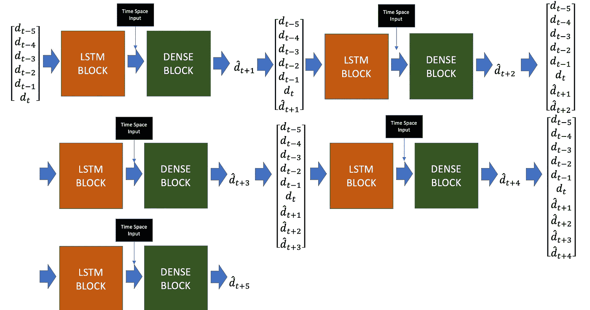
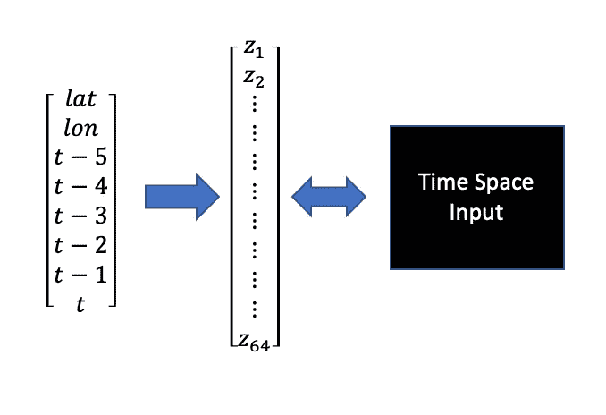
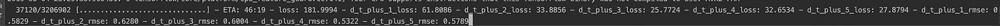

# 海上交通管理的人工智能:多步预报的窗口 LSTM(续)

> 原文：<https://towardsdatascience.com/ai-for-sea-traffic-management-window-lstm-for-multi-step-forecasting-epilogue-33551e1e07c9?source=collection_archive---------20----------------------->

Angkor Wat, one of the wonders of South-East Asia

## 更新的 LSTM 架构，其中每个时间步长都在模型中预测

**也读作:**

[海上交通管理人工智能:特征工程(1/2)](https://medium.com/@kiliantep/ai-for-sea-traffic-management-feature-engineering-part-1-2-e54f8d4eaa9e?postPublishedType=initial)
[海上交通管理人工智能:建模(2/2)](https://medium.com/@kiliantep/ai-for-sea-traffic-management-modeling-part-2-2-45cf301bd37)

*在我之前的帖子中，我已经描述了我如何继续应对由 Grab 组织的* [*人工智能海上交通管理挑战赛*](https://www.aiforsea.com/traffic-management) *。该任务包括预测 Grab 全天 15 分钟的预订需求。总之，参与者必须想出一种方法来预测时间 t 下 5 个时间步骤的需求。现在，紧迫的最后期限已经过去，我实际上有一些时间来反思和改进我以前的方法。此外，我没有使用黑客马拉松期间授予的 100 美元 AWS 积分，因为我是在 Google Colab 上训练我的第一个方法的。学分是一个尝试计算成本更高的方法的好机会。*

*我所有的代码都可以在我的*[*GitHub*](https://github.com/KilianTep/traffic-management-aiforsea)*上找到。原始数据集可以在* *这里找到* [*。*](https://www.aiforsea.com/traffic-management)

1.  **以前方法的缺点**

[以前的方法](https://medium.com/@kiliantep/ai-for-sea-traffic-management-modeling-part-2-2-45cf301bd37)的主要缺点实质上源于这样一个事实，即它只专注于预测 T+1 时的**需求。**

这种特性的第一个结果是，预测 T+1、T+2…直到 T+5 的**需求将花费大量时间。**我必须构建一个窗口函数，一次预测一个步骤。由于输入需求特征包括 T-5 时的**需求，直到 T** 时的需求，我必须将预测附加到*需求输入向量*，并移除输入需求向量的最早需求。我还必须找到一种方法来移动我的*时间空间**输入向量的值，这并不容易:因为我对时间戳应用了最小-最大缩放，所以更新这个输入不像移动到下一个每小时季度那么容易。因此，在大型测试集上，生成 5 步预测的计算效率非常低。*

*第二，由于该模型仅设计用于预测一个步骤，因此每个预测的误差会传播到下一个步骤。换句话说，当预测接下来的 5 个时间步时，在**需求 T+1** 产生的误差将影响**需求 T+2，**将影响**需求 T+3，以此类推。***

*2.**窗口 LSTM:一个通过设计集成多步预测的架构！***

*总的想法是建立一个模型，使误差在更长时间内的传播最小化。该模型应该能够解释过去预测时间步长的误差，并且仍然能够相应地预测需求。*

*在玩了一点 Keras 的功能后，我意识到连续预测**几个输出** **实际上是可能的。**下面的模式说明了新的方法:*

**

*Window LSTM architecture predicting each time step. The \d^{hat} correspond to the predicted demand values.*

*一般方法如下:将需求输入向量传递到 LSTM 块，将 LSTM 块与时空输入组合，将其传递到密集块以生成下一个时间步长。然后，将预测需求附加到原始需求输入向量，并重复该过程。*

*现在，让我们逐一详细介绍该体系结构的每个构建块。*

*   **时间空间输入**

**

*Min-Max scaled lat, lon with timestamps to a 64-dimension densely connected layer*

*为了对需求的时空依赖性进行建模，我简单地将一个带有时间戳的最小-最大缩放纬度、经度的向量传递给一个 64 维的密集连接层。然后我把这个图层和 LSTM 图层连接起来。值得一提的是，我**没有**更新时间戳，因为模型预测了后续时间步长的需求。由于时间空间输入向量是最小-最大比例的，因此相应地更新时间戳是相当棘手的。*

*   **LSTM 街区**

*让我们用下面的 Keras 代码来说明 LSTM 块的架构:*

*它将需求输入传递到几个 LSTM 层，随后是退出以减少过度拟合。经过几个 LSTM 图层后，输出被展平，以便将其与前面提到的时空输入连接起来。*

*   **密集块**

*一旦看到代码，这个密集的代码块就不言自明了:*

*然后，预测需求跟在需求块后面。*

*   **整体窗口 LSTM 建筑**

*3.**模特培训***

*与前面的方法类似，我在前 47 天训练模型，在剩下的 14 天评估它的性能。粗略估计，训练集约有 320 万个样本，测试集有近 100 万个样本。*

*这种新架构的计算成本显然要高得多。该模型在具有 36gb RAM 的 AWS EC2 GPU 上进行训练。*

*我训练了 30 个纪元的模型。我用了一个**批量** **的 200 个训练例子。**使用的优化器是 **Adam** ，初始学习率 **0.001。**我还添加了一个 Keras 回调函数，用于在训练损失达到稳定水平时调整学习率——它基本上将学习率乘以 0.2。*

*这种新架构的优势在于，Keras 使您能够在训练期间监控每个预测的损失:*

**

*Multi-Output loss monitoring during Keras training*

*此功能对于查看模型是否难以学习某些特定输出非常有用。*

*4.**结果***

*虽然训练需要更长的时间，但新架构现在为每个时间步生成结果的速度比以前的方法快得多。*

*就性能而言，它比之前的方法(整体 RMSE 为 0.07)略好。对于过去 14 天的数据，每个时间步长的 RMSEs(均方根误差)如下:*

*   ***需求 T+1** : 0.04*
*   ***需求 T+2** : 0.05*
*   ***需求 T+3** : 0.04*
*   ***需求 T+4** : 0.05*
*   ***需求 T+5** : 0.05*
*   ***总体 RMSE** : 0.05*

***结论***

*这种新方法的主要优势在于，它通过设计预测接下来的 5 个时间步长**。**在真实的生产环境中，拥有一个能够快速预测下一步时间的模型是非常重要的。*

*此外，Keras 能够在训练期间的不同时间步骤监控每个预测的性能。此功能对于查看特定时间步长的性能是否不是最佳非常有用。*

*最后，随着时间远离时间 t，main 方法能够限制误差的传播，如结果所示，误差在所有时间步长内保持非常小。*

*希望你喜欢！*

*基利安*