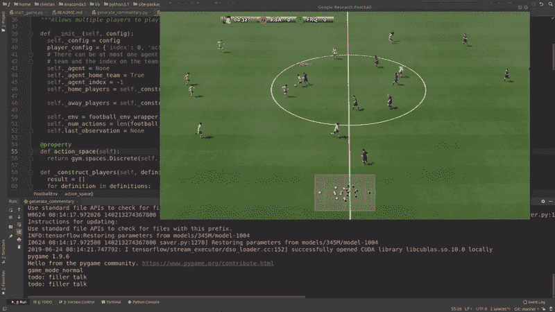
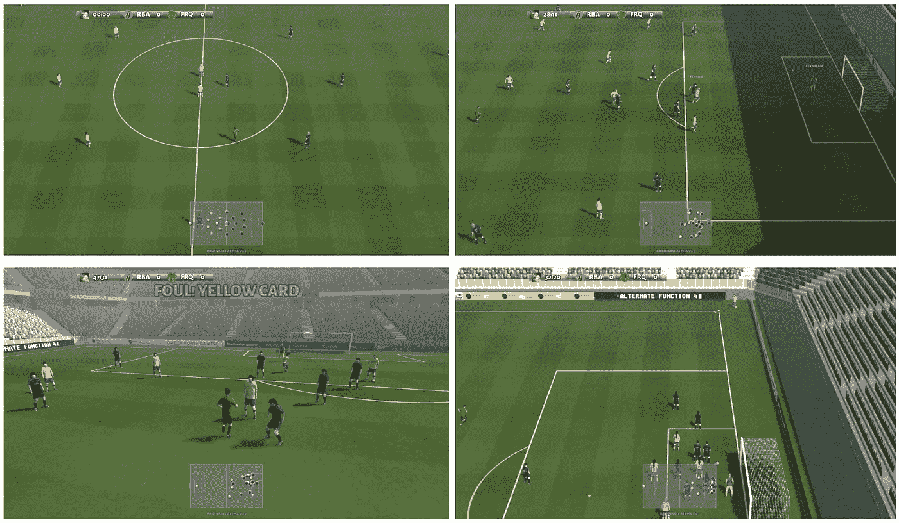
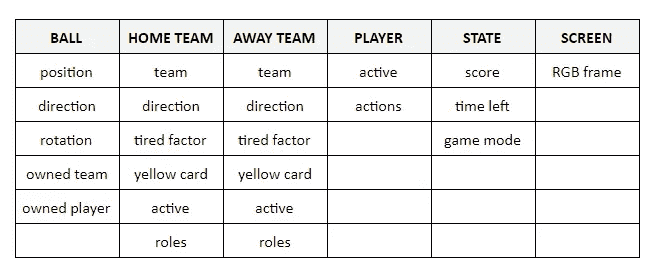
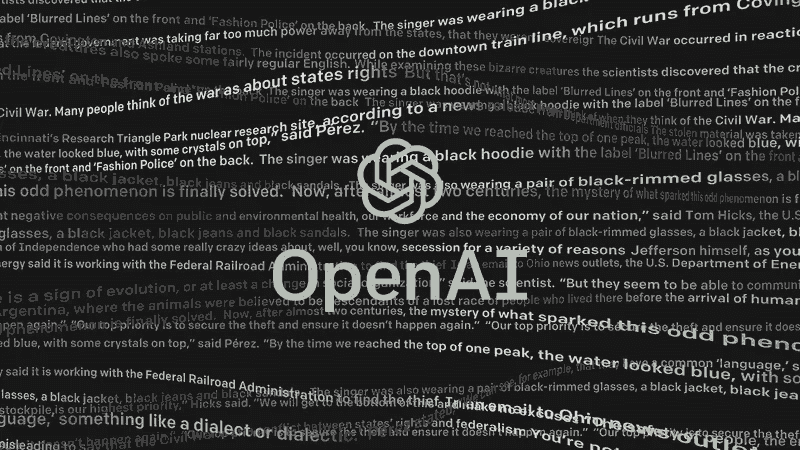
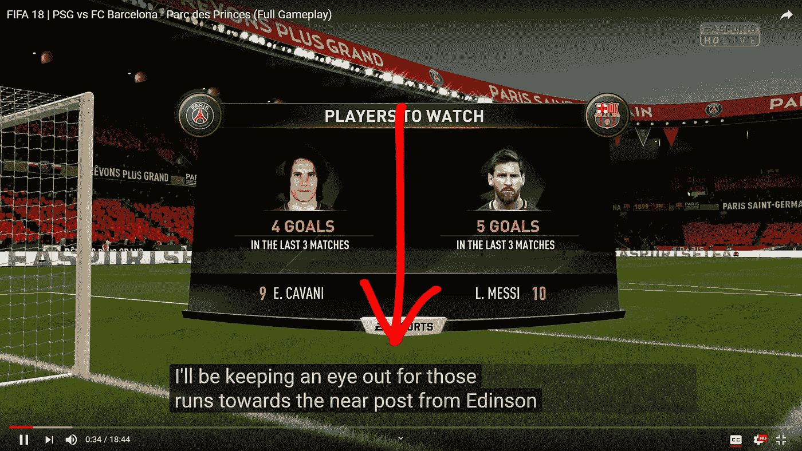

# 人工智能生成足球视频游戏解说

> 原文：<https://towardsdatascience.com/ai-generating-football-video-game-commentary-271f56f45bf?source=collection_archive---------13----------------------->

## 我使用 GPT 2 语言模型为谷歌足球环境实时生成动态评论的方法。

Sample kickoff commentary generated in real-time by the model trained on commentary lines from the FIFA video game series.

如果你已经玩了 FIFA 系列视频游戏很多年了，你可能已经在游戏的解说中听过很多次了

> “大家好，马丁·泰勒和阿兰·史密斯在这里，我们今天的比赛来自英超联赛。”
> 
> "他已经看出了那里的对手进行拦截的意图。"
> 
> “嗯，我们可以得到一些关于伤势的消息。我认为杰夫·史瑞夫斯正在调查此案。”

这些相同的短语和台词在游戏中出现如此频繁的原因是因为它们是在视频游戏的开发过程中预先录制的，并在比赛的特定事件中根据记忆回放。在游戏系列中，大多数新台词都是每隔几年才录制和发布一次，这使得评论相当重复和乏味，尤其是如果你像我一样经常玩这个游戏的话(不幸的是，比我应该玩的多得多)。

我接下这个项目的目的是探索一个人工智能是否可以在游戏中每次发生相同事件时帮助生成动态的即兴台词。希望这能让游戏更真实，更接近真实足球比赛的解说。

## 游戏环境

Google Research Football Environment [[source](https://ai.googleblog.com/2019/06/introducing-google-research-football.html)]

对于这个项目，我正在使用谷歌人工智能团队最近发布的一个[足球模拟环境](https://ai.googleblog.com/2019/06/introducing-google-research-football.html)。虽然它是为了训练强化学习代理而引入的，但我们也可以将它用于其他目的，比如生成评论。启动并运行环境就像编写下面的代码一样简单。

Running random actions on an 11-vs-11 instance of the environment. [[source](https://github.com/google-research/football/blob/master/paper.pdf)]

这个环境的美妙之处在于它允许我们一步一步地玩游戏，在每一步它都使用 [OpenAI 的 gym API](https://gym.openai.com/) 给我们关于游戏状态的完整信息。

State Observations available through the API. See full list [here](https://github.com/google-research/football#observations).

像进球、黄牌、当前游戏模式(任意球、射门)等信息。)以及 python 代码中的更多内容。这使得推断比赛事件并将其提供给语言模型以在游戏中讲述这些特定事件变得非常容易。

## 文本生成器

[[image source](https://www.eyerys.com/articles/news/gpt-2-ai-could-have-significant-societal-impacts-openai-scared)]

这让我想到了这个项目的评论生成部分。我使用的是 [OpenAI 的 GPT-2](https://openai.com/blog/better-language-models/) 语言模型，这是我在[之前的文章](/openai-gpt-2-writes-alternate-endings-for-game-of-thrones-c9be75cd2425)中提到过的，以防你有兴趣了解更多。基本上，给定一个关于某个主题的小文本提示，这个神经网络可以生成关于该主题的长而随机的句子，这使得它非常适合我们在这个项目中的用例。通过将游戏信息作为提示输入这个模型，我们可以让它生成其余的评论。

## 收集培训数据

我从 YouTube 上下载了关于 [FIFA](https://www.youtube.com/watch?v=795ttHjcuNA) 和 [PES](https://www.youtube.com/watch?v=eH2rVkeLdQw) 比赛的视频的英文注释，这给了我一个标准足球评论的语料库。不幸的是，这些注释错误百出，而且没有任何标点符号。我能想到的唯一纠正方法是手动编辑语料库，这占用了我在这个项目中的大部分时间！

YouTube auto-generated captions available via [YouTube API](https://pypi.org/project/youtube_dl/).

## 培训和结果

接下来，我[在这个数据集上微调了预训练的 345M 版 GPT-2](https://github.com/ChintanTrivedi/football_ai_commentary/blob/master/src/train_commentary_gpt2.ipynb) 模型。使用这个，我们可以将足球环境中的比赛信息作为输入提供给这个模型，并让它完成其余的评论文本，如下面的示例格式所示。

> 输入:这是这一方的目标！
> 
> 输出:好吧，如果你继续进入那种区域，球就会落向你，而对他来说，它完美地落下了。这对任何人来说都是一个教训，有助于保持在 18 码区和 6 码区的位置，你就会得分！

为了在玩游戏时重现实时评论体验，我使用了一个名为 [pyttsx3](https://pypi.org/project/pyttsx3/) 的 python 文本到语音引擎来读出 GPT-2 模型的输出。实时音频评论结果显示在下面嵌入的视频中。

## 最后的想法

根据我使用这种方法的经验，我注意到/了解到以下几点

1.  GPT-2 每次都产生动态和变化的句子，但是这些句子中的许多短语是重复的，因为大模型很容易记住小训练数据集。我试图通过尽早结束训练过程来限制这个问题，以防止它过度适应输入。然而，理想的解决方案是大规模增加训练集的大小，有望使模型的输出更加动态。
2.  我们需要提供更多的上下文作为模型的输入，如长期的比赛总结(比赛时间，比分等。)以及发生了什么事件的更简明的短期细节(谁进球了，以什么方式进球——头球还是远射，等等)。).有了更多的背景，这个模型将有望描述事件的细节，而不是像我这样只是随意猜测。

虽然解决这些限制超出了这项工作的范围，但我仍然对这个人工智能目前能够做的事情感到有趣。它展示了人工智能语言模型在彻底改造视频游戏叙事方面的巨大潜力！

请随意在下面链接的 GitHub 资源库中查看该项目的源代码，如果您能改进这些结果，请告诉我！:)

 [## ChintanTrivedi/足球 _ ai _ 解说

### 人工智能生成实时足球评论。贡献给 ChintanTrivedi/football _ ai _ 解说开发由…

github.com](https://github.com/ChintanTrivedi/football_ai_commentary) 

我还要感谢 Jonathan 在 YouTube 注释上就训练 GPT-2 模型以及如何改进结果进行了有益的讨论。

感谢您的阅读。如果你喜欢这篇文章，你可以在[媒体](https://medium.com/@chintan.t93)、 [GitHub](https://github.com/ChintanTrivedi) 上关注我的更多作品，或者订阅我的 [YouTube 频道](http://youtube.com/c/DeepGamingAI)。