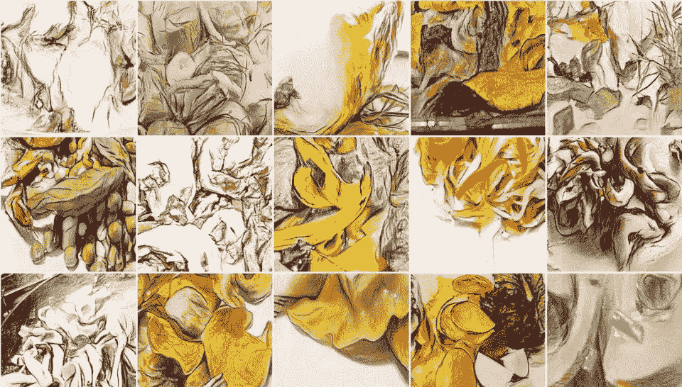

# 甘的创新成就了艾的创造力

> 原文：<https://towardsdatascience.com/ai-gets-creative-thanks-to-gans-innovations-db81462ea4b2?source=collection_archive---------20----------------------->

对于人工智能(AI)专业人士或数据科学家来说，人工智能营销的弹幕可以唤起与普通观众非常不同的感受。

首先，人工智能行业非常广泛，有许多不同的形式和功能，所以行业专业人士倾向于更深入地关注人工智能的哪些分支今天被炒作。这也是事实，因为在人工智能的不同领域有着不同程度的进展。

一些子领域，如计算机视觉，只取得了微小的进步，而其他领域每六个月就有突飞猛进的发展。一个这样的领域是生成性对抗网络(GANs)，它在大约三年的时间里从合成相当无趣的 28x28 像素图像发展到全高清人脸图像。这些完全是新奇的图像，需要一个画家所有的创造力和技巧。重要的是，对于人工智能从业者来说，这改变了我们对人工智能能力的看法，因为这意味着人工智能具有创造力。这意味着人工智能可以将一些更具机械性的创造力留给机器，并允许人类重新专注于不同的任务。

GANs 就像任何算法突破一样，只是一种工具，尽管它被广泛应用于不同的领域。例如，在医学上，GANs 已经被用于通过创建新的、真实的扫描来帮助癌症检测；它们在网络安全中被用于防御和进攻；出乎许多人的意料，gan 已经被用于艺术。事实上，由这种技术产生的一件艺术品[卖到了 432，500 美元](https://www.forbes.com/sites/williamfalcon/2018/10/25/what-happens-now-that-an-ai-generated-painting-sold-for-432500/#49b653a1a41c)。现在有几位艺术家专门为甘斯创作，其中一位是海伦娜·萨林(Helena Sarin)，她的作品在本文中有照片。

> 图片由海伦娜·萨林提供

生成性对抗网络的创新本质上很简单。它从两个网络开始，一个是生成器(因此是生成的)，另一个被称为鉴别器，因为它辨别生成器的工作。这些网络相互竞争(因此是敌对的)，试图超越对方。在艺术的例子中，生成器扮演艺术学生的角色，试图欺骗鉴别者，让他们接受它的作品是伟大艺术家的“真实”作品。与此同时，鉴别者就像一个苛刻的艺术老师，试图区分真正的艺术作品和学生的作品。通过这种竞争和反馈，双方都提高了自己的技艺。通过这种方式，甘模仿创造力和反事实推理。

在医学方面，截至 2018 年年中，已有 63 篇医学论文在某种程度上使用了 GANs。在大多数情况下，这些方法往往侧重于分割或合成，例如，在诊断心脏病时，GANs 在创造性地找出缺失信息方面的表现令人印象深刻。基于 GAN 的方法进一步推动了该领域，提供了一种新的、鲁棒的分类算法，可与所有其他尖端算法相匹配。从理论上来说，我们有理由相信，未来的外科手术中，可以使用氮化镓来增加外科医生的工作量。类似地，GANs 已被应用于药物发现和蛋白质折叠应用，以及牙科，人们已经在实践中使用它。

但是，由于有能力生成新的数据或图像，GANs 也有能力变得危险。一种相关但算法上非常不同的技术最近以“DeepFakes”的名义流传开来，如深度学习假图像。这种做法的道德和地缘政治影响是巨大的，因为它能够制作虚假的视频片段，比如政治领导人讨论对一个国家使用军事力量的视频。关于假新闻的传播和危险已经讨论了很多，但甘斯创造可信假新闻的潜力令人不安。如果有足够的公开镜头，也许很快就有可能合成从未发生过的事件的镜头。把它想象成下一代 Photoshop。

GANs 技术的创造者 Ian Goodfellow 最近被《外交事务》评为 2019 年全球思想家之一。这是人工智能被公认为关键塑造力量的重要一步，特别是考虑到中国希望其人工智能产业到 2030 年达到 1500 亿美元的目标，以及欧洲和其他国家在人工智能预算上花费数百亿美元。仅美国就花费了类似的金额，有消息称，“在其 2017 年的非机密预算中，五角大楼在人工智能和支持人工智能的领域上花费了大约 74 亿美元。”显然，考虑到投资的资金数量和这项技术塑造未来地缘政治关系的巨大潜力，外交事务的认可不应令人惊讶。

这就是为什么道德是每个人心中的一个重要话题的原因。我在与我的合著者 Vladimir Bok 合著的《行动中的 [GANs:深度学习与生成对抗网络](http://bit.ly/gan-book-partners)》一书中谈到了这个话题。GANs 可以为世界做很多好事，但是所有的工具都有滥用的地方。这里的哲学必须是一种意识:因为不可能“不发明”一种技术，所以确保相关人员意识到这种技术的快速出现及其巨大潜力是至关重要的。

同样，随着人工智能各个领域的这种增长和投资，咨询和专业团体开始出现，行业专业人士可以在这里会面，合作并讨论技术的好处和危险，如 Brainpool.ai 建立的全球网络。未来，我希望这些团体将继续定义公共人工智能政策，而不是公众对人工智能及其危险的看法。鉴于全球政界人士在人工智能方面的经验有限，该行业为这场辩论提供信息至关重要。

尽管 GANs 技术有更多的地缘政治方面，但 GANs 代表了一种令人兴奋的新技术，可以将创造力带入否则看似伪确定性的人工智能领域。最终，GANs 可以将人们从如何执行任务的低级物流中解放出来，并使他们能够专注于高级想法。为此， [GANs 是人工智能创新](https://twitter.com/intent/tweet?url=http%3A%2F%2Fwww.forbes.com%2Fsites%2Fkasiaborowska%2F2019%2F02%2F15%2Fai-gets-creative-thanks-to-gans-innovations%2F&text=GANs%20are%20one%20of%20the%20brightest%20hopes%20in%20AI%20innovation)中最光明的希望之一。

***这个故事原本是写给*** [***福布斯***](https://www.forbes.com/sites/kasiaborowska/2019/02/15/ai-gets-creative-thanks-to-gans-innovations/) ***的。*想加入对话吗？推文**[**@ langrjakub**](https://twitter.com/langrjakub)**或者看我的网站**[【jakublangr.com】](http://jakublangr.com)**！我还在写一本关于** [**生成性对抗网络的书，你可以在这里查看**](https://www.manning.com/books/gans-in-action?a_aid=gans-action&a_bid=fd02700a) **。**

来源

Korkinof、t . Rijken、m . O ' Neill、j . years ley、h . Harvey 和 b . Glocker(2018 年)。使用渐进生成对抗网络的高分辨率乳房 x 线照片合成。从 https://arxiv.org/pdf/1807.03401.pdf[取回](https://arxiv.org/pdf/1807.03401.pdf)

巴蒂博士和安德森博士(2016 年)。学习用对抗性神经密码术保护通信。从 https://arxiv.org/pdf/1610.06918.pdf[取回](https://arxiv.org/pdf/1610.06918.pdf)

m .里加基和 s .加西亚(2018 年)。把一个 GAN 带到一场刀战:适应恶意软件通信以避免检测。2018 年 IEEE 安全和隐私研讨会(SPW)(第 70–75 页)。IEEE。[https://doi.org/10.1109/SPW.2018.00019](https://doi.org/10.1109/SPW.2018.00019)