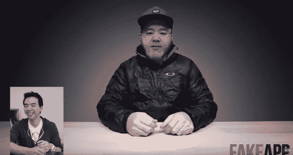

# 人工智能、永生和黑镜

> 原文：<https://towardsdatascience.com/ai-immortality-and-black-mirror-880e7aa16cc3?source=collection_archive---------18----------------------->

我最近听了一段音频剪辑，乔·罗根宣布他将开始赞助一个完全由黑猩猩组成的曲棍球队！他厌倦了人们认为黑猩猩在运动水平上无法与人类竞争。他让这些黑猩猩努力工作。他们在扔水壶铃铛，而且他们严格的饮食是骨汤和麋鹿肉！

尽管这个音频剪辑击中了一个很好的罗根流行语，录音本身是伪造的。它是使用 Dessa 公司开发的人工智能模型创建的( [bog post](https://medium.com/@dessa_/real-talk-speech-synthesis-5dd0897eef7f?stream=top) 带音频剪辑)。他们创造了一种算法，给它喂食的不是麋鹿肉，而是乔过去几集的播客，以便复制他的声音和表达方式。这个脚本是由一个人创建的，然后被交给模型，在模型中，它获取文本并将乔·罗根的模仿输出到一个音频文件中。就电脑声音而言，它很好，不完美，但真的很好。知道它是假的，你肯定能听到听起来有些不对的部分，几乎就像恐怖谷的音频版本。

# 人工智能模仿的历史

2012

*   一种名为 [Mathgen](http://thatsmathematics.com/blog/archives/102) 的算法能够创建一篇虚构的学术论文，并已被《纯数学进展杂志》接受。

My own math paper generated by Mathgen

2015

*   TensorFlow 首次亮相，其早期演示之一是其风格转移功能。使一个人能够从梵高的作品中获得一幅图像，并将这种风格应用于任何其他图像。这里有一个来自 TensorFlow [博客](https://medium.com/tensorflow/neural-style-transfer-creating-art-with-deep-learning-using-tf-keras-and-eager-execution-7d541ac31398)的演示。

An example of the style transfer capabilities from TensorFlow

2017

*   一个来自 Botnik 的人工智能模型写了新的哈利波特[章节](https://botnik.org/content/harry-potter.html)。
*   奥巴马总统和特朗普都被这个[中国 AI](https://www.youtube.com/watch?v=-ISWe9mGNiw) 模仿。他们甚至让特朗普用普通话讲话！
*   [Dadabots](https://dadabots.com/index.html) 利用深度神经网络创作了黑色金属音乐，翻拍了一些披头士的歌曲。

2018

*   深度学习模型 Deep Fake 拍摄一个人的视频，并在不同的视频中将他们的脸转移给另一个人。戴夫·李有一个很棒的评论剪辑[展示了它的能力。](https://www.youtube.com/watch?v=S6fjNq0PGYo)

Dave Lee sporting Lewis Hilsenteger’s beard

# 能力和权利

所以，这就是我们所在的地方，我们可以模仿一个艺术家或作家的内容，我们可以模仿他们的声音，通过深度伪造，我们甚至可以模仿他们的外表。希望你能生活在 19 世纪，让梵高为你画像，没问题。你最喜欢的乐队解散了，这没什么大不了的，我们会用他们的风格创作新的音乐。我觉得如果尼古拉斯·凯奇是主角，电影会更好，[有人已经为你做了。艾给了我们艺术家的不朽。没有书系列必须结束，没有画必须是最后的。](https://www.youtube.com/watch?v=BU9YAHigNx8)

这当然带来了一个问题“艺术家有什么权利？”如果他们的音乐被用作创建模型的输入，他们有权利输出吗？或者我们可以简单地说，这台机器受到音乐的启发，就像格里塔·范·弗利特这样的乐队受到齐柏林飞船的启发一样。灵感仅仅是高度变异的模仿吗？时间只会带来更多关于艺术家和 AI 话题的讨论，但一个更有趣的问题是，人们将如何将这项技术应用到他们的个人生活中。

# 进入黑镜

深入这个话题的最佳方式是通过黑镜。2013 年的剧集【T2 马上回来讲述了一个年轻女子玛莎的故事，她的男朋友突然在车祸中丧生。突如其来的损失让她心烦意乱，她求助于一项服务，该服务提供复制他的人格。它通过读入男朋友在社交媒体上分享的所有数字数据来做到这一点。这项服务开始是一个简单的聊天机器人，然后转向语音，最后甚至复制他的外貌。2013 年还是科幻的东西，现在 2019 年完全可以了。

希望你能和一个亲密的朋友有更多的交谈，做一个聊天机器人。你有他们的音频吗？更好的是，现在机器人可以用那种声音回答了。真希望你父亲能陪你走过红毯。没问题，只要有人代替就行了，现在你回去看婚礼视频的时候会是他(至少长得像他)。

像任何新技术一样，它也带来了问题。使用死者肖像的道德规范是什么？这是有益的还是有害的？这种服务会伤害情感上受伤的人吗？一个声称能让你和死人交流的数字通灵者？这带来了很多问题，精灵不会回到瓶子里。最近有人告诉我，技术遵循摩尔定律，但伦理和哲学不遵循。我们需要时间去实验，去发现让这项技术进入我们生活的正确平衡点。*马上回来*主要关注玛莎在这个问题上的挣扎。最后，她找到了一个平衡点，既能保存她男友的记忆，又不至于失去他只是一个数字代表的位置。这实际上是黑镜的一个更好的结局。希望我们也能有一个幸福的结局。