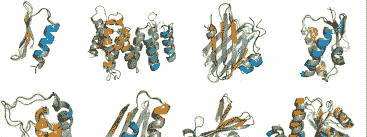
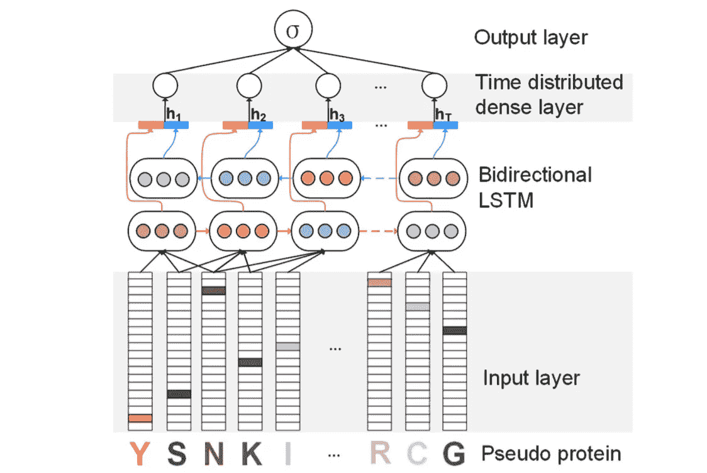
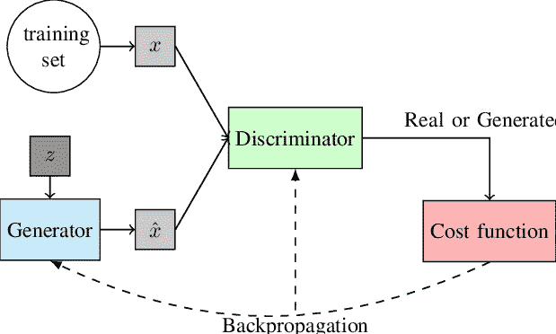
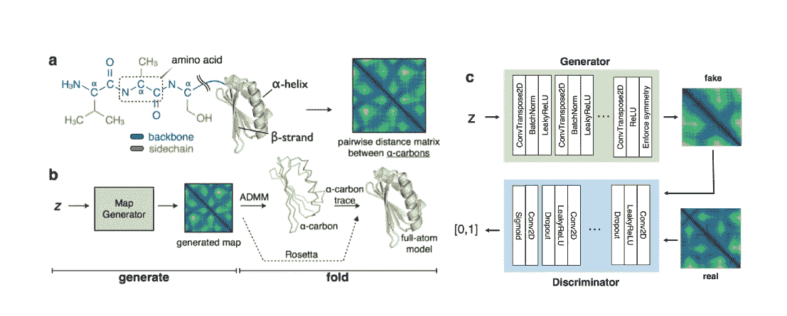
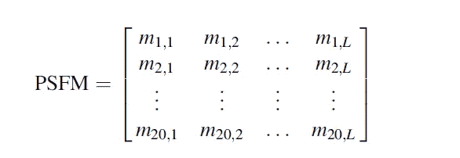

# 生物信息学中的人工智能

> 原文：<https://towardsdatascience.com/ai-in-bioinformatics-a1acdc3cdd89?source=collection_archive---------10----------------------->

> 在这篇文章中，我将介绍这一领域的最新发展。

人工智能一直在寻求大量关注，因为它试图复制人类智能来分析我们周围的复杂数据。人工智能的两个主要子集:机器学习和深度学习，因其在不同领域的可行开发而在研究界引起了很多兴奋。在这篇文章中，我们将看看最近介绍的生物信息学领域的最新进展。

> 生物信息学是生物数据分析的一个领域。该领域的基本应用包括生物序列和分子结构的分析，高级应用包括生物系统的建模。

生物信息学中的人工智能包括借助于生物序列匹配、蛋白质-蛋白质相互作用和功能-结构分析的基础和临床研究。这种分析有助于药物和复杂系统的设计和发现。

## 因此在这篇文章中，我们将关注人工智能在生物信息学领域的最新趋势:

1.  *基于双向长短期记忆的蛋白质远程同源性检测，2018(原文链接:* [*此处*](https://www.ncbi.nlm.nih.gov/pubmed/29017445) *)*
2.  *用磁带评价蛋白质迁移学习，2019 (* [*此处*](https://arxiv.org/abs/1906.08230) *)*
3.  *蛋白质结构的生成式建模，2019(* [*此处*](https://papers.nips.cc/paper/7978-generative-modeling-for-protein-structures.pdf) *)*
4.  *蛋白质远程同源性检测采用基于相异度的多实例学习，2018 (* [*此处*](https://link.springer.com/chapter/10.1007/978-3-319-97785-0_12) *)*
5.  *基于图谱的蛋白质远程同源性检测，2019 (* [*此处*](https://link.springer.com/chapter/10.1007/978-3-030-17938-0_24) *)*

## 什么是蛋白质？

> 蛋白质是氨基酸的线性链。它用标准的 25 字符字母表编码，其中 20 个字符代表标准氨基酸，2 个代表非标准氨基酸，2 个代表不确定氨基酸，1 个代表未知氨基酸。在整个讨论中，任何长度为 l 的蛋白质 x 都是 20 个离散氨基酸字符的序列(x₁,x₂……,x₂o)
> 
> 示例- 'MEEPQSD……..DSD’是来自激酶家族的蛋白质序列。

> *基于自然语言处理的技术可以用来提取有用的生物信息吗？？？*

# 基于双向长短期记忆的蛋白质远程同源性检测；

短语“蛋白质远程同源性检测”是指通过从长蛋白质序列中提取基本信息(主要通过分析结构或序列相似性)将蛋白质序列分类到它们各自的超家族中。

> 问题陈述将序列分类的任务分解成它们各自的组(超家族)

因此，基本上在提出的工作中，研究人员引入了 ProDec-BLSTM，这是一种由不同层组成的网络架构:输入层、双向 LSTM 层、时间分布密集层和输出层。这种架构试图从双向 LSTM 的每个隐藏值中捕获信息，并对其进行进一步处理。关于这一点的总结可以在[这里](https://medium.com/@ankita9shreya/protein-sequence-classification-c83a6cb38548)找到。

Architecture for ProDec-BLSTM

# 用磁带评估蛋白质迁移学习:

迁移学习出现在计算机视觉领域，现在正被用于各种其他领域，如自然语言处理( [NLP](https://medium.com/dair-ai/a-light-introduction-to-transfer-learning-for-nlp-3e2cb56b48c8) )。它指的是利用从一项任务中获得的知识来解决相关任务的想法。举个例子，

> 它试图捕捉各种信息，包括从大型语料库中学习各种语言特征，如结构、句法、长期和短期依存形式的语法。然后，它使用这些知识来初始化和训练处理类似 NLP 任务(如情感分析或文本摘要)的其他模型。

蛋白质数据是序列数据，因此生物信息学社区的研究人员试图利用 NLP 中的先进技术从蛋白质序列数据中提取信息。为了促进这一进展，任务评估蛋白质嵌入(TAPE)已被引入，它包括 5 个生物学半监督学习任务，分布在蛋白质生物学的各个领域。因此，它主要集中在蛋白质生物学的三个领域，如结构预测、远程同源性检测和蛋白质工程。作为基准的 5 个生物学相关任务是:二级结构预测、接触预测、远程同源性检测、荧光景观预测和稳定性景观预测。该性能已针对三个主要的代表性模型(循环、卷积和基于注意力)进行了基准测试。除了这两个不同的模型也被使用。

# 蛋白质结构的生成模型；

生成模型旨在学习数据分布的真实表示，使得生成的数据分布看起来与原始数据分布相似。但是，比较和学习真实的数据分布是不可能的。因此，我们试图学习一个模型，它的数据表示与真实数据相似。一种有效的方法是生成对抗网络(GANS ),它使用一个生成器和鉴别器网络来实现这一点。这基本上是两个神经网络，其中生成器试图生成自然图像，鉴别器试图确定生成的图像是假的还是真的。这可以类似于这样的场景，其中它可以被认为是 minimax 游戏，其中生成器试图通过生成接近原始图像的图像来愚弄鉴别器，而鉴别器试图通过提高其鉴别能力来不被愚弄。该模型旨在实现两个网络之间的平衡。

Architecture for GANs

在本文中，GANs 被用于生成蛋白质结构和预测损坏的蛋白质结构的缺失部分。该数据涉及 3D 蛋白质结构的使用，其被编码为α-碳之间的 2D 成对距离。这种表示不保留序列信息，但是这种信息对于结构恢复来说是足够的。这些距离矩阵被称为“地图”。

The architecture of the proposed method in the paper

> 使用深度生成模型生成和设计 DNA*是另一篇论文，它演示了如何使用 GANs 来生成新的序列，这些序列的特性有望优于蛋白质训练数据集中的序列。(* [*此处*](https://arxiv.org/pdf/1712.06148.pdf) *)*

# 基于相异度多示例学习的蛋白质远程同源性检测；

远程同源性检测的任务包括在蛋白质序列数据中鉴定功能或结构相关的相似性。有时同源蛋白质序列(属于同一超家族的序列)显示出很少的序列相似性。整个任务取决于如何构建蛋白质的特征向量表示。

序列数据的这种特征构造的最广泛使用的方法之一是 N-gram(k-mers)-它是连续符号的短子序列。因此，向量表示由字典 N-grams(氨基酸序列)在给定蛋白质序列中出现的次数组成。这种方法迫使 N 保持较小，因为较大的 N 值会导致较长且稀疏的表示。

> 例如，如果 N 的值是 2；字典 N-grams(20 个氨基酸序列)将由特征向量中 20ⁿ子序列组成。因此，20 = 400 个这样的要素制图表达。因此，单个蛋白质序列将用 1x20 表示。随着 N 值的增加，特征向量的大小也将增加。

因此，本文提出了一种新的基于多示例学习(MIL)的向量表示方法，该方法对于基于 SVM 的鉴别技术显示了良好的效果。

> 在 MIL 问题的情况下，对象由一个由一组特征向量组成的包来表示。则标签被分配给整个包，而不是单独的特征向量。如果在袋子内部存在任何(至少)阳性实例的痕迹，则假设该袋子被认为是阳性的。

这里，蛋白质序列被认为是一包大小为 n 的片段。这种技术有两个好处:

1.  特定包的标签由一小组相关实例确定。两种蛋白质之间的同源性与一小组信息片段的存在成正比。
2.  它不要求 N 聚体的大小很小，因为对子序列的大小没有限制。

# 基于图谱的蛋白质远程同源性检测；

这种分类的任务围绕着构建蛋白质序列数据的更具信息性的特征向量表示。在本文中，作者试图改进基于轮廓的方法，该方法使用位置特定频率矩阵(PSFM)进行特征提取。这种现有技术已经提出了通过去除被称为顶频轮廓(TFP)的低频氨基酸来从轮廓(从 PSFM 提取的特征集)中去除噪声的技术。现在，除了这个转换的轮廓之外，应用自交叉协方差(ACC)以使蛋白质载体的长度相同。

*PSFM 是包含每个标准氨基酸‘I’在列‘j’中出现的频率的矩阵，其代表长度为 L* 的给定蛋白质的序列

> 因此，简单地说，这个领域中的数据可以被视为携带一些与生物生命相关的上下文信息的序列数据。

# 结论

在这篇文章中，我试图吸引读者对机器学习和深度学习如何扩展到生物信息学领域的注意。我希望我能够将生物序列数据与自然语言处理中使用的序列数据联系起来，因此类似的技术也可以应用于这个领域。主要目的是让读者了解这个领域正在进行的研究。

在下一篇文章中，我想进一步探索(【https://arxiv.org/abs/1906.08230】[)的工作和细节](https://arxiv.org/abs/1906.08230)

# 参考

[1]:李 s，陈军，刘波，【基于双向长短期记忆的蛋白质远程同源性检测】 (2018)

[2]: Roshan Rao，Nicholas Bhattacharya，Neil Thomas，闫端，，John Canny，Pieter Abbeel 和 Yun S. Song，[用磁带评估蛋白质迁移学习](https://arxiv.org/abs/1906.08230) (2019)

[3]: Namrata Anand 和 Po-Ssu Huang，[蛋白质结构的生成建模](https://papers.nips.cc/paper/7978-generative-modeling-for-protein-structures.pdf) (2019)

[4]:安东内里·门西，曼努埃莱·比塞戈，皮埃特罗·洛瓦托，马尔科·卢格和大卫 M. J .塔什，[利用基于相异度的多示例学习进行蛋白质远程同源性检测](https://link.springer.com/chapter/10.1007/978-3-319-97785-0_12) (2018)

[5]:廖青，，郭，，[基于图谱的蛋白质远程同源性检测](https://link.springer.com/chapter/10.1007/978-3-030-17938-0_24) (2019)

[6]: Elvis，[NLP 迁移学习的简单介绍](https://medium.com/dair-ai/a-light-introduction-to-transfer-learning-for-nlp-3e2cb56b48c8)