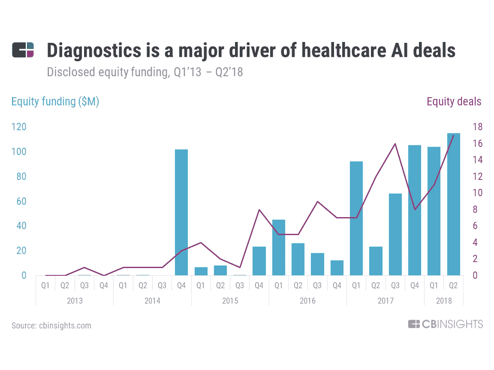
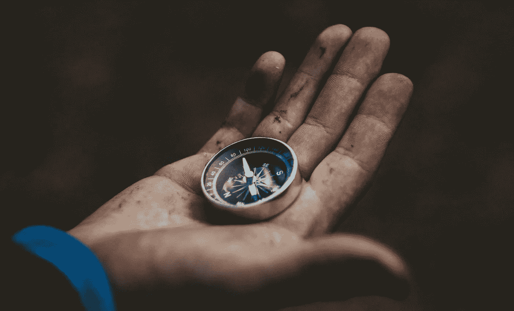

# 肿瘤学人工智能辅助诊断和药物发现:谨慎处方

> 原文：<https://towardsdatascience.com/ai-in-oncology-assisting-diagnostics-and-drug-discovery-prescribe-with-care-dd9822aac626?source=collection_archive---------33----------------------->

## 展示人工智能在癌症 Dx 和 Tx 中的应用

人工智能不再只是好莱坞的专利。人工智能(AI)是一个不断增长的市场，尤其是在医疗保健领域，没有放缓的迹象。到 2021 年，人工智能在医疗保健领域的应用预计将达到 68 亿美元。公司和国家都看到了专注于人工智能研究的价值。欧洲委员会去年宣布，他们将在 2020 年[年底](https://internetofbusiness.com/european-commission-announces-new-e20-billion-ai-strategy/)前向人工智能投资 200 亿€。这项投资将涵盖人工智能技术的许多方面，包括医疗保健。

但是人工智能到底是什么，更重要的是，所有的炒作都是为了什么？

# 什么是人工智能？

简单地说，人工智能是开发[计算机程序](https://www.forbes.com/sites/bernardmarr/2018/02/14/the-key-definitions-of-artificial-intelligence-ai-that-explain-its-importance/#1ea1b40a4f5d)来完成模仿人类智能的任务。像视觉和语音识别以及复杂的决策制定这样的事情是人工智能开发出来要完成的任务。人工智能应用不仅仅是收集和组织数据，而是能够解释和适应大量的数据和文档。

医疗保健数据库通常非常复杂，但充满了可用于药物研发和精准医疗的有用信息。在医疗保健中使用人工智能可以帮助改善数据的组织，并加快研究突破。

人工智能通过使用机器学习等各种方法来实现这一点。机器学习工具能够[识别用户行为或患者结果的](https://en.wikipedia.org/wiki/Artificial_intelligence_in_healthcare)模式，以创建自己的逻辑。这使得人工智能医疗保健编程能够学习和进化——不断改善结果和效率。

机器学习是人工智能应用程序能够完成的许多任务之一。另一个是自然语言处理，人工智能程序[解释](https://su.org/resources/exponential-guides/the-exponential-guide-to-artificial-intelligence/)口语、打字和手写单词。这在评估医疗保健听写软件和医疗文档时尤其有用。解释这些大量的数据并将其存储起来，这就是所谓的*大数据*，人工智能应用程序在不断收集和组织数据。这些程序需要学习的信息越多，它们适应的速度就越快，生产率就越高。

癌症筛查和检测，以及肿瘤学研究的进展，都是受益于 AI 技术的领域。我是肿瘤诊断公司 Universal DX 的首席运营官，该公司使用机器学习进行诊断研究。在肿瘤学中与人工智能合作提供了许多关于人工智能的好处和挑战的见解。下面我将全面介绍人工智能的最新进展以及必须采取的预防措施。

# 人工智能技术有助于癌症检测

人工智能在医疗保健领域的应用非常广泛。从癌症诊断到机器人辅助手术，人工智能应用正在帮助提高肿瘤学的效率和患者疗效。你可以在下图中看到诊断是医疗保健人工智能交易的一个主要组成部分，这说明了人工智能技术可以给研究带来的价值。

[https://www.cbinsights.com/research/report/ai-trends-healthcare/](https://www.cbinsights.com/research/report/ai-trends-healthcare/)

已经有许多研究表明，人工智能与人类对放射学研究和实验室结果的解释一样有效，如果不是更有效的话。中国[的研究人员最近研究了在评估一项新的脑肿瘤诊断时，使用深度学习程序如何帮助改善解释结果。该项目评估 MRI 成像，以分类和绘制图像，并协助手术计划。与外科医生手动进行的肿瘤分割相比，人工智能应用程序在癌症检测方面更加准确和高效。](https://ieeexplore.ieee.org/document/7802771)

乳腺癌是女性中最常见的癌症，难怪研究人员正在寻找更多方法来帮助癌症检测和治疗乳腺癌。Therapixel 开发了一个人工智能程序，通过将当前图像与数千张存储的乳房 x 光图像进行比较，来解释乳房 x 光检查结果。通过比较和分析存储图像的集合，这个人工智能程序将提供数据，确定患者是否需要额外的测试来排除癌症。Therapixel 声称，与放射科医生相比，他们的人工智能程序可以更准确地评估患者是否需要返回进行进一步成像——这一步骤可能成本高昂，而且对患者来说也很有压力。

对于病理学家来说，在确定癌症诊断时评估病理切片是非常耗时的，因为有如此大量的数据要查看。[哈佛医学院](https://blogs.nvidia.com/blog/2016/09/19/deep-learning-breast-cancer-diagnosis/)开发了一个人工智能程序，帮助病理学家诊断乳腺癌细胞。研究人员创建了一个程序来评估数百万张被鉴定为癌症和非癌症细胞的病理切片。这使得人工智能程序能够创建预测算法并生成概率热图。与病理学家 96%的准确率相比，[人工智能程序](https://blogs.nvidia.com/blog/2016/09/19/deep-learning-breast-cancer-diagnosis/)的预测准确率为 92%。但是，它确实显示了病理学家*使用*的人工智能程序具有最高的准确率——突显了人工智能工具在由研究人员使用时与完全自主使用时如何得到最佳利用。

在改进诊断的同时，[谷歌](https://ai.googleblog.com/2018/04/an-augmented-reality-microscope.html)正在开发一个人工智能显微镜程序，以帮助病理学家检测癌症。谷歌的增强现实显微镜使用机器学习算法主动分析图像。人工智能诊断工具不仅可以帮助病理学家，还可以帮助病人。 [Skin Vision](https://www.skinvision.com/) 是一家为 iOS 和 Android 用户开发了一款应用程序的公司，该应用程序可以为你的皮肤拍照，以评估可疑的病变。然后，该应用程序帮助确定该部位患癌的风险——促使医疗保健提供商进行进一步评估。

# 人工智能协助肿瘤药物发现和精确医疗

现在众所周知，个性化医疗在治疗癌症时会给患者带来更好的结果。除了检测癌症，人工智能技术在区分基因突变以实现精准医疗方面也显示出了前景。通过评估和确定基因突变，肿瘤学家能够更好地治疗他们的病人。

个性化或精确医学需要不断分析基因突变，以发现新的治疗方法。使用机器学习和大数据等人工智能工具可以帮助简化这种数据收集，甚至有助于药物发现。

瑞士的索菲亚遗传学公司正在利用大数据来帮助分析患者癌细胞的基因组构成。他们提供了一种使用人工智能技术的试剂盒，将患者的 DNA 与大型数据库进行比较，以确定是否存在基因突变，从而使用精准医疗。Sophia Genetics 利用人工智能技术，在治疗肺癌、结直肠癌、皮肤癌和脑癌等实体瘤时，帮助检测世界上许多国家的变化。

人工智能技术有助于区分健康细胞和癌细胞，并确定基因突变——但它也有助于研究人员开发癌症治疗药物。制药公司诺华[与科技巨头微软](https://medcitynews.com/2019/10/novartis-microsoft-partner-to-use-artificial-intelligence-in-drug-discovery/?mc_cid=08b3e03b09&mc_eid=4c7bbadb3e&rf=1)合作，将人工智能工具应用于药物研发。利用微软的大数据和机器学习技术，诺华的研究人员可以分析大量数据，寻找应用基因治疗的新方法。有了这些工具，进行这些发现的时间可以大大缩短，从而导致更快的药物发现和开发。

# 人工智能在医疗保健领域面临的挑战

尽管人工智能在医疗保健进步方面带来了很多希望和承诺，但仍有一些挑战必须解决。在分析大数据之前，需要完成合并数据的任务。电子健康记录使用的[增长](https://www.nature.com/articles/s41746-019-0155-4)为医疗机构创造了多种多样的选择。由于使用了如此多的医疗保健数据库平台，这给它们之间的信息共享带来了挑战。对于相同的诊断或治疗，可能使用不同的措辞，文件中的差异，以及错误的数据输入。

不幸的是，没有一个全球性的网络让医疗服务提供者和医疗保健组织彼此共享医疗信息，也没有一个全球性的方法来“结构化数据”。为了让人工智能工具有效地工作并识别趋势，必须安全地收集和组合医疗保健数据——记住使用的数据是个人医疗信息。

公司正在积极解决这个问题，但仍有工作要做。 [Riovant](https://roivant.com/) 是一家制药公司，声称通过考虑数据收集的所有差异，使*正常化*医疗保健数据。通过标准化患者和研究数据，这确保了开发新药时数据解释的准确性。将电子健康记录整合成一个整体需要更多的时间，因为有许多财务和专有的[因素在起作用。](https://www.nature.com/articles/s41746-019-0155-4)

另一个挑战在于，当涉及到高质量、干净的数据时，[数据库](https://www.labiotech.eu/features/artificial-intelligence-oncology/)并不都是平等的。在收集分子结合亲和力的数据时，一个微小的结合误差[可能意味着纳摩尔和毫摩尔之间的差异。在使用 AI 技术时，看似很小的错误都会造成误传和曲解的滚雪球效应。从本质上讲，产生的结果只和用来创建人工智能算法的数据一样好。](https://medcitynews.com/2019/10/novartis-microsoft-partner-to-use-artificial-intelligence-in-drug-discovery/?mc_cid=08b3e03b09&mc_eid=4c7bbadb3e&rf=1)

人工智能在医疗保健领域面临的另一个挑战是[限制](https://www.healthcareitnews.com/news/ai-healthcare-not-so-fast-study-outlines-challenges-dangers-machine-learning)审计和评估人工智能程序评估大数据的能力。人工智能程序经常获取大量数据并提供答案，但并不总是有办法评估结论是如何得出的。考虑决策利弊的人情味不存在——这有时会消除对患者护理全局的关注。人工智能程序的结果不能被解释为绝对正确的事实，因为人工智能的魅力在于有一个*推理*组件，它可能不总是与研究人员、医生或患者的推理一致。

# 小心使用人工智能

很明显，医疗保健中的人工智能可以为研究人员、医疗保健组织和患者提供许多好处。通过应用人工智能工具，癌症诊断和治疗方面的突破可以比以往任何时候都更快。但是必须小心确保数据被安全地共享并且数据被准确地共享。必须始终保持人机之间的良好平衡，以帮助谨慎开药。