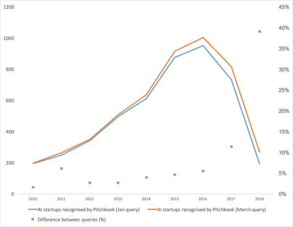
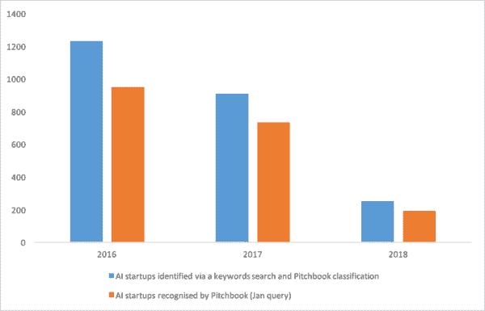
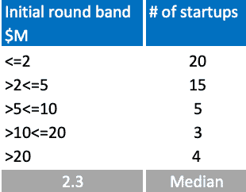
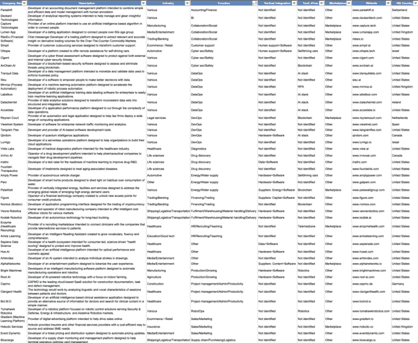

# 人工智能投资活动-2018 年趋势

> 原文：<https://towardsdatascience.com/ai-investment-activity-trends-of-2018-bf82cd8bd5ea?source=collection_archive---------17----------------------->

## 人工智能炒作放缓，建立认知技术栈，垂直整合和其他观察

Photo by [Markus Spiske](https://unsplash.com/photos/FXFz-sW0uwo?utm_source=unsplash&utm_medium=referral&utm_content=creditCopyText) on [Unsplash](https://unsplash.com/search/photos/algorithm?utm_source=unsplash&utm_medium=referral&utm_content=creditCopyText)

**这篇综述强调了 2018 年以来启动/投资人工智能(AI)初创公司的趋势。**它包含了对 2018 年推出的 47 家人工智能初创公司的分析，每个公司都成功筹集了至少 100 万美元。此外，它还包括一些长期趋势的更广泛的概述。我在这篇评论中涵盖了**、美国、加拿大、欧洲和以色列**。

回顾了 2018 年推出的人工智能创业公司的数据，我可以强调以下五个趋势:

1.人工智能炒作放缓——启动的创业公司越来越少，投资方式越来越彻底；

2.新一波人工智能创业公司的出现，解决了其他人工智能创业公司带来的挑战；

3.人工智能技术堆栈的持续构建；

4.纵向一体化；

5.市场模式的有限普及。

## AI 炒作减速

**根据 Pitchbook 的数据，2018 年见证了自 2010 年**以来新推出的人工智能创业公司数量的最低水平(图 1)。即使考虑到并非所有在 2018 年推出的创业公司都可以被纳入数据库[1]，这种趋势也很可能存在，我们正在看到人工智能公司的形成放缓。

*Chart 1\. AI startups annual formation, only for startups recognised as AI startups by Pitchbook*

从某种程度上来说，这种下滑可以解释为这样一个事实，即创业公司现在不太愿意推销自己的人工智能，因此也不太可能被数据提供商发现。然而，更仔细的搜索会发现那些“隐藏”的创业公司。例如，通过搜索与人工智能相关的多个关键词，而不是依靠数据提供商对初创公司应用的静态分类，人们可能会发现更多的人工智能初创公司(图 2)。

Chart 2\. AI startups annual formation, for startups recognised as AI startups by the data provider and by a keywords search

然而，即使经过那些没有宣传其人工智能组件的人工智能创业公司的调整，新成立的人工智能创业公司的数量也明显低于前几年的水平。

投资活动反映了人工智能初创公司的放缓。此前，投资者将赌注分散在给多家初创公司签小额支票上。如今，它们似乎加倍押注于假定的赢家，并以更专注的方式投资于新来者。例如，在 2018 年启动的 121 家人工智能创业公司的样本中[2]，7%(或 8 家公司)筹集了 1000 万美元或更多的第一轮资金，而在 2016 年启动的 801 家创业公司中，只有 3%的公司筹集了大笔初始资金。

即使大型初始轮变得更加频繁，人工智能种子轮的中值规模也仅略高于美国的平均水平，分别为 230 万美元和 2M 的 230 万美元。2018 年，大多数被抽样的新人只成功筹集了一次资金，只有 9 家初创公司分别筹集了几次资金(图 3)。

Chart 3\. Number of AI startups launched in 2018 by the initial round size, sample of 47 startups

## 人工智能创业公司的新浪潮

> Brian W. Arthur 曾经指出，“……对技术的需求更多地来自技术本身，而不是直接来自人类的需求；它们主要来自技术本身遇到的限制和产生的问题[3]。

过去的一年展示了人工智能、机器人、区块链和其他技术如何创造了对支持技术的需求。例如，自动驾驶汽车的出现为 [Ottopia](https://ottopia.tech/?utm_campaign=AI%20investment%20activity%20and%20business%20models%20&utm_medium=email&utm_source=Revue%20newsletter) 建立一个远程协助他们的平台提供了机会。远程医疗的普及需要一种新型的招聘公司，如[酵素](https://www.enzymehealth.com/?utm_campaign=AI%20investment%20activity%20and%20business%20models%20&utm_medium=email&utm_source=Revue%20newsletter)，能够将临床医生与远程医疗提供商联系起来。机器人流程自动化(RPA)的浪潮增加了对描述和绘制业务流程的工具的需求，如 [Mimica](https://mimica.ai/?utm_campaign=AI%20investment%20activity%20and%20business%20models%20&utm_medium=email&utm_source=Revue%20newsletter) 开发的工具。

另外，我想强调平台化的趋势。这在银行业引起了广泛的注意，现在它似乎正在接近法律行业。例如， [Reynen Court](https://reynencourt.com/?utm_campaign=AI%20investment%20activity%20and%20business%20models%20&utm_medium=email&utm_source=Revue%20newsletter) 的“……应用加速了法律技术应用之间的互操作性，使律师事务所能够采用人工智能和智能合同……”。**智能合同和人工智能带来的机遇推动律师事务所成为科技公司/平台。**

总体而言，在 2018 年推出的 47 家样本人工智能创业公司中，有 15 家或多或少与新技术/行业的需求有关(图表 4，以及一张[谷歌表单](https://docs.google.com/spreadsheets/d/1agAmFDuoe8vRFmDGtjxwSqGNmRzqBQFUoajK6kdAHe0/edit?usp=sharing&utm_campaign=AI%20investment%20activity%20and%20business%20models%20&utm_medium=email&utm_source=Revue%20newsletter)的大图)。

## **AI:建立新的堆栈并改进现有的堆栈**

**DataOps 和 DevOps 功能是上市人工智能初创公司最受欢迎的解决方案**。47 家初创企业中有 12 家从事这些领域的工作:

*   在数据操作方面，初创公司提出了各种方法来让 AI 变得更好，例如，通过改善数据标签和管理( [Labelbox](https://labelbox.com/?utm_campaign=AI%20investment%20activity%20and%20business%20models%20&utm_medium=email&utm_source=Revue%20newsletter) 、[宁静数据](https://www.tranquildata.com/?utm_campaign=AI%20investment%20activity%20and%20business%20models%20&utm_medium=email&utm_source=Revue%20newsletter))、数据湖管理([accele Data](http://www.acceldata.io/?utm_campaign=AI%20investment%20activity%20and%20business%20models%20&utm_medium=email&utm_source=Revue%20newsletter))；
*   用 AI 改善现有的 DevOps 流程是另一个重要的主题。对于[实例](https://thenewstack.io/lumigo-end-to-end-serverless-monitoring-and-troubleshooting/?utm_campaign=AI%20investment%20activity%20and%20business%20models%20&utm_medium=email&utm_source=Revue%20newsletter)，[lumi go](https://lumigo.io/?utm_campaign=AI%20investment%20activity%20and%20business%20models%20&utm_medium=email&utm_source=Revue%20newsletter)‘…提供了环境的可视化地图，以及跟踪和深入每个请求的每个方面的能力，它将专注于使用“机器学习来更好地隔离服务中的异常行为”。另一个[例子](https://tangramflex.com/technology/?utm_campaign=AI%20investment%20activity%20and%20business%20models%20&utm_medium=email&utm_source=Revue%20newsletter)是 Tengram Flex，它开发基于人工智能的软件开发工具，以构建“…自动生成的软件接口，在不同语言和架构的组件之间架起桥梁”。

## **垂直整合**

被选中的 47 家初创企业中有 15 家展示了纵向一体化的各个方面:一家公司的供应链归该公司所有。人工智能公司通常不直接拥有供应链，但控制供应链的几个要素，并提供整体服务，而不是纯粹的软件。可以确定几种“拥有供应链”的方式:

*   **人力支持**。例如，为客户服务提供人工智能的 [Simplr](https://www.simplr.ai/?utm_campaign=AI%20investment%20activity%20and%20business%20models%20&utm_medium=email&utm_source=Revue%20newsletter) ，也提供来自实时客户服务代理的支持，如果其人工智能无法处理请求，代理就会介入。Ottopia 不仅开发了用于自动驾驶汽车遥控操作的软件，还将其与自己的遥控操作者池相连接；
*   **专有硬件**。许多人工智能公司从事硬件开发，以及其核心软件。例如[亮机](https://www.brightmachines.com/?utm_campaign=AI%20investment%20activity%20and%20business%20models%20&utm_medium=email&utm_source=Revue%20newsletter)和[充足电](https://www.amplypower.com/?utm_campaign=AI%20investment%20activity%20and%20business%20models%20&utm_medium=email&utm_source=Revue%20newsletter)；
*   **专有数据**。 [Insitro](http://insitro.com/?utm_campaign=AI%20investment%20activity%20and%20business%20models%20&utm_medium=email&utm_source=Revue%20newsletter) 和[智人数据](https://www.sapiensds.com/?utm_campaign=AI%20investment%20activity%20and%20business%20models%20&utm_medium=email&utm_source=Revue%20newsletter)用专有数据补充他们的算法。以[为例](https://medium.com/@daphne_38275/insitro-rethinking-drug-discovery-using-machine-learning-dcb0371870ee?utm_campaign=AI%20investment%20activity%20and%20business%20models%20&utm_medium=email&utm_source=Revue%20newsletter)，Insitro 不仅将“……使用已经收集的高质量数据，而且……还将大力投资创建我们自己的数据集”；
*   **与各种供应商的整合** s，无论是能源生产者还是内容创造者 AI 创业公司都试图控制它。

## **市场**

**在 2018 年**启动创业的人工智能创始人中，市场不是很受欢迎。只有 8 家公司采用了这种方法。例如，Enzyme“…使用机器学习算法为医生和护士从业者匹配适合他们专业知识和可用性的职位”，而 [Lumen App](https://lumenapp.com/en/?utm_campaign=AI%20investment%20activity%20and%20business%20models%20&utm_medium=email&utm_source=Revue%20newsletter) 使用一种算法来验证其约会应用程序成员上传的自拍，该应用程序专为 50 岁以上年龄组的人设计。

Chart 4\. Sampled AI startups launched in 2018 and raised $1M or more each. See Notes for a Google sheet with a larger version [4].

## **结论**

1) **我们可能正处于这样一个时刻，宣传/强调一家初创公司的智能已经没有多大意义了**。部分原因是因为它受到了虚假声明的损害。另一个原因是，基于产品价值而非技术的差异化可能是更好的销售策略；

2) **为一家人工智能初创公司筹集资金可能会变得更加困难**，因为投资者已经下注了。现在，他们加倍投资，并谨慎地投资新项目；

3) **AI 和其他技术一样，创造新问题**，而不仅仅是解决问题。因此，**及早发现这些问题可能意味着新的市场机会**；

4) **认知技术栈是一个很好的例子，当一波技术浪潮产生对支持技术**的需求时，这有助于解决与第一波技术浪潮相关的挑战；

5) **垂直整合似乎在人工智能初创公司中很受欢迎，因此在创办公司时，创业者应该准备走出自己的舒适区**。该团队可能不仅从事研究和软件开发，还从事硬件工程和大型运营活动，例如管理一组呼叫中心操作员。

## 笔记

[1]创业公司的启动和它在数据库中的出现之间有一个时间差。图表 1 显示了 Pitchbook 确定为 2018 年 1 月和 3 月查询的创业公司之间的差异。我们越往前追溯，越少的创业公司没有被数据库捕获；

[2]在这里，对于 2016 年的数据集，只有筹集了已知金额资本的人工智能初创公司被纳入样本(即，不是所有这些年推出的人工智能初创公司)；

[3]Brian Arthur，w.《技术的本质:它是什么以及它如何演变》(第 204 页)。企鹅图书有限公司 Kindle 版；

[4] [谷歌图表 4 的工作表](https://docs.google.com/spreadsheets/d/1agAmFDuoe8vRFmDGtjxwSqGNmRzqBQFUoajK6kdAHe0/edit?usp=sharing&utm_campaign=AI%20investment%20activity%20and%20business%20models%20&utm_medium=email&utm_source=Revue%20newsletter)。样本人工智能初创公司于 2018 年推出，每家融资 100 万美元或以上。