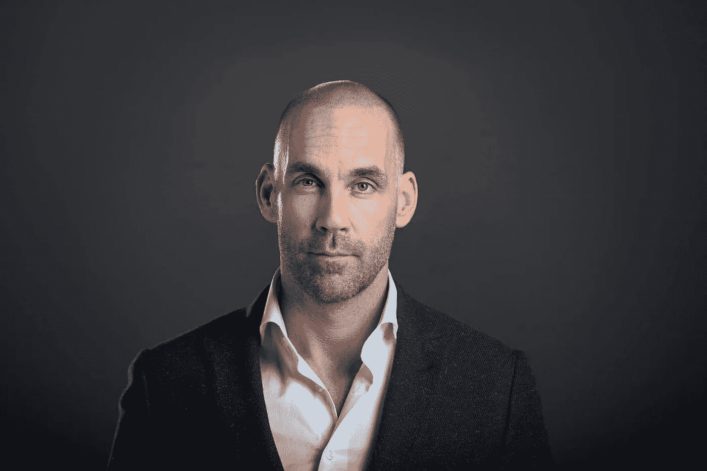

# 人工智能变得越来越聪明和恐怖，它甚至可以预测一个人何时死亡

> 原文：<https://towardsdatascience.com/ai-is-getting-smarter-and-creepier-and-it-can-even-predict-when-a-person-will-die-288395e07c66?source=collection_archive---------20----------------------->

## 人工智能算法被证明是预测死亡的有效解决方案。

Photo by [https://www.shutterstock.com/g/sdecoret](https://www.shutterstock.com/g/sdecoret)

在过去的几年里，人工智能(AI)领域出现了爆炸式的突破。几乎每个行业都可以找到这方面的证据，毫无疑问，人工智能的崛起将在未来继续扰乱现有的行业。人工智能已经证明了它在自动化零售、金融甚至建筑等行业的枯燥和平凡任务方面的有效性。然而，[人工智能算法](https://www.richardvanhooijdonk.com/en/blog/ai-could-help-people-decide-for-how-long-to-keep-loved-ones-on-life-support-should-we-trust-it/)和软件可以做得更多。事实上，这样的系统能够预测过早死亡。这看起来很可怕，但是对于 T4 的医疗保健行业来说，这可能会创造奇迹。

## 诺丁汉大学的研究

研究人员已经在人工智能领域取得了多项发现。例如，诺丁汉大学的一个团队创造了一个基于人工智能的系统，能够预测过早死亡。由于机器学习算法，该系统的表现优于人类专家领导的标准预测模型。该系统使用了英国 50 多万人的数据，年龄在 40 岁到 69 岁之间。除了健康信息，它还分析了人们的人口统计数据和生活方式选择。它甚至评估了他们每天的水果、蔬菜和肉类消费，以预测早死的风险。

这个人工智能系统可以帮助对抗严重的疾病，并在预防性医疗保健中发挥重要作用。根据研究人员之一 Joe Kai 教授的说法，“目前人们对使用人工智能或机器学习来更好地预测健康结果的潜力有着浓厚的兴趣。在某些情况下，我们可能会发现它有帮助，在其他情况下可能没有。在这种特殊情况下，我们已经证明，通过仔细调整，这些算法可以有效地改善预测。”

## 谷歌人工智能技术的能力

另一个解决方案是谷歌的预测算法，该算法已经在医院患者中进行了测试，以预测早期死亡、出院和再次入院，它显示出比传统的临床预测系统和方法更高的准确性。

作为研究的一部分，谷歌将其算法应用于一名患有转移性乳腺癌的患者。该算法给出了患者在医院死亡的 19.9%的可能性，而医院的增强预警分数提供了 9.3%的估计。为了做出预测，谷歌的人工智能分析了患者健康记录中的 175，639 个数据点，包括她的生命体征和病史。不到两周，同一名患者死亡，谷歌的技术超过了医院的传统预测模型。在整个研究过程中，AI 系统分析了来自 114，003 名患者的超过 460 亿个数据点。像这样的创新可以帮助医院优先考虑病人护理，并在医疗紧急情况发生前调整治疗计划。

## LogitBoost 机器学习算法

欧洲心脏病学会进行了一项类似的研究。该研究在 2019 年国际核心脏病学和心脏 CT 会议上发表，发现人工智能可以作为预测心脏病发作和死亡的有效方法。研究人员使用名为 LogitBoost 的机器学习算法分析了来自芬兰图尔库宠物中心 950 名患者的心脏成像数据。所有患者都有胸痛，并在六年中接受了各种心脏扫描。参与研究的团队[声称【LogitBoost 在检测患者未来患心脏病或早逝的风险时显示出 90%的准确性。由于医生和其他医疗保健专业人员已经收集了大量的患者信息，将这些数据与机器学习相结合可以准确预测患者的结果和风险，并帮助医生个性化治疗。](https://www.mdmag.com/medical-news/machine-learning-boasts-90-accuracy-rate-for-predicting-heart-attack-death)

## Gero 的人工智能应用

尽管 LogitBoost 可以简化医生预测患者结果的方式，但依靠基于人工智能的算法，即[利用](https://www.engadget.com/2018/03/30/ai-predicts-your-lifespan-using-activity-tracking-apps/)“通过智能手机和智能手表的活动跟踪来估计你的寿命”，可能是一个更实用的解决方案。为此，俄罗斯初创公司 Gero 与莫斯科物理技术学院(MIPT)的科学家合作，训练一种算法来确定预期寿命。

该算法分析了人们的步数、睡眠习惯以及他们在活跃期和非活跃期之间切换的频率。该公司甚至开发了一款预测用户寿命的测试版手机应用。然而，这项技术并不能给出一个人健康的全貌，因为它不使用基因或饮食等数据。一旦结合临床分析，该应用程序将给出更准确的估计。尽管它尚未准备好用于医疗应用，但该应用程序显示出了潜力，因为它可能有助于开发更有效的抗衰老治疗方法，并降低保险和养老金计划的风险。

## 最后的想法

如今越来越多的行业正在受到人工智能和机器学习的影响，医疗保健也不例外。事实上，这是从人工智能中受益最多的行业之一，无疑将改变医疗保健的未来。由于智能算法，医生将能够准确预测病人的结果，甚至是过早死亡的风险。这些有价值的信息将帮助医疗保健专业人员更好地个性化治疗，并在为时已晚之前改善护理服务。

**作者:**理查德·范·霍伊东克

国际主题演讲人、[趋势观察家](https://www.richardvanhooijdonk.com/en/)和未来学家 Richard van Hooijdonk 提供了关于技术如何影响我们生活、工作和做生意的方式的鼓舞人心的讲座。超过 420，000 人已经参加了他在荷兰和国外的著名灵感会议。他与 RTL 电视台合作，并在 BNR 新闻电台主持每周一次的广播节目“思维转变”。范·霍伊顿克也是奈罗德大学和伊拉斯谟大学的客座讲师。

Richard van Hooijdonk

## 来源

[https://thetrendsnext . com/automation-3d-printed-organs-immersive-tech-the-future-of-health care-is-tech-powered/](https://thetrendsnext.com/automation-3d-printed-organs-immersive-tech-the-future-of-healthcare-is-tech-powered/)

[https://www . richardvanhooijdonk . com/en/blog/ai-can-help-people-decision-how-to-keep-on-life-support-should-we-trust-it/](https://www.richardvanhooijdonk.com/en/blog/ai-could-help-people-decide-for-how-long-to-keep-loved-ones-on-life-support-should-we-trust-it/)

坎贝尔，帕特里克，
[https://www . MD mag . com/medical-news/machine-learning-saws-90-accuracy-rate for-predicting-heart-strike-death](https://www.mdmag.com/medical-news/machine-learning-boasts-90-accuracy-rate-for-predicting-heart-attack-death)。

芬加斯，乔恩，
[https://www . engadget . com/2018/03/30/ai-predicted-your-life-using-activity-tracking-apps/](https://www.engadget.com/2018/03/30/ai-predicts-your-lifespan-using-activity-tracking-apps/)。

卡塞尔，雷切尔，
[https://then extweb . com/artificial-intelligence/2018/06/19/Google-ai-predictions-death-hospitals/](https://thenextweb.com/artificial-intelligence/2018/06/19/google-ai-predictions-death-hospitals/)。

Park，Andrea，
[https://www . beckershospitalreview . com/artificial-intelligence/logit boost-algorithm-predicts-heart-strikes-death-with super human-accuracy . html](https://www.beckershospitalreview.com/artificial-intelligence/logitboost-algorithm-predicts-heart-attacks-death-with-superhuman-accuracy.html)。

坦格曼，维克多，
[https://futurism.com/googles-ai-predict-when-patient-die](https://futurism.com/googles-ai-predict-when-patient-die)。

诺丁汉大学，[https://www . science daily . com/releases/2019/03/190327142032 . htm](https://www.sciencedaily.com/releases/2019/03/190327142032.htm)。

维多利亚州，Zavyalova，[https://www . rbth . com/science-and-tech/328014-neural-networks-predict-human-长寿](https://www.rbth.com/science-and-tech/328014-neural-networks-predict-human-longevity)。