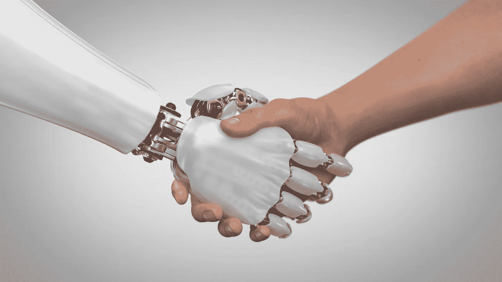

# 人工智能就在这里——我们信任它吗？

> 原文：<https://towardsdatascience.com/ai-is-here-should-we-trust-it-7774f5fffee?source=collection_archive---------22----------------------->

对于销售新技术产品的人来说，快速采用新技术产品至关重要。采用曲线越快，公司就能越快地从技术中获利。一般来说，消费者对新技术的接受开始缓慢，并逐渐获得动力，直到它成为主流，这个过程可能是不透明的，往往需要数年时间。马尔科姆·格拉德威尔写了一整本书( [The Tipping Point](https://www.amazon.com/Tipping-Point-Little-Things-Difference/dp/0316346624) )来说明新产品冲击大众的关键时刻是一种怎样的现象。

从学术角度来说，[技术接受模型(TAM)](https://en.wikipedia.org/wiki/Technology_acceptance_model) 是一个被广泛认可的模型，它概括了用户对新技术的反应，无论是有意识的还是无意识的。这些影响因素包括有用性、易用性和对技术的态度(先入为主的观念)。从本质上讲，如果技术没有压力，没有威胁，并且符合我们由社会环境塑造的观念，它将更容易被接受。最近，信任作为技术采用的影响因素已经成为 TAM 的一个重要增强因素，特别是在物联网(IOT)、在线游戏和在线购买领域(1)。

**是什么让我们相信我们的人工智能？**

在消费者意识增强和关注用户数据如何收集、存储和使用(无论是私人还是公共实体)的时代，信任正在成为所有形式的人工智能的重要因素。人工智能的女性人格化可能[鼓励接受和使用，](https://medium.com/voice-tech-podcast/siri-alexa-cortana-and-why-all-boats-are-a-she-e4fb71b6a9f7?source=search_post---------0)甚至在其用户生活中最个人和最亲密的部分(2)。这可能是因为女性角色被认为威胁性较小(友好且不太权威)，通常被认为比男性更值得信赖(3)。

当人工智能出现、行为和操作如我们所期望的那样时，我们也会信任它(5)。人工智能已经可以复制类似人类的社会线索，如声音和行为。声音是一种特别强大的机制，可以激活我们的自动社会反应，声音的性别具有重要的意义(4)。但事实上，人工智能扮演的*角色*可能对人们对信任的看法影响最大(5)。例如，某些社会角色，如教师、医生和祖父母，在很大程度上产生信任。

人工智能执行的任务类型也可能对性别化代理的可信度和信任度产生影响，但性别的社会刻板印象也在这里起作用。在几项研究中，男性拟人化的人工智能代理被认为适合“技术任务”，而女性拟人化的人工智能代理被认为最擅长“家庭或生活方式相关的任务”(6)。在回顾大量人机交互研究时，Nomura (5)提出，人机交互的情景背景，特别是机器人实体的角色和任务，是人类与计算机交互时观察到的性别化反应的一个重要因素。因此，它确实是情景背景、人类演员背景(性别、经验)、机器人特征(例如化身、性别)和文化性别刻板印象(声音、性格)的复杂组合，这些都是影响我们与人工智能和机器交互的因素(5)。

**为什么信任在我们与人工智能的互动中很重要**

信任的概念不仅对人类社会关系有广泛的影响，而且对经济因素也有广泛的影响，比如那些影响工作场所或金融交易的因素(3)。当然，这并不总是意味着人与人之间的交流和行为将等同于人机之间的交流和行为，因为有许多其他因素在一些人工智能智能代理中不会被复制(例如，语音代理，如 Siri 和 Alexa，它们不会表达肢体语言、眼神交流或触摸)。然而，如果最终人类的社会互动塑造了人们使用人工智能的行为方式，那么可信度、信任度和可信度之间的区别对于性别化人工智能和 dva 的社会影响来说是一个重要的区别。

今天的主流人工智能语音代理还不够成熟，还不能被视为真正的人类；大多数人认为 Siri 和 Alexa 仅仅是被设计成以预编程方式做出反应的计算机程序。然而，随着人工智能和机器人技术的进步，人工智能代理正迅速变得足够先进，能够像人类一样出现、行为和表达自己(例如，面部表情和肢体语言以及他们所说的和所做的)。

随着类似人类的 android 人工智能代理成为消费市场的主流，就像今天的语音代理一样，人类与人类以及人类与人工智能之间的互动正在迅速成为一层越来越薄的面纱，很少有人能够破译。当这些代理收集我们的数据和信息(或者有些人会称之为监视)时，我们可能需要更多地考虑我们给予机器的信任，并成为我们自己的代理，保护那些使我们成为人类的东西。

参考

1.吴，王，赵，杨，朱，陈，谭，郑，洪(2011)。信任对技术接受模型影响的元分析:主体和情境类型的调节作用研究。*国际信息管理杂志*， *31* (6)，572–581。doi:2011 . 03 . 004

2.伍兹，H. (2018)。对 Siri 和 Alexa 的更多要求:监视资本主义服务中的女性角色。*媒体传播批判研究*。 *35* (4)，334–349。土井指数:10.1080/152950363657

3.北卡罗来纳州布坎、罗森河、索尔尼克等人(2008 年)。信任与性别:投资游戏中行为与信念的检验。*经济行为杂志&组织。68* 。466–476.doi:10.1016/j.jebo.2007.10.006

4.Nass，c .和 Brave，S. (2004 年)。*语音连线:语音如何激活和促进人机关系*。

5.t .野村证券(2017 年)。机器人和性别。*性别与基因组，1* (1)，18–25。doi:10.1089/gg.2016.29002.nom

6.Chemaly，S. (2016 年 7 月 27 日)。性别刻板印象和性别歧视与算法和机器人有什么关系。*赫芬顿邮报*。检索自[https://www . huffington post . com/soraya-chemaly/what-gender-stereotypes-and-gender ism-have-do-with-algorithms-and-robots _ b _ 7880906 . html](https://www.huffingtonpost.com/soraya-chemaly/what-gender-stereotypes-and-sexism-have-to-do-with-algorithms-and-robots_b_7880906.html)