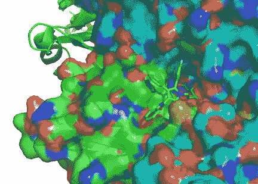
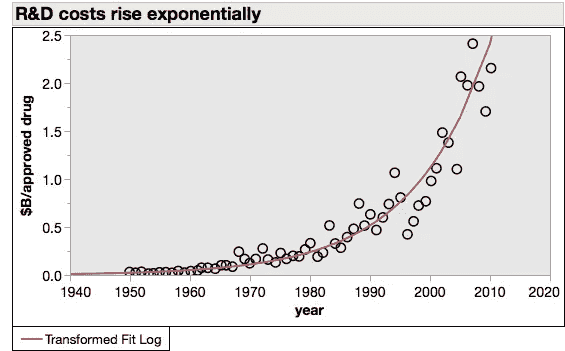
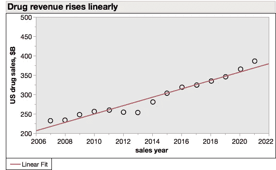
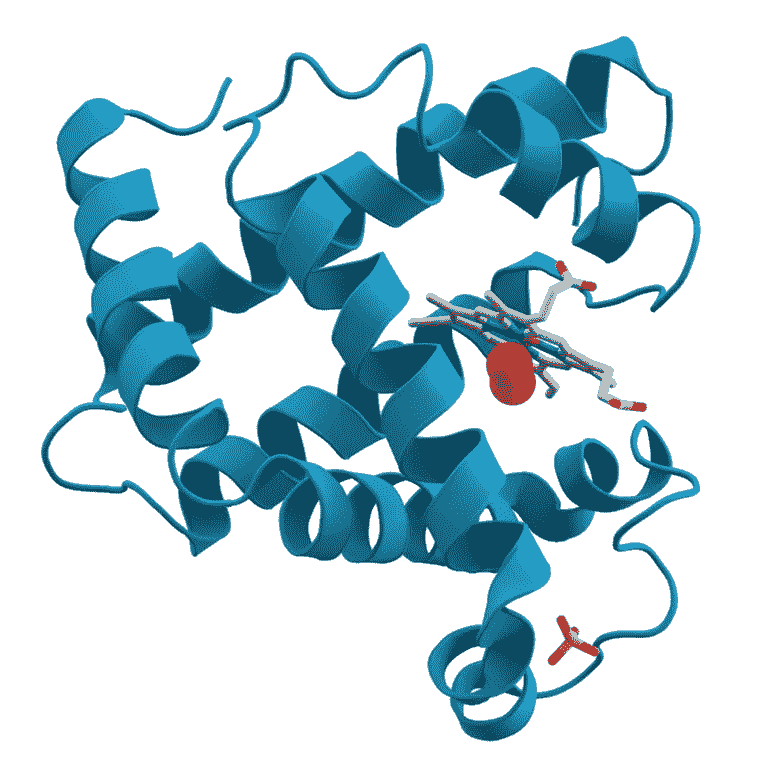
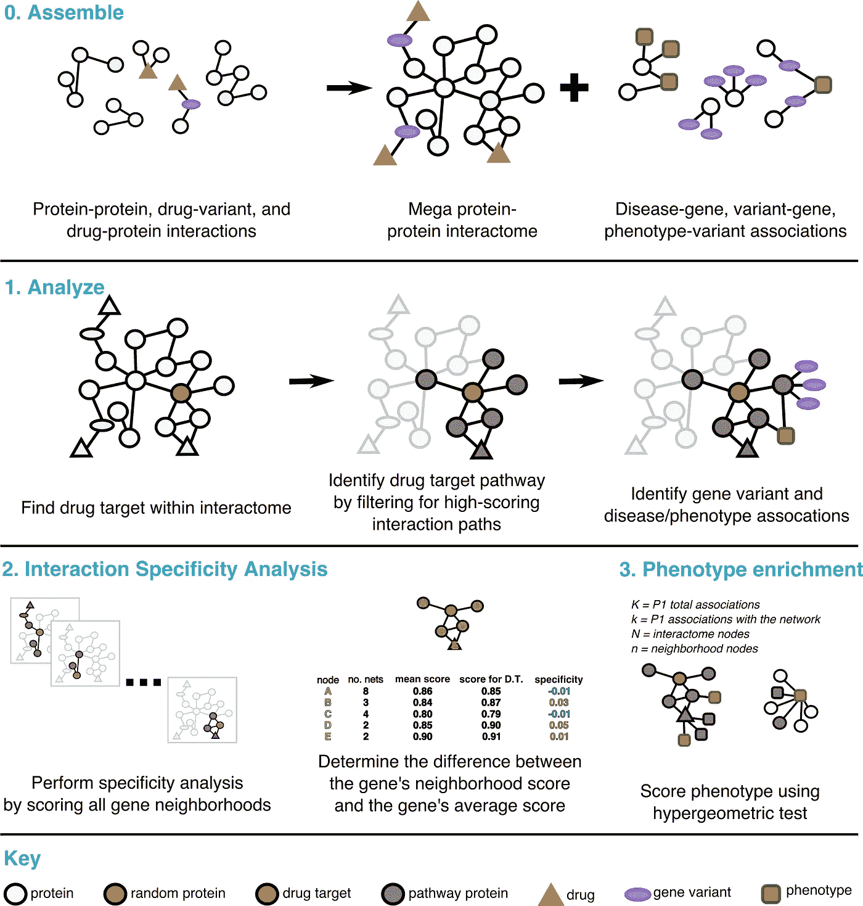

# 人工智能不会革新药物发现

> 原文：<https://towardsdatascience.com/ai-is-not-going-to-revolutionize-drug-discovery-c41df686732d?source=collection_archive---------43----------------------->

## 这只是另一种技术

Atorvastatin (stick figure) bound to its target, HMG CoA-reductase (blob). By A2–33, CC BY-SA 3.0, [https://commons.wikimedia.org/w/index.php?curid=19039469](https://commons.wikimedia.org/w/index.php?curid=19039469)

制药业陷入了困境。尽管仍有巨大的利润，但这是一个不可持续的轨迹。简而言之，开发一种新药的成本呈指数增长，而药品收入呈线性增长。如果没有一场革命，制药行业注定要失败。AI 能救吗？

Eroom’s law (Moore’s law in reverse) in action. US pharma R&D expenditures per approved drug. Own work, data from [Diagnosing the decline in pharmaceutical R&D efficiency](https://www.nature.com/articles/nrd3681)

US drug sales. Own work, data from [Medicines Use and Spending in the U.S.](https://www.iqvia.com/institute/reports/medicines-use-and-spending-in-the-us-a-review-of-2016)

乔治·赛尔夫最近在 TDS 上写了关于“[人工智能如何加速药物发现](/how-artificial-intelligence-is-accelerating-drug-discovery-931047f6ea9a)”的文章。这是一篇好文章，你应该读一读。我不太反对任何论点，这些论点归结起来就是:人工智能将使制药公司能够做他们现在正在做的事情，只是更快、更便宜、更有效。

药品公司是做什么的？他们发现与其他分子结合的分子。制药公司发现了与大分子结合的小分子(见上图)。生物技术发现大分子也能与大分子结合。人工智能确实会帮助他们做到这一点(制药比生物技术多得多)。

这远远不足以拯救他们。

尽管寻找候选药物的效率低且成本高，但这不会导致药物研发和审批成本的指数级上升。请看第一张图表的 x 轴。它可以追溯到 1950 年，趋势平稳，没有中断。1950 年，我们甚至不确定 DNA 是遗传物质。我们无法对蛋白质进行测序，而且刚刚开始解析它们的结构。事实上，当时甚至不清楚他们*有没有*稳定的结构。

Schematic diagram of the structure of myoglobin. It was the first protein structure to be solved. That happened in 1958, when it cost about $40M to bring a new drug to market. AzaToth [Public domain]

我不会浪费你的时间来列举过去 70 年来不断革新生命科学的所有技术进步。任何 TDS 的读者都知道它们数量众多，内容充实。

今天的药物发现比一、二、三十年前更加强大和有效。然而，药物研发成本以每年 9%的速度增长。候选新药的搜索效率*不可能*推动药物研发成本；如果是这样的话，这些成本将会呈指数级下降。

好吧，那么是什么在推动药物研发成本呢？

药物目标——更具体地说，缺乏药物目标。这些是药物结合的大分子。几乎所有的都是蛋白质，当然是由基因编码的。没有那么多的人类药物目标(细菌和病毒目标是另一回事)。人类基因组只编码 19000 种蛋白质。其中大约十分之一与疾病有关，是可能的药物目标。[大约一半的](https://www.ncbi.nlm.nih.gov/pmc/articles/PMC6314433/)已经被“下了药”。

最先被麻醉的是治疗效果最强的。它们是最容易识别的。从某种意义上说，他们就像矿井里的掘金者。最大的最先被摘走，不费吹灰之力。随着时间的推移，大多数金块会被发现，即使它们没有被有效地发现。所有剩下的都是灰尘，你必须筛选成吨的灰尘才能找到它们。

大多数新药批准已经是针对孤儿适应症的:在美国影响不到 20 万患者的适应症。许多都是超孤儿，影响不及 10K 患者。我们已经到达了罕见疾病的终点，在这里为单个患者设计了 T4 疗法。

事实上，人工智能(被 Deep Genomics 过分夸大的)的第一批成功声明之一是对威尔逊氏病的治疗，这种病可能影响美国的 10K 人。人工智能开发的治疗方法适用于这些患者中的 1/50(如果有效——它还没有进入临床试验)。在最好的情况下，这相当于帮助了每 150 万人中的 1 人。

也许人工智能可以破解药物开发中的一些长期难题。一种无毒的肿瘤抑制蛋白 p53 的功能增强配体，通常被描述为“不可破坏的”，将是一大胜利。像这样一鸣惊人的机会有几个，但只是几个。

A recent computational approach to drug discovery. From [PathFX provides mechanistic insights into drug efficacy and safety for regulatory review and therapeutic development](https://journals.plos.org/ploscompbiol/article?id=10.1371/journal.pcbi.1006614#). CC BY license.

我预计人工智能主要影响像威尔逊氏病这样的小众疾病。这将是真正的价值创造。但不是一场革命。不在公共健康领域，也不在制药公司的财务健康领域。

七十年来，Eroom 定律描述了药物研发成本的轨迹。这 70 年见证了比以往所有生物科学历史总和还要多的革命性进展。他们看到了监管体制的多重演变。他们看到了管理最佳实践方面的许多改进。这些事情都没有触动 Eroom 的，一点也没有。也许人工智能是一种会在所有其他人都失败的地方取得成功的技术。但我肯定不会打赌。

披露:自从 1999 年吉利德收购我的雇主(NeXstar Pharma)以来，我一直持有该公司的股票，自从 2000 年我帮助创立 SomaLogic 以来，我一直持有该公司的股票。