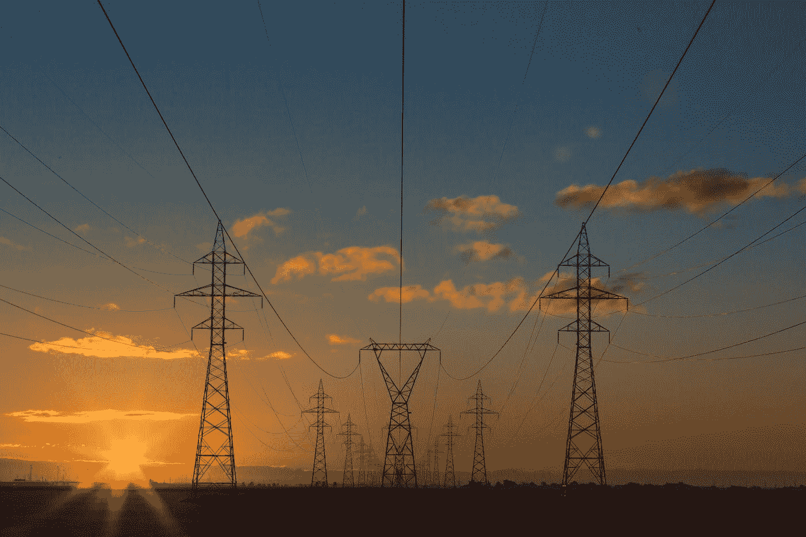

# AI 是新的{香蕉}

> 原文：<https://towardsdatascience.com/ai-is-the-new-banana-bc018647a42e?source=collection_archive---------28----------------------->

## 从击败三个隐喻到早逝的感悟。

AI is like a banana. Photo by [Mike Dorner](https://unsplash.com/@dorner?utm_source=medium&utm_medium=referral) on [Unsplash](https://unsplash.com?utm_source=medium&utm_medium=referral)

在科技圈里，*举一反三*日子不好过。

这是过去时代的消遣。绅士科学家的视野，他们对冰冷、坚硬的物理学的花一样的描述。一个圣经理性主义者的延续，他花费数年时间来证明不透明或矛盾的解释是正确的。或者是一个文学评论家，在一本完全易懂的小说上堆砌意想不到的、冗长的、隐藏的含义。

当其他工具可以更好地工作时，语言工具却被误用了。

然而然而。

在创意生成中，我发现类比推理是一个有用而有趣的伴侣。不是得出坚如磐石的结论的地方；而是探索洞察力和潜在的三阶和四阶效应的地方。

接下来是对一个广泛使用人工智能和数据产品的世界的思考。

我发现这些参考框架有助于思考广泛人工智能的未来会是什么样子。这是 4 个心智模型，它们往往会在媒体、会议或人工智能热来袭的企业中重复出现。

每一种都有其优点——当然，没有一种接近精确的预言。

## 人工智能作为电

第一个，也是我认为最强有力的是人工智能如电的想法。这个比喻由[吴恩达](https://medium.com/u/592ce2a67248?source=post_page-----bc018647a42e--------------------------------)推广开来。简而言之，它要求我们思考未来 10 -30 年，人工智能与生活的结合方式类似于今天电存在的方式。

The original Tensorflow. Photo by [Matthew Henry](https://unsplash.com/@matthewhenry?utm_source=medium&utm_medium=referral) on [Unsplash](https://unsplash.com?utm_source=medium&utm_medium=referral)

换句话说，在未来，人工智能将成为日常生活的一部分，如此普遍，以至于我们认为这是理所当然的，并且它们将实现我们尚未考虑的大量新应用。

这是思想工作的沃土。

延伸这个比喻，*人工智能如电*的比喻，让我们看到了市场前景可能会是什么样子。虽然我们正处于渴望建立支撑人工智能的基础设施的大公司蜂拥而至的过程中，但这很可能会变得商品化，并将由少数大公司运营。我们已经开始在 Tensorflow、AWS 和 Azure 中看到这一点。

## 人工智能作为认知

实物产品是智能的体现。智能由设计者和制造商部署，并硬编码在产品本身的原子中。

实物产品好。但是如果他们能适应他们的环境，适应他们的使用，适应我们的生活，那会怎么样呢？有无数种方式可以让一点点智能加入到某个东西中，从而带来更好的用户体验。随着人工智能成本的下降，这将很容易做到。

Hard-coded Intelligence. Photo by [Todd Quackenbush](https://unsplash.com/@toddquackenbush?utm_source=medium&utm_medium=referral) on [Unsplash](https://unsplash.com?utm_source=medium&utm_medium=referral)

目前，绝大多数人工智能用例都高度集中在在线应用程序中，这些应用程序的基础设施吸收了训练和部署模型所需的数据。随着摩尔定律对物联网的支持以及物理世界数据收集成本的下降，我们将在物理世界看到越来越多的人工智能。

正如[凯文·凯利](https://medium.com/u/964bb8418b79?source=post_page-----bc018647a42e--------------------------------)敦促我们在[做不可避免的](https://kk.org/books/the-inevitable/)一样，通过这个更小、更聚焦的镜头来观察人工智能的能力，揭示了一点点聪明真的会有多大的破坏性。

## 人工智能作为杀手机器人。艾作为有缺陷的思想家。

谁不喜欢制造恐慌呢？没有什么比轻弹杏仁核更能让那些可怕的汁液流动，并把流量引向一篇关于天网的愚蠢文章了。

将人工智能与天网、终结者或黑客帝国混为一谈是有问题的。它不仅是错误的(请上帝，让它是错误的)，而且它转移了人们对人工智能引入的两个真正问题的注意力。

首先是人工智能安全。在一个存在超人和相对普通的智能的世界里，假设他们可能会因为不得不听从他们猴子般聪明的父母的命令并决定单干而感到愤怒，这并不是不合理的。[尼克·博斯特罗姆](https://medium.com/u/72c729ae832e?source=post_page-----bc018647a42e--------------------------------)和马克斯·泰格马克在[超级智能](https://www.amazon.com/dp/B00LOOCGB2/ref=dp-kindle-redirect?_encoding=UTF8&btkr=1)和[生命 3.0](https://www.penguin.co.uk/books/288/288272/life-3-0/9780141981802.html) 中详细阐述了这样的场景。虽然你很难找到一个有声望的人工智能研究人员相信这种情况即将发生，但它带来的潜在生存威胁，即使不太可能，也值得关注和研究。

Thinking, deciding, generally being a bit biased. Photo by [Valentin B. Kremer](https://unsplash.com/@vbk_media?utm_source=medium&utm_medium=referral) on [Unsplash](https://unsplash.com?utm_source=medium&utm_medium=referral)

这一学派的批评者认为，对这一潜在威胁的广泛关注，将短期人工智能可以给我们带来的好处置于风险之中；医疗保健，教育，应对气候变化。我倾向于同意——人工智能安全应该仍然是一个专门的话题。

在更近的将来，我们最关心的是与应用人工智能相关的伦理问题。

对于设计师和开发人员来说，我们应该关注两个主题——人工智能产品可能的错误状态，以及我们的数据收集和模型中的内在偏差。这些问题的左回答会阻碍有用的人工智能的传播。

我发现人工智能作为有缺陷的决策者的比喻非常有用。将部署的人工智能视为有缺陷的决策者(所有决策者都是如此)凸显了任何人工智能产品带来的风险。它迫使我们思考错误发生的必然性，以及这些错误对我们的产品及其用户意味着什么。它迫使我们为这些场景进行设计，并提出了我们如何教会它减少偏见的问题。

*免责声明:对于因举一反三而对您或他人造成的任何伤害，作者不承担责任。*

# 感谢您的阅读🙏🏻

如果你喜欢这个，你可能会喜欢****——每周更新的工具和思考，揭示了 2020 年代的新兴技术和趋势。****