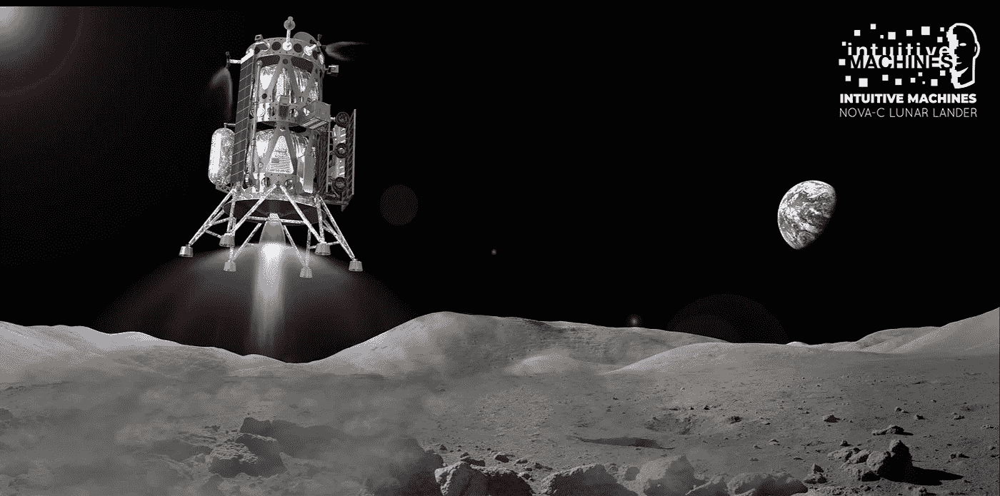
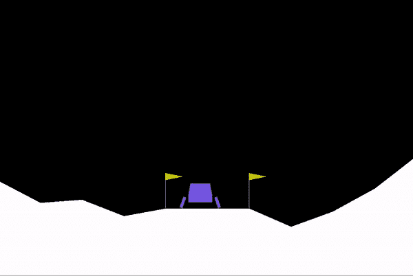
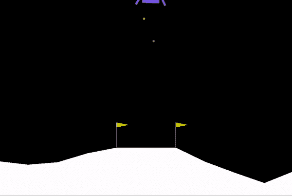
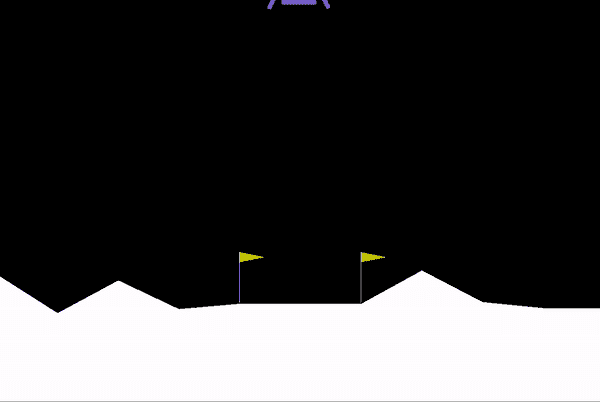
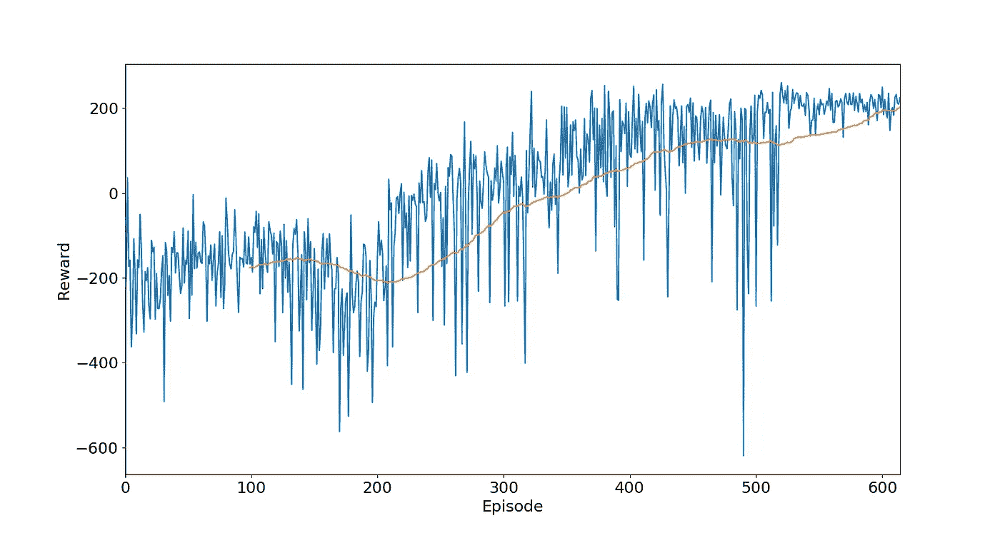
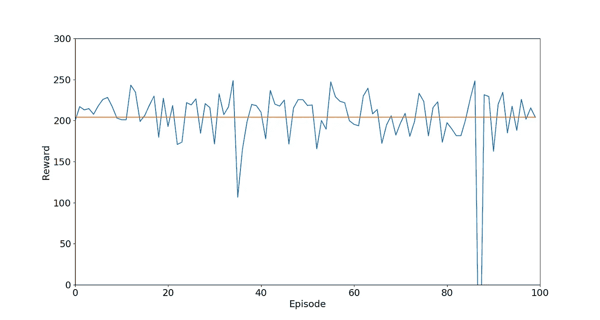
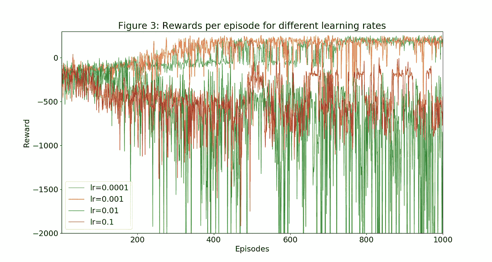
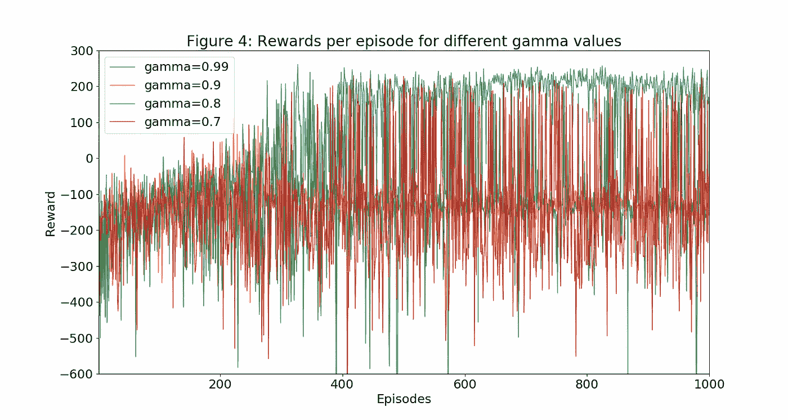
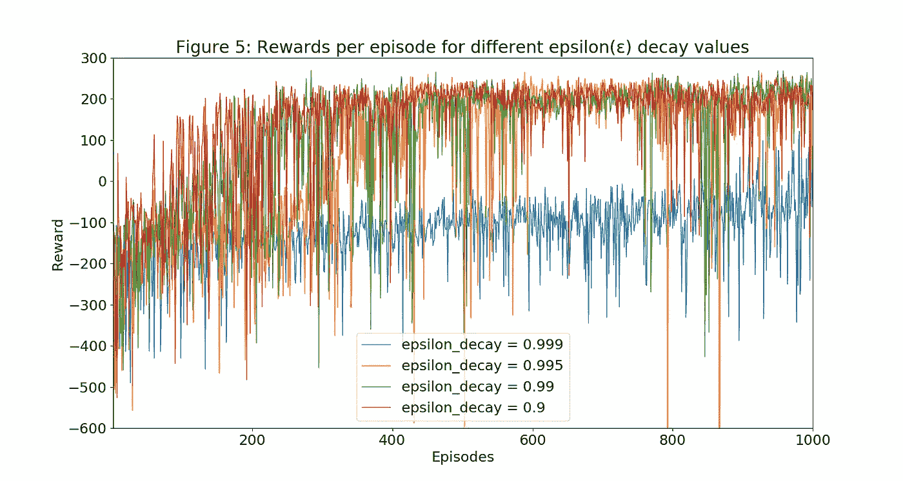

# 人工智能学习着陆火箭(月球着陆器)|强化学习

> 原文：<https://towardsdatascience.com/ai-learning-to-land-a-rocket-reinforcement-learning-84d61f97d055?source=collection_archive---------4----------------------->

## 看到人工智能通过从错误中学习来学习着陆火箭，直到它平稳地开始着陆火箭。

Image Credits: [NASA](https://www.nasa.gov/image-feature/intuitive-machines-concept-for-a-commercial-lunar-lander)

在本文中，我们将简要介绍**强化学习**，并通过训练一个**深度 Q-Network(DQN)** 智能体来解决 OpenAI gym 中的***【月球着陆器】*环境。**

**我们将看到这个**人工智能代理最初如何不做任何**关于如何控制和着陆火箭的事情，但是随着时间的推移**它从它的错误中学习**并开始改善它的性能**最终学会完全控制**火箭并完美着陆。**

****

**强化学习是一个庞大的话题，我们不打算在这里详细讨论所有的内容。相反，本文旨在用一些强化学习的实际例子来弄脏我们的手，并展示 RL 在解决真实世界用例中的实现。**

**我们将讨论使用 DQN 背后的基本原理，并将涵盖训练神经网络时遇到的*经验回放*和*探索-开发困境*。最后，我们将讨论智能体的训练和测试性能以及超参数对智能体性能的影响。**

**完整的代码可以在这里的 [Github 库](https://github.com/fakemonk1/Reinforcement-Learning-Lunar_Lander)找到。**

# **什么是强化学习？**

**强化学习是人工智能(AI)中讨论最多、关注最多和思考最多的主题之一，因为它有可能改变大多数业务。**

**强化学习的核心是这样一个概念:积极的奖励可以强化最佳的行为或行动。与初学走路的孩子学习如何走路类似，世卫组织根据他们经历的结果调整行动，例如，如果之前的大步使他们摔倒，就迈出一小步。机器和人工智能代理使用强化学习算法，根据环境的反馈来确定理想的行为。这是机器学习的一种形式，因此也是人工智能[的一个分支。](https://en.wikipedia.org/wiki/Artificial_intelligence)**

# **强化学习在行动中**

**强化学习在行动中的一个例子是 2017 年头条新闻中的 [AlphaGo Zero](https://deepmind.com/blog/alphago-zero-learning-scratch/) 。 [AlphaGo](https://deepmind.com/blog/alphago-zero-learning-scratch/) 是 Deepmind 开发的一个机器人，它利用强化学习，在中国古代围棋比赛中击败了一名世界冠军。这是人工智能(AI)首次击败职业围棋选手。围棋被认为比国际象棋等其他游戏更难让计算机获胜，因为它的大得多的 [*分支因子*](https://en.wikipedia.org/wiki/Branching_factor) 使得使用传统的人工智能方法非常困难，例如 [*alpha-beta 剪枝*](https://en.wikipedia.org/wiki/Alpha%E2%80%93beta_pruning) 、 [*树遍历*](https://en.wikipedia.org/wiki/Tree_traversal) *、*和*启发式* *搜索。***

# **月球着陆器环境**

**我们正在使用 OpenAI gym 的“月球着陆器”环境。这个环境处理着陆器在着陆台上着陆的问题。在 [OpenAI gym 的 GitHub 页面](https://github.com/openai/gym)和 [OpenAI 的文档](http://gym.openai.com/docs/)中提到了设置这个环境的步骤。下面是简单的 env 变量，以便理解我们工作的环境。**

1.  ****状态**:状态/观察就是环境的当前状态。有一个 8 维连续的状态空间和一个离散的动作空间。**
2.  ****动作**:对于环境的每种状态，代理基于其当前状态采取动作。代理可以从四个独立的操作中选择操作:不执行任何操作、fire_left_engine、fire_right_engine 和 fire_main_engine。**
3.  ****奖励**:代理每行动一次，获得一个小的负奖励。这样做是为了教会代理人尽可能快速有效地着陆火箭。如果着陆器坠毁或停止，这一集被认为是完整的，它将获得额外的-100 或+100 分，这取决于结果。**

# **DQN 算法**

**包括经验重放和ϵ-greedy 探索的深度 q 学习算法如下:**

# **模型训练和超参数选择**

**为了运行“登月”环境的完整实验，我们将首先训练一个基准模型，然后做更多的实验来找出改变超参数对模型性能的影响。**

**最初，正如我们在下面看到的，代理非常不擅长着陆，它采取随机行动来控制火箭并试图着陆。它大部分时间都失败了，并且因为撞毁火箭而获得负奖励。**

****

**对于训练模型，没有经验法则来找出在神经网络中需要多少隐藏层。我进行了不同的实验来尝试输入层和隐藏层的节点大小的不同组合。下面的基准模型是根据训练时间、训练所需的集数和训练模型性能等参数最终确定的。**

*   ****输入层** : 512 个节点，观测空间计数为 input_dim 和“relu”激活函数**
*   ****隐藏层** : 1 层，256 个节点，带“relu”激活功能**
*   ****输出层** : 4 节点，带“线性”激活功能**

**尽管如此，这种模式有时会在平均奖励 170 美元后出现分歧，并需要超过 1000 集才能出现分歧。我发现这种行为可能是由于模型的过度训练，并实施了' ***提前停止* '** 。早期停止是停止神经网络过度训练的实践。为了实现这一点，如果最近 10 次奖励的平均值超过 180，我会避免为特定的剧集训练模型。**

**缓冲区容量大小选择为 500000，以避免因经验元组过大而发生溢出。针对 2000 集的最大集数来训练模型，并且已训练模型的停止标准是最后 100 集的平均奖励 200。**

**最终基准模型具有以下超参数:**

*   *****学习率*** *= 0.001***
*   ****= 0.99****
*   ******重放 _ 内存 _ 缓冲 _ 大小*** *= 500000****
*   ******ε_ 衰变*** *= 0.995****

***经过大约 300 次训练，它开始学习如何控制和着陆火箭。***

******

***600 以后代理人就完全训练好了。它学会完美地操纵火箭，每次都能完美地着陆。***

******

# ***结果分析***

******

***Figure: Reward per each training episodes***

***上图显示的是培训时每次经历的奖励值。蓝线表示每一集训练的奖励，橙线表示过去 100 集的滚动平均值。代理随着时间不断学习，并且滚动平均值的值随着训练集的增加而增加。***

***前几集的平均回报大多是负的，因为代理人刚刚开始学习。最终，代理人开始表现得相对更好，平均回报开始上升，并在 300 集后变为正值。在 514 集之后，滚动平均值超过 200，训练结束。有几集代理人在这个时候收到了负面的奖励，但我相信如果代理人被允许继续培训，这些情况会减少。***

******

***Figure: reward per testing episode***

***上图是训练好的模型在月球着陆器环境下 100 集的表现。经过训练的模型在环境中表现良好，所有的回报都是积极的。100 集测试的平均奖励是 205。***

# ***超参数效应***

## ***A.学习率(α)***

****学习率*，设置在 0 和 1 之间，定义为我们接受新值和旧值的程度。这个值然后被加到我们先前的 q 值上，这实质上使它朝着我们最新更新的方向移动。将其设置为 0 意味着 Q 值永远不会更新，因此什么也学不到。设置较高的值(如 0.9)意味着学习可以快速进行。***

***为了验证不同学习速率对模型性能的影响，我用不同的学习速率训练了不同的代理。本实验选择的学习率为 *0.0001，0.001，0.01，0.1* 。对于学习率的中间值 0.001，观察到最佳性能。图 3 中的橙色线对应于这个值，提供了最大的回报。代理不能以更高的学习速率学习，并且奖励值是发散的。***

******

***Rewards per episode for different learning rate***

## ***B.折扣系数(γ)***

****折扣因子*影响其在价值函数中给予未来奖励的权重。一个*折扣因子* 𝛾=0 将产生代表即时奖励的状态/行动值，而一个更高的折扣因子𝛾=0.9 将产生代表代理期望获得的累积折扣未来奖励的值。下图显示了不同折扣系数下模型性能的变化。该代理在 gamma 值为 0.99 时具有最佳性能，用蓝线表示。***

******

## ***C.ε衰变***

***如上所述， *ε* 是我们不选择具有最高 Q 值的“贪婪”行为，而是选择随机行为的概率。 *epsilon(ε) decay* 是该值在一次发作后下降的衰减率。图 5 示出了对于不同的*ε(ε)衰减值的奖励值的变化。*ε衰减值为 0.999 时观察到最差的药剂性能，ε衰减值为 0.9 时观察到最佳性能，如图 3 中红色所示。这种行为可能是因为ε衰减值在勘探-开采之间提供了更好的平衡。***

******

***自深度 Q 学习首次推出以来，它已经取得了许多进展。在下一篇文章中，我将尝试更多的改进，如[双 Q 学习](http://arxiv.org/abs/1509.06461)、[优先体验回放](http://arxiv.org/abs/1511.05952)、[决斗网络架构](http://arxiv.org/abs/1511.06581)以及[扩展到连续*动作空间*](http://arxiv.org/abs/1509.02971) *。****

> ***附:这是我第一篇关于媒介的文章。请让我知道你的观点。如果您发现任何错误或对代码/算法改进有任何想法，请发表评论。***