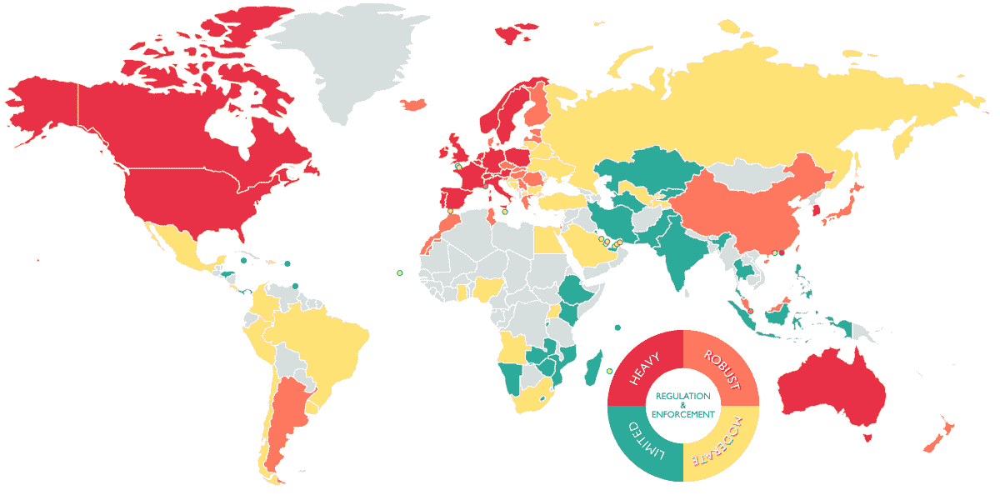

# 隐私法规时代的人工智能、人工智能和数据分析

> 原文：<https://towardsdatascience.com/ai-ml-and-data-analytics-in-the-age-of-privacy-regulations-2b79447d5239?source=collection_archive---------20----------------------->

早在 2010 年，大数据(特别是个人用户数据)的隐私就已经被认为是濒临灭绝的概念。当时，关于这个话题的大部分讨论都是积极的，本着“数字世界发展得越开源和互联越好”的精神。

九年后，人们的普遍情绪已经大不相同了。

如今，数据隐私、安全和治理是主要关注的问题，这是由不断增加的政府法规推动的。一百多个国家有不同的数据隐私法，其中最著名的是欧盟通用数据保护条例(GDPR)和加州消费者隐私法(CCPA)。

在隐私法、隐私法的执行和维护方面，仍有许多需要标准化的地方。但是数据安全和隐私保护的进程已经确定，而且不可能很快改变。

# 符合法规的人工智能面临的挑战

在这种环境下，处理用户数据的人工智能开发人员和数据科学家面临着几个挑战:

*   使数据既受保护又可访问(在需要合法披露时)
*   创建数据共享和处理方式，不仅保护隐私，而且允许在必要时收回信息
*   学习使用有限的数据，这些数据的使用受到法律的限制或管制
*   保持足够的灵活性和可解释性，以提供足够的流程透明度(此外，还能使技术经得起未来考验)
*   对于面向多个国家/地区的项目:遵守不同地区关于数据隐私和安全的法律

有许多方法可以应对这些挑战，所有这些都是目前人工智能讨论的焦点。以下是截至 2019 年底这些选项中最突出的一些。

# 数据去识别

## 数据匿名化

GDPR 和许多其他地区法规的直接要求之一是对收集的数据进行去身份化处理，将信息从其适用的真实人群中分离出来，并对其进行“脱敏”以供第三方访问。实现这一点的方法之一是数据匿名化。

至少从商业角度来看，匿名化的缺点是它在设计上是不可逆的，而完全匿名化的数据在战略分析或聚合方面的用途有限。抑制(将数据的可识别部分更改为固定的预定值)是这种方法的一个简单版本，通常用于公开发布的数据，以供无限制访问。

## 数据假名化

假名化和标记化是一种替代方法，旨在保留足够多的真实值数据，同时使用“假名”(标记)而不是敏感和识别部分，将它们连接到其发起者。这种方法通过应用额外的变量(分离的或以其他方式额外保护的)使更改可逆，并确保符合数据保护法规。例如，这通常用于确保符合支付卡信息数据安全标准(PCI DSS)。

## 数据概括

顾名思义，数据概化是一种通过取具体值(数值、地理等)进行数据去标识的方法。)并将它们更改为更广泛的类别。将特定年龄的人聚集成广义的年龄组、更大区域的位置等，同时确保数据不能转换成其原始状态是传统数据分析中广泛使用的一种流行方法。

为了更好地保护个人数据，尤其是在数据集较小或数据非常具体的情况下(例如，为公共统计收集的患有某些罕见疾病的人的健康记录)，概括通常与隐藏或屏蔽结合使用。

# 数据加密

提供数据安全和私有数据交换的方法之一是在训练神经网络和应用模型时部署数据加密。这也是法规中规定的敏感数据保护的必要措施。

采用对称加密(如 AES)、非对称加密(RSA、DSA 或 ECC)或两者的组合(混合加密)可确保数据的初始状态只能由具有密钥的授权代理访问。

为了允许加密数据的计算，部署同态加密，产生加密的输出(在解密之后，该输出将与来自相同的未加密初始数据的未加密输出相匹配)。创建完全同态的加密系统是 AI 和 ML 开发的优先事项之一，因为目前使用加密数据所带来的各种限制使它变得复杂。

使用加密并创建能够处理加密信息的模型，可以随后实现安全的数据交换，并在代理之间创造更多“模型即服务”的机会，而不会损害敏感数据的隐私。

# 合成数据生成

合成数据生成既可用作利用较小数据集实现有效机器学习的方法，又可用作数据去识别的方法，是一个有前途的概念，可有效用于确保遵守隐私法。

最初基于大量数据匿名化实践，合成数据生成主要用于测试和模型训练。目前，正在积极开发各种方法作为多用途技术，用于在各种情况下创建和使用可靠的数据，而不受敏感的、个人识别的或难以获得的细节的影响。

# 雇佣数据隐私官来控制和确保企业的合规性

GDPR 实际上要求配备数据保护官(dpo)来监督处理敏感信息的某些类型的公司和项目的合规性。即使不与欧盟公民打交道，在[机器学习咨询](https://www.itransition.com/technologies/machine-learning)中任命一名合格的 DPO 或第三方专家来负责法规合规性也是至关重要的，尤其是在拥有大量用户数据集和多区域项目的企业环境中。

# 最后

在许多方面，隐私和安全的概念今天几乎可以互换。防止泄漏和违规可以被视为防止总体滥用，包括欺诈、盗窃、偏见和本质上包含在概念中的许多其他方面。

通过创建符合法规、透明、公平和安全的处理敏感数据的实践，我们将确保“人工智能时代”不仅成为高效、个性化、自动化解决方案的时代，而且成为颠覆和变革的时代。