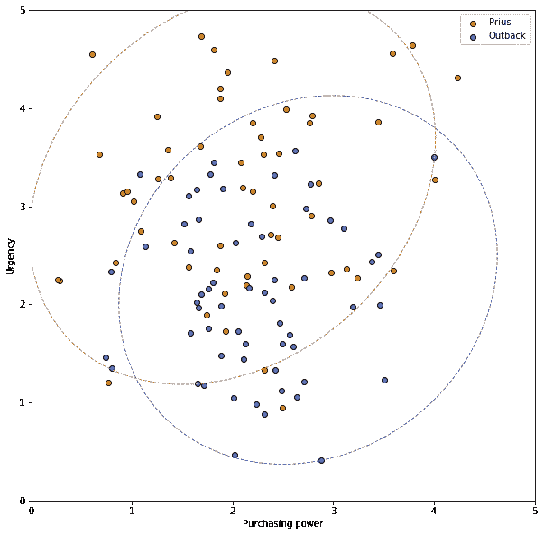
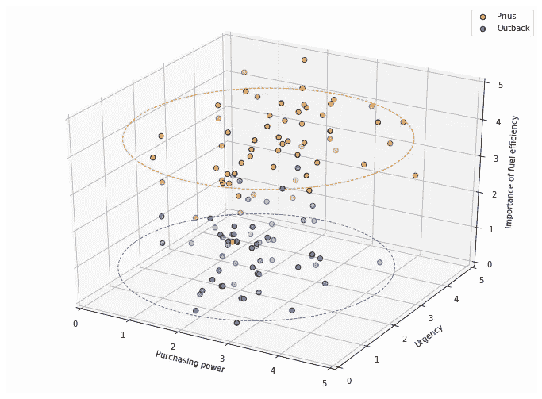
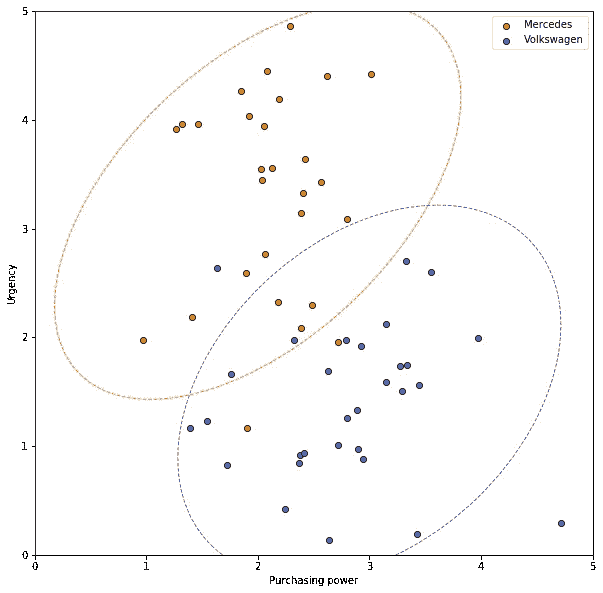
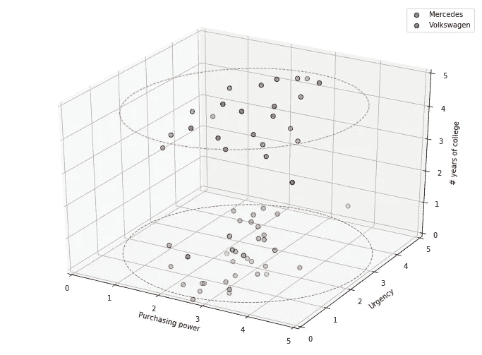

# 数据越多并不总是越好

> 原文：<https://towardsdatascience.com/ai-ml-practicalities-more-data-isnt-always-better-ae1dac9ad28f?source=collection_archive---------20----------------------->

## [AI/ML 实用性](https://towardsdatascience.com/tagged/ai-ml-practicalities)

## 尽管我们大多数人都有这样的直觉，即更多的信息不会有坏处，但它实际上是有坏处的。

*本文是* [*AI/ML 实用性*](/ai-ml-practicalities-bca0a47013c9) *系列的一部分。*

Photo by [Steve Harvey](https://unsplash.com/@trommelkopf?utm_source=unsplash&utm_medium=referral&utm_content=creditCopyText) on [Unsplash](https://unsplash.com/collections/1104477/blog-photos?utm_source=unsplash&utm_medium=referral&utm_content=creditCopyText)

# 真的吗？

如果你一直在关注这个系列，并且阅读了关于[数据](/ai-ml-practicalities-the-unreasonable-effectiveness-of-data-c0bfd44c5057)的不合理有效性，你可能会对这个标题感到困惑。整个想法不就是数据越多越好吗？

嗯，是也不是。

任何时候，当你试图模拟世界上发生的事情时，更多的例子只会帮助你的模型改进。

但是，了解每个例子的更多细节并不一定有帮助。如果额外的细节与你想学的东西无关，甚至会有伤害。

凭直觉，很难看出这怎么可能是真的。身高加上最喜欢的颜色可能不会比身高更好地预测体重。但是，获得这些无关的信息有什么坏处呢？

关键在于，你并不总是知道额外的信息是否相关，而且，在你完成判断这些信息是否有用的过程之前，它可能会掩盖数据中的真实关系。

一个例子将使这一点更加清楚。

# 两家汽车经销商

Photo by [Rahul Bhogal](https://unsplash.com/@rahulbhogal?utm_source=unsplash&utm_medium=referral&utm_content=creditCopyText) on [Unsplash](https://unsplash.com/s/photos/car-dealership?utm_source=unsplash&utm_medium=referral&utm_content=creditCopyText)

让我们想象两个非常做作的汽车经销商。第一家出售日本车，并提供斯巴鲁傲虎(Subaru Outback)或丰田普锐斯(Toyota Prius)。第二家公司销售德国汽车，让顾客在高端奔驰和大众甲壳虫之间进行选择。

两家经销商都希望优化各自销售团队的效率，并确定如果能够预测客户走进停车场时最有可能购买哪辆车，他们可以节省大量时间。

两家经销商都决定通过让他们的迎宾员收集一些关于客户的信息来解决这个问题，对这些信息进行评分，并将这些信息传递给将与客户打交道的销售人员。

每个经销商认为，最有可能预测客户选择的两个数据点是购买力，即客户能够负担的支出，以及紧迫性，即客户想要或需要新车的速度。

在收集了一年的数据后，第一家经销商创建了这个图。蓝点代表内地购买，橙点代表普锐斯购买:

Only partial separation of data

这两个输入似乎对结果有一些影响。橙色圆点表示左上角，蓝色圆点表示右下角。但是，有很多重叠，没有明确区分普锐斯和内地买家。因此，他们决定添加另一条信息。

普锐斯是一种小型混合动力车，耗油量高。因此，他们决定考虑燃油效率对客户的重要性。新数据如下所示:

Adding a third dimension reveals more separation

这正是我们希望在添加更多信息时看到的。第三个维度更清晰地将数据分为两组。在这种情况下，即使没有额外的数据点，额外的输入也会使从这些数据中学习变得更加容易。

现在，让我们看一个例子，第三维没有帮助。

在第二家经销商处，最初的数据收集工作立即显示出了令人鼓舞的结果。这一次，橙色圆点代表奔驰，蓝色圆点代表大众。

Strong, but not 100%, separation in two dimensions

这是我们第一次绘制数据时希望看到的那种图表。这两个类别被清楚地划分为几个集群，很少有离群值。他们对数据运行 ML 算法，找到两个圈起来的聚类。

尽管如此，德国汽车经销商的一名热切的销售人员指出，根据他的经验，教育水平是谁会购买奔驰的一个很好的预测因素。他问道，为什么不在模型中加入这个因素呢？在最坏的情况下，它不会告诉我们任何我们不知道的事情。

因此，经销商向模型中添加了一个反映大学毕业年数的输入，并制作了这张图表:

Adding a third dimension obscures the true separation

与第一个图表一样，数据明显分为两类。但是，新的信息是一个红鲱鱼。

教育水平集中在 0 到 4 年之间，中间值很少，可能是因为大多数客户要么上过 4 年制大学，要么根本没上过大学。但是，每个集群包含大约相同数量的奔驰和大众买家。

第三个维度，教育水平，揭示了数据点之间的距离与他们可能购买的汽车类型无关。

# 深度与广度

在这个虚构的例子中，新数据实际上误导了我们。但是，即使它只是无关的，并添加了随机噪声，它也会暗示数据点之间的人为距离。而且，随着我们添加越来越多的这些不相关的数据点，数据点之间的不相关距离将会主导我们关心的数据点。

像人类统计学家一样，一个好的机器学习算法可以消除不相关的特征，当数据清楚地显示它们是不相关的。但是请记住，我们总是只处理所有可能数据的一个样本，任何两个样本看起来相关的可能性很小，即使它们不相关。

通过添加许多额外的字段，使数据集*变得更宽*，增加了某个地方的某些东西看起来相关而实际上不相关的几率。减轻这种风险的唯一方法是通过添加更多的例子使数据集*更深*。