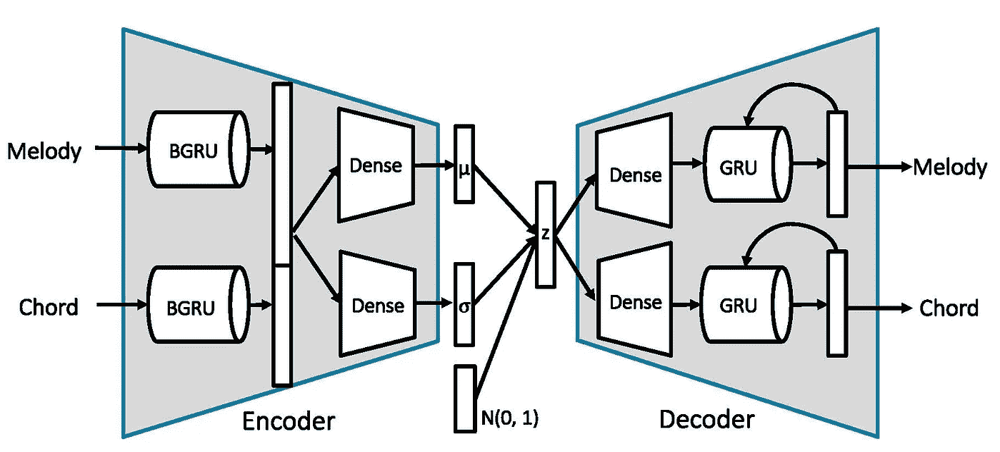

# 人工智能音乐第二代-铅表变化

> 原文：<https://towardsdatascience.com/ai-music-generation-ii-lead-sheet-variation-1884133e4f1?source=collection_archive---------20----------------------->

# 先享受一下吧！！！

> 艾全曲生成

AI Full Song Generation Sample1 — by combining chord progression from two different songs and get a minor to major feeling

AI Full Song Generation Sample 2 — by taking the contour of the melody and chord as the condition

继我们之前在[音乐编曲](/ai-music-generation-lead-sheet-composition-and-arrangement-b984208f8519)上的工作，我们不仅想添加一些乐器作为旋律的伴奏，还想改变旋律或和弦。这里，我们介绍使用变分自动编码器的我们的模型的三个应用。

# 铅片变化

如何方便音乐人作曲？这个想法来自一些音乐家的想法，他们会从一首歌的一些现有剪辑中找到灵感。问题是，由于版权问题，他们不能直接使用这些剪辑。那么我们能做什么呢？

> 自动生成这些剪辑的变体怎么样？

## 演示

首先让我以披头士的歌曲 ***Heyjude*** 为例，向大家展示一些我们 LeadSheetVAE 模型制作的 demos:

Original Song of Heyjude

Little Variation of Heyjude

a Variation of Heyjude that automatically change it into C minor key

Larger Variation of Heyjude

## 模型

这些变体都是由我们的 Lead Sheet VAE 模型生成的，代码在 [Github](https://github.com/liuhaumin/LeadsheetVAE) 上公开。欢迎来到 fork，尝试并享受其中的乐趣。如果你觉得很酷，别忘了给个**星** XD。

这项工作已经作为演示论文发表在 ISMIR2018 上。如果你对模型的细节感兴趣，这里有[的论文链接](https://liuhaumin.github.io/LeadsheetArrangement/pdf/ismir2018leadsheetarrangement.pdf)【1】。该架构如下所示。

Lead Sheet VAE model architecture

通过使用递归变分自动编码器，我们通过双向 GRU 编码器将旋律和和弦信息压缩到潜在空间中。由于 VAE 模型有一个约束，即它的潜在空间应该接近高斯分布。因此，在生成阶段，我们可以从潜在空间中随机采样一个点，并将其重建回来。让我们来听一些例子

4-bar random samples from VAE model

8-bar random samples from VAE model

# 潜在应用

该模型甚至可以通过对一些特征进行调节并生成相应的音乐来扩展到条件生成或完整歌曲生成。因为时间的关系，我可能会在我以后的故事中描述详细的想法。但是让我们先听一些演示吧！！！

AI Full Song Generation Sample1 — by combining chord progression from two different songs and get a minor to major feeling

AI Full Song Generation Sample 2 — by taking the contour of the melody and chord as the condition

# 参考

**【1】【论文】**郝-*、吴孟轩*和易-、 [**通过混合生成模型**](https://liuhaumin.github.io/LeadsheetArrangement/pdf/ismir-2018-leadsheet-arrangement.pdf)【Lead Sheet Generation and Arrangement】*ISMIR 后期开发与演示会议*，2018 *。*

**【2】【开源代码】**【https://github.com/liuhaumin/LeadsheetVAE 

# 以前的帖子

*   [艾音乐生成——领衔作曲编曲](/ai-music-generation-lead-sheet-composition-and-arrangement-b984208f8519)