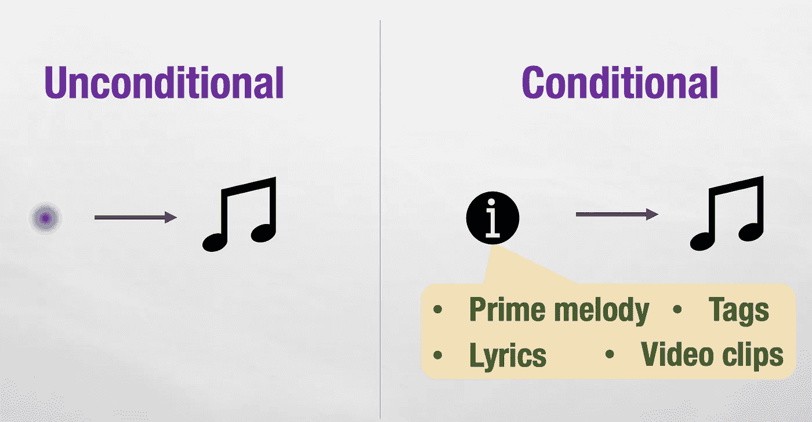
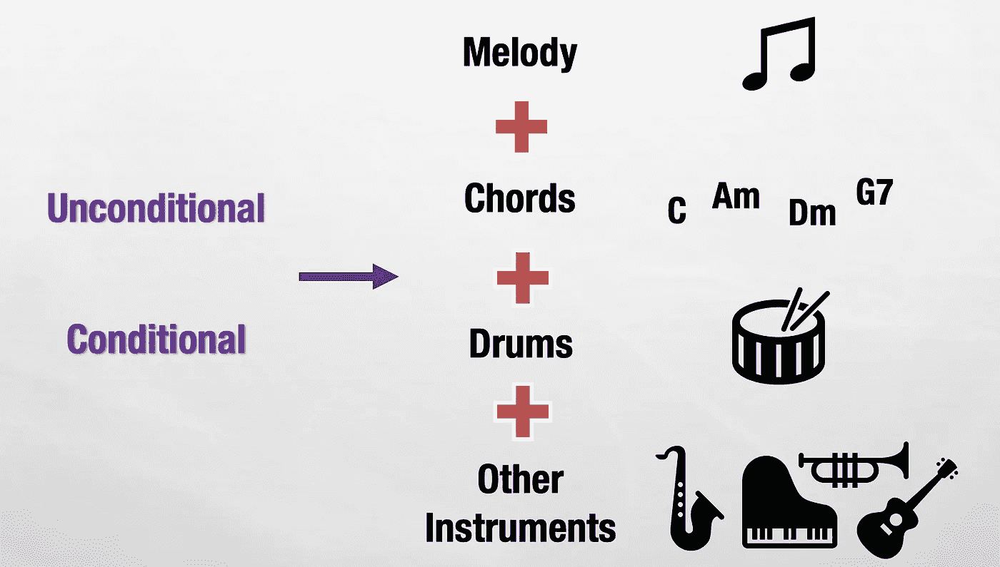
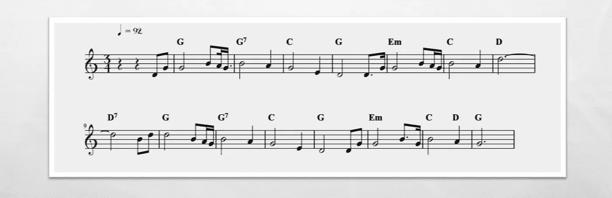
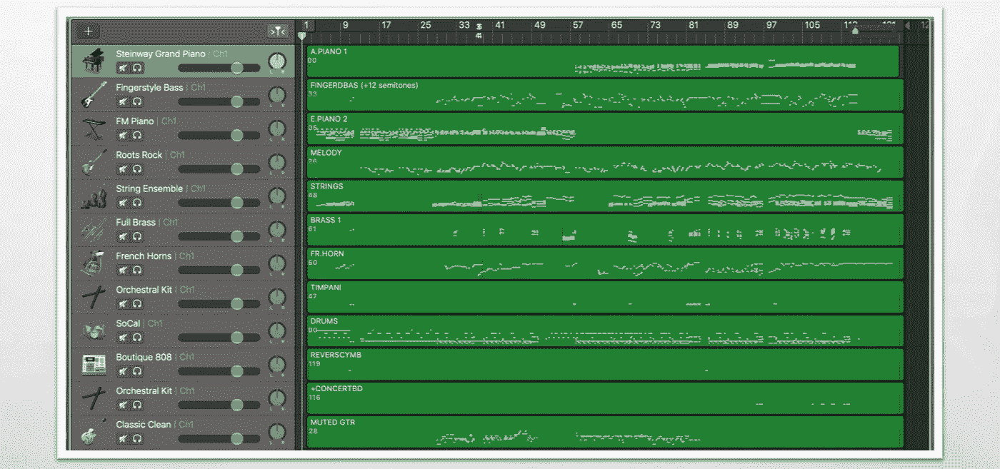
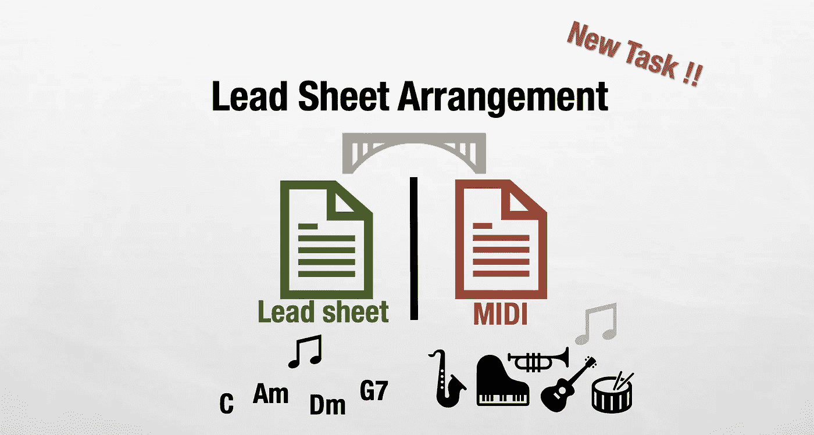
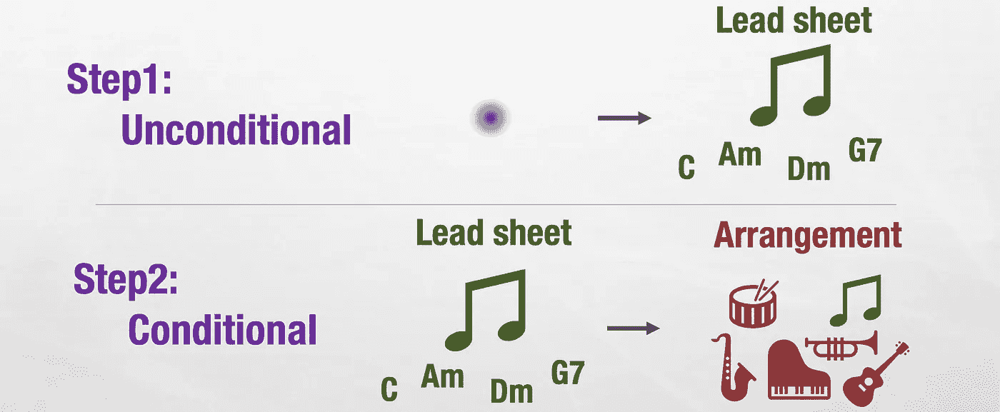
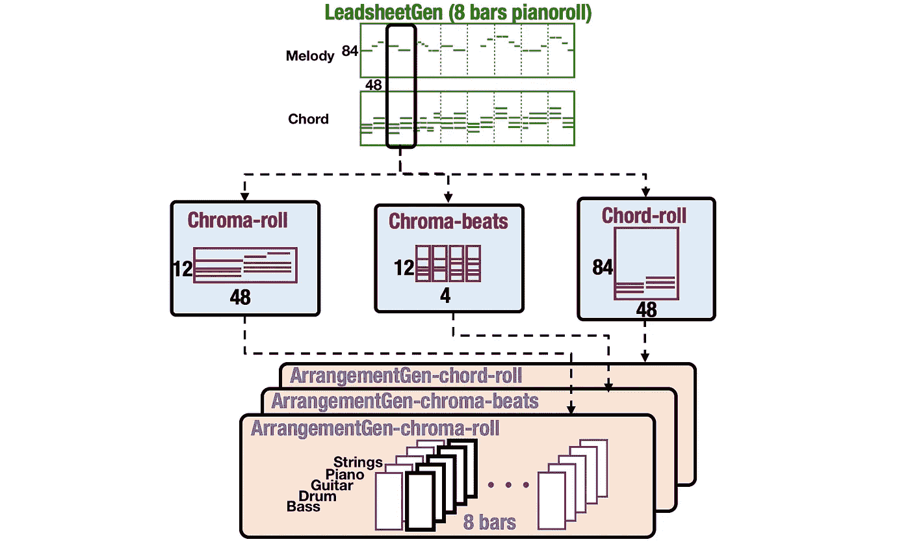
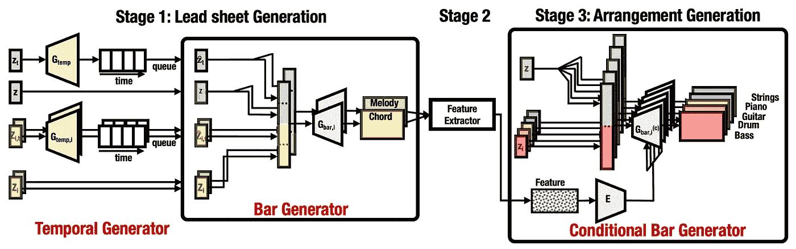
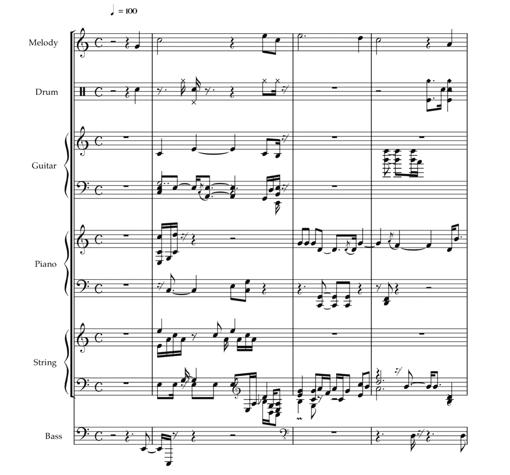

# 人工智能音乐生成-铅表组成和安排

> 原文：<https://towardsdatascience.com/ai-music-generation-lead-sheet-composition-and-arrangement-b984208f8519?source=collection_archive---------16----------------------->

S *自 2018 年起，我加入* [***音乐与 AI 实验室***](http://musicai.citi.sinica.edu.tw/) *，由* [***易教授-杨玄***](http://mac.citi.sinica.edu.tw/~yang/) *指导，做 AI 音乐一代研究。在那个时候，已经有很多关于使用深度学习算法进行音乐生成的工作。通过文献调查，我们发现从事音乐生成的人通常从生成* ***旋律*** *开始。*

# 旋律生成—无条件或有条件

旋律生成可以根据生成模型的类型进一步分为两类——无条件生成和有条件生成。

**Unconditional generation**: Generates melodies from scratch. **Conditional generation**: Generates melodies from conditional information.

因此，你可以从零开始或者从一些给定的信息中产生旋律。例如，将主旋律(即第一个小节或前两个小节的旋律)赋予模型，并让它继续为后面的小节生成旋律。您还可以为模型添加一些标签，如情感标签或流派标签，以便模型可以生成符合条件的旋律。歌词和视频剪辑等其他信息也是人们尝试条件生成的潜在应用。

> 但是只生成旋律是不够有趣的，对吗？

# Melody++怎么样

现在，从模型输出的角度来看，除了只生成旋律，还可以生成和弦，也就是所谓的铅片生成。此外，我们可以用鼓产生旋律和和弦，让音乐更有节奏感。最终，我们还可以添加其他乐器，以管弦乐的形式演奏。

Melody + Chords + Drums + Other Instruments

# 我们的目标

我们的目标不仅仅是旋律一代或旋律加和弦(主音)一代，而是拥有全套乐器的一代。我们以一首流行歌曲*《我一无所有》*为例，有三个版本(即只有旋律、旋律+和弦、多乐器)。最后一个版本是我们正在处理的任务。

Melody only version

Lead sheet version

Multi-instruments version

# 我们的挑战

正如我们所知，要建立深度学习模型，我们需要数据集。因此，我们从数据集的角度来讨论挑战。为了构建音乐生成模型，有两种类型的数据集。第一个叫做铅板，第二个叫做 MIDIs。

从铅表，它提供了旋律和和弦，所以如果你只是想做旋律生成，你可以使用旋律部分。此外，如果你也想产生和弦，你可以两者都用。让我给你举一个铅表的例子。

Amazing Grace by John Newton in lead sheet format

所以使用这种格式，你可以训练生成旋律和和弦，因为 lead-sheet 提供了它们，以前的作品如[***improv _ rnn model***](https://github.com/tensorflow/magenta/tree/master/magenta/models/improv_rnn)(谷歌洋红】[***midit***](https://arxiv.org/abs/1703.10847)(我们的实验室)都在这种数据集格式上进行过训练。但是如果你想产生鼓和所有其他乐器，那么你需要使用 midi。让我给你看看下图中的 MIDI 文件。

I have nothing by Whitney Houston in Midi format

相对而言，很少有人生成 MIDI 作为输出，因为与只包含旋律和和弦的铅表生成相比，它更困难。这里，您需要注意更多仪器之间的依赖性。例如，在 MIDI 中有 128 种乐器设置。当然，我们可以将它们简化为四个或五个乐器，但你仍然需要注意它们之间的依赖关系，这样它们在一起演奏时才会连贯。

一个名为[***muse gan***](https://github.com/salu133445/musegan)的模型，是我们实验室之前在 AAAI 18 上发布的，试图生成多音轨的音乐。以下链接提供了 MuseGAN 的结果。

 [## 穆塞甘

### 音乐生成的人工智能

salu133445.github.io](https://salu133445.github.io/musegan/) 

你会注意到结果中的主要问题是音乐中没有**旋律线**。为什么？

> 因为通常 midi 文件不会指定旋律在哪里。有时由钢琴演奏，有时由小提琴演奏，有时由别的什么东西演奏。

因此，从数据集可用性的角度来看，我们可以看到明显的差距，我们只有铅表格式或 MIDI 格式的文件。

虽然我们想创作一首有旋律、和弦和其他乐器的歌曲，但我们被迫停下来。用铅板，我们只能产生旋律和和弦。有了 MIDI，我们可以生成多声道，但是不知道旋律和和弦在哪里。

> 所以这项工作的任务是弥合差距，从单纯的旋律或铅板的产生到一个新的任务，我们称之为“铅板排列”

# 我们的方法

我们将铅板排列分为两部分。第一种是无条件生成模型，从零开始生成铅片。第二种是条件生成模型，它以铅片作为输入，生成排列。

Two Steps Approach for Lead Sheet Arrangement

但问题仍然存在，我们如何处理条件排列生成，因为如果我们希望模型做到这一点，我们仍然需要两者都成对的数据集。

> 应对这一挑战的关键思想是使用**和弦相关的特性**。铅表文件有明确的和弦。在 MIDI 文件中，虽然它没有指定和弦的位置，但是您可以从 MIDI 文件中提取一些和弦相关的特征。因此，和弦可以用作在铅表文件和 MIDI 文件之间进行交流的一种方式。

# 我们的模型

这个模型基于 MuseGAN，它使用钢琴卷帘窗形式作为数据表示。

在我们的第一阶段，称为铅表生成，我们只是把音乐曲目数量缩减为两个(旋律和和弦)。这项工作的第二个贡献是，我们发现在短语生成中使用递归模型可以捕获流行歌曲中更多的重复模式[1]。

在我们的第二阶段，所谓的铅表安排，我们应用条件 MuseGAN 学习生成五个轨道的文书根据和弦相关的特征作为条件。

我们把 lead sheet 格式和 MIDI 格式的文件都变成钢琴卷帘窗的形式，如下图所示。我们将 8 个小节制作成一个片段。每个条形由 48 个时间步长组成。纵轴是音高范围，我们总共使用 84 个音高。

System Flow

System Architecture

# 结果

Amazing Grace Arrangement Demo

更多结果显示在演示页面:【https://liuhaumin.github.io/LeadsheetArrangement/ 

# 结论

我们提出了第一个通过两步流程进行铅片排列的模型

> 步骤 1:用于引导表生成递归卷积 GAN 模型可以捕获流行歌曲数据集中更多的重复模式
> 
> 步骤 2:条件化的 GAN 模型通过弦相关的特征来桥接两个数据集的间隙。

# 参考

**[1]【论文】**郝——刘敏，和易——杨玄。  *在 Proc 中。IEEE 机器学习与应用国际会议(ICMLA)，2018 年 12 月。*

**【2】【开源代码】**[https://github.com/liuhaumin/LeadsheetArrangement](https://github.com/liuhaumin/LeadsheetArrangement)

**【3】【演示网站】**[https://liuhaumin.github.io/LeadsheetArrangement/](https://liuhaumin.github.io/LeadsheetArrangement/)

# 下一篇文章

[艾音乐第二代——铅表变奏](https://medium.com/@liuhaumin/ai-music-generation-ii-lead-sheet-variation-1884133e4f1)