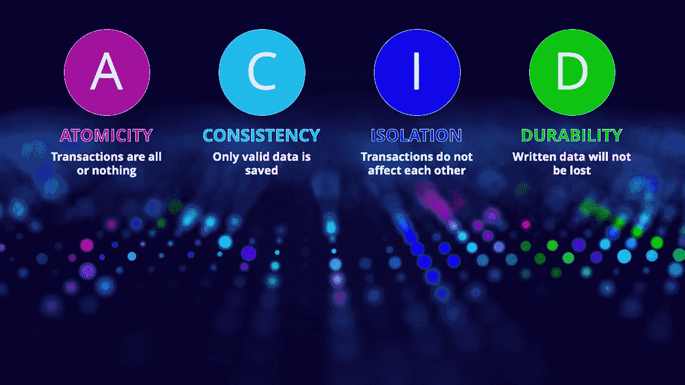
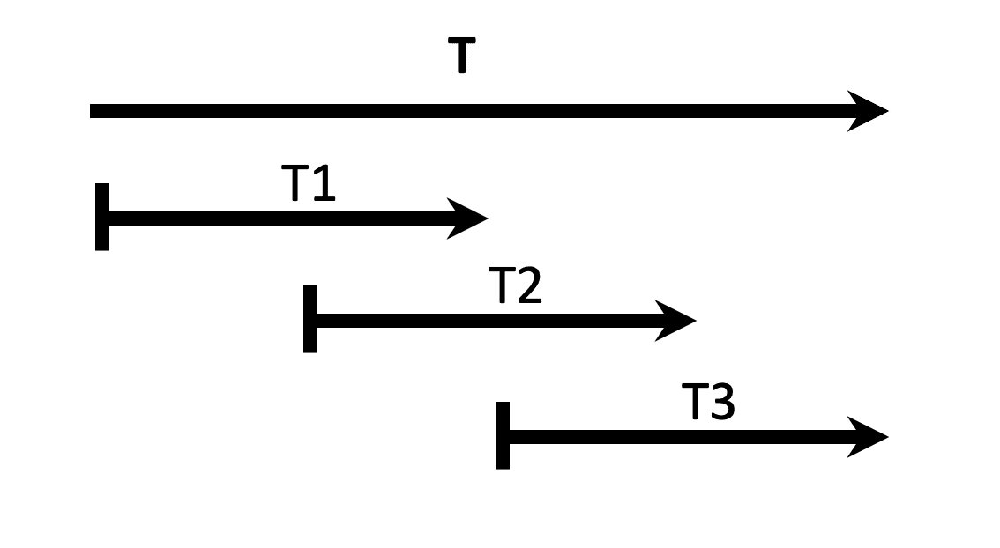
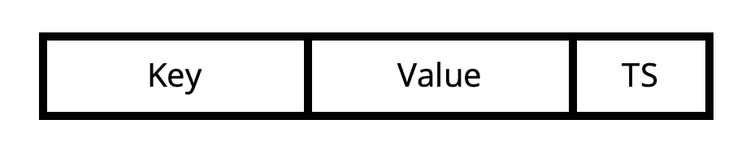
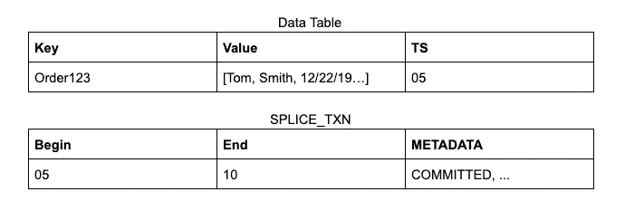
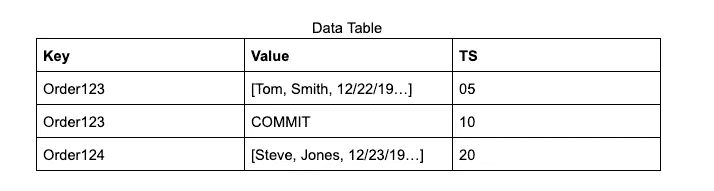
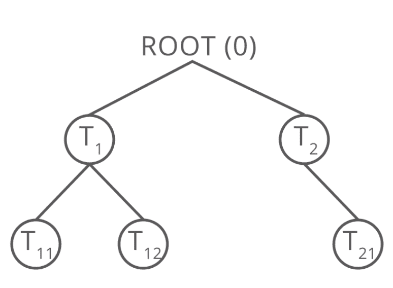
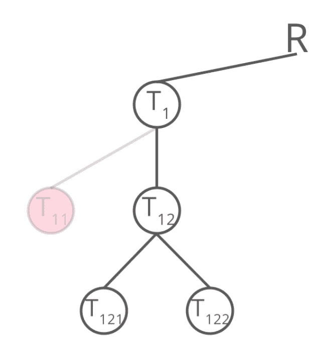
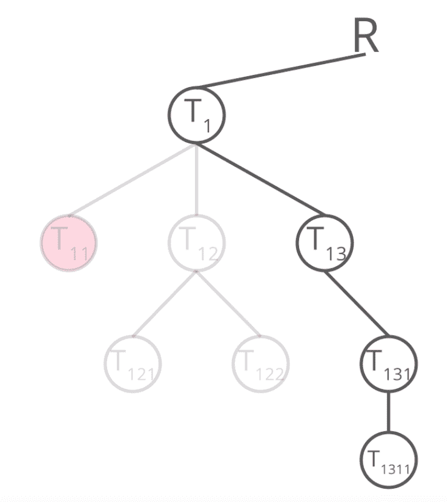
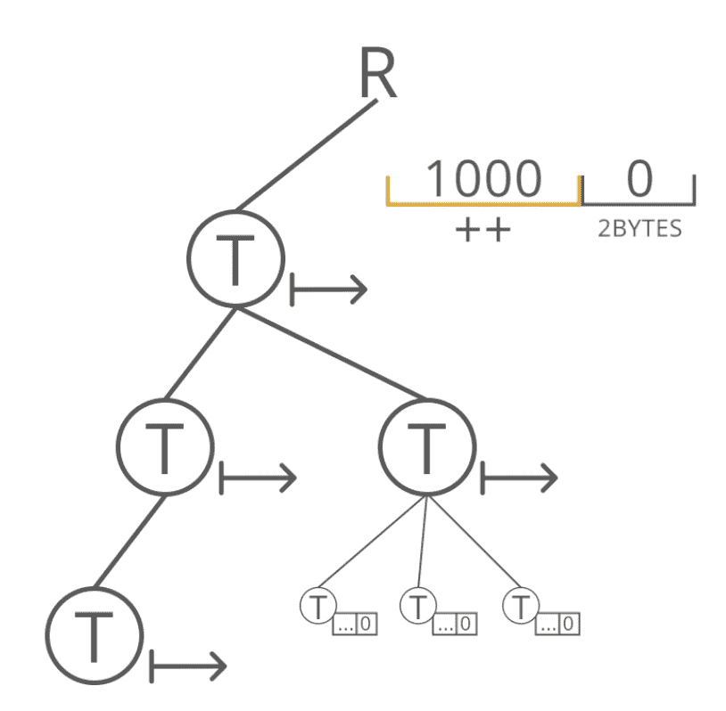

# 分布式 ACID 事务的实现

> 原文：<https://towardsdatascience.com/ai-on-acid-an-implementation-of-distributed-transactions-for-ai-applications-25cb8d2ec9b6?source=collection_archive---------14----------------------->

丹尼尔·戈麦斯·费罗和蒙特·兹韦本

# 介绍

Splice Machine 是一个混合事务/分析处理数据库(HTAP ),旨在使遗留应用程序现代化。通过将传统 RDBMS 数据库的各个方面(如 ANSI SQL 支持和 ACID(原子性、一致性、隔离性、持久性)事务)与内存分析和机器学习的可扩展性、效率和可用性相结合，Splice Machine data platform 支持数据驱动的智能应用程序，从而转变企业。

为了支持关键任务应用程序，Splice Machine 的专利分布式事务系统跨多个表、记录、约束和索引维护 ACID 属性。

Splice Machine 使用实现多版本并发控制(MVCC)的快照隔离设计，在每次更新时创建记录的新版本，而不是就地覆盖旧数据值。这意味着用户可以访问他们开始阅读时可用的数据，即使该数据随后被写入者更新。

由于每个事务都有自己的虚拟“快照”，事务可以并发执行，而没有任何锁定。这导致了非常高的吞吐量，并避免了麻烦的死锁情况。

在本白皮书中，我们将讨论拼接机如何:

*   **使用快照隔离实现分布式事务**
*   **执行分级交易**
*   **高效执行 OLTP 和 OLAP 工作负载的事务**

# 快照隔离

拼接机使用时间戳来实现快照隔离。为了实现快照隔离，系统要求一个事务只能从它开始之前已经提交的其他事务中读取数据。为了说明时间戳的概念，我们在下图中显示了三个独立事务的开始和提交时间。在这种情况下，第三个事务(T3)将知道第一个事务(T1)所做的更改，因为它们在 T3 启动之前已经提交，但是第二个事务(T2)将不知道这些更改。

*Snapshot isolation requires a specific transaction to read data from other transactions only after they have been committed.*

快照隔离还要求我们检查写-写冲突。当两个事务在时间上重叠并试图写入表中的同一行时，就会发生写-写冲突。在上面的示例中，如果事务 T1 和 T2 写入表中的同一行，其中一个将不得不中止，因为它们同时发生，而 T1 和 T3 不会发生写-写冲突。

为了解决这个问题，Splice Machine 在事务开始和提交时为它们分配时间戳。所有时间戳都是唯一的，因此不会有任何两个事务具有相同的开始和提交时间戳。在拼接机器平台中，我们使用时间戳服务器来确保时间戳是唯一的，并且它们是单调前进的。时间戳服务器通过联系共识管理器(即 Apache Zookeeper)来保留将由特定实例使用的时间戳块，使得没有其他并发实例可以使用相同的时间戳。这种方法对于恢复是必需的，以便在服务器出现故障时必须创建新的事务，整个集群只有一个唯一的时间戳可用。因为我们为集群提供了一组时间戳，所以任何对新时间戳的请求都可以由服务器在本地处理，而不是逐个事务地更新 Zookeeper 状态。这提供了更高的事务吞吐量，并消除了 Zookeeper 这个事务瓶颈。

拼接机将数据存储在 HBase 中。每个 HBase 记录包括一个带有键、值和时间戳的单元

*Structure of HBase record in Splice Machine.*

该键表示表中该记录的主键的值。该数据是该记录的表中所有列的压缩编码。Splice Machine 使用时间戳作为 HBase 单元的一部分来存储事务开始时间。因此每个事务都有自己唯一的开始时间戳。该时间戳由时间戳服务器提供，而不是通常的 HBase 时间戳。

您可能还记得我们之前的讨论，我们需要使用开始和提交时间戳来满足快照隔离的条件。这个条件要求事务只能读取已经提交的数据。因此，我们需要一种机制来将提交时间戳与特定的开始时间戳相关联。在 Splice Machine 中，我们使用一个名为 SPLICE_TXN 全局可见事务表来完成这项任务。该查找表存储开始和提交时间戳之间的映射，以及事务元数据，例如事务的类型，以及它是否已经被回滚。

假设我们有一个从时间戳 20 开始的事务，它需要查找一条记录。因此，如果表中有用户试图读取的事务数据，它将首先检查开始时间戳(在下面的例子中是 5)，然后通过参考 SPLICE_TXN 表来验证时间戳 5 和 10 之间的映射，以验证该事务已被提交。所以在时间戳 20，这个记录的值是可见的。

The Data Table holds the begin of the transaction and the SPLICE_TXN table has its end timestamp

我们用来优化 SPLICE_TXN 查找表的另一种机制是在 HBase 中添加一个具有特殊值的新记录。在下图中，该值由单词“Commit”表示当内存中的记录通过日志结构的合并树实现被刷新到磁盘时，或者在事务前滚操作期间，记录的最新值被合并到单个行中以避免 MVCC 解析的开销时，会发生这种情况。

*Optimization to avoid SPLICE_TXN lookup*

该值具有相同的键，它位于事务写入的实际数据旁边，因为记录是按键排序的。将提交时间戳写在数据本身旁边的原因是，当执行下一个事务时，不必参考查找表，而是简单地读取相应单元中的键和值，以在本地解析所有信息。在这种情况下，20 处的新事务将能够看到数据已经由事务 05 写入，事务 05 已经用时间戳 10 提交。这种方法大大提高了性能，因为它比在 SPLICE_TXN 表上进行查找更快。

# 分级交易

Splice Machine 使用分层事务来管理复杂的语句。例如，分派给 Spark 的查询使用如下的分层事务。作为根事务的用户事务被分类为事务 0。基于此，语句事务/保存点是事务 0 的子事务，然后每个 Spark 任务得到自己的事务作为语句事务的子事务。触发器和我们的分布式写管道也使用分层事务。他们是这样工作的。让我们假设根事务的时间戳为零，并且是父事务。任何事务都可以有子事务，其行为类似于任何其他事务。子事务只能读取已经提交的事务写入的数据。子事务的行为依赖于父事务之间的关系。因此，如果这些事务的父事务能够从这些事务中读取数据，那么这些事务将只能读取由这些事务写入的数据。

*Splice Machine uses hierarchies to manage complex queries.*

本质上，子事务继承了父事务的视图，然后将相同的规则应用于自己。Splice Machine 根据事务场景以几种方式实现事务层次结构。第一个是当用户通过运行一个命令启动一个事务时封装执行。在这种情况下，我们在执行这个命令之前并不知道它是否会成功。例如，插入 100 行的命令可能会由于主键冲突而失败。在这种情况下，Splice Machine 不会回滚整个事务。指出如果任何一行失败，系统行为也可以被配置为使整个插入失败，这可能是有用的，因为这取决于用例。我们通过自动创建驱动语句的子事务来执行此操作。如果命令失败，我们回滚子事务，并为下一条语句创建一个新事务。在下图中，如果子事务 T11 失败，Splice Machine 回滚子事务，并为下一条语句创建一个名为 T12 的新事务。

*In case of a child transaction failing, it is rolled back to create a new transaction*

我们还使用子事务来实现保存点。每当我们创建一个保存点时，我们都用一个子事务封装它。如果用户决定返回到那个特定的保存点，他或她可以回滚整个事务集，并从那个特定点开始一个新的事务。保存点可以嵌套，如下图所示。

*Splice Machine uses hierarchy to encapsulate child transactions and to implement savepoints.*

层次结构的另一个重要功能是支持分布式执行。在用户将要运行分布式操作的情况下，我们将这个信息传递给将要执行这个分布式操作的所有节点。这方面的一个例子是运行导入功能。这个函数在 Spark 中运行，它同时从不同的机器中读取数据，并将数据从每个任务中直接插入 HBase。因此，每个任务接收实际信息，并创建其唯一的子事务，用于将数据写入 HBase。如果其中一些任务失败，Splice Machine 可以回滚部分失败的事务，并使用新的事务标识符重试这些任务。如果失败是灾难性的，我们可以使整个操作失败并回滚所有事务。

对于主要目标是实现低延迟的 OLTP 工作负载，创建开始和提交时间戳可能是一项开销很大的操作。我们通过识别持久的和内存中的事务来解决这个问题。所有根级事务都是记录在事务表中的持久化事务。在这种情况下，事务 ID 分为两部分。最低有效字节保留给唯一标识子事务的计数器，而实际事务 ID 在时间戳服务器中递增。因此，对于新的子事务，它不是从时间戳服务器获取新的时间戳，而是递增计数器。这允许我们唯一地标识子事务写入的数据，如果有回滚，我们可以在 ID 级别将它记录在事务表中。当我们在一台机器上运行 OLTP 事务并且可以访问这个计数器时，这种方法对于本地事务是有效的，我们可以为每个事务不断增加和维护唯一的 id。

*TransactionID is broken into two parts, the least significant byte is reserved for a counter to identify the child transactions.*

当我们用完增加计数器的位时，我们通过从时间戳服务器获得新的时间戳来创建新的持久化子事务。在这种情况下，子事务将具有来自时间戳 Oracle 的新序列号，并且计数器将从零开始，新的子事务将不断增加计数器。如果事务在 Spark 中不同的执行器上运行，而我们没有访问计数器的权限，那么这些事务必须被持久化。

由于执行的分布式特性，分布式任务或作业已经有了一些开销，所以获取 begin commit 时间戳不会有太大的影响。

# 结论

总之，我们认为拼接机平台可以执行 OLTP 和 OLAP 工作负载。我们的平台不要求事务为子事务获取新的时间戳，因为我们使用一个字节作为内存计数器。对于 OLAP 和分布式查询，Splice Machine 的分层设计允许用户创建同时执行但相互独立的多个事务，以便它们可以相互独立地启动、提交和重试。这使我们能够以安全和一致的方式管理事务性工作负载，这也非常高效，因为我们不需要集中的协调点。

如果您想了解 Splice Machine 如何工作的更多信息，请观看我们的“ [under the hood](https://info.splicemachine.com/UndertheHoodWebinarRecording.html?utm_source=medium&utm_medium=blog&utm_campaign=tx) ”网络研讨会，深入了解我们数据平台的内部情况。

# 关于拼接机

Splice Machine 是一个可扩展的 SQL 数据库，使公司能够将其传统和定制应用程序现代化，以实现敏捷、数据丰富和智能—所有这些都无需重写。

当您将 Oracle 和 DB2 应用程序迁移到 Splice 时，您不仅降低了数据库许可成本，还使应用程序能够大规模地添加新的数据源。

Splice Machine 使您能够将过去在不同平台上的分析和机器学习统一到应用程序中，从而减少 ETL 延迟和基础架构成本，并实现智能决策。