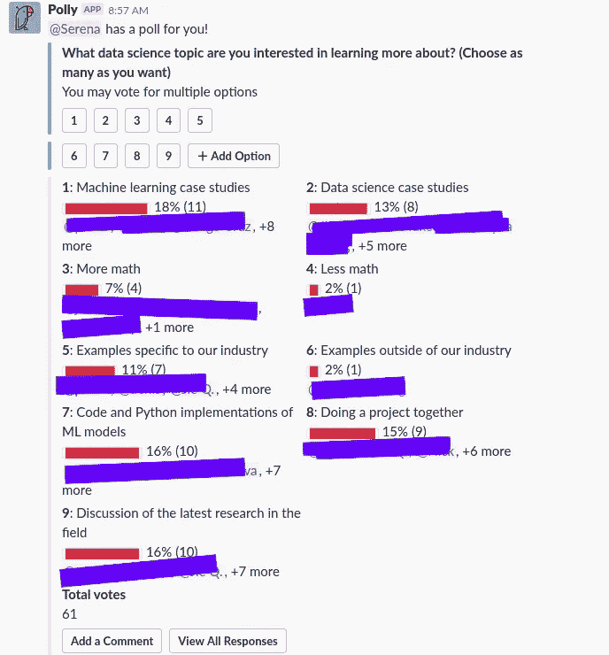
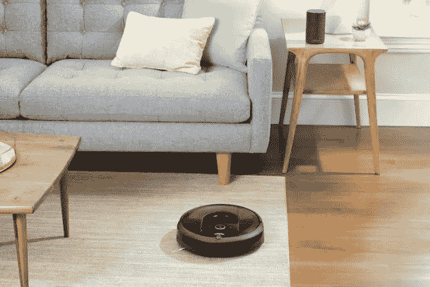
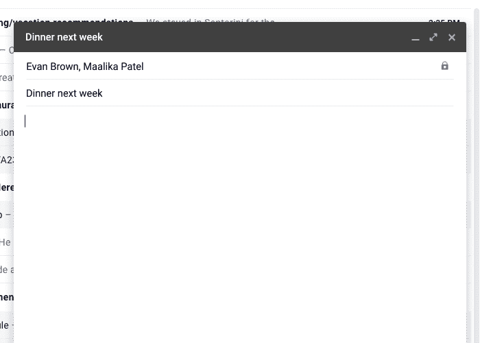
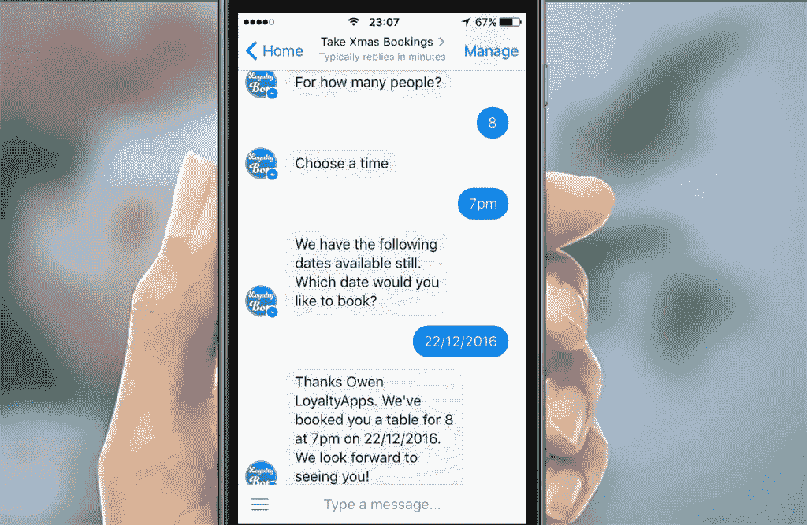

# AI 还是营销炒作？(我的第一顿午餐和工作中的学习)

> 原文：<https://towardsdatascience.com/ai-or-marketing-hype-my-first-lunch-and-learn-at-work-a0b596e8dcb8?source=collection_archive---------15----------------------->

我是我们公司唯一的数据科学家。这让我的工作有了很大的广度，这很好，但也让我很少有人能和真正的书呆子在一起。我指的是特定于数据科学的那种削弱——关于[其他主题](https://geekandsundry.com/shows/critical-role/)肯定有很多削弱，这也很棒。

出于看似无私但实际上相当自私的努力，我决定开始一次数据科学午餐和学习系列。该系列的目标是帮助我的公司在所有团队中增强其数据驱动的决策制定，而不仅仅是数据科学团队。对数据进行批判性思考并强调潜在数据集和商业机会的人越多越好。这就是无私的部分，我自愿花时间去教我的同事。自私的部分是，真的，我只是希望人们在谈到数据科学时与我保持一致，这样我可以从他们那里获得想法，他们可以突出我们业务中可能有助于探索的机会。如果他们开始自己做分析就更好了。我不介意让我的 60 位才华横溢的同事为我工作。

我的想法是有 5 个会议:

1.  首先是对整个主题的介绍，因为许多人甚至不知道数据科学的真正含义(有时包括我自己？).
2.  第二课(在撰写本文时尚未教授)将讨论基本模型的案例研究，以及一些更前沿的东西，包括 Python 中的示例代码。重点是，虽然数学可能很复杂，但通常现成的实现就能解决问题。
3.  第三节是选修课，有更多的数学知识，并讨论模型。显然人们想要更多的数学(见下图)。
4.  倒数第二课将是动手操作，我们所有人一起做一些探索性的数据分析，可能是在一些杂货数据集上，因为我们公司在杂货领域。
5.  最后一课将涉及我们所有人一起建立一个模型，可能是为了预测某人是否会在给定的一周内购买花生酱，或者类似的事情。我选择花生酱的原因是因为我在第一课中反复使用了这个例子，它似乎很受欢迎。如果能从一开始就把事情联系起来就好了。

After the talk, I sent out a poll to see what everyone was interested in for the next lessons. The responses were really surprising- people want more math! (Names covered up to protect the privacy of my coworkers).

# 第一次演讲分三部分

我第一次会议的目标是为接下来的事情做好准备。我把演讲分成三个部分:

1.  “深度学习教父”Geoffrey Hinton 的故事，他与多伦多的关系，以及为什么每个人都应该知道他是谁，并为生活在这样一个伟大的技术中心而自豪。
2.  一遍数据科学、机器学习的定义，试图重现我第一次试图理解所有这些术语时所经历的过程。这哪里是“人工智能还是营销炒作？”部分进来了。
3.  为什么我们都应该关心。我举了一个例子，是从一个风险投资家的演讲中借来的:在 90 年代，公司想知道如何建立他们的互联网战略。在 21 世纪初，拥有互联网战略是理所当然的，但下一个大问题是如何建立移动战略。在 2010 年，问题不在于互联网或移动战略，这些都是既定的。问题是如何驾驭“人工智能”。人工智能将走上互联网和移动的道路——它将被整合到所有的业务中。未来每个公司都会是 AI 公司，在某些方面。所以即使你不关心 AI，你也得关心。

# AI 还是营销炒作？

我对演讲的这一部分感到紧张。我想让讨论继续下去，并指出“人工智能”一词的含义因谈话对象的不同而不同。一个计算机科学家会给出一个与非技术营销经理截然不同的答案。这没什么不对的！(或者我是这样告诉他们的。完全公开，我不是人工智能这个术语的狂热粉丝，但我知道它在最近几年有了不同的含义。

这个“游戏”本来是有争议的。*假定*是。结果非常…没有争议。但仍然很有趣。

游戏如下。我会向观众展示不同的产品图像，这些图像可以被视为“人工智能”或“营销炒作”，这取决于你在和谁说话。我会站在那里，让他们互相讨论，等待他们的答案:这是人工智能还是营销炒作？

以下是我向同事展示的一些例子，以及他们的回应:

# 1.老派亚马逊产品推荐。

Source: mageplaza.com.

观众的回答:营销炒作。(和我的回答一样)。

# 2.自动驾驶汽车。

Source: phys.org.

观众的回答:营销炒作。(和我的回答不一样)。

# 3.Roomba(记得你客厅布局的吸尘器)。

观众的回答:营销炒作。肯定是营销炒作。(不是我的回答)。

# 4.谷歌的自动补全/句子建议。

观众回答:AI(经过一番讨论)。(和我的回答不一样)。

# 5.聊天机器人

观众的回答:营销炒作。(我的回答:看情况)。

# 那么什么是*AI 呢？*

*在游戏结束时，我告诉观众我认为哪种产品配得上“人工智能”这个词。我告诉他们，我认为 AI 是一个机器学习驱动的系统，可以与现实世界进行交互。自动驾驶汽车，亚马逊的无人机送货系统，Roomba，汉森机器人的索菲亚，我会称之为人工智能。任何我称之为机器学习驱动的产品。(真的，我宁愿不要用人工智能这个术语来形容任何技术。但是如果必须的话，那就是我上面给出的定义。使用这个定义为我的演讲提供了一个很好的叙述。*

*有趣的是，我的观众不同意我的观点。游戏*是有争议的，但不是我希望的那种。我希望观众会不同意，但事实上，他们不同意我的观点。我站在那里说“人工智能存在！”而他们在那里异口同声地说“没有人工智能这种东西。”我猜这是一个(前端/后端)开发者的视角。非技术观众要么保持沉默，要么似乎同意他们的同事。我也同意他们的观点，但我也认为这个术语这些年来已经发生了很大的变化。它在五年前的意义可能与在下一个五年后的意义不同。这个领域变化很快。**

# *离别感言:我觉得我做得很好！*

*我对几件事感到惊讶:*

1.  *人们真的出现了。大多数是技术人员，但也有一些高级人员。*
2.  *有一个似乎一致的回应，人工智能只是炒作，一个营销术语，人工智能不存在，也不可能存在。*
3.  *演示期间对数学的恐惧(我给他们看了一张显示反向传播的计算图)，但几天后对*更多*数学的渴望。*
4.  *观众的互动，与我和他们自己的互动，还有笑声。当我演讲时，我总是试图让观众发笑！*
5.  *从讲座一开始，每个人都很感兴趣并参与其中。人们确实对数据科学感兴趣。*
6.  *它会带来的疲劳。自从我硕士毕业后(大约 18 个月前)，我就再也不用像那样做报告了。我都忘了演讲有多有趣多累了。*

# *跑个便当学学！很好玩！*

*我强烈建议每一位数据科学家考虑在他们的公司举办一次午餐和学习会议。这是完美的自私和无私的行为；两端的持续学习和知识共享机会。你可以练习公开演讲，提高你的沟通技巧，教你的同事，分享一些欢笑。最重要的是，它很有趣。*

**最初发布于我的个人网站:Serena . MC donnell . ca**