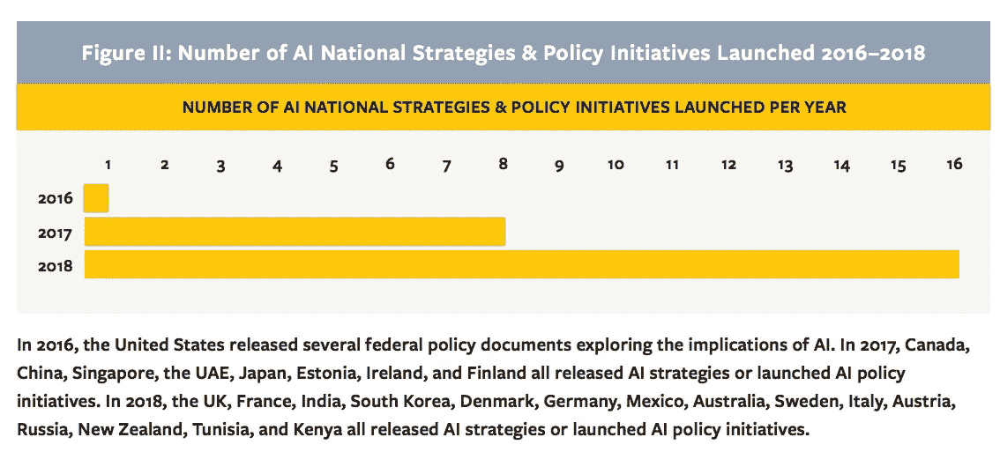
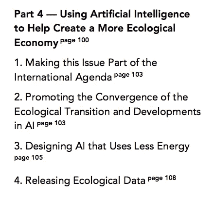
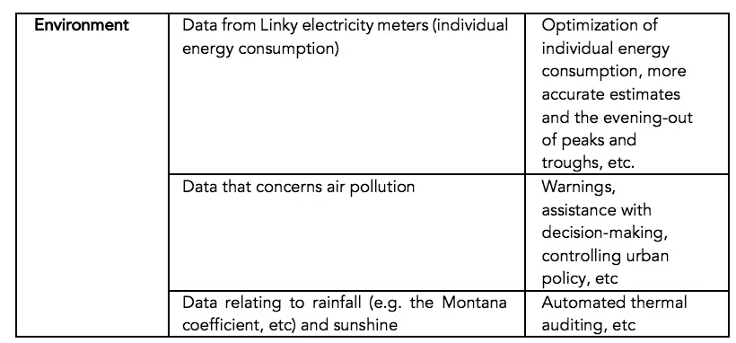
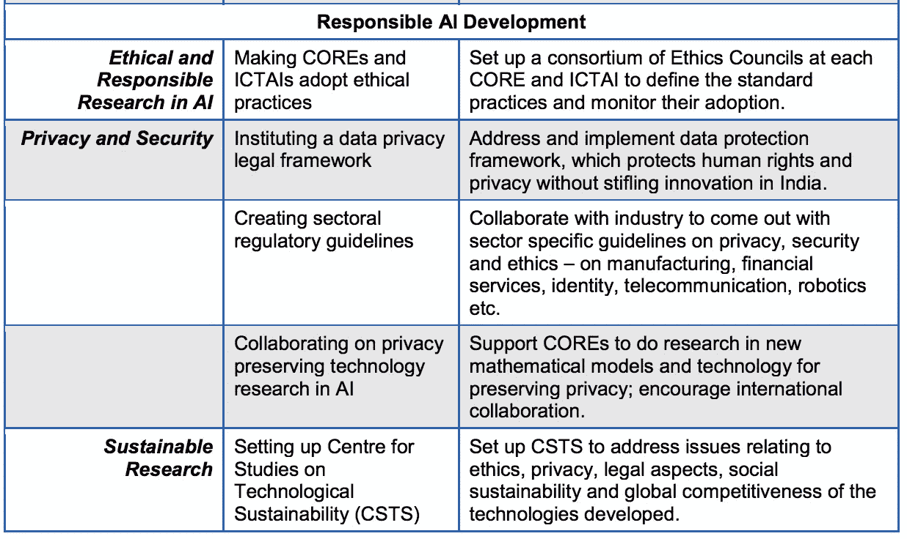

# 国家人工智能战略和气候危机

> 原文：<https://towardsdatascience.com/ai-policies-and-the-climate-crisis-7790f11ef23b?source=collection_archive---------32----------------------->


Photo by [@franckinjapan](https://unsplash.com/@franckinjapan)

## 世界各地的人工智能战略是否足以解决我们这个时代的决定性问题？

我们可以研究一下联合国安理会五个常任理事国——中国、法国、俄罗斯、英国和美国——的战略。然而，我也选择了印度的策略，印度有 1，366，417，754 人，是世界上第二大人口大国；它有强大的军事力量；并且正在大力投资人工智能。看看中国、法国、印度、俄罗斯、英国和美国的人工智能战略，在应对气候危机的方式上有明显的不同。中国、法国和印度有明确的优先权，而俄罗斯、英国和美国没有。

这些战略是每个国家总体政策的一部分，因此所描述的战略用于代表每个国家的人工智能政策，可能并不完全如此。无论是计划还是战略，每个国家的人工智能政策都比这些文件中所写的要多，然而这些不同的战略文件或计划将是本文的重点。

根据 Jessica Cussins Newman 在她的报告[走向人工智能安全](https://cltc.berkeley.edu/wp-content/uploads/2019/02/Toward_AI_Security.pdf)中的说法，在 2016-2018 年间，人工智能国家战略&政策倡议的数量有了很大的增加。我非常感谢 Newman 在撰写本文时所做的工作，因为她一直在绘制人工智能安全性，并通过这样做收集了不同策略的概述，这反过来又给了我一个更好的概述。



Retrieved on the 10th of November 2019

我将按字母顺序浏览这六个国家。

1.  中国
2.  法国
3.  印度
4.  俄罗斯
5.  联合王国
6.  美国

# 1.中国、人工智能战略和气候危机

## 1.1 中国的人工智能计划是否解决了气候危机？

One of the most [extensive analysis of AI Policy around the world](https://cltc.berkeley.edu/wp-content/uploads/2019/02/Toward_AI_Security.pdf) which I have found so far has been undertaken by Jessica Cussins Newman and is focused on AI Security. To begin I would say clearly that **climate is not mentioned specifically** in China’s [A New Generation of Artificial Intelligence Development Plan](https://flia.org/wp-content/uploads/2017/07/A-New-Generation-of-Artificial-Intelligence-Development-Plan-1.pdf) (新一代人工智能发展规划), AI Policy from 2017\. On the other hand **‘sustainable’ is mentioned four times**. There was **two mentions of environmental protection**. I will discuss these four mentions of sustainable; two of environmental protection; and the context within which they are mentioned. I have found six focal points that can be linked to addressing the climate crisis within China’s AI strategy from 2017.

## 1.2 以可持续发展为中心的智能化

*“发展智能经济，建设智能社会，维护国家安全，构建知识、技术、产业集群融合，人才、制度、文化相互支撑的生态系统，预见风险与挑战，* ***以智能*** *为核心推进可持续发展，全面提升社会生产力。 国力和国家竞争力为宗旨，加快建设创新型国家和世界科技强国，为实现“两个一百年”奋斗目标和民族伟大复兴提供有力支撑。”*

The first mention of sustainable is mentioned in the second section called *‘Overall Requirements’* within the first point *‘(A) Guiding Thought’*. Towards the end the 200 year goals are mentioned. The **Two Centenaries** (Chinese: 两个一百年) is a set of goals advanced by General Secretary Xi Jinping following the 18th National Congress of the Communist Party of China held in 2012\. It is said to be the basic foundation for achieving the “Chinese Dream”, another ideology advanced by Xi. They were formed back in the 80’s. The goal for 2020 is the elimination of extreme poverty in China, linking it to GDP.

```
Sustainability可持续性Kě chíxù xìng
```

“能保持持续的自然”，同样地，这可能与生态学以及其他有关持续能力的概念有关。

可持续发展一直是中国当前战略的重要组成部分，然而，将可持续发展与 GDP 部分挂钩可能是不幸的，因为越来越多的证据表明，这是一个可能产生负面影响的指标。更换这种测量工具可能是幸运的，但这可能不是一种简单的追溯方法。

## 1.3 人工智能的健康和可持续发展

*“人工智能的发展是一项关系全局的复杂系统工程。按照“构建体系、把握双重属性、坚持三位一体、强化四大支撑”的布局，形成人工智能健康持续发展的战略路径***。”**

*这里说的三位一体是半信半疑的，我可能是错的。然而，卡尔·冯·克劳塞维茨试图通过连接人民、军队和政府之间的关系来阐明战略的“三位一体”，孙子着眼于这些行为者之间的相互依存关系，同时考虑到自然、地形和法律在形成战略中的作用。就算我可能错了。*

*另一方面，它更有可能指的是(1)稳定的人民币，(2)开放边境，(3)控制自己的利率。这被称为不可能的三位一体。*

*这一部分不仅谈到了目标，以及可持续发展是核心，它还坚持认为通往目标的道路必须是健康和可持续的。*

## *1.4 跨学科可持续发展*

**“聚焦人工智能重大科学前沿问题，兼顾当前需求和长远发展，以突破人工智能基础理论瓶颈为重点，确保超前布局可能引发人工智能范式变革的基础研究，* ***促进学科交叉融合，为人工智能可持续发展*** *和深度应用提供有力的科学储备。”**

*在翻译的文档中提到了交叉整合，我选择将其翻译成跨学科的。*

*它不确定如何确保这一点，以及应该涉及哪些“类型”的学科。对学科整合的关注是一个有趣的想法，因为这在许多情况下被证明是具有挑战性的。在学术、商业或政府环境中，强大的科学储备也有助于促进这种合作，这当然是必要的。*

## *1.5 促进基础设施持续发展的可持续生态系统*

**“高性能计算基础设施。继续加强超级计算基础设施、分布式计算基础设施和云计算中心建设。* ***为高性能计算应用的持续发展构建可持续的生态系统*** *。推动下一代超级计算机研发应用。”**

*由于通往人工智能的道路必须是“可持续的”，因此需要一个可持续发展的生态系统是有意义的。可持续和一致当然可以有不同的解释，发展的速度可能是对项目可持续性的挑战。*

## *1.6 人工智能在环境保护中的应用*

**“人工智能为社会建设带来新机遇。我国正处于全面建成小康社会阶段，人口老龄化、资源环境约束等挑战依然严峻，人工智能在教育、***【城市运行】 ***等领域的应用，将极大提升公共服务*** *的精准化水平，全面提升人民群众的生活质量。”****

*这个目标太笼统，不能说得太具体，但又特别提到人工智能是一系列不同领域的机会。这里要强调的要点是，人们希望提高公共服务的精确性。各国政府一直希望在一个人口众多的模糊世界中更准确、更具体地运作。中国是世界上人口最多的国家，2017 年估计有 1379302771 人[。很难将定量理解等同于生活质量，但是对于如此大的数量，很明显，理解这些数据或做出决策可能涉及很大程度的自动化。](https://www.cia.gov/library/publications/the-world-factbook/rankorder/2119rank.html)*

## *1.7 智能环保*

*****智能环保*** *。建立大气、水、土壤等环境领域智能监测的大数据平台。构建陆海互动、大地互动、信息共享的智能环境监测网络和服务平台。研究开发资源能源消耗和环境污染物排放智能预测模型和预警方案。* ***加强京津冀、长江经济带等国家重大战略区域环境保护和突发环境事件智能防控体系*** *。”***

**这涉及到确保保护环境遗址和预测环境的突然变化。随着时间的推移，突然的变化预计会更频繁地发生，因此，能够使用更准确的模型来预测或了解大范围内正在发生的事情非常重要。预测必然是一种合作，世界各地的天气数据都是如此，然而，测量和预测的意愿并不新鲜——将人工智能加入其中并不是一件奇怪的事情。**

## **概述中国与气候相关的人工智能战略**

**我们可以看到 2017 年中国人工智能战略中与解决气候危机相关的六个焦点。我认为它在战略中得到了解决，可以在这些要点的基础上制定计划，或者在这些要点中提出论点，使项目具有生命力。每一点我都加了一个问题。**

1.  ****以智能为中心的可持续发展。** *我们如何让可持续发展成为 AI 发展的中心？***
2.  ****人工智能健康可持续发展的战略路径。****
3.  ****跨学科的可持续发展或/和学科整合。** *哪些学科需要整合，在国内和国外有哪些途径可以做到？***
4.  ****基础设施持续发展的可持续生态系统。** *中国政府如何审计其云提供商或资源提供商，以确保开发是负责任的？在不同的解决方案中可以看到哪种类型的能源使用？***
5.  ****人工智能在环境保护和提高公共服务精准化水平方面的应用。** *中国政府可以探索哪些与人工智能相关的政府技术来改善公共服务？***
6.  ****通过大数据实现智能环保和监控。** *中国如何与其他国家在环境保护和监测方面开展合作，5G 网络可以以何种方式用于这一目的？***

**最后，我意识到关于中国的争议并不能使这些观点没有问题。我对这些并不视而不见，但是理解我们如何共同努力解决气候危机是很重要的——因为这是一个可怕的危机，而中国是地球上人口最多的国家，我们都依赖于中国如何处理这个普遍的问题。**

# **2.法国人工智能战略与气候危机**

## **2.1 法国人工智能战略如何应对气候危机？**

**我本周的主题是从人工智能战略中看到他们提到气候、可持续性、环境和生态的背景。主要是看看他们如何在他们的人工智能战略中解决气候危机。我粗略地看了一下:“[对于一个有意义的人工智能:走向法国和欧洲的战略](https://www.aiforhumanity.fr/pdfs/MissionVillani_Report_ENG-VF.pdf)”写于 2017 年 9 月 8 日至 2018 年 3 月 8 日。**

**以最终极的法国方式，它以作者的照片开始，作者是一位数学家和法国议会议员。这是总理爱德华·菲利普指派的任务。报告的一部分包括到世界各地不同的人工智能中心旅行，了解更多关于这个主题的知识。这是一个由各种各样的人组成的团队。**

**显而易见，法国的人工智能战略在考虑人工智能的发展时，有专门考虑气候和生态的空间。他们文件中的第四部分致力于使用人工智能来创建更生态的经济。**

****

**该报告的执行摘要指出:**

> **“为人工智能创造一个有意义的角色也意味着解决其可持续性问题，尤其是从生态的角度来看。这不仅仅意味着考虑人工智能在我们生态转型中的应用，而是设计天然的生态人工智能，并使用它来解决人类活动对环境的影响。这是一个紧迫的问题，因为与数字技术和人工智能发展内在相关的世界数据存储需求，可能会超过 2040 年全球可用的硅产量。”**

**自然生态人工智能听起来有点像绒毛，但已经有不同的人工智能解决方案的讨论，这些解决方案不是在大规模数据集上训练的。以及存储更少的数据，所以它在其他地方有一个实际的讨论点，并且在工业中被谈论，特别是在法国。资源问题也是一个很好的问题，我在其他地方还没有看到足够的提及(特别是在美国的战略中)。**

**然后又是全世界都在谈论的巴黎协定，如果这个巨大变革的中心不认真对待这些观点，那将是非常可悲的。“人工智能必须被纳入作为巴黎气候协议和全球环境公约一部分的倡议中。”据说这也是一种战略需要:**

*   **法国和欧洲可以通过提高国际舞台上的意识来引领这一明智的生态转型。**
*   **首要任务是考虑人工智能对实现联合国可持续发展目标的影响，它如何对某些目标施加压力，以及它如何加速其他目标。**

## **2.2 如何做到这一点？**

**为了做到这一点，有人认为，必须有一个专门的空间来进行人工智能研究和能源优化研究。这些想法还包括从消费者的角度出发，创建一个平台，让消费者更加了解他们在技术方面的选择。“这个平台还应该包括一个简单的计算器，使所有公民都能更好地了解这些影响，并比较各种产品、服务、软件和硬件的环境足迹。”**

**特别提到了云产业:“公共当局也必须采取行动，使价值链更加绿色，并支持欧洲云产业促进其生态转型。”独特的是，因为我没有在其他地方看到过，这份报告不仅主张开放软件，而且主张开放硬件:“*最后，让人工智能价值链更加绿色显然需要开放硬件和开放软件……”*最后一点，也是中国提到的，是收集大量的气候数据。**

**在第 103 页，有人认为它必须成为国际议程的一部分。**

> ***“法国可以提议按照 COP 21 的思路设立一项重大活动，展示示范性和高影响力的举措。它还可以更密切地参与国际论坛，特别是七国集团内生态和数字两大转型的融合，在七国集团，关于人工智能的讨论已经启动，法国不久将接任主席国"***

## **2.3 威胁和解决方案**

**提到了一个具体的现有项目，我也想提出来。塔拉海洋项目:释放大量关于海洋的数据，用于理解和模拟行星生物群落。也有人认为法国需要提供更多的公共数据。有一个表格展示了公共数据在环境方面的可能用途。**

****

**表来自“[一个有意义的人工智能:走向法国和欧洲的战略](https://www.aiforhumanity.fr/pdfs/MissionVillani_Report_ENG-VF.pdf)”第 29 页检索 11 月 6 日。**

**报告中指出:**

> ***“到 2040 年，计算所需的能源将同样超过世界能源产量”***

**报告中说，数字能源消耗每年增长 8.5%，到 2030 年，它对世界电力消耗的贡献在中度情景下可能达到 20%，在悲观情景下甚至达到 50%。因此，我们可以看到消费在 20 年后增长 10 倍。**

**虽然人工智能是环境的潜在威胁，但它也是一种潜在的解决方案。他们认为，ESEC(法国经济、社会和环境委员会)需要在关于人工智能及其后果的严格政治辩论中发挥主要作用。**

**法国/欧洲人工智能战略明确关注环境，不仅谈论抽象的优先事项，而且提出解决问题的具体方法。**

# **3.印度的人工智能战略和气候危机**

## **3.1 印度计划如何在其人工智能战略中解决气候危机？**

**我发现印度的人工智能策略在处理各种不同的话题时非常全面。讨论文件[人工智能国家战略](https://niti.gov.in/writereaddata/files/document_publication/NationalStrategy-for-AI-Discussion-Paper.pdf)于 2018 年 6 月发布。Jessica Newman 在她的分析中声称，与其他国家(如英国)相比，印度的人工智能战略相当广泛，涵盖了各种各样的主题。我并不是说这是好是坏，但是我很想知道这个策略中有多少对气候的关注。**

**在印度战略中,“气候”被提到了六次。环境是在一个不同的上下文中提到的，它更多地与人有关。然而，可持续性也被多次提及。**

## **3.2 农业**

***“随着全球* ***气候*** *变得更加脆弱和不可预测，对不可持续和资源密集型农业的依赖只会加剧粮食短缺和农业困境的风险[…]由于依赖雨水，印度农业部门容易受到* ***气候变化*** *的影响。变化的天气模式，如气温升高、降水量变化和地下水密度，会影响农民，特别是在该国的雨养地区。人工智能可用于预测播种、虫害控制和投入控制的建议，有助于确保增加收入，并为农业社区提供稳定性。”***

**不久前的 2017 年，超过 55%的印度人以农业为生。因此，关注农业成为报告的重点也就不足为奇了。**

## **3.3 气候变化研究重点**

**这项研究专注于 IT 服务和社会公益，旨在为提高生产力提供强大的人工智能见解和建议。它还包括软件分析——通过使用人工智能的预测和建议模型，构建、测试、管理应用程序并使其现代化，解决现实生活中的社会问题，如营养不良、人口贩运和 ***气候变化*** *。”***

**在描述研究的章节中，气候变化很早就被提及，尽管被隐藏在一系列其他优先事项中。**

## **3.4 太阳能**

***"印度已经在* ***气候领导力*** *中发挥着领导作用，尊敬的纳伦德拉·莫迪总理誓言要"超越"印度对《巴黎协定》关于* ***气候变化*** *的承诺。类似地，印度通过领导国际太阳能联盟(International Solar Alliance)成为持续推动清洁能源革命的先锋，并制定了到 2022 年太阳能装机容量达到 100 吉瓦的宏伟目标。凭借 2000 万千瓦的太阳能装机容量，印度正稳步实现这一目标。”***

**印度已经制定了一个目标，在该国安装大量的太阳能，以提高可再生能源的可再生性，这是一个值得努力的目标。**

## **3.5 政府数据共享**

***“政府数据共享:印度政府有大量数据存放在各部委的仓库中。政府可以发起一项任务，在进行适当的隐私检查后，将所有这些数据用于公共利益。例如—* ***气候数据*** *、非战略遥感数据、地区语言语音(来自全印电台)、土壤健康数据等。”***

**不同地方都有政府共享计划，遵循这一流程可能会有所帮助。如果政府负责分享数据，会给社会带来巨大的好处。**

## **3.6 印度作为进一步扩大规模的试验台**

***“考虑到我们大多数经济和社会挑战的复杂性和多面性，解决印度问题可以很容易地扩展到其他新兴和发展中经济体。印度人工智能战略的一个组成部分涉及应对可以通过技术干预解决的共同和复杂的全球挑战，印度的规模和机遇景观提供了理想的试验台，以确保* ***可持续*** *和可扩展的解决方案。”***

**在这种情况下，在印度试行解决方案并将其推向国际市场似乎是一个明确的目标。**

## **3.7 运输**

***“对可持续交通的需求:印度政府最近宣布发展 100 个智能城市的倡议旨在解决这一异常现象，促进智能城市规划战略，促进可持续土地利用***设计和多式联运[……]虽然新的倡议可能需要时间来显示可实现的影响，但城市交通中与拥堵、高效交通流量、货物流动等相关的现有问题。确实可以用人工智能技术解决。”****

**当我们使用人工智能技术来解决问题时，它可能会导致新的问题，然而，在不同的背景下，将技术更无缝地集成到社会中是一个目标。**

## **3.8 教育**

***“教育部门需要重新调整，以便以可持续的方式有效利用人工智能的潜力。在小学和中学，有必要在与人工智能相关的科目中过渡到基于技能的教育。经常被批评为过度知识密集型的印度教育急需转型，尤其是在与 STEM 或基于计算机的教育相关的科目上。随着以技术为基础的工作变得越来越突出，在不断变化的环境中培养应用技能的需求也越来越大。”***

**教育平台中的人工智能是一个有趣的命题。**

## **3.9 可持续商业模式汇总数据**

**“今天，在人工智能领域建立可持续的商业模式方面，在位者继续享有寡头垄断地位，原因有两个:(a)由于资源的可用性，他们可以成功地在非正式市场环境中购买数据，并不断就一次性合同进行谈判；(b)他们有专门的部门从事开发价值链的不同方面的工作。”**

**这是非正式数据与正式数据的对话。在印度，似乎非正式数据相对容易获得，然而，由于需要良好的数据质量，所以我认为这是一个问题。**

## **3.10 负责任的人工智能开发**

****

**Retrieved on the 9th of November 2019**

**最后，这张幻灯片提出了一些很好的观点，说明我们可以在哪些领域投入精力来应对气候危机。**

# **4.俄罗斯人工智能战略**

**据[俄罗斯塔斯社](https://tass.com/economy/1082644)报道:“俄罗斯总统弗拉基米尔·普京批准了截至 2030 年的人工智能发展国家战略。10 月 10 日的总统行政命令于周五公布在法律信息官方网站上。”**

**乔治城大学安全和新兴技术中心(CSET)出版了俄罗斯报告的[译本。“气候”或“可持续发展”这两个词根本找不到。“环境”这个词只是在提到“经济”这个词时才提到的。](https://cset.georgetown.edu/wp-content/uploads/Decree-of-the-President-of-the-Russian-Federation-on-the-Development-of-Artificial-Intelligence-in-the-Russian-Federation-.pdf?fbclid=IwAR0i3TozXQe76zJU0PlKzCzpVjtN1hgIQmFWmNFVLEWaJnWNx9klC6HXz64)**

**俄罗斯人在他们目前的人工智能战略中没有关注气候和可持续发展，该战略计划滚动到 2030 年。**

# **5.英国人工智能战略与气候危机**

## **5.1 英国人工智能战略对气候危机的关注程度如何？**

**与我认识到战略或政策不是随意讨论中最令人兴奋的词。即使在治理或道德轨道上，这个词似乎也不会让人们兴奋。另一方面，这可能取决于你建议实施什么样的*政策——讨论可能的*政策制定的问题或领域*可能看起来不太适合以行动为导向。那么政策就是*所采取或建议的行动方针或原则*，作为这样的行动框架。英国的行动框架是人工智能部门协议，简而言之就是我将在本文中讨论的内容:它与气候危机有什么关系？***

**首先，我们可以说，尽管在 2019 年 5 月 21 日进行了更新，但人工智能领域的交易没有提到“气候”一词，也没有为此提到“危机”一词。就“环境”而言，它提到了 19 次，但通常是在商业环境的背景下。“可持续”这个词一次也没有提到。**

***"同样，* ***开放环境数据*** *已用于创建洪水风险和水质应用程序。为了测试未来的自动驾驶汽车，我们需要关于路况和路边障碍物的高质量 3D 地形数据。”***

**就可持续性而言，它们仍然被标记为属于安全领域，并且它们仍然在 Jessica Cussins Newman 的报告[迈向人工智能安全](https://cltc.berkeley.edu/wp-content/uploads/2019/02/Toward_AI_Security.pdf)中获得标记，该报告概述了不同的人工智能策略。这个网格就是基于这个策略。**

**因此，在比较了中国和法国的人工智能战略后，我会说在关注气候变化的程度上有很大的不同。英国人工智能战略接近尾声时的关键行动中，没有一项表明与气候变化有关。**

**我想写更多，但是没有太多关于当前战略的内容可写。**

**上议院任命了一个特别委员会。**

**看到勋爵、子爵和女男爵审查人工智能是非常奇怪的。看到旷日持久的英国退出欧盟谈判根本不是一个有启发性或光明的过程。阅读英国当前的人工智能战略同样单调乏味，当它完全不提气候或可持续发展时，英国似乎与其人口或全球社会脱节。**

**然而，在学术界，我感兴趣的一个倡议是关于人工智能×可持续发展目标的牛津倡议。一种可能性是由卢西亚诺·弗洛里迪教授领导的这项倡议，他的讲座是[人工智能在社会中——你必须看到的机遇和风险](https://www.youtube.com/watch?v=EwLrzlfi0oo&t=1s)。他还是牛津互联网研究所数字伦理实验室的主任。要想认为自己是成功的，我认为该计划必须至少在不同的方向上影响英国的地方战略。**

# **6.美国需要一个人工智能的国家愿景**

## **6.1 新战略会考虑气候危机吗？**

**看看中国、法国和印度的战略，它们普遍关注环境和可持续性。人们很容易在白宫网站上的《为美国人民服务的人工智能》的美国声明中发现，没有关注气候变化。[国家人工智能研究与发展战略计划:2019](https://www.whitehouse.gov/wp-content/uploads/2019/06/National-AI-Research-and-Development-Strategic-Plan-2019-Update-June-2019.pdf) 没有包含许多关于气候危机和生态环境的想法。然而，这可能并不令人惊讶，因为特朗普总统正式退出了巴黎协定，[这正在正式化](https://www.climatechangenews.com/2019/11/04/trump-begins-formal-us-withdrawal-paris-agreement/)，将在新总统选举后一天生效。**

**因此，由于目前的战略和计划可以说没有关于气候变化、环境或可持续性的愿景，我们必须从其他地方寻找愿景。**

## **6.2 人工智能的国家愿景**

**2019 年 10 月 23 日斯坦福人工智能研究所(HAI)发布了一个帖子。这篇文章叫做[我们需要一个人工智能的国家愿景](https://hai.stanford.edu/news/we-need-national-vision-ai)，作者是费-李非和约翰·埃切门迪，他们都是 HAI 的联合创始人。他们以明确的信息开始正文:**

> **“通过大胆的人工智能政策和计划建立全球领导地位，对于我们社会的经济增长和稳定至关重要”**

## **6.3 气候变化**

***“人工智能有能力成为我们最好和最坏意图的力量倍增器。它可以帮助我们解决最棘手的挑战:管理自然资源；减缓气候变化……”***

**气候变化的问题在帖子中并不明显，事实上只提到过一次，所以并不突出。然而它还是被提到了，这比美国目前的任何战略都要好。因此，与美国目前的愿景相比，这一愿景已经是一种进步。**

## **6.4 可持续性**

**“我们应该通过赠款、投资和技术资源为新兴技术提供早期支持，重点是农业、制造业、医疗保健、可持续发展和清洁能源。”**

**可持续发展在愿景中也只被提到过一次，它可能会更加突出，但是它已经比当前的人工智能战略更好了。**

## **6.5 将人工智能作为明确的战略重点**

**该文本建议建立一个跨越教育、研究和创业的新的人工智能生态系统，在十年内投资至少 1200 亿美元。**

1.  ****支持公共研究**追求下一代人工智能突破，重点是跨学科研究。
    预算:每年 70 亿美元。与一流大学合作建立国家和地区研究中心，强调跨学科研究和多元化团队。启动国家研究云将为公共利益研究提供高价值数据和高性能计算。**
2.  ****投资教育**，强调包容性。预算:30 亿美元(是目前联邦 K-12 STEM 年度支出的两倍)。美国需要在科学、技术、工程和数学(STEM)领域培养更加多样化的未来劳动力，包括人工智能和计算机科学，并支持研究和项目以解决就业替代和再培训问题。**
3.  **刺激创新，支持企业家。预算:2B。创业是美国经济的核心。小企业创业委员会估计雇员少于 100 人的公司占美国企业的 98%。**
4.  ****为人工智能的道德使用实施清晰、可行的国际标准和指南**。与外国政府、公司和民间社会组织合作，具体实施全球人工智能原则，如经合组织制定的原则。**

**必须提到的是，奥巴马在任期间有一份名为 [*为人工智能的未来做准备的报告*](https://obamawhitehouse.archives.gov/sites/default/files/whitehouse_files/microsites/ostp/NSTC/preparing_for_the_future_of_ai.pdf) 于 2016 年 10 月发布。在本报告中，气候和可持续性被多次提及。正如你现在所知，这与后来的报告和特朗普政府期间的战略沟通截然相反。**

# **总体结论**

**世界各地的人工智能政策是否充分解决了我们这个时代的决定性问题？我会说答案是否定的。在六个国家中，只有一半的国家提到了气候或可持续性问题，这太弱了。没有一个国家在其战略中提到“气候危机”,因此任何战略中都没有紧迫感。另一方面，必须指出的是，中国、法国和印度已经开始在其人工智能战略或计划中解决气候危机——这是朝着正确方向迈出的一大步。**

**如果我错过了这些不同国家的人工智能政策或战略文件的更新，请务必通过这里或其他地方的回复发送给我，以便我修改我的文章。**

***这里是#500daysofAI，您正在阅读第 160 篇文章。500 天来，我每天都写一篇关于人工智能或与之相关的新文章。***